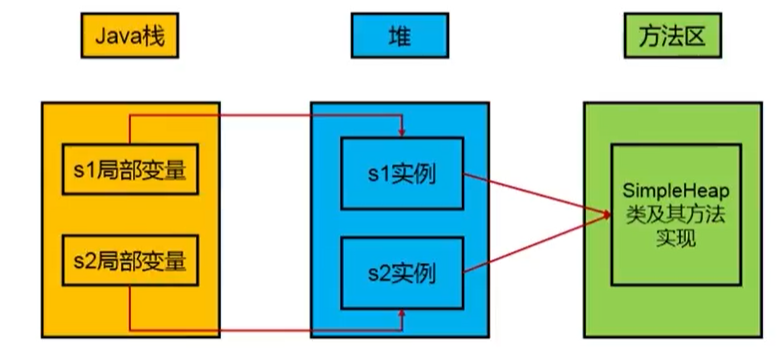
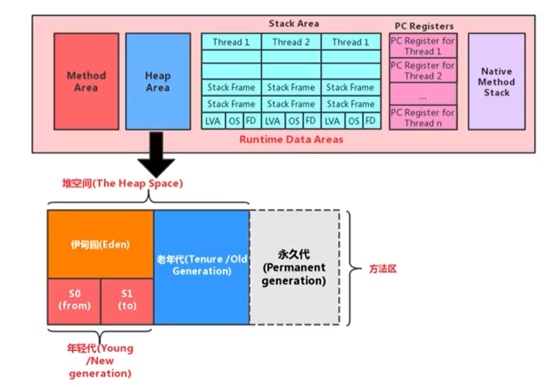
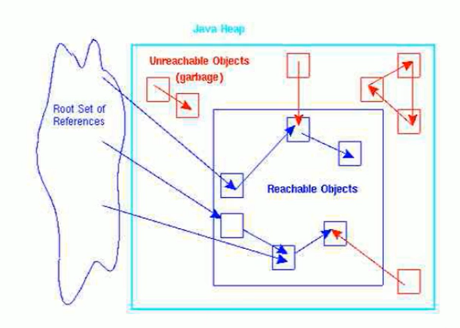
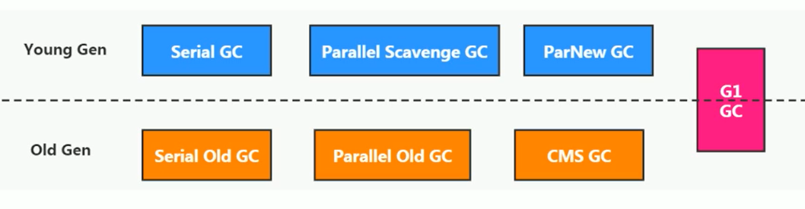

# JVM

## Java 虚拟机

### 介绍：

#### 概念

`Java 虚拟机就是二进制字节码的运行环境，负责装载字节码到其内部，解释/编译为对应平台的机器指令。在不同的平台下，jvm 都遵循着同一套指令和定义，故可以一次编译，各处运行`


#### 特点

- 一次编译，到处运行
- 自动内存管理
- 自动垃圾回收


#### 整体结构


### jdk 和 jre 的区别

#### 概念

- JDK：java development kit （java开发工具）
- **JRE：java runtime environment （java运行时环境）**
- JVM：java virtuak machine （java虚拟机）


#### 关系

从图中可以发现，jdk是一个开发工具包，包含了 jvm 以及 jre。同时还包含了 java 开发的各种工具类 。


###  JVM生命周期

#### 虚拟机的启动

Java虚拟机的启动是通过引导类加载器（bootstrap class loader）创建一个初始类（initial class）来完成的，这个类是由虚拟机的具体实现指定的。


#### 虚拟机的执行

- 一个运行中的Java虚拟机有着一个清晰的任务：执行Java程序。
- 程序开始执行时他才运行，程序结束时他就停止。
- 执行一个所谓的Java程序的时候，真真正正在执行的是一个叫做Java虚拟机的进程。


#### 虚拟机的退出

有如下的几种情况：

- 程序正常执行结束
- 程序在执行过程中遇到了异常或错误而异常终止
- 由于操作系统用现错误而导致Java虚拟机进程终止
- 某线程调用Runtime类或system类的exit方法，或Runtime类的halt方法，并且Java安全管理器也允许这次exit或halt操作。
- 除此之外，JNI（Java Native Interface）规范描述了用JNI Invocation API来加载或卸载 Java虚拟机时，Java虚拟机的退出情况。


### 虚拟机模型图

若是要自己实现一个虚拟机 demo，必须考虑的是 类加载器子系统，以及执行引擎


## 类的加载

### 类加载器子系统

#### 概念

`类加载器子系统负责从文件系统或者网络中加载Class文件，class文件在文件开头有特定的文件标识。`

`ClassLoader只负责class文件的加载，至于它是否可以运行，则由Execution Engine决定。`


#### 做了什么

- 加载 class 文件到内存中，这块内存叫做 `方法区`
- 同时 `方法区` 还存储了运行时的常量信息


#### 类的加载阶段


##### 加载(Loading)

- 通过一个类的全限定名获取定义此类的二进制字节流

- 将这个字节流所代表的静态存储结构转化为方法区的运行时数据结构

- 在内存中生成一个代表这个类的java.lang.Class对象，作为方法区这个类的各种数据的访问入口


##### 链接(Linking)

###### 验证 Verify

`目的在于确保Class文件的字节流中包含信息符合当前虚拟机要求，保证被加载类的正确性，不会危害虚拟机自身安全。`

主要包括四种验证，文件格式验证，元数据验证，字节码验证，符号引用验证。

可以通过安装 jclass 插件查看 class 文件，或安装 jclass lib


###### 准备 Prepare

`为类变量分配内存并且设置该类变量的默认初始值，即零值。`

如：

```java
public class HelloApp {
    private static int a = 1;  // 准备阶段为0，在下个阶段，也就是初始化的时候才是1
    public static void main(String[] args) {
        System.out.println(a);
    }
}
```

上面的变量a在准备阶段会赋初始值，但不是1，而是0。

这里不包含用final修饰的static，因为final(常量)在编译的时候就会分配了，准备阶段会显式初始化；

实例变量(对象)不会在这里初始化


###### 解析 Resolve

`将常量池内的符号引用转换为直接引用的过程`

直接引用就是直接指向目标的指针、相对偏移量或一个间接定位到目标的句柄。

解析动作主要针对类或接口、字段、类方法、接口方法、方法类型等


##### 初始化

`初始化阶段就是执行类的构造器方法的过程`


### 类加载器类型

#### 概述

java 规范中将类加载器的类型分为

- 引导类加载器（Bootstrap ClassLoader）
- 自定义类加载器（User-Defined ClassLoader）

但实际中需要关注的加载器是：

- Bootstrap ClassLoader 引导类加载器
- Extension ClassLoader 扩展类加载器
- System ClassLoader 系统类加载器

`类加载器是包含关系，不是继承关系`


#### 关系


####  启动类加载器（引导类加载器，Bootstrap ClassLoader）

`它用来加载Java的核心库（JAVAHOME/jre/1ib/rt.jar、resources.jar或sun.boot.class.path路径下的内容），用于提供JVM自身需要的类`

- 这个类加载使用C/C++语言实现的，嵌套在JVM内部。

- 并不继承自ava.lang.ClassLoader，没有父加载器。

- 加载扩展类和应用程序类加载器，并指定为他们的父类加载器。

- 出于安全考虑，Bootstrap启动类加载器只加载包名为java、javax、sun等开头的类

  

#### 扩展类加载器（Extension ClassLoader）

`从java.ext.dirs系统属性所指定的目录中加载类库，或从JDK的安装目录的jre/1ib/ext子目录（扩展目录）下加载类库。`

`如果用户创建的JAR放在此目录下，也会自动由扩展类加载器加载。`

- Java语言编写，由sun.misc.Launcher$ExtClassLoader实现。

- 派生于ClassLoader类

- 父类加载器为启动类加载器

  


#### 应用程序类加载器（系统类加载器，AppClassLoader）

`它负责加载环境变量classpath或系统属性java.class.path指定路径下的类库该类加载是程序中默认的类加载器，`

`一般来说，Java应用的类都是由它来完成加载`

- java语言编写，由sun.misc.LaunchersAppClassLoader实现

- 派生于ClassLoader类

- 父类加载器为扩展类加载器

- 通过classLoader#getSystemclassLoader（）方法可以获取到该类加载器

  

#### 用户自定义类加载器

在Java的日常应用程序开发中，类的加载几乎是由上述3种类加载器相互配合执行的，在必要时，我们还可以自定义类加载器，来定制类的加载方式。 

###### 为什么要自定义类加载器？

- 隔离加载类
- 修改类加载的方式
- 扩展加载源
- 防止源码泄漏

###### 用户自定义类加载器实现步骤：

- 开发人员可以通过继承抽象类ava.1ang.ClassLoader类的方式，实现自己的类加载器，以满足一些特殊的需求
- 在JDK1.2之前，在自定义类加载器时，总会去继承ClassLoader类并重写1oadClass（）方法，从而实现自定义的类加载类，但是在JDK1.2之后已不再建议用户去覆盖1oadclass（）方法，而是建议把自定义的类加载逻辑写在findclass（）方法中
- 在编写自定义类加载器时，如果没有太过于复杂的需求，可以直接继承URIClassLoader类，这样就可以避免自己去编写findclass（）方法及其获取字节码流的方式，使自定义类加载器编写更加简洁。


### 双亲委派机制

#### 概念

`Java虚拟机对class文件采用的是按需加载的方式，也就是说当需要使用该类时才会将它的class文件加载到内存生成class对象。而且加载某个类的class文件时，Java虚拟机采用的是双亲委派模式，即把请求交由父类处理，它是一种任务委派模式。`

实际上，双亲委派机制叫做父类委派机制更合适，因为他首先尝试让父类进行处理，当父类还有父类时，又会继续向上委派。直到没有父类或是最初始的类无法处理时，又会依次下发


#### 工作流程

- 如果一个类加载器收到了类加载请求，它并不会自己先去加载，而是把这个请求委托给父类的加载器去执行；
- 如果父类加载器还存在其父类加载器，则进一步向上委托，依次递归，请求最终将到达顶层的启动类加载器；
- 如果父类加载器可以完成类加载任务，就成功返回，倘若父类加载器无法完成此加载任务，子加载器才会尝试自己去加载，这就是双亲委派模式。


#### 作用

- 保证核心基础类不被篡改(即最终的父类会先加载核心基础类，如 String 类，而不是加载自定义的类)
- 避免类的重复加载。例如自定义的类都是系统加载器装载的，假设定义了一个 java.lang.String 类，这个类是会被系统类加载器加载的，但由于双亲委派机制的存在，java 核心库的 String 类会被启动类加载器(加载 java 开头的类)加载，而这个我们自定义的类是不会被加载的。避免了 String 类的重复加载

这种双亲委派机制也可以叫做沙箱安全机制


#### 如何判断类是否相同

- 类的完整类名必须一致，包括包名
- 加载这个类的 ClassLoader 必须相同

自定义的都基本都属于系统类加载器，而 java 的核心类基本属于启动类加载器，如此可以避免核心类被污染和重复。

方法区会记录类使用的类加载器


#### 如何打破双亲委派机制

打破双亲委派机制则不仅**要继承ClassLoader**类，还要**重写loadClass和findClass**方法。


## 运行时数据区


### 概念

#### 定义

`运行时数据区即类加载时将数据存储到运行时数据区去，同时当执行引擎运行时也会不断读取和写入运行时数据区`


#### 主要结构

jdk1.7 之前，元数据区其实叫永久代


#### 进程和线程占用


Java虚拟机定义了若干种程序运行期间会使用到的运行时数据区，

- **进程拥有：**

  随着虚拟机启动而创建，随着虚拟机退出而销毁。

- **线程拥有：**

  与每条线程一一对应，这些与线程对应的数据区域会随着线程开始和结束而创建和销毁。

灰色的为单独线程私有的，红色的为多个线程共享的。即：

- 每个线程：独立包括程序计数器、栈、本地栈。
- 线程间共享：堆、堆外内存（永久代或元空间、代码缓存）


####  线程

##### 定义

`线程是一个程序里的运行单元。JVM 允许一个应用有多个线程并行的执行。 在Hotspot JVM里，每个线程都与操作系统的本地线程直接映射。`


##### 线程的创建

当一个Java线程准备好执行以后，此时一个操作系统的本地线程也同时创建。Java线程执行终止后，本地线程也会回收。

操作系统负责所有线程的安排调度到任何一个可用的CPU上。一旦本地线程初始化成功，它就会调用Java线程中的run（）方法。


##### JVM 线程类型

- 虚拟机线程：这种线程的操作是需要JVM达到安全点才会出现。这些操作必须在不同的线程中发生的原因是他们都需要JVM达到安全点，这样堆才不会变化。这种线程的执行类型包括"stop-the-world"的垃圾收集，线程栈收集，线程挂起以及偏向锁撤销。
- 周期任务线程：这种线程是时间周期事件的体现（比如中断），他们一般用于周期性操作的调度执行。
- GC线程：这种线程对在JVM里不同种类的垃圾收集行为提供了支持。
- 编译线程：这种线程在运行时会将字节码编译成到本地代码。
- 信号调度线程：这种线程接收信号并发送给JVM，在它内部通过调用适当的方法进行处理。


### 程序计数器

#### 概念

`cpu完成一条指令的过程分为：读取 => 译码 => 执行`

`而程序计数器在被译码之前指向当前正在运行的指令地址，而当译码器开始执行时，程序计数器指向下一个需要执行的指令地址`


#### 为什么要有程序计数器

`因为CPU需要不停的切换各个线程，这时候切换回来以后，就得知道接着从哪开始继续执行。JVM的字节码解释器就需要通过改变PC寄存器的值来明确下一条应该执行什么样的字节码指令。`


#### 为什么程序计数器是每个线程私有的

由于 cpu 不断地在切换线程，必然使线程处于经常中断和恢复状态，为了保证线程不互相干扰，以及提高效率，给每个线程都分配一个私有的程序计数器，这样一来线程被运行时就可以马上恢复当前状态


#### CPU时间片

`CPU时间片即CPU分配给各个程序的时间，每个线程被分配一个时间段，称作它的时间片`

在宏观上看，我们可以同时运行多个程序。但在微观上，实际的 cpu 数量是有限的，一次只能处理有限量的线程。这时候 cpu 就会按时间片让线程轮流执行


#### 常见问题

- 什么是程序计数器

- 程序计数器是进程所有还是每个线程独有
- 为什么要有程序计数器
- 程序计数器是如何运行的


### 虚拟机栈

#### 基本概念

##### 栈和堆的区别

栈是运行时的单位，而堆是存储的单位

- 栈解决程序的运行问题，即程序如何执行，或者说如何处理数据。
- 堆解决的是数据存储的问题，即数据怎么放，放哪里


##### 什么是虚拟机栈

`每个线程在创建时都会创建一个虚拟机栈，其内部保存一个个的栈帧（Stack Frame），对应着一次次的Java方法调用。一个栈帧就对应着一个 java 方法`


##### 生命周期

生命周期与所属线程一致


##### 作用

主管Java程序的运行，它保存方法的局部变量(8种基本数据类型，对象的引用地址)、部分结果(中间的运算结果)，并参与方法的调用和返回。


##### 特点

栈是一种快速有效的分配存储方式，访问速度仅次于罹序计数器。JVM直接对Java栈的操作只有两个：

- 每个方法执行，伴随着进栈（入栈、压栈）
- 执行结束后的出栈工作

对于栈来说不存在垃圾回收问题（栈存在溢出的情况）


##### 常见的异常

Java 虚拟机规范允许Java栈的大小是动态的或者是固定不变的。默认是1M

- StackoverflowError （固定大小）

  如果采用固定大小的Java虚拟机栈，那每一个线程的Java虚拟机栈容量可以在线程创建的时候独立选定。

  如果线程请求分配的栈容量超过Java虚拟机栈允许的最大容量，Java虚拟机将会抛出一个StackoverflowError 异常。

  `即栈帧个数超出了栈的大小`，如死循环的递归调用

- OutofMemoryError （动态扩展）

  如果Java虚拟机栈可以动态扩展，并且在尝试扩展的时候无法申请到足够的内存，或者在创建新的线程时没有足够的内存去创建对应的虚拟机栈，那Java虚拟机将会抛出一个 outofMemoryError 异常。

  `即虚拟机无法分配出更多内存给线程`


#### 修改栈大小

-Xss 默认以 btyes 为单位，若要修改则

```
-Xss1024  #1024 bytes
-Xss1024k #1024k
-Xss1m    #1m
-Xss1g    #1g
```


#### 栈的存储

`每个线程都有自己的栈，栈中的数据都是以一个个栈帧（Stack Frame）的格式存在`

`在这个线程上正在执行的每个方法都各自对应一个栈帧（Stack Frame）`

`JVM直接对Java栈的操作只有两个，就是对栈帧的压栈和出栈，遵循“先进后出”/“后进先出”原则。`


##### 存储内容

栈帧是一个内存区块，是一个数据集，维系着方法执行过程中的各种数据信息。

> OOP的基本概念：类和对象
>
> 类中基本结构：field（属性、字段、域）、method


##### 运行模式

- 在一条活动线程中，一个时间点上，只会有一个活动的栈帧。即只有当前正在执行的方法的栈帧（栈顶栈帧）是有效的，这个栈帧被称为当前栈帧（Current Frame），与当前栈帧相对应的方法就是当前方法（Current Method），定义这个方法的类就是当前类（Current Class）。执行引擎运行的所有字节码指令只针对当前栈帧进行操作。

- 如果在该方法中调用了其他方法，对应的新的栈帧会被创建出来，放在栈的顶端，成为新的当前帧。

- 如果当前方法调用了其他方法，方法返回之际，当前栈帧会传回此方法的执行结果给前一个栈帧，接着，虚拟机会丢弃当前栈帧，使得前一个栈帧重新成为当前栈帧。

- Java方法有两种返回函数的方式，一种是正常的函数返回，使用return指令；另外一种是抛出异常。不管使用哪种方式，都会导致栈帧被弹出。


#####  栈帧的内部结构

每个栈帧中存储着：

- 局部变量表（Local Variables）
- 操作数栈（operand Stack）（或表达式栈）
- 动态链接（DynamicLinking）（或指向运行时常量池的方法引用）
- 方法返回地址（Return Address）（或方法正常退出或者异常退出的定义）
- 一些附加信息


##### 局部变量表

**定义**：

`定义为一个数字数组，主要存储方法参数以及定义在方法内的局部变量`

**主要包含：**

- 基本数据类型
- 对象引用
- 返回地址

**生命周期：**

局部变量表中的变量只在当前方法调用中有效。在方法执行时，虚拟机通过使用局部变量表完成参数值到参数变量列表的传递过程。当方法调用结束后，随着方法栈帧的销毁，局部变量表也会随之销毁


##### 操作数栈

`操作数栈，在方法执行过程中，根据字节码指令，往栈中写入数据或提取数据，即入栈（push）和 出栈（pop）。主要用于保存计算过程的中间结果，同时作为计算过程中变量临时的存储空间`


##### 动态链接

运行时常量池中保存了指向方法的符号引用，动态链接的作用就是为了将这些符号引用转换为调用方法的直接引用。


### 本地方法栈

#### 本地方法

`本地方法就是一个java调用非java代码的接口，如调用C/C++方法`

#### 本地方法栈 

`本地方法栈就是用来管理本地方法的`


### 堆

#### 概念

`堆是java内存管理的核心区域，所有的对象实例以及数组都应当在运行时分配在堆上。堆是gc执行垃圾回收的重点区域`

一个jvm进程只有一个堆，一个堆被所有线程共享

堆在jvm启动时就被创建。堆的大小调整需要在jvm进程启动前通过参数调整


#### 存储

`堆内的数据不是马上被回收，而是需要等待GC进行回收`

数组和对象可能永远不会存储在栈上，因为栈帧中保存引用，这个引用指向对象或者数组在堆中的位置

在方法结束后，堆中的对象不会马上被移除，仅仅在垃圾收集的时候才会被移除。




#### 大小调整

`《Java虚拟机规范》规定，堆可以处于物理上不连续的内存空间中，但在逻辑上它应该被视为连续的。`

所有的线程共享Java堆，在这里还可以划分线程私有的缓冲区（Thread Local Allocation Buffer，TLAB）。

**参数：**

- -Xms10m：最小堆内存

- -Xmx10m：最大堆内存


####  堆内存结构

Java 7及之前堆内存逻辑上分为三部分：新生区+养老区+永久区

- Young Generation Space 新生区 Young/New 又被划分为Eden区和Survivor区
- Tenure generation space 养老区 Old/Tenure
- Permanent Space 永久区 Perm

Java 8及之后堆内存逻辑上分为三部分：新生区+养老区+元空间

- Young Generation Space新生区 Young/New 又被划分为Eden区和Survivor区
- Tenure generation space 养老区 Old/Tenure
- Meta Space 元空间 Meta

约定：新生区 = 新生代 = 年轻代 、 养老区 = 老年区 = 老年代、 永久区 = 永久代




#### 设置堆内存大小与OOM

##### 设置

Java堆区用于存储Java对象实例，那么堆的大小在JVM启动时就已经设定好了。设置的堆内存大小为年轻代+老年代，无法管理到永久代或元空间的大小。

通过选项`-Xmx`和`-Xms`来进行设置。

- “-Xms"用于表示堆区的起始内存，等价于-xx:InitialHeapSize
- “-Xmx"则用于表示堆区的最大内存，等价于-XX:MaxHeapSize

一旦堆区中的内存大小超过`-Xmx`所指定的最大内存时，将会抛出outofMemoryError异常。


##### 建议设置值

`通常会将-Xms和-Xmx两个参数配置相同的值，其目的是为了能够在Java垃圾回收机制清理完堆区后不需要重新分隔计算堆区的大小，从而提高性能。`

若堆空间不够时，就需要不断地进行扩容，直到上限。而当空闲时堆空间会被释放，若频繁地扩容和释放则会导致系统额外的压力。


##### 参数介绍

- **-X：** jvm 的运行参数

- **ms：** memory start
- mx：设置对空间(年轻代+老年代)的最大内存代销

默认情况下

- 初始内存大小：物理电脑内存大小/64
- 最大内存大小：物理电脑内存大小/4


##### 命令行

- **jps** 

  查看当前所有的java进程

- **jstat**

  查看 jvm 在 gc 时的内存使用情况

  ```java
  jstat -gc [进程号]
  ```

  **计算**

  

  **老年代：**

  OC:  老年区总量

  OU:  老年区使用量

  **年轻代：**

  S0C、S1C、EC：总量

  S0U、S1U、EU:   使用量

- **在运行时打印堆信息**

  ```java
  -XX:+PrintGCDetails
  ```

  


#### 年轻代与老年代

##### 概念

`年轻代中主要存储生命周期较短的瞬时对象，即创建和消亡迅速的对象，如临时变量等`

`老年代中存储生命周期很长的对象，如连接对象等`


##### 比例调整

默认-XX:NewRatio=2，表示新生代占1，老年代占2，新生代占整个堆的1/3


##### 年轻代结构

###### 结构

年轻代分为：

- Eden 空间

- Survivor0 空间(from 区)

- Survivor1 空间(to 区)


###### 比例

Eden空间和另外两个survivor空间缺省所占的比例是8:1:1，但实际上不会是严格个8:1:1，可能是6:1:1，由于有个自适应，

如果要严格匹配，则需要显式指定

开发人员可以通过选项“-xx:SurvivorRatio”调整这个空间比例。比如-xx:SurvivorRatio=8

`可以通过 -Xmn 修改新生代最大内存大小`


##### 对象分配流程

###### 年轻代回收过程

**前提：**

- 当 Eden 满了就会触发 YoungGC，对 Eden 区的数据和 Survivor 区的数据进行回收
- 每个数据都有年龄计数器，默认是0，回收后使用中的数据(未被回收的数据)的年龄计数器+1
- 默认将对象放入老年代的阈值是15，可以通过 `-Xx:MaxTenuringThreshold= N` 修改

**总结：**

- 对于 s0,s1：复制之后有交换，谁空谁是to
- 对于垃圾回收：频繁在年轻代收集，很少在养老区收集，几乎不在永久区/元空间收集
- 新生代采用复制算法的目的：是为了减少内碎片

**流程：**

一开始新建的对象都分配在 Eden 区，当 Eden 区满了之后，就会出触发 YoungGC，回收 Eden 区的垃圾数据，同时将仍在使用的数据放入

S0或S1区(放入空的那个区域，如S0有数据，S1没数据，则放入S1区)，同时年龄计数+1


当 Eden 区再一次满了之后会触发 YoungGC，回收 Eden 和 S0 区存放的数据，同时将 Eden 和 S0 区保存的使用中的数据，放入空闲的 S1 中，

且年龄计数器+1


继续不断的进行对象生成 和 垃圾回收，当Survivor中的对象的年龄达到15的时候，将会触发一次 Promotion晋升的操作，也就是将年轻代中的对象 晋升到 老年代中


###### **当 Survivor 满时**

当 Survivor 满时，会将 Survivor 内的对象直接放入老年代


###### 整体流程图


####  Minor GC，MajorGC、Full GC

##### 回收类型

- Minor GC(YGC)：新生代的GC
- Major GC(OGC)：老年代的GC
- Full GC：整堆收集，收集整个Java堆和方法区的垃圾收集（新生代+老年代+方法区）


##### 收集分类

**部分收集：**不是完整收集整个Java堆的垃圾收集。其中又分为：

- 新生代收集（MinorGC/YoungGC）：只是新生代的垃圾收集
- 老年代收集（MajorGC/OldGC）：只是老年代的圾收集。
  - 目前，只有CMS GC会有单独收集老年代的行为。
  - 注意，很多时候Major GC会和Fu11GC混淆使用，需要具体分辨是老年代回收还是整堆回收。
- 混合收集（MixedGC）：收集整个新生代以及部分老年代的垃圾收集。
  - 目前，只有G1 GC会有这种行为

**整堆收集（FullGC）：**收集整个java堆和方法区的垃圾收集。一般情况下都是老年区满了触发。


##### STW

`STW 是指在执行垃圾收集算法时，应用程序的其他所有线程都被挂起（除了垃圾收集帮助器之外）。Java中一种全局暂停现象，全局停顿，所有Java代码停止，native代码可以执行，但不能与JVM交互；这些现象多半是由于gc引起`


##### Minor GC

- 当年轻代空间不足时，就会触发MinorGC，这里的年轻代满指的是Eden代满，Survivor满不会引发GC。（每次Minor GC会清理年轻代的内存。）

- Minor GC会引发STW，暂停其它用户的线程，等垃圾回收结束，用户线程才恢复运行。但由于年轻代内存空间小，回收快，故对用户线程的影响较小。


##### Major GC

指发生在老年代的GC，对象从老年代消失时，我们说 “Major Gc” 或 “Full GC” 发生了

`也就是在老年代空间不足时，会先尝试触发MinorGc。如果之后空间还不足，则触发Major GC`

出现了MajorGc，经常会伴随至少一次的Minor GC（但非绝对的，在Paralle1 Scavenge收集器的收集策略里就有直接进行MajorGC的策略选择过程）

Major GC的速度一般会比MinorGc慢1倍以上，STW的时间更长，如果Major GC后，内存还不足，就报OOM了


#####  Full GC

触发Fu11GC执行的情况有如下五种：

- 调用System.gc（）时，系统建议执行Fu11GC，但是不必然执行
- 老年代空间不足
- 方法区空间不足
- 通过Minor GC后进入老年代的平均大小大于老年代的可用内存
- 由Eden区、survivor space0（From Space）区向survivor spacel（To Space）区复制时，对象大小大于To Space可用内存，则把该对象转存到老年代，且老年代的可用内存小于该对象大小

说明：Full GC 是开发或调优中尽量要避免的。这样暂时时间会短一些


#### 为什么要把 Java 堆分代？

`分代的原因是为了优化 GC 的性能`

其实不分代也可以正常工作。但如果没有分代，所有的对象都放在一起，GC 需要对堆的所有区域进行扫描。

分代后，由于大多数对象都是创建没多久就无用了需要被回收了，将这部分对象放在一起，可以快速清理出空间来。

这个从 GC 的触发也可以看出来，GC 在频繁地清理年轻代，只有几种特殊情况才会清理老年代。


####  内存分配策略

对象晋升老年代的年龄阀值，可以通过选项-xx:MaxTenuringThreshold来设置

针对不同年龄段的对象分配原则如下所示：

- 优先分配到Eden

  - Eden 存储的大部分都是瞬时对象，应该被快速释放掉，以释放更多的内存空间

- 大对象直接分配到老年代
  
  - 尽量避免程序中出现过多的大对象，因为大对象需要一个较大的连续空间。特别是瞬时对象，需要花更多的时间gc，导致swt时间更长
  
- 长期存活的对象分配到老年代

- 动态对象年龄判断
  
  - 如果survivor区中相同年龄的所有对象大小的总和大于Survivor空间的一半，年龄大于或等于该年龄的对象可以直接进入老年代，无须等到MaxTenuringThreshold 中要求的年龄
  
- -XX:HandlePromotionFalilure：是否设置空间分配担保

  在发生Minor GC之前，虚拟机会检查老年代最大可用的连续空间是否大于新生代所有对象的总空间。I

  - 如果大于，则此次Minor GC是安全的
  - 如果小于，则虚拟机会查看-xx:HandlePromotionFailure设置值是否允担保失败。
    - 如果HandlePromotionFailure=true，那么会继续检查老年代最大可用连续空间是否大于历次晋升到老年代的对象的平均大小。
    - 如果大于，则尝试进行一次Minor GC，但这次Minor GC依然是有风险的；
    - 如果小于，则改为进行一次FullGC。
    - 如果HandlePromotionFailure=false，则改为进行一次Full Gc。


#### TLAB

##### 概念

`由于对象实例的创建在 jvm 中非常频繁，为了避免在并发环境下多个线程操作同一地址，同时也为了提高效率，jvm 为每个线程分配一个私有缓冲区，这个缓冲区包含在 Eden 内，就是 TLAB。`

`但在默认情况下，TLAB 空间的内存非常小，仅占整个 Eden 空间的 1%。一旦对象在 TLAB 空间分配内存失败时， jvm 就会尝试着使用锁机制确保数据操作的原子性，从而直接在 Eden 空间中分配`


##### 修改配置

`-Xx:UseTLAB`设置是否开启TLAB空间。

`-Xx:TLABWasteTargetPercent`设置TLAB空间所占用Eden空间的百分比大小。


##### 整体流程图


#### 堆外内存分配

##### 概念

`随着分析逃逸技术的逐渐成熟，栈上分配、标量替换优化技术使得对象不一定会被分配到堆上，或是TaoBaoVM也可以将生命周期较长的Java对象从堆中移动到堆外`

`对象是在Java堆中分配内存的，这是一个普遍的常识。但是，有一种特殊情况，那就是如果经过逃逸分析（Escape Analysis）后发现，一个对象并没有逃逸出方法的话，那么就可能被优化成栈上分配。这样就无需在堆上分配内存，也无须进行垃圾回收了。这也是最常见的堆外存储技术。`


##### 逃逸分析

###### 概念

`逃逸分析是一种可以有效减少Java程序中同步负载和内存堆分配压力的跨函数全局数据流分析算法。`

通过逃逸分析，Java Hotspot编译器能够分析出一个新的对象的引用的使用范围从而决定是否要将这个对象分配到堆上。逃逸分析的基本行为就是分析对象动态作用域：

- 当一个对象在方法中被定义后，对象只在方法内部使用，则认为没有发生逃逸。
- 当一个对象在方法中被定义后，它被外部方法所引用，则认为发生逃逸。例如作为调用参数传递到其他地方中。

**没有逃逸的对象，则可以放在栈空间中，随着方法执行结束，栈空间就会被移除。由于栈空间是每个线程一份，不存在线程安全的问题。同时方法执行完毕后，栈帧就弹出栈了，相当于自动释放了对象，省略了gc的过程**

`这个告诉我们，能够使用局部变量的，就不要在方法外定义`


###### 例子

```java
/**
 * 逃逸分析
 * 如何快速的判断是否发生了逃逸分析，大家就看new的对象是否在方法外被调用。
 */
public class EscapeAnalysis {

    public EscapeAnalysis obj;

    /**
     * 方法返回EscapeAnalysis对象，发生逃逸
     * @return
     */
    public EscapeAnalysis getInstance() {
        return obj == null ? new EscapeAnalysis():obj;
    }

    /**
     * 为成员属性赋值，发生逃逸
     */
    public void setObj() {
        this.obj = new EscapeAnalysis();
    }

    /**
     * 对象的作用于仅在当前方法中有效，没有发生逃逸
     */
    public void useEscapeAnalysis() {
        EscapeAnalysis e = new EscapeAnalysis();
    }

    /**
     * 引用成员变量的值，发生逃逸
     */
    public void useEscapeAnalysis2() {
        EscapeAnalysis e = getInstance();
        // getInstance().XXX  发生逃逸
    }
}
```

在JDK 1.7 版本之后，HotSpot中默认就已经开启了逃逸分析

如果使用的是较早的版本，则可以通过：

- 选项“-xx：+DoEscapeAnalysis"显式开启逃逸分析
- 通过选项“-xx：+PrintEscapeAnalysis"查看逃逸分析的筛选结果


###### 不足

关于逃逸分析的论文在1999年就已经发表了，但直到JDK1.6才有实现，而且这项技术到如今也并不是十分成熟。

`其根本原因就是无法保证逃逸分析的性能消耗一定能高于他的消耗。虽然经过逃逸分析可以做标量替换、栈上分配、和锁消除。但是逃逸分析自身也是需要进行一系列复杂的分析的，这其实也是一个相对耗时的过程。 一个极端的例子，就是经过逃逸分析之后，发现没有一个对象是不逃逸的。那这个逃逸分析的过程就白白浪费掉了。`

在 Hotspot 上 JVM 并没有打开栈上逃逸


##### 栈上分配

JIT编译器在编译期间根据逃逸分析的结果，发现如果一个对象并没有逃逸出方法的话，就可能被优化成栈上分配。分配完成后，继续在调用栈内执行，最后线程结束，栈空间被回收，局部变量对象也被回收。这样就无须进行垃圾回收了。

常见的栈上分配的场景

- 在逃逸分析中，给成员变量赋值、方法返回值、实例引用传递，都可能造成逃逸。


##### 同步省略

线程同步的代价是相当高的，同步的后果是降低并发性和性能。

`在动态编译同步块的时候，JIT编译器可以借助逃逸分析来判断同步块所使用的锁对象是否只能够被一个线程访问而没有被发布到其他线程。如果没有，那么JIT编译器在编译这个同步块的时候就会取消对这部分代码的同步。这样就能大大提高并发性和性能。这个取消同步的过程就叫同步省略，也叫锁消除。`

例如下面的代码

```java
public void f() {
    Object hellis = new Object();
    synchronized(hellis) {
        System.out.println(hellis);
    }
}
```

代码中对hellis这个对象加锁，但是hellis对象的生命周期只在f()方法中，并不会被其他线程所访问到，所以在JIT编译阶段就会被优化掉，优化成：

```java
public void f() {
    Object hellis = new Object();
	System.out.println(hellis);
}
```


##### 分离对象和标量替换

###### 概念

- 标量：一个无法再分解成更小的数据的数据，如 Java 中的原始数据类型就是标量
- 聚合量：可以分解成其他标量或聚合量的结构，如 Java 中的对象

`在JIT阶段，如果经过逃逸分析，发现一个对象不会被外界访问的话，那么经过JIT优化，就会把这个对象拆解成若干个其中包含的若干个成员变量来代替。这个过程就是标量替换。这样的对象就不需要一个连续的内存结构中，而是可以放到栈的栈帧中，减少内存分配和gc的开销`


###### 例子

```java
public static void main(String args[]) {
    alloc();
}
class Point {
    private int x;
    private int y;
}
private static void alloc() {
    // 这个point就会被放到堆空间中
    Point point = new Point(1,2);
    System.out.println("point.x" + point.x + ";point.y" + point.y);
}
```

以上代码，经过标量替换后，就会变成

```java
private static void alloc() {
    // 变成临时变量，放到栈的栈帧中
    int x = 1;
    int y = 2;
    System.out.println("point.x = " + x + "; point.y=" + y);
}
```


### 方法区 (Non-Heap)

#### 概念

`方法区其实是一个概念，在jdk1.8之前是永久代，jdk1.8及之后是元空间。方法区可以看作是一块独立于Java堆的内存空间，主要存放的是字节码文件(class)文件，而堆中主要存放的是 实例化的对象`

- 方法区（Method Area）与Java堆一样，是各个线程共享的内存区域
- 方法区在JVM启动的时候被创建，并且它的实际的物理内存空间中和Java堆区一样都可以是不连续的。
- 方法区的大小，跟堆空间一样，可以选择固定大小或者可扩展。
- 方法区的大小决定了系统可以保存多少个类，如果系统定义了太多的类，导致方法区溢出，虚拟机同样会抛出内存溢出错误：ava.lang.OutofMemoryError：PermGen space (jdk1.7)或者 java.lang.OutOfMemoryError:Metaspace( >= jdk1.8)
  - 加载大量的第三方的jar包
  - Tomcat部署的工程(项目)过多（30~50个）
  - 大量动态的生成反射类
- 关闭JVM就会释放这个区域的内存。


#### 永久代和元空间(重要)

`元空间的本质和永久代类似，都是对JVM规范中方法区的实现。不过元空间与永久代最大的区别在于：元空间不在虚拟机设置的内存中，而是使用本地内存`

永久代、元空间二者并不只是名字变了，内部结构也调整了。元空间的内存容量更大，也更不容易出现OOM。

##### 为什么要使用元空间

在使用元空间后，元空间的最大可分配空间就是系统的可用内存空间，增大了内存空间的大小。

- 如果动态加载的类很多，永久代容易引起FullGC，甚至OOM。FullGC 会导致 SWT，即所有用户线程挂起，且回收时间长，影响较大。
- 永久代调优困难


##### 修改大小(重要)

方法区的大小不必是固定的，JVM可以根据应用的需要动态调整

###### jdk7及以前

```
-XX:Permsize=100m
-XX:MaxPermsize=100m
```

- 通过-XX:Permsize来设置永久代初始分配空间。默认值是20.75M
- -XX:MaxPermsize来设定永久代最大可分配空间。32位机器默认是64M，64位机器模式是82M
- 当JVM加载的类信息容量超过了这个值，会报异常OutofMemoryError:PermGen space。


###### JDK8以后

```
-XX:MetaspaceSize=100m
-XX:MaxMetaspaceSize=100m
```

元数据区大小可以使用参数 -XX:MetaspaceSize 和 -XX:MaxMetaspaceSize指定

默认值依赖于平台。`windows下，-XX:MetaspaceSize是21m`，-XX:MaxMetaspaceSize的值是-1，即没有限制。

与永久代不同，如果不指定大小，默认情况下，虚拟机会耗尽所有的可用系统内存。如果元数据区发生溢出，虚拟机一样会抛出异常OutOfMemoryError:Metaspace


###### 元空间参数优化

-XX:MetaspaceSize：设置初始的元空间大小。对于一个64位的服务器端JVM来说，其默认的-xx:MetaspaceSize值为21MB。这就是初始的高水位线，一旦触及这个水位线，FullGC将会被触发并卸载没用的类（即这些类对应的类加载器不再存活）然后这个高水位线将会重置。新的高水位线的值取决于GC后释放了多少元空间。如果释放的空间不足，那么在不超过MaxMetaspaceSize时，适当提高该值。如果释放空间过多，则适当降低该值。

`如果初始化的高水位线设置过低，上述高水位线调整情况会发生很多次。通过垃圾回收器的日志可以观察到Ful1GC多次调用。为了避免频繁地GC，建议将-XX:MetaspaceSize设置为一个相对较高的值。`


##### 二者的异同

- 二者都可以设置初始值以及最大值

- 在不指定大小的情况下，在永久代中的分配空间默认为21.75m，当jvm加载的类信息超过最大值，则会报OOM。

  而在元空间中，若超出默认值会继续使用可用的系统内存，直到耗尽可用内存。耗尽后会报OOM。


####  如何解决OOM

- 要解决ooM异常或heap space的异常，一般的手段是首先通过内存映像分析工具（如Ec1ipse Memory Analyzer）对dump出来的堆转储快照进行分析，重点是确认内存中的对象是否是必要的，也就是要先分清楚到底是出现了内存泄漏（Memory Leak）还是内存溢出（Memory Overflow）
  - 内存泄漏就是 有大量的引用指向某些对象，但是这些对象以后不会使用了，但是因为它们还和GC ROOT有关联，所以导致以后这些对象也不会被回收，这就是内存泄漏的问题
- 如果是内存泄漏，可进一步通过工具查看泄漏对象到GC Roots的引用链。于是就能找到泄漏对象是通过怎样的路径与GCRoots相关联并导致垃圾收集器无法自动回收它们的。掌握了泄漏对象的类型信息，以及GCRoots引用链的信息，就可以比较准确地定位出泄漏代码的位置。
- 如果不存在内存泄漏，换句话说就是内存中的对象确实都还必须存活着，那就应当检查虚拟机的堆参数（-Xmx与-Xms），与机器物理内存对比看是否还可以调大，从代码上检查是否存在某些对象生命周期过长、持有状态时间过长的情况，尝试减少程序运行期的内存消耗。


#### 方法区的内部结构

`方法区主要存储已被虚拟机加载的类型信息、常量、静态变量、即时编译器编译后的代码缓存等`


##### 类型信息

对每个加载的类型（类class、接口interface、枚举enum、注解annotation），JVm必须在方法区中存储以下类型信息：

- 这个类型的完整有效名称（全名=包名.类名）
- 这个类型直接父类的完整有效名（对于interface或是java.lang.object，都没有父类）
- 这个类型的修饰符（public，abstract，final的某个子集）
- 这个类型直接接口的一个有序列表

##### 域信息

JVM必须在方法区中保存类型的所有域的相关信息以及域的声明顺序。

域的相关信息包括：域名称、域类型、域修饰符（public，private，protected，static，final，volatile，transient的某个子集）

##### 方法（Method）信息

JVM必须保存所有方法的以下信息，同域信息一样包括声明顺序：

- 方法名称
- 方法的返回类型（或void）
- 方法参数的数量和类型（按顺序）
- 方法的修饰符（public，private，protected，static，final，synchronized，native，abstract的一个子集）
- 方法的字节码（bytecodes）、操作数栈、局部变量表及大小（abstract和native方法除外）
- 异常表（abstract和native方法除外）

> 每个异常处理的开始位置、结束位置、代码处理在程序计数器中的偏移地址、被捕获的异常类的常量池索引

##### 静态的类变量

静态变量和类关联在一起，随着类的加载而加载，他们成为类数据在逻辑上的一部分

类变量被类的所有实例共享，即使没有类实例时，你也可以访问它

```
/**
 * non-final的类变量
 *
 * @author: 陌溪
 * @create: 2020-07-08-16:54
 */
public class MethodAreaTest {
    public static void main(String[] args) {
        Order order = new Order();
        order.hello();
        System.out.println(order.count);
    }
}
class Order {
    public static int count = 1;
    public static final int number = 2;
    public static void hello() {
        System.out.println("hello!");
    }
}
```


##### 全局常量

全局常量就是使用 static final 进行修饰

被声明为final的类变量的处理方法则不同，每个全局常量在编译的时候就会被分配了。


#### 常量池和运行时常量池(重要)

##### 字节码文件

`代码编译生成的 class 文件就是字节码文件`

一个有效的字节码文件中除了包含类的版本信息、字段、方法以及接口等描述符信息外，还包含一项信息就是常量池表（Constant Pool Table），包括各种字面量(类的属性)和对类型、域和方法的符号引用


##### **常量池**

`常量池是字节码文件(Class文件)的一部分，可以看做是一张表，虚拟机指令根据这张常量表找到要执行的类名、方法名、参数类型、字面量等类型`


##### 为什么要有常量池

在编译或运行期间，同一个类可能被反复使用多次，这时候先在常量池中列出对应的类，并标明唯一索引。在其他地方直接使用这个索引即表明使用这个类了。这样可以极大减少字节码文件的大小。同时在动态链接的时候，也可以通过这个索引在运行时常量池中找到对应的类信息。


##### **运行时常量池**

`运行时常量池是方法区的一部分，在常量池中存放着的编译期生成的各种字面量与符号引用，这部分内容将在类加载后存放到方法区的运行时常量池中，便于在运行期间访问。`

**注意：**

- JVM为每个已加载的类型（类或接口）都维护一个运行时常量池。池中的数据项像数组项一样，是通过索引访问的。即每个类或接口都有自己的运行时常量池

- 运行时常量池中包含多种不同的常量，包括编译期就已经明确的数值字面量，也包括到运行期解析后才能够获得的方法或者字段引用。此时不再是常量池中的符号地址了，这里换为真实地址。

- 运行时常量池，相对于Class文件常量池的另一重要特征是：具备动态性。这一点从运行时常量池不仅包括编译期就明确的字面量，还有运行期解析后的字面量引用就可以看出来。


- 当创建类或接口的运行时常量池时，如果构造运行时常量池所需的内存空间超过了方法区所能提供的最大值，则JVM会抛outofMemoryError异常


#### 方法区的演进细节

只有Hotspot才有永久代。BEA JRockit、IBMJ9等来说，是不存在永久代的概念的。原则上如何实现方法区属于虚拟机实现细节，不受《Java虚拟机规范》管束，并不要求统一

**Hotspot中方法区的变化：**

| JDK1.6及以前 | 有永久代，静态变量存储在永久代上                             |
| ------------ | ------------------------------------------------------------ |
| JDK1.7       | 有永久代，但已经逐步 “去永久代”，字符串常量池，静态变量移除，保存在堆中 |
| JDK1.8       | 无永久代，类型信息，字段，方法，运行时常量池保存在本地内存的元空间(方法区)，但字符串常量池、静态变量仍然在堆中。 |


#### StringTable为什么要调整位置

jdk7中将StringTable从永久代中移出，放到了堆空间中。

这是因为永久代的回收效率很低，在full gc的时候才会触发。而ful1gc是老年代的空间不足、永久代不足时才会触发。导致stringTable回收效率不高。而我们开发中会有大量的字符串被创建，回收效率低，导致永久代内存不足。放到堆里，能及时回收内存。


#### 静态变量存放在那里？

静态引用对应的对象实体始终都存在堆的老年代中。


#### 方法区的垃圾回收

`《Java虚拟机规范》对方法区的约束是非常宽松的，提到过可以不要求虚拟机在方法区中实现垃圾收集`

HotSpot虚拟机对常量池的回收策略是很明确的，只要常量池中的常量没有被任何地方引用，就可以被回收。但实现这个的条件十分苛刻，需要同时满足下面三个条件：

- 该类所有的实例都已经被回收，也就是Java堆中不存在该类及其任何派生子类的实例。 加载该类的类加载器已经被回收，这个条件除非是经过精心设计的可替换类加载器的场景，如osGi、JSP的重加载等，否则通常是很难达成的。
- 该类对应的java.lang.C1ass对象没有在任何地方被引用，无法在任何地方通过反射访问该类的方法。I Java虚拟机被允许对满足上述三个条件的无用类进行回收，这里说的仅仅是“被允许”，而并不是和对象一样，没有引用了就必然会回收。关于是否要对类型进行回收，HotSpot虚拟机提供了-Xnoclassgc参数进行控制，还可以使用-verbose:class 以及 -XX：+TraceClass-Loading、-XX：+TraceClassUnLoading查看类加载和卸载信息
- 在大量使用反射、动态代理、CGLib等字节码框架，动态生成JSP以及oSGi这类频繁自定义类加载器的场景中，通常都需要Java虚拟机具备类型卸载的能力，以保证不会对方法区造成过大的内存压力。


### 直接内存

`直接内存是在Java堆外的、直接向系统申请的内存区间，直接内存就是元空间所占用的本地内存`

#### 优点

访问直接内存的速度会优于Java堆。即读写性能高


#### 问题

由于直接内存在Java堆外，因此它的大小不会直接受限于-xmx指定的最大堆大小，但是系统内存是有限的，Java堆和直接内存的总和依然受限于操作系统能给出的最大内存

- 分配回收成本较高
- 不受JVM内存回收管理
- 也可能导致outofMemoryError异常


#### 设置大小

直接内存大小可以通过MaxDirectMemorySize设置

如果不指定，默认与堆的最大值-xmx参数值一致


## 执行引擎

`执行引擎是Java虚拟机核心的组成部分之一，用于将字节码指令解释/编译为对应平台上的本地机器指令`


## StringTable

### String 的基本概念

#### 创建方式(重要)

- 字面量方式定义

  - String s1 = "hello";
  - 字面量方式定义的字符串会被直接放入字符串常量池中，即在字符串常量池中创建一个对象
  - 这时候 s1 保存的是字符串常量池中的对象的引用

- new String 方式定义

  - String s2 = new String("hello");
  - 使用这种方式定义，会创建两个对象，一个对象是在堆中创建，另一个对象是在字符串常量池中
  - 这时候的 s2 实际保存的是堆中的对象的引用

- 比较

  - 如果用 s1 == s2 的方式，则比较的是二者的地址，返回为 false

  - 要使用 equals 比较他们的内容，即 s1.equals(s2)，返回值为 true

  - ```java
    public static void main(String[] args) {
        String s1 = new String("hello");
        String s2 = "hello";
        System.out.println(s1 == s2);
        System.out.println("equals: " + s1.equals(s2));
        System.out.println("===================================");
        s1 = s1.intern();
        System.out.println("intern: " + (s1 == s2));
        System.out.println("intern equals: " + s1.equals(s2));
    }
    ```

    


#### 特性(重要)

- string声明为final的，不可被继承
- String实现了Serializable接口：表示字符串是支持序列化的。实现了Comparable接口：表示string可以比较大小
- string在jdk8及以前内部定义了final char[] value用于存储字符串数据。JDK9时改为byte[]


#### 不可变性(重要)

`String：不可变的字符序列，即只要修改了就不可变，要变就要重新创建`

- 当对字符串重新赋值时，需要重写指定内存区域赋值，不能使用原有的value进行赋值
- 当对现有的字符串进行连接操作时，也需要重新指定内存区域赋值，不能使用原有的value进行赋值
- 当调用string的 replace（）方法修改指定字符或字符串时，也需要重新指定内存区域赋值，不能使用原有的value进行赋值
- 通过字面量的方式（区别于new）给一个字符串赋值，此时的字符串值声明在字符串常量池中。若是通过其他方式，则可以通过 intern() 方法获取


##### 值传递和引用传递

###### 值传递

- 基本数据类型 
  - 整型：byte，short，int，long
  - 浮点型：float，double
  - 字符型：char
  - 布尔型：boolean
- String

###### 引用传递

- 引用数据类型 
  - 数组
  - 对象(类、接口)，StringBuilder、StringBuffer


#### 唯一性(重要)

字符串的内容会被放到字符串常量池中。相同内容的字符串，常量池中仅会保存一份

```java
String s1 = "abc";
String s2 = "abc";
System.out.println(s1 == s2);
===============  结论   ================
true
```

##### 原理

String的string Pool是一个固定大小的Hashtable，默认值大小长度是1009。如果放进string Pool的string非常多，就会造成Hash冲突严重，从而导致链表会很长，而链表长了后直接会造成的影响就是当调用string.intern时性能会大幅下降。


##### 默认值

- jdk6中，stringTable是固定的，就是1009的长度，所以如果常量池中的字符串过多就会导致效率下降很快

- jdk7中，stringTable的长度默认值是60013

- jdk8中，StringTable的长度默认值是60013，允许设置的最小值为1009

`使用-XX:StringTablesize可设置stringTab1e的长度`


#### JDK9的变化(重要)

JDK 9之前，String 类是将字符存在 char 数组中，每个字符使用两个字节。但在后来发现大多数字符串对象只包含拉丁字符。这些字符只需要一个字节的存储空间，因此这些字符串对象的内部char数组中有一半的空间将不会使用。

从而在 JDK9 开始，将字符串内部使用 byte数组 + 一个 encoding-flag 字段表示。encoding-flag 中存储当前编码格式，若编码格式为ISO-8859-1/Latin-1(每个字符一个字节)，就用一个 byte ，若编码格式为UTF-16(每个字符两个字节)的字符，就用两个btye表示。

`同时基于String的数据结构，例如StringBuffer和StringBuilder也同样做了修改`

**结论：**

String再也不用char[] 来存储了，改成了byte [] 加上编码标记，节约了一些空间

```
// 之前
private final char value[];
// 之后
private final byte[] value
```


### 内存分配变化

- Java 6及以前

  字符串常量池存放在永久代

- Java 7

  将字符串常量池的位置调整到Java堆内

  由于永久代的分配空间较小，如果大量造 String 的话容易造成OOM。但放到堆空间后，只需要调整堆空间的大小就可以了。

- Java8

  字符串常量池依旧在堆中


### String 参数传递

`其实所谓的按引用传递，都是新建一个引用副本，只向同一个地址。由于只向同一个地址，因此和直接使用类中的引用修改内容是一样的。但由于 String 的不可变性，在 String 修改后，这个引用副本会被指向新的内存地址，因此实际修改的都是这个引用副本，而不是真实类中的属性指向的内存内容`


### String 拼接

#### 总结

- 完全相同的字符串字面量，应该包含同样的Unicode字符序列(对应字符串常量池的索引)，并且必须是指向常量池中同一个String类实例
- 常量与常量的拼接结果在常量池，原理是编译期优化
- 常量池中不会存在相同内容的变量
- 拼接时只要其中有一个是变量，结果就在堆中(非常量池空间)。变量拼接的原理是StringBuilder
- 如果拼接的结果调用intern()方法，则主动将常量池中还没有的字符串对象放入池中，并返回此对象地址


####  拼接操作和append性能对比

```java
    public static void method1(int highLevel) {
        String src = "";
        for (int i = 0; i < highLevel; i++) {
            src += "a"; // 每次循环都会创建一个StringBuilder对象
        }
    }

    public static void method2(int highLevel) {
        StringBuilder sb = new StringBuilder();
        for (int i = 0; i < highLevel; i++) {
            sb.append("a");
        }
    }
```

方法1耗费的时间：4005ms，方法2消耗时间：7ms

结论：

- 通过StringBuilder的append()方式添加字符串的效率，要远远高于String的字符串拼接方法

好处

- StringBuilder的append的方式，自始至终只创建一个StringBuilder的对象
- 对于字符串拼接的方式，还需要创建很多StringBuilder对象和调用toString时候创建的String对象
- 内存中由于创建了较多的StringBuilder和String对象，内存占用过大，如果进行GC那么将会耗费更多的时间

改进的空间

- 我们使用的是StringBuilder的空参构造器，默认的字符串容量是16，然后将原来的字符串拷贝到新的字符串中， 我们也可以默认初始化更大的长度，减少扩容的次数
- 因此在实际开发中，我们能够确定，前前后后需要添加的字符串不高于某个限定值，那么建议使用构造器创建一个阈值的长度


#### String、StringBuffer、StringBuilder

在JDK5之后，使用的是StringBuilder，在JDK5之前使用的是StringBuffer

| String                                                       | StringBuffer                                                 | StringBuilder    |
| ------------------------------------------------------------ | ------------------------------------------------------------ | ---------------- |
| String的值是不可变的，这就导致每次对String的操作都会生成新的String对象，不仅效率低下，而且浪费大量优先的内存空间 | StringBuffer是可变类，和线程安全的字符串操作类，任何对它指向的字符串的操作都不会产生新的对象。每个StringBuffer对象都有一定的缓冲区容量，当字符串大小没有超过容量时，不会分配新的容量，当字符串大小超过容量时，会自动增加容量 | 可变类，速度更快 |
| 不可变                                                       | 可变                                                         | 可变             |
|                                                              | 线程安全                                                     | 线程不安全       |
|                                                              | 多线程操作字符串                                             | 单线程操作字符串 |


### intern()

#### 概念

`intern方法用于将字符串放入字符串常量池中，在调用intern方法时，如果池中已经包含了由equals(object)方法确定的与该字符串对象相等的字符串，则返回池中的字符串。否则，该字符串对象将被添加到池中，并返回对该字符串对象的引用。`

intern是一个native方法，调用的是底层C的方法


#### JDK6 和 JDK7

JDK1.6中，将这个字符串对象尝试放入串池。

- 如果串池中有，则并不会放入。返回已有的串池中的对象的地址
- 如果没有，会把此`对象复制一份`，放入串池，并返回串池中的对象地址

JDK1.7起，将这个字符串对象尝试放入串池。

- 如果串池中有，则并不会放入。返回已有的串池中的对象的地址
- 如果没有，则会把`对象的引用地址`复制一份，放入串池，并返回串池中的引用地址


- 字符串拼接，底层默认使用 StringBuilder ，所以底层先` new StringBuilder() `
- 创建 “a”，两个对象
  - new String("a")  =>  先在堆中`新建一个 String 对象，里面存"a"`
  - 检查字符串常量池，字符串常量池中没有 "a"，就`在字符串常量池里面新建String对象 "a"`
- new String("b") 同理，也生成`两个对象`
- 由于返回的是 String 类型，而我们是用 StringBuilder类型拼接的，所以要调用 toString()， 就`又在堆里面新建了对象 ab`
  - 只有 String str = "xxx" 或是 new String("xxx") 的才会检查常量池，因此不会在常量池中创建


1. 字符串拼接，底层默认使用 StringBuilder ，所以底层先 new StringBuilder()
2. 创建 “a”，两个对象
   1. new String("a")  =>  先在堆中新建一个 String 对象，里面存"a"
   2. 检查字符串常量池，字符串常量池中没有 "a"，就在字符串常量池里面新建String对象 "a"
3. new String("b") 同理，也生成两个对象
4. 由于返回的是 String 类型，而我们是用 StringBuilder类型拼接的，所以要调用 toString()， 就又new 了一个 String对象
5. 只有 String str = "xxx" 或是 new String("xxx") 的才会检查常量池，因此不会在常量池中创建


#### 题目

jdk1.6 时，是复制内容

jdk1.7 时：

- 若 new String() 的内容在常量池中不存在，则常量池中存一份在堆的引用地址

  - ```java
    String s1 = new String("hello"); // 常量池中没有 hello
    String s2 = "hello";
    System.out.println(s1 == s2) // true
    ```

  

- 若 new String() 的内容已经在常量池中存在了，在不会修改已经存好的地址

  - ```
    String s1 = "hello"; // 将hello先存入常量池
    String s2 = new String("hel") + new String("lo");
    System.out.println(s1 == s2) // false
    ```

  


#### 性能测试

`当存在大量的字符串对象时，若其中存在很多重复的字符串，使用 intern() 可以节省内存空间`

```java
public class StringIntern2 {
    static final int MAX_COUNT = 1000 * 10000;
    static final String[] arr = new String[MAX_COUNT];

    public static void main(String[] args) {
        Integer [] data = new Integer[]{1,2,3,4,5,6,7,8,9,10};
        long start = System.currentTimeMillis();
        for (int i = 0; i < MAX_COUNT; i++) {
            arr[i] = new String(String.valueOf(data[i%data.length]));
//            arr[i] = new String(String.valueOf(data[i%data.length])).intern();
        }
        long end = System.currentTimeMillis();
        System.out.println("花费的时间为：" + (end - start));

        try {
            Thread.sleep(1000000);
        } catch (Exception e) {
            e.getStackTrace();
        }
    }
}
```

不使用 intern() 时


使用 intern() 后


#### String 的垃圾回收

```
 -Xms15m -Xmx15m -XX:+PrintStringTableStatistics -XX:+PrintGCDetails
```

```java
public class StringGCTest {
    public static void main(String[] args) {
        for (int i = 0; i < 100000; i++) {
            String.valueOf(i).intern();
        }
    }
}
```


## 垃圾回收

###  什么是垃圾？

`垃圾是指在运行程序中没有任何指针指向的对象，这个对象就是需要被回收的垃圾。`

如果不及时对内存中的垃圾进行清理，那么，这些垃圾对象所占的内存空间会一直保留到应用程序的结束，被保留的空间无法被其它对象使用，甚至可能导致内存溢出。


###  为什么需要GC

- **释放内存**

  如果不进行垃圾回收，没用的对象就会一直占用内存空间，内存空间总是被分配出去而不会被释放，最后总有一天会占满

- **清理内存碎片**

  除了清理无用的对象释放内存，垃圾回收还可以清理内存碎片，并将整理堆内存，将分散的内存碎片整理到堆的一端，为大对象腾出内存空间

- **场景复杂**

  随着项目的运营，一般是不关闭服务的，如果不gc，必定会造成内存泄漏。故而要不断优化gc


### Java 的垃圾回收机制

#### 优点

- **自动内存管理**，无需开发人员手动参与内存的分配与回收，这样降低内存泄漏和内存溢出的风险
- **降低代码复杂性**，没有垃圾回收器，java也会和cpp一样，各种悬垂指针，野指针，泄露问题让你头疼不已。
- **专注业务编程**，自动内存管理机制，将程序员从繁重的内存管理中释放出来，可以更专心地专注于业务开发
- oracle官网关于垃圾回收的介绍 https://docs.oracle.com/javase/8/docs/technotes/guides/vm/gctuning/toc.html


#### 缺点

对于Java开发人员而言，自动内存管理就像是一个黑匣子，如果过度依赖于“自动”，那么这将会是一场灾难，最严重的就会`弱化Java开发人员在程序出现内存溢出时定位问题和解决问题的能力。`

此时，了解JVM的自动内存分配和内存回收原理就显得非常重要，只有在真正了解JVM是如何管理内存后，我们才能够在遇见outofMemoryError时，快速地根据错误异常日志定位问题和解决问题。

`当需要排查各种内存溢出、内存泄漏问题时，当垃圾收集成为系统达到更高并发量的瓶颈时，我们就必须对这些“自动化”的技术实施必要的监控和调节。`


#### GC主要关注的区域

GC主要关注于 方法区 和堆中的垃圾收集


垃圾收集器可以对年轻代回收，也可以对老年代回收，甚至是全栈和方法区的回收

- 其中，Java堆是垃圾收集器的工作重点

**从次数上讲：**

- 频繁收集Young区
- 较少收集Old区
- 基本不收集Perm区（元空间）


### 垃圾回收相关算法(重要)

#### 标记阶段

##### 概念

`在GC执行垃圾回收之前，要先区分出内存中哪些是存活的对象，哪些是没有被存活对象引用的对象(死亡对象)，只有这些被标记为死亡的对象，才会被GC回收，释放掉所占的内存空间。这个过程我们可以称为垃圾标记阶段。`

`当一个对象已经不再被任何的存活对象继续引用时，就可以宣判为已经死亡，即为死亡的对象`


##### 判断方式

- 引用计数算法
- 可达性分析算法


##### 标记阶段：引用计数算法

###### 概念

`引用计数算法即对每一个对象保存一个整型的引用计数器属性，用于记录对象的被引用情况`

对于一个对象A，只要有任何一个对象引用了A，则A的引用计数器就加1；当引用失效时，引用计数器就减1。只要对象A的引用计数器的值为0，即表示对象A不可能再被使用，可进行回收。


###### 优缺点

- **优点：**
  - 实现简单，垃圾对象便于辨识
  - 判定效率高，回收没有延迟性

- **缺点：**
  - 它需要单独的字段存储计数器，这样的做法增加了存储空间的开销
  - 每次赋值都需要更新计数器，伴随着加法和减法操作，这增加了时间开销
  - 无法处理`循环引用`的情况。这是一条致命缺陷，导致在Java的垃圾回收器中没有使用这类算法循环引用


###### 循环引用

当p的指针断开的时候，内部的引用形成一个循环，引用计数都不是0，这就是循环引用，从而造成内存泄漏。


**解决方式**

- 手动解除他们的引用关系，即指针指向Null
- 使用弱引用


##### 标记阶段：可达性分析算法(根搜索算法/追踪性垃圾收集)

###### 概念

`可达性分析算法是通过定义一个根对象(GCRoots)，所有的对象都直接或间接地与根对象连接着(即可达)。而没有与根的对象直接或间接连接(不可达)的对象，这些不可达的对象就是垃圾对象，在GC中会被回收`

- 可达性分析算法也可以称为 根搜索算法、追踪性垃圾收集，**是 Java 和 C# 中使用的标记算法**

- 相对于引用计数算法，可达性分析算法不仅同样具备实现简单和执行高效等特点，还有效地解决在引用计数算法中`循环引用`的问题


###### 思路

- 可达性分析算法是以根对象集合（GCRoots）为起始点，按照从上至下的方式搜索被根对象集合所连接的目标对象是否可达。
- 使用可达性分析算法后，内存中的存活对象都会被根对象集合直接或间接连接着，搜索所走过的路径称为引用链（Reference Chain）
- 如果目标对象没有任何引用链相连，则是不可达的，就意味着该对象己经死亡，可以标记为垃圾对象。
- 在可达性分析算法中，只有能够被根对象集合直接或者间接连接的对象才是存活对象。


######  GC Roots可以是哪些？

`由于Root采用栈方式存放变量和指针，所以如果一个指针，它保存了堆内存里面的对象，但是自己又不存放在堆内存里面，那它就是一个Root`



**具体：**

- 虚拟机栈中引用的对象

  各个线程被调用的方法中使用到的参数、局部变量等

- 本地方法栈内JNI（通常说的本地方法）引用的对象方法区中类静态属性引用的对象

  比如：Java类的引用类型静态变量

- 方法区中常量引用的对象

  比如：字符串常量池（string Table）里的引用

- 所有被同步锁synchronized持有的对象

- Java虚拟机内部的引用

  本数据类型对应的Class对象，一些常驻的异常对象（如：Nu11PointerException、outofMemoryError），系统类加载器

- 反映java虚拟机内部情况的JMXBean、JVMTI中注册的回调、本地代码缓存等


**更多**

除了这些固定的GC Roots集合以外，根据用户所选用的垃圾收集器以及当前回收的内存区域不同，还可以有其他对象“临时性”地加入，共同构成完整GC Roots集合。比如：分代收集和局部回收（PartialGC）。

例如一些对象被放入了老年代中，这些对象创建的对象放入了新生代中，而老年代的对象这时候就可以当做GC Roots


##### 对象的finalization机制

###### 概念

`finalization 方法是用于自定义对象被销毁之前的处理逻辑，垃圾回收垃圾对象之前，总会先调用垃圾对象的 finalize() 方法`

finalize() 方法允许在子类中被`重写`，用于在对象被回收时进行资源释放。通常`在这个方法中进行一些资源释放和清理的工作，比如关闭文件、套接字和数据库连接等。


###### 注意

**永远不要主动调用某个对象的finalize（）方法I应该交给垃圾回收机制调用。**

理由包括下面三点：

- 在finalize（）时可能会导致对象复活。
- finalize（）方法的执行时间是没有保障的，它完全由Gc线程决定，极端情况下，若不发生GC，则finalize（）方法将没有执行机会。
  - 因为优先级比较低，即使主动调用该方法，也不会因此就直接进行回收
- 一个糟糕的finalize（）会严重影响GC的性能。


###### finalize() 和 析构函数的区别

从功能上来说，finalize（）方法与c++中的析构函数比较相似，但是Java采用的是基于垃圾回收器的自动内存管理机制，所以finalize()方法在本质上不同于C++中的析构函数。


###### GC机制中对象的三种状态

对象可能的状态：

- **可触及的：**从根节点开始，可以到达这个对象。
- **可复活的：**对象的所有引用都被释放，但是对象有可能在finalize（）中复活。
- **不可触及的：**对象的finalize()被调用，并且没有复活，那么就会进入不可触及状态。不可触及的对象不可能被复活，因为**finalize()只会被调用一次**。

以上3种状态中，是由于finalize()方法的存在，进行的区分。只有在对象不可触及时才可以被回收。


###### 判断对象是否可回收

从对象的三种状态可知，判断一个对象是否可以回收，至少要经过两次标记。

- 如果对象objA到GC Roots没有引用链，则进行第一次标记
- 进行筛选，判断此对象是否有必要执行finalize（）方法
  - 如果对象objA没有重写finalize()方法，或者finalize()方法已经被虚拟机调用过，则虚拟机视为“没有必要执行”，objA被判定为不可触及的，即会被GC回收掉
  - 如果对象objA重写了finalize())方法，且还未执行过，那么objA会被插入到F-Queue队列中，由一个虚拟机自动创建的、低优先级的Finalizer线程触发其finalize()方法执行
  - finalize()方法是对象逃脱死亡的最后机会，稍后GC会对F-Queue队列中的对象进行第二次标记。如果objA在finalize()方法中与引用链上的任何一个对象建立了联系，那么在第二次标记时，objA会被移出“即将回收”集合。之后，对象会再次出现没有引用存在的情况。在这个情况下，finalize方法不会被再次调用，对象会直接变成不可触及的状态，也就是说，一个对象的finalize方法只会被调用一次。


#### 清除阶段

##### 概念

`清除阶段就是在在标记阶段区分出存活对象和死亡对象后，gc 在清除阶段清理掉这些死亡对象，释放内存。`


##### 常见的清除算法

JVM中比较常见的三种垃圾收集算法是：

- 标记一清除算法（Mark-Sweep）
- 复制算法（copying）
- 标记-压缩算法（Mark-Compact）

 

#####  清除阶段：标记-清除算法(Mark - Sweep 算法)

###### 流程

`当堆中的有效内存空间（available memory）被耗尽的时候，就会停止整个程序（也被称为stop the world），然后进行两项工作，第一项则是标记，第二项则是清除`

- 标记

  - Collector从引用根节点开始遍历，`标记所有可达对象`，一般是在对象的Header中记录为可达对象。

  - **注意：**标记的是可达对象，而不是死亡对象！！

- **清除**

  - Collector对堆内存从头到尾进行线性的遍历，如果发现某个对象在其Header中没有标记为可达对象，则将其回收


######  缺点

- 标记清除算法的效率不算高

  - 主要是慢在遍历，在**标记**时需要从根节点开始遍历和标记对象。

    在**清除**时需要遍历整个堆，效率更慢

- 在进行GC的时候，需要停止整个应用程序，用户体验较差

- 这种方式清理出来的空闲内存是不连续的，产生内碎片，需要维护一个空闲列表


###### 清除的原理

这里所谓的清除并不是真的置空，而是**把需要清除的对象地址保存在空闲的地址列表里**。下次有新对象需要加载时，判断垃圾的位置空间是否够，如果够，就存放覆盖原有的地址。

**空间列表：**

对象分配时

- 如果内存规整
  - 采用指针碰撞的方式进行内存分配
- 如果内存不规整
  - 虚拟机需要维护一个列表
  - 空闲列表分配


##### 清除阶段：标记-压缩算法(Mark-Compact算法)

**标记-压缩算法**又名**压缩-整理算法**

###### 概念

`标记-压缩算法即先标记出所有的可达对象，然后将可达对象都整理到空间的一端有序排放，最后清理可达对象占用的空间外的所有空间`


###### 为什么要有标记-压缩算法

复制算法的高效性是建立在存活对象少、垃圾对象多的前提下的。这种情况在新生代经常发生，但是在老年代，更常见的情况是大部分对象都是存活对象。如果依然使用复制算法，由于存活对象较多，复制的成本也将很高。因此，基于老年代垃圾回收的特性，需要使用其他的算法。

标记一清除算法的确可以应用在老年代中，但是该算法不仅执行效率低下，而且在执行完内存回收后还会产生内存碎片

故而，标记-压缩算法应用而生，用于解决标记-清除算法执行完存留内存碎片的问题


###### 标记清理算法和标记压缩算法区别

- **流程不同** 

  标记压缩算法比标记清理算法多了一步碎片整理。因此标记压缩算法也可以称为：标记-清除-压缩(Mark-Sweep-Compact)算法

- **本质不同**

  标记-清除算法说一种非移动式的回收算法，不会修改对象的引用

  而标记-压缩算法说移动式的回收算法，标记的存活对象会被整理并按内存地址顺序依次排列，需要修改对象的引用地址

- **维护开销**

  标记-清除算法需要维护一个空闲列表，表明哪些内存区域可以存放新的对象

  标记-压缩算法只需要记录一个内存的起始地址(可达内存区域的最末尾边界)，给新对象分配内存时直接从这个起始地址开始分配即可

- **OOM 风险**

  标记-清除算法的内存空间是碎片化的，如果对象过大容易导致所有的内存碎片都不足以分配这么大的空间，OOM的风险较大

  标记-整理算法会将可达对象整理到内存的一端，清理掉内存碎片，整理出一大块连续的可用内存区域来容纳对象，OOM的风险就小了很多


###### 标记-整理算法的优缺点

优点

- 解决了标记清理算法中存在内存碎片的缺点
- 降低了维护开销，需要给新对象分配内存时，JVM只需要持有一个内存的起始地址即可。
- 充分利用内存空间，没有复制算法内存减半的问题

**缺点**

- 效率上标记-整理算法要低于复制算法。
- 移动对象的同时，如果对象被其他对象引用，则还需要调整引用的地址
- 移动过程中，需要全程暂停用户应用程序。即：STW


##### 清除阶段：复制算法(Copying 算法)

###### 概念

`复制算法即将内存空间分为两块，每次只使用其中一块。在垃圾回收时将正在使用的内存块(角色：from)中的存活对象复制到未被使用的另一块内存块(角色：to)中，之后清除正在使用的内存空间的所有对象，之后交换两个内存的角色(from和to)，最后完成垃圾回收`


######  优点

- 没有标记和清除过程，实现简单，运行高效
- 复制过去以后保证空间的连续性，不会出现“碎片”问题。

###### 缺点

- 需要两倍的内存空间。
- 对于G1这种分拆成为大量region的GC，**复制而不是移动**，意味着GC需要维护region之间对象引用关系，不管是内存占用或者时间开销也不小

 

###### 适用情况

复制算法不适用于大量对象存活的情况，这会导致这些对象全部都复制一份。它更适用于少量存活对象，大量垃圾对象的情况。最常用的用法就是新生代中的两个Survivor区。


###### 注意

复制算法是复制对象，不是移动对象


##### 三种清除算法的对比

没有最好的算法，只有最合适的算法。要根据不同的情况选择。

|              | 标记-清除算法      | 标记-整理算法    | 复制算法                              |
| ------------ | ------------------ | ---------------- | ------------------------------------- |
| **速率**     | 中等               | 最慢             | 最快                                  |
| **空间开销** | 少（但会堆积碎片） | 少（不堆积碎片） | 通常需要活对象的2倍空间（不堆积碎片） |
| **移动对象** | 否                 | 是               | 是                                    |


##### 分代收集算法

`分代收集算法即对不同生命周期的对象采用不同的垃圾回收算法。一般指年轻代和老年代。`

- 年轻代中的对象生命周期很短，存活率低，回收频繁，故采用`复制算法`。而复制算法内存利用率不高的问题，则是通过 survivor 区缓解。

- 老年代中对象的生命周期较长，存活率高，回收不及年轻代频繁，若采用复制算法复制对象的数量多，开销大，故采用`标记-清除算法和标记-压缩算法混合`的方式

  - Mark阶段的开销与存活对象的数量成正比。

  - Sweep阶段的开销与所管理区域的大小成正相关。

  - compact阶段的开销与存活对象的数据成正比。

以HotSpot中的CMS回收器为例，CMS是基于Mark-Sweep实现的，对于对象的回收效率很高。而对于碎片问题，CMS采用基于Mark-Compact算法的Serial old回收器作为补偿措施：当内存回收不佳（碎片导致的Concurrent Mode Failure时），将采用serial old执行FullGC以达到对老年代内存的整理。

分代的思想被现有的虚拟机广泛使用。几乎所有的垃圾回收器都区分新生代和老年代


##### 增量收集算法

###### 概念

`增量收集算法即通过对内存进行分片收集，每次只收集一小片内存空间，从而缩短stw的时间，实现更好的用户体验。实际底层使用的还是标记-清除和复制算法。`

- 在垃圾回收过程中，应用程序会处于stw的状态，此时所有的用户线程都会被挂起，应用程序暂停工作，直至垃圾回收完成。若垃圾对象很多，则影响到用户体验

- 而增量收集算法每次都只回收一小片区域的内存，从而减少垃圾回收的时间，让垃圾收集线程和应用程序线程交替执行，直到垃圾回收完成


###### 优缺点

- 增量收集算法，通过每次回收一小块的内存区域，有效地减少了系统的停顿时间
- 由于不断在用户线程和垃圾回收线程间切换，造成更多的线程切换和上下文转换的消耗，使得垃圾回收的总成本上升，造成系统吞吐量的下降


##### 分区算法

`分区算法是将堆空间分割成一个个独立的小块内存，每个小块都可以独立回收。通过控制一次回收多少个块来控制gc造成的停顿时间`

- 分区算法会先将内存空间分割成小块内存
- `当要给对象分配内存时，会将对象分配到对应区域，并标志当前区域归属的堆的位置


### 垃圾回收相关概念(重要)

#### 概念

##### 内存溢出

`内存溢出(outofMemoryError)的解释是，没有空闲内存，并且垃圾收集器也无法提供更多内存`

造成OOM的原因可能有：

- Java虚拟机的堆内存设置得太小或创建的对象太大
- 创建了大对象，并且长时间不能被垃圾收集器回


##### 内存泄漏

`内存泄漏即当对象不会再被程序用到了，但是GC又不能回收他们的情况，才叫内存泄漏`

内存泄漏并不会立刻引起程序崩溃，但是一旦发生内存泄漏，程序中的可用内存就会被逐步蚕食，直至耗尽所有内存，最终出现outofMemory异常，导致程序崩溃。

**注意**：这里的存储空间并不是指物理内存，而是指虚拟内存大小，这个虚拟内存大小取决于磁盘交换区设定的大小。

######  举例

- 单例模式

单例的生命周期和应用程序是一样长的，所以单例程序中，如果持有对外部对象的引用的话，那么这个外部对象是不能被回收的，则会导致内存泄漏的产生。

- 一些提供close的资源未关闭导致内存泄漏

数据库连接（dataSourse.getConnection() ），网络连接（socket）和io连接必须手动close，否则是不能被回收的。


#####  Stop The World

`指的是GC事件发生过程中，会产生应用程序的停顿。停顿产生时整个应用程序线程都会被暂停`

- STW 会挂起所有用户线程，此时整个应用暂停工作，会被用户造成不好的使用体验，故而我们要减少 swt 的发生，减少 swt 的持续时间

- system.gc() 会导致stop-the-world的发生


##### 跨代引用

`跨代引用是指新生代中存在对老年代的引用，或是老年代中存在对新生代的引用`


###### 存在的问题

在 YoungGC 时，为了处理跨代引用不得遍历整个老年代，反之在 OGC 时，回收老年代前不得不先进行一次 YGC。


###### 处理方式

通过记忆集的方式处理，G1 中已经有了记忆集。

或是通过修改参数，让回收器在 Major GC（OGC）之前先进行一次 Minor GC（YGC）

https://blog.csdn.net/weixin_30979383/article/details/112542930

https://blog.csdn.net/ning0323/article/details/76039150


##### 垃圾回收的并行与并发

###### 并发

`在操作系统中，是指一个时间段中有几个程序都处于已启动运行到运行完毕之间，且这几个程序都是在同一个处理器上运行`

**注意：**

并发不是真正意义上的“同时进行”，只是CPU把一个时间段划分成几个时间片段（时间区间），然后在这几个时间区间之间来回切换，由于CPU处理的速度非常快，用户感觉是多个应用程序同时在进行。


###### 并行

`当系统有一个以上CPU时，当一个CPU执行一个进程时，另一个CPU可以执行另一个进程，两个进程互不抢占CPU资源，可以同时进行。决定并行的因素不是CPU的数量，而是CPU的核心数量，比如一个CPU多个核也可以并行`

**场景：**

适合科学计算，后台处理等弱交互场景


###### 并行和并发的对比

- 执行不同

  - 并发是指多个事情，在同一时间段内同时发生了，但实际是给每个进程分配时间片，切换时间片执行对应进程的方式，故不会再同一时间内发生。

  - 并行指多个事情，在同一时间点上同时发生了。由于并行是多个cpu内核各干各的，互不影响。并行数是cpu内核数目决定的，而不是cpu数目

- 资源使用

  - 并发的多个任务之间是抢占资源的
  - 并行的多个任务是不互相抢占资源的


###### 垃圾回收中的并行和并发

**并行**

多条垃圾收集线程并行工作，但此时用户线程仍处于等待状态。如ParNew、Parallel Scavenge、Parallel old；

**串行**

相较于并行，串行则是单线程执行


**并发**

用户线程与垃圾回收线程是同时执行的，即垃圾回收线程在执行时不会停止用户程序的运行。用户程序和垃圾回收任务分别跑在不同的cpu内核上。

如：CMS、G1


##### 安全点和安全区域

###### 安全点（Safe Point）

`程序执行时并非在所有地方都能停顿下来开始GC，只有在特定的位置才能停顿下来开始GC，这些位置就称为安全点`

通常会根据

**安全点的设置**

- 如果安全点太少，则可能导致GC的等待时间太长
- 如果安全点太多，就会频繁触发GC，则会影响运行时的性能


**如何在GC时，检测到所有线程都跑到安全区并停下来**

- **抢先式中断**：（目前没有虚拟机采用了）首先中断所有线程。如果还有线程不在安全点，就恢复线程，让线程跑到安全点。
- **主动式中断**：设置一个中断标志，各个线程运行到安全点的时候主动轮询这个标志，如果中断标志为真，则将自己进行中断挂起。


###### 安全区（Safe Region）

`安全区域是指在一段代码片段中，对象的引用关系不会发生变化，在这个区域中的任何位置开始GC都是安全的`

- 当程序运行时，不用太长的时间就会遇到安全点
- 若程序睡眠，或是被挂起，则无法响应jvm，这时候就需要安全区来解决


**执行流程：**

- 当线程运行到Safe Region的代码时，首先标识已经进入了Safe Relgion，如果这段时间内发生GC，JVM会忽略标识为Safe Region状态的线程
- 当线程即将离开Safe Region时，会检查JVM是否已经完成GC，如果完成了，则继续运行，否则线程必须等待直到收到可以安全离开Safe Region的信号为止；


### 引用

#### 四种引用类型

这4种引用强度依次逐渐减弱：强软弱虚

- **强引用（StrongReference）**

  只要引用关系还存在，垃圾回收期就不会回收掉被引用对象

- **软引用（SoftReference）**

  若对象没有被强引用引用，在即将OOM前，强制回收软引用关联的对象。若没有足够内存，才会抛出OOM

- **弱引用（WeakReference）**

  若对象没有被强引用引用，则只能活到下一次垃圾回收之前，下次一垃圾回收时，必定回收掉被弱引用关联的对象

- **虚引用（PhantomReference）**

  虚引用即形同虚设，不会影响对象的生命周期，用于对象的回收跟踪。为一个对象设置虚引用关联的唯一目的就是能在这个对象被收集器回收时收到一个系统通知


#### 强引用引擎

```java
StringBuffer str = new StringBuffer("hello mogublog");
StringBuffer str1 = str;
```


#### 软引用(SoftReference)

```java
// 声明强引用
Object obj = new Object();
// 创建一个软引用
SoftReference<Object> sf = new SoftReference<>(obj);
obj = null; //销毁强引用，这是必须的，不然会存在强引用和软引用
```


#### 弱引用(WeakReference)

```java
// 声明强引用
Object obj = new Object();
// 创建一个弱引用
WeakReference<Object> sf = new WeakReference<>(obj);
obj = null; //销毁强引用，这是必须的，不然会存在强引用和弱引用
```


#### 虚引用(PhantomReference)

```java
// 声明强引用
Object obj = new Object();
// 声明引用队列
ReferenceQueue phantomQueue = new ReferenceQueue();
// 声明虚引用（还需要传入引用队列）
PhantomReference<Object> sf = new PhantomReference<>(obj, phantomQueue);
obj = null; 
```


### 垃圾回收器

#### 评估指标

- **吞吐量**：运行用户代码的时间占总运行时间的比例（总运行时间 = 程序的运行时间 + 内存回收的时间）
- **垃圾收集开销**：吞吐量的补数，垃圾收集所用时间与总运行时间的比例。
- **暂停时间**：执行垃圾收集时，程序的工作线程被暂停的时间。
- **收集频率**：相对于应用程序的执行，收集操作发生的频率。
- **内存占用**：Java堆区所占的内存大小。
- **快速**：一个对象从诞生到被回收所经历的时间。

**最大吞吐量优先：**降低gc频率，暂停时间延长，吞吐量提高

**最小暂停优先：**增加gc频率，gc数据更少，降低暂停时间，但频繁gc会降低吞吐量

**在最大吞吐量优先的情况下，降低停顿时间**


####  7款经典收集器与垃圾分代之间的关系



新生代收集器：Serial、ParNew、Paralle1 Scavenge；

老年代收集器：Serial old、Parallel old、CMS；

整堆收集器：G1；


#### 垃圾收集器的组合关系

`一般垃圾收集器都是通过组合的方式进行堆的回收的，`

`JDK8 默认使用 Parallel Scavenge/Parallel 01d`

`JDK9 默认使用的是 G1`


- **黑色连线：**表明可以组合

  Serial/Serial old、Serial/CMS、ParNew/Serial old、ParNew/CMS、Parallel Scavenge/Serial 0ld、Parallel Scavenge/Parallel 01d、G1

  其中Serial o1d作为CMs出现"Concurrent Mode Failure"失败的后备预案。

- 红色虚线：JDK 8 中移除

  由于维护和兼容性测试的成本，在JDK 8时将Serial+CMS、ParNew+Serial old这两个组合声明为废弃（JEP173），并在JDK9中完全取消了这些组合的支持（JEP214）

- **绿色虚线：J**DK14中弃用

  弃用Paralle1 Scavenge和Serialold GC组合（JEP366）

- **青色虚线****：**JDK14中删除

  删除CMS垃圾回收器（JEP363）


####  Serial回收器：串行回收

`Serial回收器采用复制算法、串行回收和"stop-the-World"机制的方式执行年轻代的内存回收，而老年代的内存回收只是用 Serial Old ，使用的是标记压缩算法回收。`

Serial收集器由于没有线程交互的开销，专心做垃圾收集自然可以获得最高的单线程收集效率

由于Serial是采用串行回收，且限制在单核cpu中使用。故基本没人用了。


**开启**

```
-XX：+UseSerialGC
```


#### ParNew回收器：并行回收

`ParNew 基本原理和 Serual 一样，采用复制算法、串行回收和"stop-the-World"机制的方式执行年轻代的内存回收，而老年代的内存回收只是用 Serial Old ，使用的是标记压缩算法回收`

`ParNew 是采用并发回收的方式，多个线程同时进行回收`

**注意：**

​	单cpu的情况下串行是最高效的回收方式，ParNew 在多cpu的环境下效率更高


- 对于新生代，回收次数频繁，使用并行方式高效。
- 对于老年代，回收次数少，使用串行方式节省资源。（CPU并行需要切换线程，串行可以省去切换线程的资源）

**开启：**

默认线程数与当前cpu相同，但也可以修改：

```
-XX:ParallelGCThreads
```


#### Parallel回收器：吞吐量优先

##### 概念

`Parallel 采用了复制算法、年轻代和老年代都是会用了并行回收，同时有自适应调节策略，能够动态调整内存分配结构`

- Paraller 是吞吐量优先的策略，通过对老年代和年轻代都采用并行回收，减少stw的时间，提高吞吐量`
- Parallel 是jdk8 默认使用的垃圾回收器


##### ParNew 和 Parallel 的区别

- 底层实现不同
- ParNew  在老年代使用串行回收，Parallel 则是使用并行回收的方式
- Parallel 提供自适应调节策略，能够自动调整内存分配结构


##### 参数设置

###### 开启

**-XX：+UseParallelGC** 

- 手动指定年轻代使用Paralle1并行收集器执行内存回收任务。
- 使用于新生代

**-XX：+UseParalleloldcc** 

- 手动指定老年代都是使用并行回收收集器。
- 使用于老年代

上面两个参数，默认开启一个，另一个也会被开启。（互相激活）

**-XX:ParallelGcrhreads**

-  设置年轻代并行收集器的线程数

- cpu数 <= 8，则线程数与cpu数相等
- cpu数 > 8，线程数为：3+[5*CPU Count]/8]


###### 吞吐量和暂停时间

**-XX:MaxGCPauseMillis** 

- 设置垃圾收集器最大停顿时间（即STw的时间）。单位是毫秒。

- 为了尽可能地把停顿时间控制在 MaxGCPauseMillis 以内，收集器在工作时会调整Java堆大小或者其他一些参数。 对于用户来讲，停顿时间越短体验越好。但是在服务器端，我们注重高并发，整体的吞吐量。所以服务器端适合Parallel，进行控制。**该参数使用需谨慎。**

**-XX:GCTimeRatio**

- 垃圾收集时间占总时间的比例（=1/（N+1））。用于衡量吞吐量的大小。

- N 的取值范围（0，100）。默认值99，也就是垃圾回收时间不超过1%。

- 与前一个-xx:MaxGCPauseMillis参数有一定矛盾性。暂停时间越长，Radio参数就容易超过设定的比例。


###### 自适应调节

**-XX:+UseAdaptivesizepplicy** (默认开启)

- 设置Parallel scavenge收集器具有自适应调节策略

- 在这种模式下，年轻代的大小、Eden和Survivor的比例、晋升老年代的对象年龄等参数会被自动调整，已达到在堆大小、吞吐量和停顿时间之间的平衡点。

- **在手动调优比较困难的场合，可以直接使用这种自适应的方式，仅指定虚拟机的最大堆、目标的吞吐量（GCTimeRatio）和停顿时间（MaxGCPauseMil1s），让虚拟机自己完成调优工作。**


#### CMS回收器：低延迟

##### 概念

`CMS（Concurrent-Mark-Sweep）收集器采用标记清除算法，是HotSpot虚拟机中第一款真正意义上的并发收集器，它第一次实现了让垃圾收集线程与用户线程同时工作`


##### 场景

CMS收集器的关注点是尽可能缩短垃圾收集时用户线程的停顿时间。停顿时间越短（低延迟）就越适合与用户交互的程序，良好的响应速度能提升用户体验。

目前很大一部分的Java应用集中在互联网站或者B/S系统的服务端上，这类应用尤其重视服务的响应速度，希望系统停顿时间最短，以给用户带来较好的体验。CMS收集器就非常符合这类应用的需求。


##### 适应性

CMS 无法与 Parallel Scavenge 配合工作。选用 CMS 作为老年代回收期时，新生代只能选择 ParNew 或 Serial。优先能选择 ParNew 或 Serial。

这是用于 Parallel Scavenge、G1 的底层框架不同


##### 处理过程


整个过程分为4个主要阶段，即初始标记阶段、并发标记阶段、重新标记阶段和并发清除阶段。**(涉及STW的阶段主要是：初始标记 和 重新标记)**

- **初始标记**（Initial-Mark,STW）阶段：在这个阶段中，程序中所有的工作线程都将会因为“stop-the-world”机制而出现短暂的暂停，这个阶段的主要任务仅仅只是**标记出GCRoots能直接关联到的对象**。一旦标记完成之后就会恢复之前被暂停的所有应用线程。由于直接关联对象比较小，所以这里的速度非常快。
- **并发标记**（Concurrent-Mark）阶段：从Gc Roots的直接关联对象开始遍历整个对象图的过程，这个过程耗时较长但是不需要停顿用户线程，可以与垃圾收集线程一起并发运行。
- **重新标记**（Remark，STW）阶段：由于在并发标记阶段中，程序的工作线程会和垃圾收集线程同时运行或者交叉运行，因此为了修正并发标记期间，因用户程序继续运作而导致标记产生变动的那一部分对象的标记记录，这个阶段的停顿时间通常会比初始标记阶段稍长一些，但也远比并发标记阶段的时间短。
- **并发清除**（Concurrent-Sweep）阶段：此阶段清理删除掉标记阶段判断的已经死亡的对象，释放内存空间。由于不需要移动存活对象，所以这个阶段也是可以与用户线程同时并发的


##### CMS为什么不使用标记整理算法？

因为在清理死亡对象时，回收线程是与用户线程并发执行的，使用标记整理算法需要移动对象的内存地址，这回造成用户进线无法正常访问到对应的对象资源


##### 内存管理

- 由于垃圾收集阶段用户线程没有中断，故 CMS 在回收的过程中还需要保证能够分配足够的内存供用户线程使用。因为 CMS 收集器不能像其他垃圾收集器一样等待老年嗲几乎填满才收集，而是当堆内存使用率达到某一阈值时便开始回收。

- 若 CMS 运行期间给用户线程预留的内存无法满足需要，就会出现一次“Concurrent Mode Failure” 失败，这时虚拟机将启动后备预案：临时启用Serial old收集器来重新进行老年代的垃圾收集，这样停顿时间就很长了
- CMS收集器的垃圾收集算法采用的是**标记清除算法**，这会导致内存不连续，只能使用空闲列表的方式进行新对象的内存分配


#####  优点

- 并发收集
- 低延迟


#####  缺点

- 会产生内存碎片，导致并发清除后，用户线程可用的空间不足。在无法分配大对象的情况下，不得不提前触发FullGC。
- CMS收集器对CPU资源非常敏感。在并发阶段，它虽然不会导致用户停顿，但是会因为占用了一部分线程而导致应用程序变慢，总吞吐量会降低。
- CMS收集器无法处理**浮动垃圾**。可能出现“Concurrent Mode Failure"失败而导致另一次Full GC的产生。在并发标记阶段由于程序的工作线程和垃圾收集线程是同时运行或者交叉运行的，那么**在并发标记阶段如果产生新的垃圾对象**，CMS将无法对这些垃圾对象进行标记，最终会导致这些新产生的垃圾对象没有被及时回收，从而只能在下一次执行GC时释放这些之前未被回收的内存空间。


#####  JDK后续版本中CMS的变化

**JDK9新特性**：CMS被标记为eprecate了（JEP291）>如果对JDK9及以上版本的HotSpot虚拟机使用参数-XX： +UseConcMarkSweepGC来开启CMS收集器的话，用户会收到一个警告信息，提示CMS未来将会被废弃。

JDK14新特性：删除CMs垃圾回收器（JEP363）移除了CMS垃圾收集器，如果在JDK14中使用 XX：+UseConcMarkSweepGC的话，JVM不会报错，只是给出一个warning信息，但是不会exit。JVM会自动回退以默认GC方式启动JVM


##### 参数设置

###### 启动

-XX：+UseConcMarkSweepGC 

**手动指定使用CMS收集器执行内存回收任务。**

- 开启该参数后会自动将-xx：+UseParNewGC打开。即：ParNew（Young区用）+CMS（01d区用）+Serial old的组合。


###### 回收阈值

**-XX:CMSInitiatingoccupanyFraction** 

设置堆内存使用率的阈值，一旦达到该阈值，便开始进行回收。

- JDK5及以前版本的默认值为68，即当老年代的空间使用率达到68%时，会执行一次cMs回收。JDK6及以上版本默认值为92%

- 如果内存增长缓慢，则可以设置一个稍大的值，大的阀值可以有效降低CMS的触发频率，减少老年代回收的次数可以较为明显地改善应用程序性能。反之，如果应用程序内存使用率增长很快，则应该降低这个阈值，以避免频繁触发老年代串行收集器。因此通过该选项便可以有效降低FullGC的执行次数。


###### 内存整理

**-XX：+UseCMSCompactAtFullCollection** 

用于指定在执行完FullGC后堆内存空间进行压缩整理，但过程无法并行，会导致长时间的STW


**-XX:CMSFullGCsBeforecompaction** 

设置在执行多少次Ful1GC后对内存空间进行压缩整理。


**-XX:ParallelcMSThreads**

 设置CMS的线程数量。

- CMS默认启动的线程数是（Paralle1GCThreads+3）/4，ParallelGCThreads是年轻代并行收集器的线程数。当CPU资源比较紧张时，如果CMS线程过多，会导致用户线程太少，使得应用程序的性能在垃圾回收阶段非常糟糕


#### G1 回收器(Garbage First)：区域分代化

##### 概念

`G1 将堆内存分割成不连续的区域，将传统的 Eden、Survivor0、Survivor1、Old 区打散到这些区域(Region)中。同时 G1 会跟踪各个 Region 里面的垃圾堆积的性价比(即回收所得的空间大小以及回收所需的时间)，在后台维护一个优先列表，根据允许的收集时间，优先回收性价比最高的 Region。`

`这种方式的重点在与回收垃圾最大量的区间，而不是像其他垃圾回收器回收整个年轻代或回收整个老年代，G1 可能只会回收年轻代和老年代的部分内存。 `

`因此 G1 称为： 垃圾优先(Garbage First)`

- G1（Garbage-First）是一款面向服务端应用的垃圾收集器，**主要针对配备多核CPU及大容量内存的机器，以极高概率满足GC停顿时间的同时，还兼具高吞吐量的性能特征**。
- 在JDK1.7版本正式启用，在JDK1.9版本设为默认的垃圾回收器


##### 优点

总结：`stw时间更短，吞吐量更高，运行更稳定(内存碎片回收)`

**并行与并发**

- 并行性：G1在回收期间，可以有多个GC线程同时工作，有效利用多核计算能力。此时用户线程STW
- 并发性：G1拥有与应用程序交替执行的能力，部分工作可以和应用程序同时执行，因此，一般来说，不会在整个回收阶段发生完全阻塞应用程序的情况

**分代收集**

- 将堆空间分为若干个区域（Region），这些区域中包含了逻辑上的年轻代和老年代。

- 不再要求整个Eden区、年轻代或者老年代都是连续的，也不再坚持固定大小和固定数量
- 同时兼顾年轻代和老年代

**内存碎片整合**

- G1 将内存划分为多个 region，并以 region 作为内存回收的基本单位。通过复制算法，将可达对象复制到更靠近内存一端的 region中，从而避免内存碎片。

  这种特性在分配大对象时不会因为无法找到连续内存空间而提前触发下一次GC

**可预测的停顿时间模型（即：软实时soft real-time）** 

- G1 能建立可预测的停顿时间模型，能让使用者明确指定在一个长度为M毫秒的时间片段内，消耗在垃圾收集上的时间不得超过N毫秒。

- G1 可以在有限之间内，从维护的优先列表中回收性价比最高的 region。

- 相比于CMS的GC，G1未必能做到CMS在最好情况下的延时停顿，但是最差情况要好很多。


##### G1收集器的常见操作步骤

G1的设计原则就是简化JVM性能调优，开发人员只需要简单的三步即可完成调优：

- 第一步：开启G1垃圾收集器
- 第二步：设置堆的最大内存
- 第三步：设置最大的停顿时间

G1中提供了三种垃圾回收模式：YoungGC、Mixed GC和Fu11GC，在不同的条件下被触发。


##### 参数设置

- -XX:+UseG1GC：手动指定使用G1垃圾收集器执行内存回收任务
- -XX:G1HeapRegionSize设置每个Region的大小。值是2的幂，范围是1MB到32MB之间，目标是根据最小的Java堆大小划分出约2048个区域。**默认是堆内存的1/2000。**
- -XX:MaxGCPauseMillis 设置期望达到的最大Gc停顿时间指标（JVM会尽力实现，但不保证达到）。**默认值是200ms**
- -XX:+ParallelGcThread 设置STW工作线程数的值。最多设置为8
- -XX:ConcGCThreads 设置并发标记的线程数。将n设置为并行垃圾回收线程数（ParallelGcThreads）的1/4左右。
- -XX:InitiatingHeapoccupancyPercent 设置触发并发Gc周期的Java堆占用率阈值。超过此值，就触发GC。**默认值是45%。**


##### 场景

面向服务端应用，针对具有大内存、多处理器的机器。（在普通大小的堆里表现并不惊喜）

最主要的应用是需要低GC延迟，并具有大堆的应用程序提供解决方案；

如：在堆大小约6GB或更大时，可预测的暂停时间可以低于0.5秒；（G1通过每次只清理一部分而不是全部的Region的增量式清理来保证每次Gc停顿时间不会过长）。 用来替换掉JDK1.5中的CMS收集器；在下面的情况时，使用G1可能比CMS好：

- 超过50%的Java堆被活动数据占用；
- 对象分配频率或年代提升频率变化很大；
- GC停顿时间过长（长于0.5至1秒）

HotSpot垃圾收集器里，除了G1以外，其他的垃圾收集器使用内置的JVM线程执行GC的多线程操作，而G1GC可以采用应用线程承担后台运行的GC工作，即当JVM的GC线程处理速度慢时，系统会调用应用程序线程帮助加速垃圾回收过程。


##### Region 分区

- G1 将堆内存划分为约 2048 个大小相同的 Region 块，每个 Region 块的大小根据堆空间大小而定，范围在1 ~32 M 之间，且为 2 的 N 次幂。
- 每个 Region 的大小相同，且在 jvm 生命周期内不会被改变 
- 每个 Region 可以存储年轻代、老年代的数据，不指定存储哪部分。
- 分区使得年轻代和老年代的数据不再是连续排列
- 增加 Humongous 区存放大对象，若对象大小超过1.5个region，则放入 Humongous  中
- 在每个 Region 中，又可以使用指针碰撞来存放变量，也可以分配TLAB


##### G1 的垃圾回收过程

主要包括如下三个环节：

- 年轻代GC（Young GC）
- 老年代并发标记过程（Concurrent Marking）
- 混合回收（Mixed GC)

- `单线程、独占式、高强度的FullGC `还是继续存在的。它针对GC的评估失败提供了一种失败保护机制，即强力回收。如设置的允许回收时间设置较少，导致回收的内存较少


###### 年轻代GC（Young GC）

当Eden用尽时会触发年轻代GC，此时的回收是一个并行的独占式收集器，在回收期间会暂停所有用户线程，启动多线程执行回收。


###### 并发标记过程（Concurrent Marking）

当堆内存使用到一定值(默认45%)时，开始并发标记过程。对堆中的 Region 进行标记，会计算每个 Region 中存活对象的比例，作为回收优先级的依据。若发现全部都是垃圾，则会被立刻回收。


###### 混合回收（Mixed GC)

标记完成马上开始混合回收过程。对于一个混合回收期，G1 会将老年代的存活对象移动到堆内存一端的空间区间中，这些被占用的空间区间就变成了老年代的区间，被清理的区间变为空闲区间。与其他垃圾回收器一次处理整个老年代不同，G1 支持扫描/回收一小部分的老年代区间。

注意：混合回收是`全部的年轻代+一部分老年代` 回收，然后通过多次的混合回收逐步实现整个老年代区域的全部回收。因此开始触发混合回收时，后面往往有多次的混合回收


### cms 和 G1 对比

- 使用范围不同

  - CMS 适用于老年代收集，而 G1 适用于整个堆空间收集

- stw 时间不同

  - CMS 使用的是最短停顿时间，而 G1 则是使用可预测停顿时间的方式

- 垃圾碎片

  - CMS 使用的是标记清除算法，会产生内存碎片，而G1 则使用标记整理算法，回收过程中逐步将数据整理到内存的一端

- 回收流程不同

  - G1：https://blog.csdn.net/u011069294/article/details/108370587

    

#### 垃圾回收器总结

- 优先调整堆的大小让JVM自适应完成。
- 如果内存小于100M，使用串行收集器
- 如果是单核、单机程序，并且没有停顿时间的要求，串行收集器
- 如果是多CPU、需要高吞吐量、允许停顿时间超过1秒，选择并行或者JVM自己选择
- 如果是多CPU、追求低停顿时间，需快速响应（比如延迟不能超过1秒，如互联网应用），使用并发收集器
- 官方推荐G1，性能高。现在互联网的项目，基本都是使用G1。


## jvm 内存模型(JMM)

### happen-before

`前一个操作的结果可以被后续的操作获取`。如在 volatile 中，一个线程修改了 volatile 修饰的变量后，其他线程读取到的这个变量的值必须是最新的


### 指令重排

实际上代码的运行顺序不是按照书写顺序来指定的，编译器会自动对代码进行优化，重新排序以提高效率


### 内存屏障

`内存屏障则是用于控制特定情况下的重排序和内存可见性的`

- LoadLoad屏障：在Load2及后续的读取操作要读取数据时，必须保证Load1要读取的数据被读取完毕
- StoreStore屏障：在Load2及后续的写操作要写入数据时，必须保证Load1要写入的数据被写入完毕
- LoadStore屏障：在Load2及后续的写操作要写入数据时，必须保证Load1要读取的数据被读取完毕
- StoreLoad屏障：在Load2及后续的读操作要读取数据时，必须保证Load1要写入的数据被写入完毕


### jvm 内存模型

jvm 为每个线程都分配了私有的内存用于存储共享变量副本，线程直接在内存中操作这些共享变量副本，并以一定的时间返回给主内存，而不是马上返回给主内存。这就导致并发情况下共享变量是线程不安全的。

如果使用 volatile 修饰，则会使用类似 StoreLoad 屏障的机制，当线程更新了共享变量，则会立刻将数据写入主内存中。同时其他线程读取的这个共享变量值会失效，必须从主内存中重新读取。由此来保证共享变量的线程安全


## jvm 性能调优

### 概述

性能调优步骤

- 性能监控：通过性能监控来发现问题
  - GC 频繁
  - cpu 过高
  - oom
  - 内存泄漏
  - 死锁
  - 程序响应时间长
- 性能分析：通过主动收集性能数据进行分析
  - 打印GC日志，通过 GCViewer
  - 使用命令行工具  jstack、jmap、jinfo
  - dump出堆文件，用内存分析工具分析，如 阿里arthas、jconsole、jVisualVM
  - jstack查看堆栈信息
- 性能调优
  - 适当增加内存，选择垃圾回收器
  - 优化代码
  - 增加机器
  - 合理设置线程池的线程数量
  - 使用中间件
  - ...
- 性能指标
  - 吞吐量：单位时间内完成的工作量，而在gc中则是用户线程运行时间占总时间的比例
  - 占用内存大小：堆区占用的内存大小
  - 并发数
  - 停顿时间


### 命令行

#### jps 查看正在运行的 java 进程

```java
jps [options]
```

> options

| 参数   | 描述                                             |
| ------ | ------------------------------------------------ |
| -q     | 显示本地虚拟机唯一id                             |
| -l     | 输出应用程序的全限定类名                         |
| -m     | 输出jvm进程启动时传递给main函数的参数            |
| **-v** | **列出虚拟机启动时的jvm参数，如-Xms20m -Xmx50m** |


#### jstat 查看 jvm 的统计信息

监视虚拟机各种运行状态信息，可以显示进程中的类装载、内存、垃圾收集、JIT编译等运行数据

```markdown
# 查看帮助文档
jstat -help
```

##### options


##### 例子

> ###### -gc

```markdown
jstat -gc 28788
```


## jvm 常见题目

https://blog.csdn.net/qq_41701956/article/details/100074023

### 调优命令总结

##### 堆内存(新生代内存+老年代内存)

###### -Xms10m: 最小堆内存

###### -Xmx10m：最大堆内存

- “-Xms"用于表示堆区的起始内存，等价于-xx:InitialHeapSize，默认为物理内存的1/64
- “-Xmx"则用于表示堆区的最大内存，等价于-XX:MaxHeapSize，默认为物理内存的1/4

###### -Xmn10M： 新生代内存大小(一般不设置)

- 一般设置比例即可

###### -XX:NewRatio: 设置新生代和老年代的比例

- 默认-XX:NewRatio=2，表示新生代占1，老年代占2，新生代占整个堆的1/3

###### -XX:SurvivorRatio: 设置新生代中 Eden 区与 Survivor 区的比例

- 默认比例是 Eden(8)：Survivor0(1)：Survivor1(1)，即8:1:1

###### -Xx:MaxTenuringThreshold：修改放入老年代的阈值

- 默认阈值是15次

###### -XX：+PrintGCDetails：输出详细的GC处理日志

- -XX：+PrintFlagsInitial：查看所有的参数的默认初始值
- -XX：+PrintFlagsFinal：查看所有的参数的最终值（可能会存在修改，不再是初始值）
  - 打印gc简要信息：①-Xx：+PrintGC ② - verbose:gc
- -XX:HandlePromotionFalilure：是否设置空间分配担保


### 虚拟机栈面试题

#### 举例栈溢出的情况 StackOverflowError 

mainmian   OutOfMemoryError => -Xss


#### 调整栈的大小，就能保证不出现溢出吗

不能，只是调整了栈能够制造的栈帧数目，但也有耗尽的时候


#### 分配的栈内存越大越好吗

综合考虑


#### 垃圾回收是否会涉及到虚拟机栈

不会


#### 方法中定义的局部变量是否线程安全

不一定。若变量只被当前线程使用，就是线程安全。若有一个变量被多个线程同时使用，就是线程不安全的


### 堆/方法区面试题

#### 栈、堆、方法区分别存储了什么

**栈区：**

- 每个线程包含一个栈区，栈中只保存基础数据类型的值和对象以及基础数据的引用
- 每个栈中的数据(基础数据类型和对象引用)都是私有的，其他栈不能访问

**堆区：**

- 存储存储对象的数据以及对应的class的指针，用于在方法区找到对应的对象类型
- jvm只有一个堆区(heap)被所有线程共享，堆中不存放基本类型和对象引用，只存放对象本身

**方法区：**

- 又叫静态区，跟堆一样，被所有的线程共享。方法区包含所有的class和static变量
- 方法区中包含的都是在整个程序中永远唯一的元素，如class，static变量。 


#### 运行时数据区的结构

按线程是否共享来区分：

- **线程共享：**
  - 堆
  - 元空间/永久代/方法区

- **线程私有**
  - 虚拟机栈
  - 本地方法栈
  - 程序计数器


#### 如何解决OOM

- 要解决ooM异常或heap space的异常，一般的手段是首先通过内存映像分析工具（如Ec1ipse Memory Analyzer）对dump出来的堆转储快照进行分析，重点是确认内存中的对象是否是必要的，也就是要先分清楚到底是出现了内存泄漏（Memory Leak）还是内存溢出（Memory Overflow）
  - 内存泄漏就是 有大量的引用指向某些对象，但是这些对象以后不会使用了，但是因为它们还和GC ROOT有关联，所以导致以后这些对象也不会被回收，这就是内存泄漏的问题
- 如果是内存泄漏，可进一步通过工具查看泄漏对象到GC Roots的引用链。于是就能找到泄漏对象是通过怎样的路径与GCRoots相关联并导致垃圾收集器无法自动回收它们的。掌握了泄漏对象的类型信息，以及GCRoots引用链的信息，就可以比较准确地定位出泄漏代码的位置。
- 如果不存在内存泄漏，换句话说就是内存中的对象确实都还必须存活着，那就应当检查虚拟机的堆参数（-Xmx与-Xms），与机器物理内存对比看是否还可以调大，从代码上检查是否存在某些对象生命周期过长、持有状态时间过长的情况，尝试减少程序运行期的内存消耗。


#### JVM内存模型有哪些区？分别干什么的？

jvm 内存按是否线程共享来区分

- 线程共享的主要有堆、元空间
- 线程私有的主要有虚拟机栈、本地方法栈和程序计数器

作用为：

- 堆：存储对象的实例化数据
- 元空间：存储对象的类型数据
- 虚拟机栈：本身是一个栈结构，一个个节点叫做栈帧，一个栈帧对应一个调用的方法，存储了局部变量表，方法返回地址，动态链接、操作数栈等
- 本地方法栈：用于java调用其他语言的方法
- 程序计数器：用于保存现场以及下一次运行指定的地址


#### 栈和堆的区别？

- **性质不同**

  栈是线程私有的，堆是共享的，但对中有给每个线程提供私有的TLAB(私有缓冲区)，会优先将数据分配到TLAB中，避免用到锁

- **内存回收方式不同**

  栈是通过方法运行完成后出栈实现内存回收的，等同于没有gc，速度更快。而堆占用的内存需要通过gc才能回收

- **存储内容不同**

  栈上存储的是方法的局部变量表，方法返回地址，动态链接以及操作数栈。

  而堆上存储的是类的实例化数据，运行时常量池以及字符串常量池。


#### 堆的内存结构

堆的内存结构分为：新生代和老年代，其中新生代又分为伊甸园区和幸存者0，幸存者1

- 新生代： 存储新创建的实例化数据，Minor GC 频繁
  - 伊甸园区：存储刚创建的对象，年龄计数器值为0
  - 幸存者区：用于存储gc后没有被回收的对象，默认年龄值<15
- 老年代：用于存储长久持有的对象，如数据库的链接对象等，除非老年代满了，否则一般不会触发回收(MajorGC)


#### 为什么要有Survivor区

如果没有Survivor区，那么Eden每次满了清理垃圾，存活的对象被迁移到老年区，老年区满了，就会触发Full GC，Full GC是非常耗时的，解决办法：

1. 增加老年代内存，那么老年代清理频次减少，但清理一次花费时间更长。
2. 减少老年代内存，老年代一次FullGC时间更少，频率增加。

都不行，只有再加一层Survivor。将Eden区满了的对象，添加到Survivor区，等对象反复清理几遍之后都没清理掉，再放到老年区，这样老年区的压力就会小很多。即Survivor相当于一个筛子，筛掉生命周期短的，将生命周期长的放到老年代区，减少老年代被清理的次数


#### 为什么要有两个Survivor区？

由于在清理内存时容易产生内存碎片，当存入对象时，若内存碎片太小无法放入对象，则对象会被放到其他更大的内存碎片中。久了这些内存碎片的空间就无法被使用。

为了清理这些小的内存碎片，通过复制算法，在 MinorGC 后将 Eden 区和 Survivor 的存活对象整齐地放到一个空的内存中(空的Survivor中)。

Eden：Survivor0：Survivor1  = 8：1：1


#### 新生代和老年代的比例？Eden 和 Survivor 的分配比例？

新生代和老年代的比例默认为 Young：Old = 1：2

Eden：Survivor0：Survivor1  = 8：1：1


#### 为什么要有新生代和老年代

因为有的对象寿命长，有的对象寿命短。应该将寿命长的对象放在一个区，寿命短的对象放在一个区。不同的区采用不同的垃圾收集算法。寿命短的区清理频次高一点，寿命长的区清理频次低一点。提高效率


#### 什么样的对象会进入老年代

满意一下任意条件：

- 年龄计数器达到15的对象
- 大对象，即伊甸园区放不下了
- 当幸存者区满了，就会将幸存者区的数据放入老年代中
- 静态变量
- 动态对象年龄判定：为了能更好地适应不同程度的内存状况，虚拟机并不是永远地要求对象的年龄必须达到了MaxTenuringThreshold才能晋升到老年代，如果在Survivor空间中相同年龄的所有对象大小的总和大于Survivor空间的一半，年龄大于或等于年龄的对象就可以直接进入老年代，无须等到MaxTenuringThreshold中要求的年龄。


#### 为什么要有永久代/元空间

永久代/元空间中主要存放了字节码文件(class文件)，字节码文件主要存储了类信息，以及常量池和字符串常量池。在类的加载完成后jvm会为每个类都生成自己的运行时常量池，对象或方法使用时可以根据常量池中的索引找到对应的方法。这样可以使同一个类数据只保存一份，减少字节码文件的大小以及内存空间的占用。


#### 如何理解方法区/永久代/元空间的关系

方法区是一个概念，用于存储字面量文件以及常量池等，而永久代/元空间是实现方法区的方式。

在 jdk1.8 之前，HotSpot 实现方法区的方式是`永久代`

在 jdk1.8之后，HotSpot 实现方法区的方式是`元空间`


#### 如何理解方法区和堆的关系

方法区又名非堆(non-heap)，就是为了和堆区分开。方法区不占用堆的内存空间。


####  java内存分配 jvm的永久代中会发生垃圾回收吗

《Java虚拟机规范》对方法区的约束是非常宽松的，提到过可以不要求虚拟机在方法区中实现垃圾收集

HotSpot虚拟机对常量池的回收策略是很明确的，只要常量池中的常量没有被任何地方引用，就可以被回收。但实现这个的条件十分苛刻，需要同时满足下面三个条件：

- 该类所有的实例都已经被回收，也就是Java堆中不存在该类及其任何派生子类的实例
- 该类对应的java.lang.class对象没有在任何地方被引用，无法在任何地方通过反射访问该类的方法。I Java虚拟机被允许对满足上述三个条件的无用类进行回收，这里说的仅仅是“被允许”，而并不是和对象一样，没有引用了就必然会回收。关于是否要对类型进行回收，HotSpot虚拟机提供了-Xnoclassgc参数进行控制，还可以使用-verbose:class 以及 -XX：+TraceClass-Loading、-XX：+TraceClassUnLoading查看类加载和卸载信息
- 在大量使用反射、动态代理、CGLib等字节码框架，动态生成JSP以及oSGi这类频繁自定义类加载器的场景中，通常都需要Java虚拟机具备类型卸载的能力，以保证不会对方法区造成过大的内存压力。


#### JVM的内存模型，Java8做了什么改变

以HotSpot虚拟机为例

**jdk7:**

- 使用永久代（Permanent Generation）实现方法区，这样就可以不用专门实现方法区的内存管理，但这容易引起内存溢出问题；
- 有规划放弃永久代而改用Native Memory来实现方法区；
- 不再在Java堆的永久代中生成中分配字符串常量池，而是在Java堆其他的主要部分（年轻代和老年代）中分配；
- 更多请参考：http://docs.oracle.com/javase/8/docs/technotes/guides/vm/enhancements-7.html

**jdk8:**

- 永久代已被删除，类元数据（Class Metadata）存储空间在本地内存中分配，并用显式管理元数据的空间：

  - 类加载器从它的块中分配元数据的空间（一个块被绑定到一个特定的类加载器）；

  - 当为类加载器卸载类时，它的块被回收再使用或返回到操作系统；

  - 元数据使用由mmap分配的空间，而不是由malloc分配的空间；


#### 虚拟机内存、堆内存、本地内存

`虚拟机内存 = 堆内存 + 本地内存`

##### 物理内存和虚拟内存

https://www.cnblogs.com/wangkeqin/p/11356197.html

首先我们要了解物理内存和虚拟内存，以及他们之间的映射关系

###### 物理内存

物理内存就是内存卡上的内存数

###### 虚拟内存

由于硬件的限制，物理内存难以满足软件的需求。故而有了虚拟内存。

操作系统通过映射的方式，将数据写入本地磁盘中，并与物理内存关联起来。这样在访问的时候就可以通过读取磁盘的虚拟内存获取数据，满足内存需求

###### 映射关系

物理内存和虚拟内存是通过系统进行映射的，以页为单位。

`每个进程都有各自独立的4G 字节的虚拟地址空间。\**4G的进程空间分为两部分，0~3G-1 为用户空间，3G~ 4G-1 为内核空间`


##### 内核空间和用户空间

`操作系统os分配给每个进程一个独立的、连续的、虚拟的地址内存空间，而内存空间又分为内核空间和用户空间`

操作系统和驱动程序运行在内核空间，应用程序运行在用户空间


##### Java进程

`Java 进程所占的内存空间就是OS为进程分配的虚拟内存空间`


###### 虚拟机内存

虚拟机内存即用户空间的大小，内部包含堆内存+本地内存

###### 堆内存

存储类的实例以及字符串常量池

###### 本地内存

本地内存中包含了元空间的数据，JVM 等其他数据


### String 面试题

#### StringTable 为什么要从永久代移动到堆中

- jdk1.6 使用的是永久代，永久代的默认分配内存较少
- 永久代的垃圾回收频率低


#### String、StringBuffer、StringBuilder

在JDK5之后，使用的是StringBuilder，在JDK5之前使用的是StringBuffer

| String                                                       | StringBuffer                                                 | StringBuilder    |
| ------------------------------------------------------------ | ------------------------------------------------------------ | ---------------- |
| String的值是不可变的，这就导致每次对String的操作都会生成新的String对象，不仅效率低下，而且浪费大量优先的内存空间 | StringBuffer是可变类，和线程安全的字符串操作类，任何对它指向的字符串的操作都不会产生新的对象。每个StringBuffer对象都有一定的缓冲区容量，当字符串大小没有超过容量时，不会分配新的容量，当字符串大小超过容量时，会自动增加容量 | 可变类，速度更快 |
| 不可变                                                       | 可变                                                         | 可变             |
|                                                              | 线程安全                                                     | 线程不安全       |
|                                                              | 多线程操作字符串                                             | 单线程操作字符串 |


#### 创建String对象的不同方式有哪些？

- 字面量方式定义

  - String s1 = "hello";
  - 字面量方式定义的字符串会被直接放入字符串常量池中，即在字符串常量池中创建一个对象
  - 这时候 s1 保存的是字符串常量池中的对象的引用

- new String 方式定义

  - String s2 = new String("hello");
  - 使用这种方式定义，会创建两个对象，一个对象是在堆中创建，另一个对象是在字符串常量池中
  - 这时候的 s2 实际保存的是堆中的对象的引用

- 比较

  - 如果用 s1 == s2 的方式，则比较的是二者的地址，返回为 false

  - 要使用 equals 比较他们的内容，即 s1.equals(s2)，返回值为 true

  - ```java
    public static void main(String[] args) {
        String s1 = new String("hello");
        String s2 = "hello";
        System.out.println(s1 == s2);
        System.out.println("equals: " + s1.equals(s2));
        System.out.println("===================================");
        s1 = s1.intern();
        System.out.println("intern: " + (s1 == s2));
        System.out.println("intern equals: " + s1.equals(s2));
    }
    ```

    


#### new String 会创建几个对象

`一个 new String 语句会创建两个对象，一个对象是 new 关键字在堆空间中创建，另一个则是在字符串常量池中创建`

`若常量池中已包括了一样的内容，则不会在常量池中再创建一个对象，只会在堆空间中新建一个对象`

**示例：**

```java
public static void test7() {
    /**
     * 实际创建了6个对象
     * new StringBuilder
     * new String
     * ldc a => 将a写入字符串常量池
     * new String
     * ldc b => 将b写入字符串常量池
     * 由于接收者为String,类型，就要调用 toString() ，其内部是通过 new String 方式返回新的字符串
       但通过 toString() 返回的字符串不会被放入常量池中
     */
    String s = "a";
    String p = "b";
    String str = new String("a") + new String("b");
}
```


```java
public static void main(String[] args) {
    /**
     * 实际创建了两个对象
     * 在 new String 的时候会分别在常量池中创建一个对象，在堆中创建一个对象
     * 而 s2 直接指向了刚刚常量池中创建的对象，没有创建对象
     */
    String s1 = new String("hello");
    String s2 = "hello";
}
```


#### 笔试代码题

##### 不可变性

```java
public class StringExer {
    String str = new String("good");
    char [] ch = {'t','e','s','t'};

    public void change(String str, char ch []) {
        str = "test ok";
        ch[0] = 'b';
    }

    public static void main(String[] args) {
        StringExer ex = new StringExer();
        ex.change(ex.str, ex.ch);
        System.out.println(ex.str);
        System.out.println(ex.ch);
    }
}

========== 结果 ==========
good
best
    
========== 分析 ==========
String 虽然不是基本类型，但如果作为参数传递，是按值传递，而不是按引用传递
       但 StringBuffer 和 StringBuilder 作为参数传递时，是按引用传递
```


##### 拼接

```java
public class StringTest5 {

    public static void test1() {
        String s1 = "a" + "b" + "c";  // 得到 abc的常量池
        String s2 = "abc"; // abc存放在常量池，直接将常量池的地址返回
        /**
         * 最终java编译成.class，再执行.class
         */
        System.out.println(s1 == s2); // true，因为存放在字符串常量池
        System.out.println(s1.equals(s2)); // true
    }

    public static void test2() {
        String s1 = "javaEE";
        String s2 = "hadoop";
        String s3 = "javaEEhadoop";
        String s4 = "javaEE" + "hadoop";
        String s5 = s1 + "hadoop";
        String s6 = "javaEE" + s2;
        String s7 = s1 + s2;

        System.out.println(s3 == s4); // true
        System.out.println(s3 == s5); // false
        System.out.println(s3 == s6); // false
        System.out.println(s3 == s7); // false
        System.out.println(s5 == s6); // false
        System.out.println(s5 == s7); // false
        System.out.println(s6 == s7); // false

        String s8 = s6.intern();
        System.out.println(s3 == s8); // true
    }
    
    
    /**
     * s1 + s2的执行细节
     *
     * StringBuilder s = new StringBuilder();
     * s.append(s1);
     * s.append(s2);
     * s.toString(); -> 类似于new String("ab");
     */
    public static void test3() {
        String s1 = "a";
        String s2 = "b";
        String s3 = "ab";
        String s4 = s1 + s2;
        System.out.println(s3 == s4);
    }

    /**
     * 字符串拼接操作不一定适用的是 StringBuilder
     * 如果拼接符号的左右两笔那都是字符串常量或常量引用(final修饰)，则仍使用常量池方式，即非 StringBuilder 方式
     * 针对 final 修改类、方法、基本数据类型、类的成员变量时，必须当场赋值
     * final 的特点：
     *    * 用于修饰一个引用
     *    * 如果引用为基本数据类型，则值无法修改
     *    * 如果引用为引用数据类型，则地址不能修改
     *    * 如果final修饰的是类的成员变量，则必须当场赋值
     */
    public static void test4() {
        final String s1 = "a";
        final String s2 = "b";
        String s3 = "ab";
        String s4 = s1 + s2;
        System.out.println(s3 == s4);
    }
    
    public static void test6() {

    }

    public static void method1(int highLevel) {
        String src = "";
        for (int i = 0; i < highLevel; i++) {
            src += "a"; // 每次循环都会创建一个StringBuilder对象
        }
    }

    public static void method2(int highLevel) {
        StringBuilder sb = new StringBuilder();
        for (int i = 0; i < highLevel; i++) {
            sb.append("a");
        }
    }

    public static void main(String[] args) {
        test4();
    }
}
```

```java
1、下面的代码输入什么
String s1 = new String("abc");
String s2 = new String("abc");
System.out.println(s1 == s2);
输入false

2、下面的代码输入什么
String s1 = "abc";
StringBuffer s2 = new StringBuffer(s1);
System.out.println(s1.equals(s2));
输入false，因为s2不是String类型，String的equals方法进行了类型判断。

3、下面的代码输入什么
String s1 = "abc";
String s2 = new String("abc");
s2.intern();
System.out.println(s1 ==s2);
输出false，intern()方法将返回从字符串池中的字符串对象的引用，但因为我们没有分配到S2，S2没有变化，如果该第三行代码为s2 =s2.intern()，则输入true。

4、下面的代码将创建几个字符串对象。
String s1 = new String("Hello");  
String s2 = new String("Hello");
答案是3个对象.

第一，行1 字符串池中的“hello”对象。
第二，行1，在堆内存中带有值“hello”的新字符串。
第三，行2，在堆内存中带有“hello”的新字符串。这里“hello”字符串池中的字符串被重用。
```


### JDK8中的内存结构变化

- 永久代变为元空间
- 与jdk1.6相比，jdk1.7 将字符串常量池移动到了堆空间中，并修改默认长度为60013(原本为1009)，jdk1.8 设置字符串常量池的最小值为1009


### JVM 内存模型


### JVM 类的加载


### 双亲委派机制以及为什么要有双亲委派机制


### 临时记录

常见异常有哪些。什么情况出现的。Error Exception

VisualVM		 jProfiler  https://guobinhit.blog.csdn.net/article/details/106817964

反射机制

Object

jclasslib

protobuf


String、StringBuilder、StringBuffer


# -------   我是底  -------