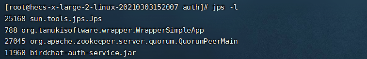
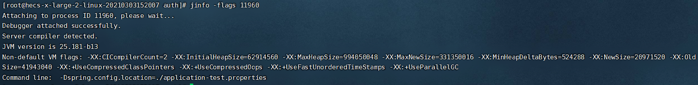
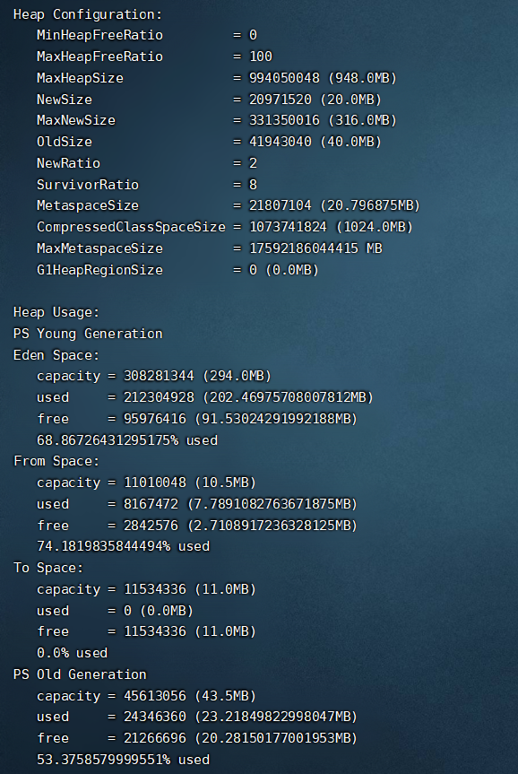

# JVM 性能调优

## 查询篇

### 列出 java 进程 jps

使用 jps 命令可以列出当前系统中有哪些 java 进程

```markdown
# 查看java进程
# -l 显示应用程序的全限定类名
# -v 列出虚拟机启动时的jvm参数
jps -l
```




### 查询 jInfo

使用 jInfo 可以查看对应线程的堆栈情况

```markdown
# 查看堆大小，参数以及垃圾回收器等
# jinfo -flags <pid>
jinfo -flags 11960
```




### 查看内存数据 jMap

使用 jMap 可以很方便地查看当前堆内存的状态，但不能实时监控

```markdown
# jmap -heap <pid>
jmap -heap 11960
```




### 实时监控堆内存数据 jstat


## 调整篇