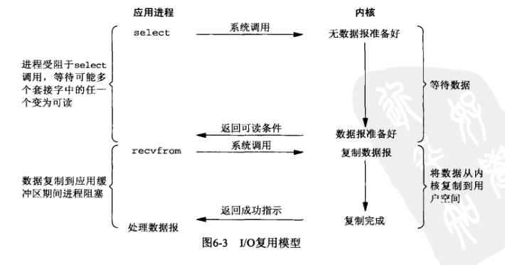
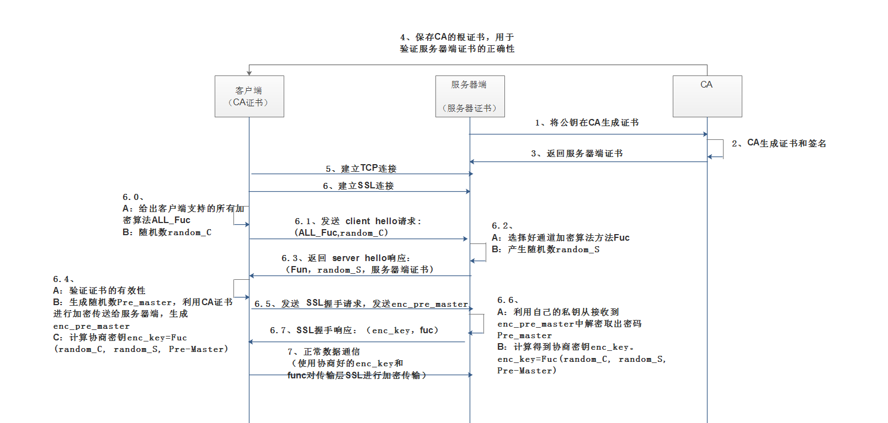

# Java基础

## 集合


## 锁

### 读写锁

```java
/**
 * ReadWriteLock
 * 读-读  可以共存
 * 读-写  不可共存
 * 写-写  不可共存
 *
 * 独占锁 => 写锁，只允许一个线程占有
 * 共享锁 => 读锁，允许多个线程共同占有
 */
public class ReadWriteLockDemo {
    public static void main(String[] args) {
        MyCache myCache = new MyCache();
        for (int i = 0; i < 5; i++) {
            final int tmp = i;
            new Thread(() -> {
                myCache.put(tmp+"", tmp+"");
            }, String.valueOf(i)).start();
        }

        for (int i = 0; i < 5; i++) {
            final int tmp = i;
            new Thread(() -> {
                myCache.get(tmp+"");
            }, String.valueOf(i)).start();
        }
    }
}

class MyCache {
    private volatile Map<String, Object> map = new HashMap<>();
    private ReentrantReadWriteLock lock = new ReentrantReadWriteLock();

    public void put(String key, Object value) {
        lock.writeLock().lock();
        try {
            System.out.println(Thread.currentThread().getName() + " 开始写入");
            map.put(key, value);
            System.out.println(Thread.currentThread().getName() + " 写入ok");
        } catch (Exception e) {
            e.printStackTrace();
        } finally {
            lock.writeLock().unlock();
        }
    }

    public void get(String key) {
        lock.readLock().lock();

        try {
            System.out.println(Thread.currentThread().getName() + " 开始读取");
            Object o = map.get(key);
            System.out.println(Thread.currentThread().getName() + " 读取ok");
        } catch (Exception e) {
            e.printStackTrace();
        } finally {
            lock.readLock().unlock();
        }
    }
}
```


## jdk8 新特性

### lambda表达式


### 链式编程


### 函数式接口


### Stream 流式运算


## 多线程

### 线程池

> 三大方法，七大参数，四种拒绝策略


#### cpu 密集型和 IO 密集型

- CPU 密集型
  - 将最大线程数设定为 cpu 核心数，保证cpu的效率最高
- IO 密集型
  - 根据程序中耗io的任务，一般设计为两倍


```java
public class ThreadPoolTest {
    public static void main(String[] args) {
        ThreadPoolExecutor threadPoolExecutor = new ThreadPoolExecutor(
                2,
                5,
                3,
                TimeUnit.SECONDS,
                new LinkedBlockingQueue<>(3),
                Executors.defaultThreadFactory(),
                new ThreadPoolExecutor.DiscardOldestPolicy()
        );

        try {
            for (int i = 0; i < 90; i++) {
                threadPoolExecutor.execute(() -> {
                    try {
                        System.out.println(Thread.currentThread().getName() + " execute");
                        TimeUnit.SECONDS.sleep(2);
                        System.out.println(Thread.currentThread().getName() + " over");
                    } catch (InterruptedException e) {
                        e.printStackTrace();
                    }
                });
            }
        } catch (Exception e) {
            e.printStackTrace();
        } finally {
            threadPoolExecutor.shutdown();
        }
    }
}

```


### ForkJoin

`即将大任务拆分成小任务，最后汇总结果。在处理大数据量时可以使用`


#### 工作窃取

`即当多个线程同时执行小任务，当一个线程完成任务后，可能会获取其他的线程的任务进行完成`

里面都是双端队列


#### 使用

```java
public class ForkJoinTest extends RecursiveTask<Long> {

    private Long start;
    private Long end;

    private Long temp = 10000L;

    public ForkJoinTest(Long start, Long end) {
        this.start = start;
        this.end = end;
    }

    @Override
    protected Long compute() {
        if ((end - start) < temp) {
            Long sum = 0L;
            for (Long i = start; i < end; i++) {
                sum += i;
            }
            return sum;
        } else {
            Long middle = (start+end)/2;
            ForkJoinTest task1 = new ForkJoinTest(start, middle);
            task1.fork(); // 拆分任务，将任务压入线程队列
            ForkJoinTest task2 = new ForkJoinTest(middle + 1, end);
            task2.fork(); // 拆分任务，将任务压入线程队列
            return task1.join() + task2.join();
        }
    }

    public static void main(String[] args) {
//        test1();
        test2();
//        test3();
    }

    public static void test1() {
        Long sum = 0L;
        long start = System.currentTimeMillis();
        for (long i = 0L; i < 10_0000_0000L; i++) {
            sum += i;
        }
        long end = System.currentTimeMillis();
        System.out.println("sum = " + sum + " 时间 = " + (end-start));
    }

    public static void test2() {
        long start = System.currentTimeMillis();
        ForkJoinPool forkJoinPool = new ForkJoinPool();
        ForkJoinTest task = new ForkJoinTest(0L, 10_000_000L);
        ForkJoinTask<Long> submit = forkJoinPool.submit(task);
        Long sum = null;
        try {
            sum = submit.get();
        } catch (InterruptedException e) {
            e.printStackTrace();
        } catch (ExecutionException e) {
            e.printStackTrace();
        }
        long end = System.currentTimeMillis();
        System.out.println("sum = " + sum + " 时间 = " + (end-start));
    }

    public static void test3() {
        long start = System.currentTimeMillis();

        // Stream 并行流
        long sum = LongStream.rangeClosed(0L, 10_0000_0000L).parallel().reduce(0, Long::sum);
        long end = System.currentTimeMillis();
        System.out.println("sum = " + sum + " 时间 = " + (end-start));
    }
}
```


### 异步回调


## IO

### IO基础

#### 概念

##### 什么是IO

`I 就是输入Input，就是将数据流向内存。O 就是Output，即将内存中的数据对外输出`


##### IO 的分类

根据数据流向分：

- 输入流：将数据从其他设备`读取`到内存中
- 输出流：将内存中的数据`写出`到其他设备

根据数据类型分：

- 字节流：以字节为单位，读写数据的流
- 字符流：以字符为单位，读写数据的流
- 1个字节=2个字符，1个字符=8位


#### 各自类型的结构图


#### 字节流 

一切文件数据(文本、图片、视频等)在存储时，都是以二进制数字的形式保存，都一个一个的字节，那么传输时一样如此。所以，字节流可以传输任意文件数据。在操作流的时候，我们要时刻明确，无论使用什么样的流对象，底层传输的始终为二进制数据。


##### 输出流 OutputStream

`java.io.OutputStream `抽象类是表示字节输出流的所有类的超类，将指定的字节信息写出到目的地。它定义了字节输出流的基本共性功能方法。

* `public void close()` ：关闭此输出流并释放与此流相关联的任何系统资源。  
* `public void flush() ` ：刷新此输出流并强制任何缓冲的输出字节被写出。  
* `public void write(byte[] b)`：将 b.length字节从指定的字节数组写入此输出流。  
* `public void write(byte[] b, int off, int len)` ：从指定的字节数组写入 len字节，从偏移量 off开始输出到此输出流。  
* `public abstract void write(int b)` ：将指定的字节输出流。

**注意：close方法，当完成流的操作时，必须调用此方法，释放系统资源。**


##### 输入流 InputStream

`java.io.InputStream `抽象类是表示字节输入流的所有类的超类，可以读取字节信息到内存中。它定义了字节输入流的基本共性功能方法。

- `public void close()` ：关闭此输入流并释放与此流相关联的任何系统资源。    
- `public abstract int read()`： 从输入流读取数据的下一个字节。 
- `public int read(byte[] b)`： 从输入流中读取一些字节数，并将它们存储到字节数组 b中 。

**注意：close方法，当完成流的操作时，必须调用此方法，释放系统资源。**


##### 子类

- FileInputStream/FileOutputStream： 文件输入/输出流，用于将文件内容读取到内存中(输入)，或是将内存的数据写入文件(输出)
- FilterInputStream/FilterOutputStream： 过滤器字节输入/输出流
- ObjectInputStream/ObjectOutputStream：对象/输入输出流，将一个对象写出和读取，即序列化(写出)和反序列化(读取)
- PipedInputStream/PipedOutputStream：管道输入/输出流，形成了类似管道的效果，用于多线程之间通信
- ByteArrayInputStream/ByteArrayOutputStream：字节数组输入/输出流，用于当数据的缓冲区
- BufferedInputStream/BufferedOutputStream： 缓冲输入/输出流


##### 代码示例

###### 文件写入和读取

```java
public static void main(String[] args) {
    FileOutputStream fos = null;
    FileInputStream fis = null;

    try {
        // 若文件不存在，则会自动创建
        fos = new FileOutputStream("a.txt", true);
        // 写入时需要转成byte数组，否则文件中会乱码
        fos.write("22".getBytes());
        fos.write("\r\n".getBytes());
        fos.write("33".getBytes());

        // 批量读取字节流
        fis = new FileInputStream("a.txt");
        int len = 0;
        byte[] b = new byte[100];
        while ((len = fis.read(b)) != -1) {
            System.out.println(new String(b, 0 ,len));
        }
    } catch (IOException e) {
        e.printStackTrace();
    } finally {
        try {
            fos.close();
            fis.close();
        } catch (IOException ioException) {
            ioException.printStackTrace();
        }
    }
}
```

###### 复制图片

```java
public static void main(String[] args) {
    FileInputStream fis = null;
    FileOutputStream fos = null;
    try {
        fis = new FileInputStream("1.png");
        fos = new FileOutputStream("1copy.png");
        byte[] bytes = new byte[1024];
        int len = 0;
        while ((len = fis.read(bytes)) != -1) {
            fos.write(bytes,0, len);
        }
    } catch (IOException e) {
        e.printStackTrace();
    } finally {
        try {
            fos.close();
            fis.close();
        } catch (IOException ioException) {
            ioException.printStackTrace();
        }
    }
}
```


#### 字符流

##### 字符输入流 Reader

`java.io.Reader`抽象类是表示用于读取字符流的所有类的超类，`可以读取字符信息到内存中`。它定义了字符输入流的基本共性功能方法。

- `public void close()` ：关闭此流并释放与此流相关联的任何系统资源。    
- `public int read()`： 从输入流读取一个字符。 
- `public int read(char[] cbuf)`： 从输入流中读取一些字符，并将它们存储到字符数组 cbuf中 。


##### 字符输出流 Write

`java.io.Writer `抽象类是表示用于写出字符流的所有类的超类，`将指定的字符信息写出到目的地`。它定义了字节输出流的基本共性功能方法。

- `void write(int c)` 写入单个字符。
- `void write(char[] cbuf) `写入字符数组。 
- `abstract  void write(char[] cbuf, int off, int len) `写入字符数组的某一部分,off数组的开始索引,len写的字符个数。 
- `void write(String str) `写入字符串。 
- `void write(String str, int off, int len)` 写入字符串的某一部分,off字符串的开始索引,len写的字符个数。
- `void flush() `刷新该流的缓冲。  
- `void close()` 关闭此流，但要先刷新它。 

**注意：**

在调用close()方法前，要先调用flush()方法。


##### 子类

- BufferReader/BufferWriter
- InputStreamReader/OutputStreamWriter **=> FileWriter**
- StringReader/StringWriter
- PipedReader/PipedWriter
- ByteArrayReader/ByteArrayWriter
- FileReader
- CharArrayWriter
- FilterReader/FilterWriter
- BufferReader/BufferWriter


##### 限制

字符流，只能操作文本文件，不能操作图片，视频等非文本文件


###### 代码示例

```java
public static void main(String[] args) {
    FileWriter fileWriter = null;
    FileReader fileReader = null;
    try {
        fileWriter = new FileWriter("a.txt", true);
        fileWriter.write(30001);
        fileWriter.write("哈哈哈这是测试");

        fileReader = new FileReader("a.txt");
        int len;
        char[] chars = new char[1024];
        while ((len=fileReader.read(chars)) != -1) {
            System.out.println("len = " + len);
            System.out.println(new String(chars, 0 , len));
        }
    } catch (IOException e) {
        e.printStackTrace();
    } finally {
        try {
            if(fileWriter!=null) {
                fileWriter.flush();
                fileWriter.close();
            }
            if(fileReader!=null) fileReader.close();
        } catch (IOException ioException) {
            ioException.printStackTrace();
        }
    }
}
```


##### 字节流和字符流的选择

使用常见文本文件时  使用字符流，其他情况使用字节流


#### 缓冲流

`缓冲流,也叫高效流，是对4个基本的FileXxx 流的增强缓冲流的基本原理，是在创建流对象时，会创建一个内置的默认大小的缓冲区数组，通过缓冲区读写，减少系统IO次数，从而提高读写的效率。`


按照数据类型分类：

* **字节缓冲流**：`BufferedInputStream`，`BufferedOutputStream` 
* **字符缓冲流**：`BufferedReader`，`BufferedWriter`


##### 字节缓冲流

```java
package com.atguigu.java.chapter01;

import java.io.*;

public class test {
    public static void main(String[] args) throws FileNotFoundException {
        // 普通输入输出流复制
//        commonCopy();

        // 缓冲区输入输出流复制
        bufferCopy();
    }

    public static void commonCopy() {
        // 记录开始时间
        long start = System.currentTimeMillis();
        // 创建流对象
        try (
                FileInputStream fis = new FileInputStream("1.exe");
                FileOutputStream fos = new FileOutputStream("copy.exe")
        ){
            // 读写数据
            int len = 0;
            byte[] bytes = new byte[1024];
            while ((len = fis.read(bytes)) != -1) {
                fos.write(bytes, 0 ,len);
            }
        } catch (IOException e) {
            e.printStackTrace();
        }
        // 记录结束时间
        long end = System.currentTimeMillis();
        System.out.println("普通流复制时间:"+(end - start)+" 毫秒");
    }

    public static void bufferCopy() {
        // 记录开始时间
        long start = System.currentTimeMillis();
        // 创建流对象
        BufferedInputStream bufferedInputStream = null;
        BufferedOutputStream bufferedOutputStream = null;
        try {
            bufferedInputStream = new BufferedInputStream(new FileInputStream("1.exe"));
            bufferedOutputStream = new BufferedOutputStream(new FileOutputStream("copy.exe"));

            int len = 0;
            byte[] bytes = new byte[1024];
            while ((len = bufferedInputStream.read(bytes)) != -1) {
                bufferedOutputStream.write(bytes, 0 ,len);
            }
        } catch (Exception e) {
            e.printStackTrace();
        } finally {
            try {
                if(bufferedInputStream != null) {
                    bufferedInputStream.close();
                }
                if(bufferedOutputStream!= null) {
                    bufferedOutputStream.close();
                }
            } catch (IOException ioException) {
                ioException.printStackTrace();
            }
        }
        // 记录结束时间
        long end = System.currentTimeMillis();
        System.out.println("缓冲流使用数组复制时间:"+(end - start)+" 毫秒");
    }
}
```


##### 字符缓冲流

* BufferedReader：`public String readLine()`: 读一行文字。 
* BufferedWriter：`public void newLine()`: 写一行行分隔符,由系统属性定义符号。 

```java
public class bufferTest {
    public static void main(String[] args) {
        BufferedReader br = null;
        BufferedWriter writer = null;
        try {
            HashMap<Integer, String> map = new HashMap<>();

            // 读取文件内容
            br = new BufferedReader(new FileReader("a.txt"));
            writer = new BufferedWriter(new FileWriter("b.txt", true));

            String line = null;
            while ((line = br.readLine()) != null) {
                System.out.println(line);
                // \\.实际上被转义bai为两次，du\\在java中被转换为一个'\'字符，然后'\.'被传给正则，\.表示对点字符进行转义，
                // 使.就表示字符'.',而不使用它在正则中的特殊意义
                String[] split = line.split("\\.");
                map.put(Integer.valueOf(split[0]), line);
            }

            int len = map.size();
            for (int i = 1; i <= len; i++) {
                writer.write(map.get(i));
                writer.newLine();
//                System.out.println("map = " + map.get(i));
            }
            writer.flush();
        } catch (IOException e) {
            e.printStackTrace();
        } finally {
            try {
                br.close();
                writer.close();
            } catch (IOException ioException) {
                ioException.printStackTrace();
            }
        }
    }
}
```


#### 转换流

##### 字符集和编码解码

###### 相关概念

计算机中存储的信息都是二进制数表示的，

- **字符集 `Charset`**

  是通用的所有字符的集合，包括各国家文件、标点符号、图形符号、数字等。常见的字符集有GBK、UTF-8、ASCII等

- **编码**

  依照某个字符集，将字符存储到计算机中，称为`编码`

- **解码**

  将存储在计算机中的二进制流以指定字符集解析显示出来，称为`解码`

- **乱码**

  由于文件的编码方式不同，如用 GBK 编码格式编写的文件，使用了 UTF-8 编码方式查看，就会看到乱码。故需要转换流，以指定的字符集写入和读取数据


###### 字符集类型

* **ASCII字符集** ：
  * ASCII（American Standard Code for Information Interchange，美国信息交换标准代码）是基于拉丁字母的一套电脑编码系统，用于显示现代英语，主要包括控制字符（回车键、退格、换行键等）和可显示字符（英文大小写字符、阿拉伯数字和西文符号）。
  * 基本的ASCII字符集，使用7位（bits）表示一个字符，共128字符。ASCII的扩展字符集使用8位（bits）表示一个字符，共256字符，方便支持欧洲常用字符。
* **ISO-8859-1字符集**：
  * 拉丁码表，别名Latin-1，用于显示欧洲使用的语言，包括荷兰、丹麦、德语、意大利语、西班牙语等。
  * ISO-8859-1使用单字节编码，兼容ASCII编码。
* **GBxxx字符集**：
  * GB就是国标的意思，是为了显示中文而设计的一套字符集。
  * **GB2312**：简体中文码表。一个小于127的字符的意义与原来相同。但两个大于127的字符连在一起时，就表示一个汉字，这样大约可以组合了包含7000多个简体汉字，此外数学符号、罗马希腊的字母、日文的假名们都编进去了，连在ASCII里本来就有的数字、标点、字母都统统重新编了两个字节长的编码，这就是常说的"全角"字符，而原来在127号以下的那些就叫"半角"字符了。
  * **GBK**：最常用的中文码表。是在GB2312标准基础上的扩展规范，使用了双字节编码方案，共收录了21003个汉字，完全兼容GB2312标准，同时支持繁体汉字以及日韩汉字等。
  * **GB18030**：最新的中文码表。收录汉字70244个，采用多字节编码，每个字可以由1个、2个或4个字节组成。支持中国国内少数民族的文字，同时支持繁体汉字以及日韩汉字等。
* **Unicode字符集** ：
  * Unicode编码系统为表达任意语言的任意字符而设计，是业界的一种标准，也称为统一码、标准万国码。
  * 它最多使用4个字节的数字来表达每个字母、符号，或者文字。有三种编码方案，UTF-8、UTF-16和UTF-32。最为常用的UTF-8编码。
  * UTF-8编码，可以用来表示Unicode标准中任何字符，它是电子邮件、网页及其他存储或传送文字的应用中，优先采用的编码。互联网工程工作小组（IETF）要求所有互联网协议都必须支持UTF-8编码。所以，我们开发Web应用，也要使用UTF-8编码。它使用一至四个字节为每个字符编码，编码规则：
    1. 128个US-ASCII字符，只需一个字节编码。
    2. 拉丁文等字符，需要二个字节编码。 
    3. 大部分常用字（含中文），使用三个字节编码。
    4. 其他极少使用的Unicode辅助字符，使用四字节编码。


##### 转换流

###### 转换输入流 InputStreamReader

转换流`java.io.InputStreamReader`，是Reader的子类，是从字节流到字符流的桥梁。它读取字节，并使用指定的字符集将其解码为字符。它的字符集可以由名称指定，也可以接受平台的默认字符集。 


###### 转换输出流 OutputStreamReader

转换流`java.io.OutputStreamWriter` ，是Writer的子类，是从字符流到字节流的桥梁。使用指定的字符集将字符编码为字节。它的字符集可以由名称指定，也可以接受平台的默认字符集。 


###### 示例代码

###### 转换输入流读取文件内容

```java
public class transTest {
    public static void main(String[] args) {
         // 以默认编码方式读取文件
        InputStreamReader inputStreamReader = null;
        InputStreamReader inputTargetStreamReader = null;

        try {
            inputStreamReader = new InputStreamReader(new FileInputStream("file_gbk.txt"));
            inputTargetStreamReader = new InputStreamReader(new FileInputStream("file_gbk.txt"),"utf-8");

            int len = 0;
            char[] chars = new char[1024];
            while ((len = inputStreamReader.read(chars)) != -1) {
                System.out.println(new String(chars, 0, len));
            }

            char[] chars2 = new char[1024];
            while ((len = inputTargetStreamReader.read(chars2)) != -1) {
                System.out.println(new String(chars2, 0, len));
            }
        } catch (IOException e) {
            e.printStackTrace();
        } finally {
            try {
                inputStreamReader.close();
                inputTargetStreamReader.close();
            } catch (IOException ioException) {
                ioException.printStackTrace();
            }
        }
    }
}
```


###### 以GBK方式写入内容，并读取

```java
public class transTest {
    public static void main(String[] args) {
        OutputStreamWriter outputStreamWriter = null;
        InputStreamReader inputStreamReader = null;
        try {
            // 编写文件
            outputStreamWriter = new OutputStreamWriter(new FileOutputStream("file_gbk.txt", true), "GBK");
            String contnet = "你好啊大家们";
            outputStreamWriter.write(contnet);
            outputStreamWriter.flush();

            // 读取文件
            inputStreamReader = new InputStreamReader(new FileInputStream("file_gbk.txt"),"GBK");
            char[] chars = new char[1024];
            int len = 0;

            while ((len = inputStreamReader.read(chars)) != -1) {
                System.out.println(new String(chars, 0, len));
            }
        } catch (IOException e) {
            e.printStackTrace();
        } finally {
            try {
                outputStreamWriter.close();
                inputStreamReader.close();
            } catch (IOException ioException) {
                ioException.printStackTrace();
            }
        }
    }
}
```


#### 序列化

https://blog.csdn.net/u013870094/article/details/82765907

使用 ObjectOutputStream/ObjectInputStream 实现序列化和反序列化

##### 概念

- **序列化**

  将对象保存为一个字节序列，字节序列中包含了对象的数据、类型以及属性等信息，并将其写入到文件中。相当于在文件中持久地保存一个对象。

- **反序列化**

  从文件中将字节序列读取出来，进行重构对象。重构的对象会恢复存储的数据、类型和属性等信息

常见的序列化手段有：JSON、XML、JDK等


##### 使用场景

- 当你想把的内存中的对象状态保存到一个文件中或者数据库中时候；

- 当你想用套接字在网络上传送对象的时候；

- 当你想通过RMI传输对象的时候；


##### 示例代码

```java
public class SerTest {
	public static void main(String[] args) throws Exception {
		// 创建 学生对象
		Student student = new Student("老王", "laow");
		Student student2 = new Student("老张", "laoz");
		Student student3 = new Student("老李", "laol");

		ArrayList<Student> arrayList = new ArrayList<>();
		arrayList.add(student);
		arrayList.add(student2);
		arrayList.add(student3);
		
		// 序列化操作
		// serializ(arrayList);
		
		// 反序列化  
		ObjectInputStream ois  = new ObjectInputStream(new FileInputStream("list.txt"));
		// 读取对象,强转为ArrayList类型
		ArrayList<Student> list  = (ArrayList<Student>)ois.readObject();
		
      	for (int i = 0; i < list.size(); i++ ){
          	Student s = list.get(i);
        	System.out.println(s.getName()+"--"+ s.getPwd());
      	}
	}

	private static void serializ(ArrayList<Student> arrayList) throws Exception {
		// 创建 序列化流 
		ObjectOutputStream oos = new ObjectOutputStream(new FileOutputStream("list.txt"));
		// 写出对象
		oos.writeObject(arrayList);
		// 释放资源
		oos.close();
	}
}
```


#### 打印流

平时我们在控制台打印输出，是调用`print`方法和`println`方法完成的，这两个方法都来自于`java.io.PrintStream`类，该类能够方便地打印各种数据类型的值，是一种便捷的输出方式。


##### 改变打印流向

`System.out`就是`PrintStream`类型的，只不过它的流向是系统规定的，打印在控制台上。不过，既然是流对象，我们就可以玩一个"小把戏"，改变它的流向。

```java
public class PrintDemo {
    public static void main(String[] args) throws IOException {
		// 调用系统的打印流,控制台直接输出97
        System.out.println(97);
      
		// 创建打印流,指定文件的名称
        PrintStream ps = new PrintStream("ps.txt");
      	
      	// 设置系统的打印流流向,输出到ps.txt
        System.setOut(ps);
      	// 调用系统的打印流,ps.txt中输出97
        System.out.println(97);
    }
}
```


#### 总结

单纯读或者写文本文件时  使用字符流，其他情况使用字节流


#### 属性集(Properties)

`java.util.Properties ` 继承于` Hashtable` ，来表示一个持久的属性集。它使用键值结构存储数据，每个键及其对应值都是一个字符串。该类也被许多Java类使用，比如获取系统属性时，`System.getProperties` 方法就是返回一个`Properties`对象。

- `public Object setProperty(String key, String value)` ： 保存一对属性。  
- `public String getProperty(String key) ` ：使用此属性列表中指定的键搜索属性值。
- `public Set<String> stringPropertyNames() ` ：所有键的名称的集合。

- `public void load(InputStream inStream)`： 从字节输入流中读取键值对。 

##### 代码示例

###### 设置和读取

```
public class ProDemo {
    public static void main(String[] args) throws FileNotFoundException {
        // 创建属性集对象
        Properties properties = new Properties();
        // 添加键值对元素
        properties.setProperty("filename", "a.txt");
        properties.setProperty("length", "209385038");
        properties.setProperty("location", "D:\\a.txt");
        // 打印属性集对象
        System.out.println(properties);
        // 通过键,获取属性值
        System.out.println(properties.getProperty("filename"));
        System.out.println(properties.getProperty("length"));
        System.out.println(properties.getProperty("location"));

        // 遍历属性集,获取所有键的集合
        Set<String> strings = properties.stringPropertyNames();
        // 打印键值对
        for (String key : strings ) {
          	System.out.println(key+" -- "+properties.getProperty(key));
        }
    }
}
输出结果：
{filename=a.txt, length=209385038, location=D:\a.txt}
a.txt
209385038
D:\a.txt
filename -- a.txt
length -- 209385038
location -- D:\a.txt
```

###### 从配置文件中读取

配置文件中的数据，必须是键值对形式，可以使用空格、等号、冒号等符号分隔

```
filename=a.txt
length=209385038
location=D:\a.txt
```

```java
public class ProDemo2 {
    public static void main(String[] args) throws FileNotFoundException {
        // 创建属性集对象
        Properties pro = new Properties();
        // 加载文本中信息到属性集
        pro.load(new FileInputStream("read.txt"));
        // 遍历集合并打印
        Set<String> strings = pro.stringPropertyNames();
        for (String key : strings ) {
          	System.out.println(key+" -- "+pro.getProperty(key));
        }
     }
}
输出结果：
filename -- a.txt
length -- 209385038
location -- D:\a.txt
```


#### 面试题

##### 说明流的三种分类方式

- 按流向分：

  - 输入流

  - 输出流

- 按数据单位分
  - 字节流
  - 字符流
- 按角色分
  - 节点流：直接作用在文件上的
  - 处理流：不是直接作用在文件上的，内部包含节点流来间接操作文件。如缓冲流


##### 写出四个IO流中的抽象基类，4个文件流，4个缓冲流

- 基类
  - InputStream、OutputStream
  - Reader、Writer
- 文件流 FileXXXX
  - FileInputStream、FileOutputStream
  - FileReader、FileWriter

- 缓冲流 BufferedXXXX
  - BufferedInputStream、BufferedOutputStream
  - BufferedReader、BufferedWriter


##### 字节流和字符流的区别？使用情景？

- 字节流
  - 字节流以字节为单位，从read就能看出：`read(byte[] buffer)`
  - 目标是非文本文件
- 字符流
  - 字符流以字符为单位，`read(char[] cbuf)`
  - 目标是文本问津


##### 使用缓冲流实现 a.jpg 复制为 b.jpg 文件的操作

```java
public static void bufferCopy() {
    BufferedInputStream bis = null;
    BufferedOutputStream bos = null;
    try{
        bis = new BufferedInputStream(new FileInputStream("a.jpg"));
        bos = new BufferedOutputStream(new FileOutputStream("a.jpg"));
        byte[] bytes = new byte[1024];
        int len = 0;
        
        while((len = bis.read(bytes))!=-1) {
            bos.write(bytes,0,len);
        }
        
        bos.flush();
    } catch(IOException e) {
        e.printStackTrace();
    } finally {
        try {
			if(bis != null) bis.close();
	        if(bos != null) bos.close();
        } catch(IOException e) {
			e.printStackTrace();
        }
    }
}
```


##### 转换流是哪两个类，分别作用是什么？

- InputStreamReader
  - 将输入的字节流转换成字符流
  - `new InputStreamReader(new FileStreamReader("a.txt"), "utf-8");`

- inputStreamWriter
  - 将输入的字符流转换成字节流
  - `new OutputStreamReader(new FileStreamWriter("a.txt"), "utf-8");`


### IO模型

#### 同步、异步、阻塞、非阻塞

##### 阻塞和非阻塞

- **阻塞：**当某个任务在执行过程中，发出了一个请求操作，如果该请求操作的条件不满足，则会一直等待，直至条件满足
- **非阻塞：**当某个任务在执行过程中，发出一个请求操作，若该请求操作的条件不满足，则会立刻返回一个标志信息告知条件不满足，而不是一直等待

- **例子：**就好像读取文件，如果文件中没有内容可以读取
  - **阻塞模式下，**线程会一直等待直到文件有内容可读
  - **非阻塞模式下：**立刻返回一直标志信息告知文件中没有内容可读


##### 同步和异步

- **同步：**发出请求后，必须得到确切的结果后，才能继续进行下一个请求
- **异步：**发出请求后，并不会立刻得到确切的结果，但可以继续执行下一个请求。确切的结果会在接收方准备完毕后，通过通知或回调的方式来告知相应结果


##### 同步异步、阻塞非阻塞的区别

同步异步，阻塞非阻塞其实是阶段性的区别

- 同步异步关注的是`是否会马上得到最终结果`，同时关注的是`接收请求阶段的处理`，如读取文件时：

  - **同步：**请求者要求接收方告诉我的是确切的最终结果，读取文件成功还是失败。如果请求者没告诉我我就一直等着。

  - **异步：**请求者告诉接收方我要读取文件了，有结果了你可以用xxx方式联系我，最迟多久联系我。接收方立刻回复说好的我看看。

    当接收方准备好了，就使用请求者留下的方式(回调或通知)告诉请求者最终的结果

- 阻塞非阻塞关注的是`要不要等待`，同时关注的是`处理请求阶段的处理` ，如读取文件时：

  - 阻塞：若条件不满足，请求者就一直等着(实际是用户线程挂起)，直到数据准备好了，才恢复用户线程返回数据
  - 非阻塞：若条件不满足，接收方直接告诉请求者结果，无需请求者一直等待。若数据准备好了，也要等请求者下次来询问才能知道结果。

  

##### 阻塞IO和非阻塞IO

- **阻塞IO：**当用户发起一个I/O请求，内存会去查看读取的数据是否就绪，若数据没有就绪，线程会被挂起，直到数据就绪，恢复用户线程并返回数据
- **非阻塞IO：**当用户发起一个I/O请求，内存会去查看读取的数据是否就绪，若数据没有就绪，则会立刻返回一个标志位，告知用户数据没有就绪。即使之后数据准备好了，也需要用户再次发起请求读取才能得到数据


##### 同步IO和异步IO

- **同步IO：**当用户发出IO请求后，必须得到一个确切的结果，如数据读取成功或是数据读取失败
- **异步IO：**当用户发出IO请求，同时告知接收方回调方式，接收方立马返回一个确认信息，并在之后返回处理结果。

- 例子：小明去小王家找他拿书，若小王不在家，小明有两种选择

  - 一直在小王家等，直到小王回来给他书或是被告知小王不会回来了，然后小明回家(响应) => **同步**

  - 告诉小王可以通过邮寄到xxx地址把书给我，然后小明回家(响应)。之后小王把书邮寄到小明家(回调) => **异步**

  - 二者的区别在于小明是否马上得到了结果，同步的话小明一直等，直到得到书(响应成功)或是告知小王不回来了(响应失败)

    异步的话小明不需要直到小王什么时候回来，反正事后小王就会把东西按留下来的方式(回调)寄过来(响应结果)了


##### 同步异步+阻塞非阻塞的模型组合

同步异步和阻塞非阻塞，他们不能割裂开看，而是需要两两组合的方式看

###### 同步阻塞IO模型

- **同步IO：**当用户放出IO请求后，必须得到确切的结果才会返回

- **阻塞IO：**当发起IO请求后，若不满足，则挂起用户线程直到条件满足
- **组合效果：**用户发起请求后，必须等待业务处理完毕给出响应才能再发起下一个请求。同时如果要读取的数据没准备好，则用户线程会被挂起，等待数据准备完成


###### 同步非阻塞IO模型

- **同步IO：**当用户放出IO请求后，必须得到确切的结果才会返回
- **非阻塞IO：**当发起IO请求后，马上返回结果，不满足则返回失败，满足则返回成功
- **组合效果：**用户发起请求后，必须在等待得到响应后才能在发起下一个请求。如果内核发现要读取的数据没准备好，内核会马上返回数据没准备好的信号结果用户线程，用户线程马上给出响应。此过程中不会挂起用户线程


###### 异步非阻塞IO模型

- **异步IO：**当用户发出IO请求后，接收方会记录回调方式并马上给出一次响应，业务阶段处理完毕后，调用回调再次给前端响应
- **非阻塞IO：**当发起IO请求后，马上返回结果，不满足则返回失败，满足则返回成功
- **组合效果：**用户发起请求后，接收方立马返回响应，用户线程就可以先去处理其他业务。同时接收方进入业务处理阶段，内核会马上判断是否有可读数据，而不会挂起线程。得到结果后调用回调函数再次给出一个响应给请求方
- **注意：**这种模式下，只有IO请求和响应操作的发出是由用户线程来进行的，如果数据没有就绪，则由内核去轮询数据是否就绪，当数据就绪时从内核拷贝数据到用户线程，然后发送通知告知用户线程IO操作已经完成。`也就是说在异步IO中，由于不需要用户线程去轮询查看数据是否就绪，不会对用户线程产生任何阻塞。`


#### 五种 IO 模型

IO模型都以读事件为例

##### 阻塞IO模型

`阻塞IO模型是最传统的IO模型，即在读写数据的过程中会发生阻塞。`

`当用户发出IO请求后，内核会去查看数据是否就绪，若没有就绪则用户线程就会阻塞等待，直到数据准备完成后，内核将数据拷贝到用户线程并返回结果给用户线程，用户线程才会解除阻塞状态`


##### 非阻塞IO模型

`非阻塞IO模型是当用户发出IO请求后，若内核发现数据没有就绪，会立刻返回数据没有就绪的标志。用户线程可以在一段时间后再次发起IO请求获取数据。若此时数据依旧没有就绪，则返回数据未就绪的标志。若数据准备好了，则从内核中复制数据到用户线程，并返回数据给用户线程。`

实际上非阻塞IO模型，在复制数据的过程中依赖是阻塞的，但在数据未准备好的时候是非阻塞的，可以让用户线程去干别的事情


##### 多路复用IO模型(事件驱动模型)

在多路复用IO模型是典型的同步非阻塞模型，如 Java 的 NIO 模型和 Reactor 模型

`在多路复用IO模型中，会有一个线程(Selector)定时去轮询多个socket的状态，只有当 socket 真正发生了事件时，才会取出对应的事件请求，并分发到线程池的线程中处理。`

实际多路复用IO模型中处理可用的读写事件是阻塞的，其意义更多是避免了监听线程的额外开销，能够同时连接更多的线程。

###### 优点

- **避免创建/销毁线程的开销：**实现一个线程监听多个 socket，而不是每个 socket 都建立一个新的线程
- **降低内存资源的占用：**监听 socket 的线程一般不会被释放的，只使用一个线程监听多个 socket 可以极大减少资源占用
- **事件驱动**：多路复用IO是在内核中去轮询 socket 状态的，有事件发生性能远高于在用户线程中轮询 socket 状态




##### 信号驱动IO模型

`在信号驱动IO模型中，当用户线程发起一个IO请求操作，会给对应的socket注册一个信号函数，之后用户线程会继续执行。当内存数据就绪时会发送一个信号给用户线程，当用户线程接收到信号后，就会调用注册好的信号函数来进行实际的IO读写操作,这部分是阻塞操作`

当用户线程接收到信号表示数据已经就绪，然后需要用户线程调用IO函数进行实际的读写操作


##### 异步IO模型

在异步IO模型中，当用户线程发起一个IO请求操作后，内核会立马给出一个返回给用户线程，并记录用户线程的回调。当数据准备好并从内核复制到用户线程后，直接使用回调函数返回数据给用户线程

`在异步IO模型中，收到信号表示IO操作已经完成，此时用户数据已经从内存复制到用户线程了，不需要再在用户线程中调用iO函数进行实际的读写操作`


##### 五种模型的优缺点

**阻塞IO模型：**

- 优点
  - 搭建简单
- 缺点
  - 会导致用户线程挂起，效率低
  - 一个 socket 对应一个线程，线程开销大

**非阻塞IO模型：**

- 优点
  - 解决了阻塞IO模型会导致线程挂起的问题，性能高于阻塞IO模型
- 缺点
  - 一个 socket 对应一个线程，线程开销大
  - 当未准备好的情况下，需要用户线程不断轮询请求

**多路复用IO模型：**

- 优点
  - **降低创建/销毁线程的开销：**在非阻塞IO模型的基础上，解决了线程开销大的问题。用一个线程监听多个socket，只有可用的读写事件发生了才会创建新线程处理
  - **基于事件处理：**在内核中轮询，而不是让用户线程轮询，内核轮询性能高于用户线程轮询
  - **避免了资源占用：**NIO模型中每个socket对应的线程都是长连接，一般不会释放，占用内存，而多路复用IO只需要一个线程即可

- 缺点
  - 依然使用同步IO模式，会导致从内核复制数据到用户线程阶段，用户线程阻塞

**信号驱动IO模型：**

- 优点
  - 解决了NIO模型中，要线程或内核不断轮询的问题
- 缺点
  - 实现难度高
  - 在数据准备完成后，用信号量通知用户线程数据准备完成了。依然需要用户线程调用IO方法将数据从内核复制到用户线程，这部分是阻塞操作

**异步IO模型**

- 优点
  - 当用户线程知晓数据准备完成时数据已经从内核复制到用户线程了，不会像信号驱动IO模型那样导致用户线程阻塞


### NIO

#### 概念

##### BIO、NIO、AIO

- **BIO(Blocking I/O 同步并阻塞)**

  - 一个连接对应一个线程，当服务器接收到一个请求(连接)时就需要启动一个线程进行处理
  - 适用于`连接数目较少`的项目中
  - 可以通过线程池改善

- **NIO(No-Blocking I/O，New I/O 同步非阻塞)**

  - Reactor 模式
  - 一个线程处理多个请求(连接)，客户端发来的连接请求都会注册到多路复用器上，多路复用器轮训到连接有I/O请求就进行处理

  - 适用于`连接数目较多，且I/O时间较短`的项目，如聊天服务器，弹幕系统，服务器间通讯等
  - NIO 是`面向缓冲区`编程的，即数据读取到它稍后处理的缓冲区中，需要时可以在缓冲区中前后移动，这增加了处理过程中的灵活性，使得可以提供非阻塞式的高伸缩性网络

- **AIO(异步非阻塞)**

  - AIO 中引入了异步通道的概念，采用了 Proactor 模式，只有有效的请求才启动线程。它的特点是先由操作系统完成后才通知服务端程序启动线程去处理，一般适用于连接数较多且连接时间较长的应用
  - 适用于`连接数较多，且连接时间较长`的架构，如文件服务器

  


##### NIO 和 AIO 的主要区别是 

- NIO(Reactor) 通知用户线程数据准备好时，需要用户线程调用IO函数将数据从内核复制到用户线程中，这个过程是阻塞的
- AIO(Proactor) 通知用户线程数据准备好时，已经将数据从内核复制到用户线程了，故整个过程是没有阻塞的


##### 非阻塞模式

非阻塞模式下，NIO可以做到一个线程处理多个操作，例如同时来10000个请求，实际只需要50个线程就可以处理，而不是像BIO一样要10000个线程处理这些请求

- 读取数据时：
  - 阻塞模式下，若线程读取数据时没有得到数据(即inputstream.read())，就会阻塞在那边
  - 非阻塞模式下，线程仅能得到目前可用的数据，`若线程没有读取到可用数据，则什么都不会获取，且不会保存线程阻塞`。在数据变得可以读取之前，线程可以去做其他的事情。
- 写入数据时：
  - 阻塞模式下，若客户端写入没有完成，则服务端线程会阻塞等待客户端写入，直到客户端断开，或客户端调用 socket.shutdownOutput()
  - 非阻塞模式下，当一个线程请求写入一些数据到某通道，不需要等待它完全写入，这个线程可以去做其他的事情

HTTP2.0 使用了多路复用技术，做到同一链接并发处理多个请求，能够处理的并发请求数量远大于 HTTP1.1


##### BIO和NIO的区别

- **是否阻塞**

  BIO 是阻塞的，NIO是非阻塞的。BIO在线程读取/写入数据是，是阻塞等待的，而NIO则是采用事件机制，若没有在写入、读取则线程可以去干其他的事情

- **数据处理方式**

  BIO 是以流的方式处理数据，而NIO是以块的方式处理数据，块I/O的效率高于流I/O

  BIO是基于字节流和字符流进行操作，而NIO是基于 Channel(通道) 和 Buffer(缓冲区) 进行操作

  NIO 是将数据从通道读取到缓冲区中，或者从缓冲区写入通道中。Selector(选择器)用于监听多个通道的时间(如连接请求、数据到达等)。因此实现单个线程就可以监听多个客户端通道。


#### 模型图

##### BIO 模型


##### NIO 模型


#### 核心概念

##### 概述

NIO 的三大核心组件分别是： Selector(选择器)、Channel(通道)、Buffer(缓冲区)

###### 三者关系：

- 一个 Selector 对应一个线程，一个线程对应多个 Channel
- 如下图，一个线程对应了一个 Selector，一个 Selector 上注册了三个 Channel
- 线程切换到哪个 Channel 上是由事件(Event)决定的，Selector 会根据不同的事件在各个通道上切换
- 每个 Channel 都会对应一个 Buffer
- Buffer 就是一个内存块，底层是一个数组存储数据的
- 数据的读取/写入都是通过 Buffer 的，Buffer 和 Channel 都是双向的，既可以写也可以读，但是需要 flip 方法切换


##### Buffer 缓冲区

`缓冲区实际是一个可以读写数据的内存块，或理解成一个容器对象，提供了一组方法可以更方便的存储数据和读写内存块，并且能够跟踪和记录缓冲区的状态变化情况。所有的读取和写入的数据都必须经过 Buffer`


###### 读写流程

**重要参数：**

- Capacity: Buffer 的容量，在缓冲区创建时设定，且不能被改变
- Limit: 表示缓冲区的当前终点，用于标识实际有效数据的大小，应该小于等于capacity。
- Position: `下一个`要被读或者写的元素的索引。即每次调用 get() 方法都会将 Position 向后移动一位
- Mark: 对位置做出标记，可以通过 reset() 方法直接回到这个标记的位置

**流程分析：**

- 创建 Buffer
  - 在创建时指定 capacity，虚拟机会为其分配一块对应大小的内存
  - 此时 limit = 0, position = 0

- 写模式下添加数据

  - 将 limit 设置成 capacity 一样的大小，即 limit = capacity
  - 每次加入数据都会导致 position 加一，直至 position 等于 limit

- 切换成读模式

  - 从写模式切换成读模式，capacity 不变，将读模式下的position值赋值给 limit。即 limit = position，将 position 变为 0
  - 读模式下使用 get 方法读取数据，position 不能大于 limit

- 读模式切换为写模式

  - 读模式切换为写模式后，原本的数据不会清理，而是采用覆盖的方式。与一开始在写模式下添加数据一样，

    limit = capacity，position = 0


###### 常见类型

- ByteBuffer
- CharBuffer
- IntBuffer
- ShortBuffer
- LongBuffer
- DoubleBuffer
- FloatBuffer

没有 BooleanBuffer


###### 变量描述


```java
public abstract class Buffer {
    //JDK1.4时，引入的api
    public final int capacity( )//返回此缓冲区的容量
    public final int position( )//返回此缓冲区的位置
    public final Buffer position (int newPositio)//设置此缓冲区的位置
    public final int limit( )//返回此缓冲区的限制
    public final Buffer limit (int newLimit)//设置此缓冲区的限制
    public final Buffer mark( )//在此缓冲区的位置设置标记
    public final Buffer reset( )//将此缓冲区的位置重置为以前标记的位置
    public final Buffer clear( )//清除此缓冲区, 即将各个标记恢复到初始状态，但是数据并没有真正擦除, 后面操作会覆盖
    public final Buffer flip( )//反转此缓冲区
    public final Buffer rewind( )//重绕此缓冲区
    public final int remaining( )//返回当前位置与限制之间的元素数
    public final boolean hasRemaining( )//告知在当前位置和限制之间是否有元素
    public abstract boolean isReadOnly( );//告知此缓冲区是否为只读缓冲区
 
    //JDK1.6时引入的api
    public abstract boolean hasArray();//告知此缓冲区是否具有可访问的底层实现数组
    public abstract Object array();//返回此缓冲区的底层实现数组
    public abstract int arrayOffset();//返回此缓冲区的底层实现数组中第一个缓冲区元素的偏移量
    public abstract boolean isDirect();//告知此缓冲区是否为直接缓冲区
}
```


###### MappedByteBufffer

`MappedByteBufffer 能够让文件直接在内存修改，操作系统不需要再修改一次`


##### Channel 通道

`Channel 其实是 NIO 中的一个接口，实现类似流的功能，但可以同时读写，而流只能单向读，或者单向写。`

Channel 是在流内部的


###### 常用的 Channel 类型

- FileChannel：向文件中读写数据	
- DatagramChannel：通过UDP协议向网络读写数据
- SocketChannel：通过TCP协议向网络读写数据
- ServerSocketChannel：监听到来的TCP连接，给每个连接建立一个 SocketChannel


###### 常用的方法

- public int read(ByteBuffer dst) ，从通道读取数据并放到缓冲区中

- public int write(ByteBuffer src) ，把缓冲区的数据写到通道中

- public long transferFrom(ReadableByteChannel src, long position, long count)，从目标通道中复制数据到当前通道

- public long transferTo(long position, long count, WritableByteChannel target)，把数据从当前通道复制给目标通道，使用的是零拷贝


##### Selector 选择器

`Selector 即选择器，又称多路复用器，用于检查一个或多个 NIO Channel（通道）的状态是否有读/写事件发生，如果有事件发生，便获取事件并进行对应处理。`


###### 好处

- 能够使用单线程管理多个channel，即使用更少的线程来处理请求，减少了线程上下文切换的开销


常用方法

**Selector**

- open()：创建出一个 Selector， 一个 Selector 对应一个线程
- select() ：阻塞，返回发生了事件，等待处理的通道的个数
- **select(1000)：阻塞 1000 毫秒，**返回发生了事件，等待处理的通道的个数
- selectSelectionKeys();  返回发生事件的通道的Selectionkey集合
- selectNow();：不阻塞，立马返回

  

**SelectionKey**

- **channel()：得到这个 selectionKey 对应的通道**
- **attachment()：得到这个 selectionKey 对应的 Buffer**
- **isAcceptable()：连接请求事件**
- **isConnectable()：连接成功事件**
- **isReadable()：读事件**
- **isWritable()：写事件**
- interestOps()：修改关注的事件类型


**ServerSocketChannel/SocketChannel**

ServerSocketChannel 主要是负责监听客户端连接的，而  SocketChannel 主要是读写

- accept()：服务端 ServerSocketChannel 为客户端打开一个连接
- open()：打开一个连接通道
- bind()：设置端口
- register()：注册到 selector 中
- read()：读数据

- write()：写数据


#### NIO 非阻塞网络编程原理图(重要)

##### 监听事件类型

- **OP_READ：**有读操作
- **OP_WRITE：**有写操作
- **OP_CONNECT：**连接建立成功
- **OP_ACCEPT：**有新的网络可以连接

##### 流程

- 当客户端连接时，并会通过 ServerSocketChannel 建立连接并得到 SocketChannel，表示自己这条连接。
- 这个 SocketChannel 会注册到 Selector 上(包括要监听什么事件)，一个 Selector 可以注册多个 SocketChannel 实例
- SocketChannel 成功在 Selector 注册后，会得到自己唯一的 SelectionKey。并被 Selector 的记录
- Selector 监听 select 方法，返回有事件发生的通道的个数，并得到有事件方式的对应的通道 SelectionKey
- Selector 会根据得到的 SelectionKey 去找到对应的 SocketChannel (使用 Channel 方法)
- Selecotr 处理 SocketChannel 中的业务


#### 零拷贝

##### 概念

`零拷贝就是一种避免 CPU 将数据从一块存储拷贝到另外一块存储的技术。能够将内核空间中的数据直接拷贝到协议栈中，而不需要经过用户空间的缓冲区了，同时也无需cpu拷贝，减低了cpu开销。`


##### 常见类型

- mmap(内存映射) 
- sendFile

###### 区别

- **数据大小：**mmap 适合小数据量读写，sendFile 适合大文件传输。
- **切换和拷贝次数：**mmap 需要 4 次上下文切换，3 次数据拷贝；sendFile 需要 3 次上下文切换，最少 2 次数据拷贝。
- **拷贝方式：**sendFile 可以利用 DMA 方式，减少 CPU 拷贝，mmap 则不能（必须从内核拷贝到 Socket 缓冲区）


###### 优势

- **更少的数据复制：**直接在内核空间使用DMA拷贝到内核空间的协议栈中
- **更少的上下文切换：**从传统IO的三次切换，变为二次切换
- **更少的cpu计算：**从传统IO需要两次cpu复制，变为直接一次DMA复制
- **更少的内存空间占用：**无需在用户空间中开辟缓存


##### 传统IO处理

###### 四次拷贝，三次切换

**DMA(direct memory access)：**直接内存拷贝，即不使用cpu

**四次拷贝：**硬盘=>内核（DMA）、内核buffer=>user buffer（CPU COPY）、user buffer=>socket buffer（CPU COPY）、

​				  socket buffer=>协议栈（DMA）

**三次切换：**

- 用户上下文 => 内核上下文 (开始硬盘dma拷贝)

- 内核上下文 => 用户上下文（开始cpu拷贝，从内核中拷贝到user buffer）
- 用户上下文 => 内核上下文（又通过cpu拷贝，从user buffer 拷贝到 socket buffer 中）

​	

###### 流程

- 先将硬盘中的数据，使用 DMA 拷贝拷贝到内核的 kernel buffer 中
- 然后在内核中使用 cpu copy 将内核 buffer 中的数据拷贝到 user buffer
- 在 user buffer 中进行修改后，又使用 cpu copy 拷贝到 socket buffer
- 最终又使用 DMA 拷贝将数据拷贝到协议栈中


 

##### 零拷贝处理

零拷贝直接将内核 buffer 的数据拷贝到协议栈中

实际是有进行 cpu拷贝的，将数据拷贝到 socket buffer中，但由于只包含了少量参数(如大小，偏移量等)，损耗几乎忽略

###### sendFIle 模型图


###### MMAP模型图


#### 存在的问题

- **NIO 的类库和API繁杂，使用麻烦：**需要熟练掌握 Selector、ServerSocketChannel、SocketChannel、ByteBuffer 等
- **技术难度高：**掌握NIO 必须熟悉多线程编程，网络编程以及 Reactor 模式
- **开发工作量大：**需要处理断线重连、半包读写、失败缓存、网络拥塞等
- **存在Bug：**如 Epoll Bug，导致 Selector 空轮训，最终导致 cpu 100%


#### 简单示例代码

##### 拷贝文件

```java
public class NIOFileChannel01 {
    public static void main(String[] args) throws Exception {
        // 记录开始时间
        long start = System.currentTimeMillis();

        // 实现读取一个文件，然后再输出到另一个文件中
        // 读取文件
        File file = new File("a.txt");
        // 先获取文件输入流
        FileInputStream fileInputStream = new FileInputStream(file);
        // 创建 channel
        FileChannel inChannel = fileInputStream.getChannel();
        // 创建 buffer
        ByteBuffer buffer = ByteBuffer.allocate(1024);
        // 由于可能一次性读取不完，构架一个byte输出流存储
        ByteArrayOutputStream byteOuptutStream = new ByteArrayOutputStream();
        int len = 0;
        while ((len = inChannel.read(buffer)) > 0) {
            byteOuptutStream.write(buffer.array(), 0, len);
            buffer.clear();
        }

        System.out.println("读取完毕，结果为：" + byteOuptutStream.toString());

        System.out.println("开始写入文件！");
        ByteBuffer writeBuffer = ByteBuffer.allocate(byteOuptutStream.size());
        writeBuffer.put(byteOuptutStream.toByteArray());
        // 反转 buffer
        writeBuffer.flip();
        // 将读取到的数据通过通道写入到新的文件中
        FileOutputStream fileOutputStream = new FileOutputStream(new File("b.txt"));
        FileChannel outChannel = fileOutputStream.getChannel();
        outChannel.write(writeBuffer);
        System.out.println("写入完毕！");

        byteOuptutStream.close();
        fileOutputStream.close();
        fileInputStream.close();

        // 记录结束时间
        long end = System.currentTimeMillis();
        System.out.println("缓冲流使用数组复制时间:"+(end - start)+" 毫秒");
    }
}
```


##### **transferFrom 的使用**

```java
// 先读取图片
FileInputStream fileInputStream = new FileInputStream(new File("1.png"));
FileOutputStream fileOutputStream = new FileOutputStream(new File("2.png"));
FileChannel sourceChannel = fileInputStream.getChannel();
FileChannel destChannel = fileOutputStream.getChannel();
// 使用 transfrom 完成拷贝
destChannel.transferFrom(sourceChannel, 0, sourceChannel.size());
```


##### Buffer 使用

```java
public class NioByteBufferDemo03 {
    public static void main(String[] args) {
        ByteBuffer buffer = ByteBuffer.allocate(64);

        buffer.putInt(100); // 4个字节
        buffer.putLong(9L); // 8个字节
        buffer.putChar('啦'); // 2个字节
        buffer.putChar('a'); // 2个字节
        buffer.flip();
        System.out.println(buffer.limit());
        System.out.println("int = " + buffer.getInt());
        System.out.println("long = " + buffer.getLong());
        System.out.println("char = " + buffer.getChar());
        System.out.println("char2 = " + buffer.getChar());
    }
}
```


##### MappedByteBufffer 使用

```java
public class MappedByteBuffferDemo {
    public static void main(String[] args) throws Exception{
        RandomAccessFile randomAccessFile = new RandomAccessFile("1.txt", "rw");
        FileChannel fileChannel = randomAccessFile.getChannel();

        /**
         * 参数1：使用的是读写模式
         * 参数2： 0 可以直接修改起始位置
         * 参数3： 5：映射到内存的代销，即将 1.txt 的多少字节映射到内存
         */
        MappedByteBuffer map = fileChannel.map(FileChannel.MapMode.READ_WRITE, 0, 5);
        map.put(0, (byte) 'H');
        map.put(3, (byte) 'E');
    }
}
```


##### ByteBuffer 聚集(重要)

```java
/**
 * Scattering：将数据写入到 buffer 时，可以采用 buffer 数组，依次写入 => 分散
 * Gathering： 从 buffer 中读取数据时，可以采用 buffer 数组，依次读取
 */
public class NIOFileBufferDemo04 {
    public static void main(String[] args) throws Exception{
        ServerSocketChannel serverSocketChannel = ServerSocketChannel.open();
        InetSocketAddress inetSocketAddress = new InetSocketAddress(7000);
        // 绑定端口到 Socket 并启动
        serverSocketChannel.socket().bind(inetSocketAddress);

        // 创建 buffer 数组
        ByteBuffer[] byteBuffers = new ByteBuffer[2];
        byteBuffers[0] = ByteBuffer.allocate(5);
        byteBuffers[1] = ByteBuffer.allocate(3);

        // 等待客户端连接
        SocketChannel socketChannel = serverSocketChannel.accept();
        int msgLen = 8;
        while (true) {
            int byteRead = 0;
            while (byteRead < msgLen) {
                long l = socketChannel.read(byteBuffers);
                byteRead += l; // 累计读取的字节数
                System.out.println("byteRead = " + byteRead);

                // 使用流打印
                Arrays.asList(byteBuffers).stream().map(byteBuffer -> "position = " + byteBuffer.position() +
                        " limit = " + byteBuffer.limit()).forEach(System.out::println);
            }

            // 将所有的 buffer 进行反转
            Arrays.asList(byteBuffers).forEach(byteBuffer -> byteBuffer.flip());

            // 将数据独处显示到客户端
            long byteWrite = 0;
            while (byteWrite < msgLen) {
                long l = socketChannel.write(byteBuffers);
                byteWrite += l;
            }

            // 将所有的buffer清理
            Arrays.asList(byteBuffers).forEach(byteBuffer -> {
                byteBuffer.clear();
            });

            System.out.println("byteRead = " + byteRead);
            System.out.println("byteWrite = " + byteWrite);
            System.out.println("msgLen = " + msgLen);
        }
    }
}
```


##### 简易聊天

###### 服务端

```java
public class ChatServer {
    private Selector selector;
    private ServerSocketChannel serverSocketChannel;
    private static final int port = 7000;

    public ChatServer() {
        try {
            selector = Selector.open();
            serverSocketChannel = ServerSocketChannel.open();
            serverSocketChannel.socket().bind(new InetSocketAddress(port));
            serverSocketChannel.configureBlocking(false);
            serverSocketChannel.register(selector, SelectionKey.OP_ACCEPT, ByteBuffer.allocate(1024));
            System.out.println("服务器启动完成...");
        } catch (IOException e) {
            e.printStackTrace();
        }
    }

    public void listener() {
        try {
            while (true) {
                int count = selector.select(2000);
                // 有事件要处理
                if (count > 0) {
                    Set<SelectionKey> selectionKeys = selector.selectedKeys();
                    Iterator<SelectionKey> iterator = selectionKeys.iterator();
                    while (iterator.hasNext()) {
                        // 取出这个 SelectionKey
                        SelectionKey key = iterator.next();

                        // 监听连接事件
                        if (key.isAcceptable()) {
                            SocketChannel channel = this.serverSocketChannel.accept();
                            channel.configureBlocking(false);
                            channel.register(this.selector, SelectionKey.OP_READ, ByteBuffer.allocate(1024));
                            System.out.println(channel.getRemoteAddress() + " 上线了！");
                        }

                        // 监听读事件
                        if (key.isReadable()) {
                            this.readHandler(key);
                        }

                        // 删除key，防止重复处理
                        iterator.remove();
                    }
                } else {
//                    System.out.println("没有事件要处理！");
                }
            }
        } catch (IOException e) {
            e.printStackTrace();
        }
    }

    /**
     * 获取到读消息
     * @param selectionKey
     */
    public void readHandler(SelectionKey selectionKey) {
        SocketChannel socketChannel = null;

        try {
            socketChannel = (SocketChannel) selectionKey.channel();
            ByteBuffer buffer = ByteBuffer.allocate(1024);
            int len = socketChannel.read(buffer);
            if (len > 0) {
                String msg = new String(buffer.array());
                System.out.println("from 客户端：" + msg);

                // 向其他客户端转发消息
                this.transferMsg(msg, socketChannel);
            }
        } catch (IOException e) {
            try {
                System.out.println(socketChannel.getRemoteAddress() + " 离线了...");
                // 取消注册
                selectionKey.cancel();
                // 开始关闭通道
                socketChannel.close();
            } catch (IOException ex) {
                ex.printStackTrace();
            }
        }
    }

    /**
     * 转发消息给其他客户端
     */
    public void transferMsg(String msg, SocketChannel sender) throws IOException {
        // 向所有客户端转发这条消息，但要排除消息的发送方
        for (SelectionKey key : selector.keys()) {
            Channel channel = key.channel();
            // 判断这个通道是客户端的连接通道，并不能是发送者
            if (channel instanceof SocketChannel && channel!=sender) {
                SocketChannel destChannel = (SocketChannel) channel;
                ByteBuffer buffer = ByteBuffer.wrap(msg.getBytes());
                destChannel.write(buffer);
            }
        }
    }

    public static void main(String[] args) {
        ChatServer chatServer = new ChatServer();
        chatServer.listener();
    }
}
```

###### 客户端

```java
public class ChatClient {
    private final String host = "127.0.0.1";
    private final int port = 7000;

    private Selector selector;
    private SocketChannel socketChannel;
    private String userName;

    public ChatClient() throws IOException {
        this.selector = Selector.open();
        this.socketChannel = SocketChannel.open(new InetSocketAddress(host, port));
        socketChannel.configureBlocking(false);
        socketChannel.register(selector, SelectionKey.OP_READ);
        userName = socketChannel.getLocalAddress().toString().substring(1);
        System.out.println(userName + " is OK...");
    }

    // 向服务器发送消息
    public void sendMsg(String msg) {
        msg = userName + " 说：" + msg;
        try {
            socketChannel.write(ByteBuffer.wrap(msg.getBytes()));
        } catch (IOException e) {
            e.printStackTrace();
        }
    }

    // 读取服务器端的返回消息
    public void readMsg() {
        try {
            int count = selector.select();
            if (count > 0) {
                Set<SelectionKey> selectionKeys = selector.selectedKeys();
                Iterator<SelectionKey> iterator = selectionKeys.iterator();
                while (iterator.hasNext()) {
                    SelectionKey key = iterator.next();
                    if (key.isReadable()) {
                        SocketChannel channel = (SocketChannel) key.channel();
                        ByteBuffer buffer = ByteBuffer.allocate(1024);
                        channel.read(buffer);
                        System.out.println(new String(buffer.array()).trim());
                    }
                }

                iterator.remove();
            } else {
            }
        } catch (IOException e) {
            e.printStackTrace();
        }
    }

    public static void main(String[] args) throws IOException {
        ChatClient chatClient = new ChatClient();
        new Thread() {
            @Override
            public void run() {
                // 每隔三秒向服务器读取一次数据
                while (true) {
                    chatClient.readMsg();
                    try {
                        sleep(3000);
                    } catch (InterruptedException e) {
                        e.printStackTrace();
                    }
                }
            }
        }.start();

        Scanner scanner = new Scanner(System.in);
        while (scanner.hasNext()) {
            String msg = scanner.nextLine();
            chatClient.sendMsg(msg);
        }

    }
}
```


### 三种设计模式

#### 传统IO模式

传统IO模式有几个特点：

- 每个请求都要创建一个线程处理
- 使用阻塞式IO处理任务，即没有数据读写时会阻塞等待


#### Reactor模式

Reacotr 模式又称为：反应器模式、分发者模式

主要用于同步非阻塞式的IO模型

`Reactor 模式即主线程只负责监控通道是否有事件发生，如果事件发生且是 Accept 事件，则发送给 Acceptor 来建立连接，若是读写事件等，则发送给 handler 进行处理。`


##### 单 Reactor 单线程模式

- **优点：**搭建简单

- **缺点：**单线程处理连接、数据读写，只适用于小并发且业务处理快速的场景，不建议使用


##### 主从 Reactor 多线程模式

为了提高并发量和可用性， Netty 使用了主从 Reactor 多线程模式

**流程**

- Reactor主线程通过 select 监听到请求连接事件，通过 Acceptor 处理连接事件
- Acceptor 处理连接事件后，MainReactor 会将连接分配给 SubReactor，让 accept 到的 channel 注册到 SucReactor 的 select 上
- SubReactor 将连接加入到连接队列中进行监听，并创建 handler 处理监听到的事件
- handler 会监听 read 事件，并分发给后面的 worker 线程处理
- worker 线程池会为这些任务分配独立的 worker 线程进行业务处理，并返回结果给 handler
- handler 收到 worker 线程的响应结果后，再通过 send 将数据结果返回给 client

**注意：一个 Reactor 主线程可以拥有多个 SubReactor**。甚至可以有多个 Reactor主线程


##### 优点

- 响应速度快，不会被单个同步事件阻塞
- 可以避免多线程和同步问题，降低多线程切换的开销
- 扩展性好，可以通过增加 Reactor 实例个数来利用 cpu 资源
- 复用性强，Reactor 模型本身与具体事件的处理逻辑无关


#### Proactor模式

在**Proactor**模式中，当检测到有事件发生时，会新起一个异步操作，然后交由内核线程去处理，当内核线程完成IO操作之后，发送一个通知告知操作已完成，异步IO模型**采用的就是**Proactor**模式


#### Reactor 模式和 Proactor 模式的对比

- 在**Reactor**模式中，会先对每个client注册感兴趣的事件，然后有一个线程专门去轮询每个client是否有事件发生，当有事件发生时，便顺序处理每个事件，当所有事件处理完之后，便再转去继续轮询
- 在**Proactor**模式中，当检测到有事件发生时，会新起一个异步操作，然后交由内核线程去处理，当内核线程完成IO操作之后，发送一个通知告知操作已完成，异步IO模型**采用的就是**Proactor模式


### Netty

#### 概念

##### Netty 是什么

`Netty 是一个异步非阻塞的，基于事件驱动的网络I/O框架，使用它能够快速简单地开发网络应用程序。它在原本NIO的基础上又优化了整体架构，提高了性能和拓展性，并提供了完整的 SSL 安全协议支持。同时它还支持多种协议，如TCP、UDP、HTTP、FTP 等。`

如 Elasticsearch、Dubbo 内部都使用了 netty，当前主要使用的是 Netty4.x 的版本


##### 常用场景

- 远程调用框架，如 Dubbo 默认用 Netty 作为基础通信组件实现各进程节点之间的内部通信
- IM 通讯
- 消息推送
- HTTP 服务器


##### 优点

- **优化设计：**如提供了阻塞和非阻塞的传输类型选择，灵活可扩展的事件模型，可定制的线程模型(如单线程，或多个线程池处理)

- **文档支持度高：**有详细的用户指南和示例，无需依赖其他项目
- **优化性能：**有更高的性能和吞吐量，同时减少不必要的内存复制，减少资源的消耗
- **安全性：**提供了完整的 SSL/TLS 和 StartTLS 支持
- **社区活跃：**社区活跃度高，迭代周期块，bug 可以被及时修复


#### 核心概念

##### Selector

`Netty 基于 Selector 实现IO多路复用，通过 Selector 线程实现一个线程监听多个连接 Channel 的事件`

`当向 Selector 中注册 Channel 后，Selector 内部就会不断查询这些注册的 Channel 是否有已就绪的IO事件`


##### NioEventLoop 和 NioEventLoopGroup

`NioEventLoop 表示一个不断循环执行的线程，每个 NioEventLoop 都有一个自己的 selector，用于监听绑定的网络通道`

`NioEventLoopGroup 即内部线程都是 NioEventLoop 的线程池，内部提供了 next 接口来获取其中一个 EventLoop 处理任务`

NioEventLoop 实际是一个单线程的线程池，实际是继承了 EventLoop 类。EventLoop 中含有一个死循环的线程，不断执行三件事：

- 监听端口
- 处理IO事件
- 处理队列事件

每个 EventLoop 可以监听多个 Channel，但一个 Channel 只能绑定在一个 EventLoop 上


##### Channel

`Channel(通道) 是 Netty 中的数据读写通道，包括了bind()、read()、write()等方法`

在 Netty 主要是 NioServerSocketChannel 和 NioSocketChannel，NioServerSocketChannel 是服务器通道的实现类，ServerSocketChannel

是客户端通道的实现类

通过 Channel 可以获取到对应的 pipeline

###### netty 的 channel 类型

- NioServerSocketChannel：异步的服务端 TCP Socket 连接
- NioSocketChannel：异步的客户端 TCP Socket 连接
- NioDatagramChannel：异步的 UDP 连接
- NioSctpChannel：异步的客户端 Sctp 连接
- NioSctpServerChannel：异步的服务器端 Sctp 连接


##### ChannelHandler

`ChannelHandler 是消息的具体处理器，允许自定义`

**入站：**事件为客户端流向服务器

**出站：**事件为服务器流向客户端


###### 常见事件

- **channelRead()：**通道读取数据事件
- **channelReadComplete()：**数据读取完毕事件
- **exceptionCaught()：**通道发生异常事件


##### ChannelPipeline

`ChannelPipeline 是 Handler 的一个双向，负责处理和拦截 inbound(入栈) 或者 outbound(出栈)的操作。实现了一种高级形式的拦截过滤器，使用户可以完全控制事件的处理方式，以及 Channel 中各个的 ChannelHandler 如何交互`

- 每个 Channel 都有自己的 ChannelPipeLine，而 ChannelPipeLine 内部又维护了一个由 ChannelHandlerContext(handler 上下文)组成的双向链表，而每个 ChannelHandlerContext 都关联着一个 ChannelHandler
- 入站和出站都在 ChannelPipeline 维护的双向链表中，入站事件会从链表的 head 向后传递直到链表尾部ChannelHandler，出站事件会从链表的 tail 向前传递直到链表的头部 ChannelHandler。这两种 handler 互不干扰


##### Bootstrap 和 ServerBootstrap

`ServerBootstrap 是服务端的启动引导类，可以定义参数配置，以及用 bind() 来绑定监听端口`

`Bootstrap 是客户端的启动引导类，可以定义通道的初始化，以及用 connect() 指定要连接的服务器端地址`

###### 常用方法

- group()：设置 NioEventLoopGroup
- channel()：用于设置一个服务器端通道的实现
- option()：用于给 ServerChannel 添加配置
  - ChannelOption.SO_BACKLOG：用于初始化服务器的请求等待队列的大小
- handler()：给BossGroup 添加方法
- childOption()：给接收到的通道添加配置
  - ChannelOption.SO_KEEPALIVE：开启心跳保活
- childHandler()：设置业业务处理类，即自定义业务处理方法


##### ChannelFuture

ChannelFuture 是用于监听异步操作的回调事件的。由于 Netty 是异步非阻塞的，所有的 I/O 操作都是异步处理，需要用 ChannelFuture 的 addListener() 注册一个 ChannelFutureListener，当操作执行成功或失败时进行处理


##### TaskQueue

TaskQueue 是任务队列，支持异步处理任务。由于可能有长时间的耗时任务，这时候就可以添加到任务队列中去，而不阻碍线程继续执行

任务队列支持自定义任务以及定义定时任务，还可以通过获取到 channel 向其他的 channel 对应的 eventloop 发任务


##### Unpooled 和 ByteBuf

专门用来操作缓冲区的工具类

```java
// 创建指定大小内存的ByteBuf
public static ByteBuf buffer(int initialCapacity);
// 通过给定的数据和字符编码返回一个 ByteBuf 对象（类似于 NIO 中的 ByteBuffer 但有区别）
public static ByteBuf copiedBuffer(CharSequence string, Charset charset)
```

```java
ctx.writeAndFlush(Unpooled.copiedBuffer("hello，这是客户端发来的", CharsetUtil.UTF_8));
```


#### 构造模型(重要)

##### 内部构造


- NioEventLoopGroup 下有多个 NioEventLoop
- 一个 NIoEventLoop 对应一个不断循环执行的线程
- 每个 NIoEventLoop  都有自己的 selector 和 taskQueue
- 每个 NIoEventLoop 的 selector 上都可以绑定多个 NIoChannel
- 每个 NioChannel 只会绑定在一个 selector 上
- 每个 NioChannel 都有一个自己的 ChannelPipeLine
- 每个 ChannelPipeLine 中都可以注册多个处理器，按添加顺序依次处理


##### 流程描述


- Netty 的工作线程主要分为 Boss Group 和 Worker Group，Boss Group 主要负责监听连接事件，Worker Group 负责处理读写事件。为了效率，两者都是 NioEventLoopGroup 类型，即内部包含了多个 NIoEventLoop，每个 NioEventLoop 对应一个线程，这个线程里面包含了自己的 Selector 和 TaskQueue

- 当 Boss Group 中的线程轮询获取到 accept 事件时，会与客户端建立连接，生成 NioSocketChannel，并注册到 Worker Group 中的某个 NioEventGroup 中的 NioEventLoop 的 selector 上

- Worker Group 上存在多组 NioEventGroup，每个 NioEventGroup 的 selector 上都注册了不同的客户端连接，当 NioEventLoop 轮询时发现有读事件或写事件，则会在自己的 NioScocketChannel 中处理。这个过程中会使用到 pipeline，依次流过注册的 ChannelHandler。


##### 对比 Reactor 模型

###### 结构对比

- 实际上 BossGroup 就是 Reactor 模型中的 MainReactor，但由于 BossGroup 是使用了线程池模式，可以看做多个 MainReactor，即线程池方式处理连接请求。但 accept() 处理完后，是注册到 WorkGroup 中的 select 上的
- WorkGroup 就是 Reactor 模型中的 SubReactor，但都是多线程模式的。一个 SubReactor 对应一个 NioEventLoop 线程
- PipLine 以及 ChannelHandler 就是它的执行处理了，其实 Netty 模型中的一个 EventLoop 就相当于 Reactor 中的 SubReactor+worker了

###### 优化

- 更高的并发量，对请求接收模块和读写处理模块都使用了线程池，使得处理的并发请求更高
- 连接和读写都使用独立线程处理，减少了线程并发的问题
- 灵活的配置，能够调整 BossGroup 和 WorkerGroup 的线程数量，根据实际情况合理利用线程
- 实现了异步处理，通过任务队列的方式可以异步处理耗时较长的事件


#### 异步机制

##### Netty 的异步如何体现

Netty 的是异步非阻塞的IO模型，其异步体现在 ChannelFuture 机制上


##### 异步事件类型

Netty 支持异步处理事件，常见的有：

- 自定义任务
- 定时任务
- 非当前 Reactor 线程调用 Channel 的各种方法

###### 自定义任务

```java
/**
 * 读取数据事件
 * @param ctx 上下文对象，含有管道pipeline，通道channel、地址等
 * @param msg 客户端发送的数据
 * @throws Exception
 */
@Override
public void channelRead(ChannelHandlerContext ctx, Object msg) throws Exception {
    System.out.println("server ctx = " + ctx);
    ByteBuf buffer = (ByteBuf) msg;
    System.out.println("客户端发送的消息是：" + buffer.toString(CharsetUtil.UTF_8));
    System.out.println("客户端地址是：" + ctx.channel().remoteAddress());

    // 若有一个很耗时的业务，则异步进行，应提交这个 Channel 对应的 NioEventLoop 到 taskQueue 中
    // 任务可以多个，但由于一个 EventLoop 是一个线程，故只有前一个完成了，后一个才会开始执行
    // 如任务1处理了10秒，任务2处理了20秒，但实际，客户端接收到任务2的返回时间为 任务1时间+任务2时间= 30秒
    ctx.channel().eventLoop().execute(new Runnable() {
        @Override
        public void run() {
            try {
                Thread.sleep(10000);
                ctx.writeAndFlush(Unpooled.copiedBuffer("hello，这是异步执行任务 10s", CharsetUtil.UTF_8));
            } catch (InterruptedException e) {
                System.out.println("发生异常：" + e.getMessage());
            }
        }
    });
    // 若有一个很耗时的业务，则异步进行，应提交这个 Channel 对应的 NioEventLoop 到 taskQueue 中
    ctx.channel().eventLoop().execute(new Runnable() {
        @Override
        public void run() {
            try {
                Thread.sleep(20000);
                ctx.writeAndFlush(Unpooled.copiedBuffer("hello，这是异步执行任务 20s", CharsetUtil.UTF_8));
            } catch (InterruptedException e) {
                System.out.println("发生异常：" + e.getMessage());
            }
        }
    });

    System.out.println("go on");
    ctx.fireChannelRead(msg);
}
```


###### 定时任务

定时任务即延时执行

```java
// 定时任务是放到 scheduledTaskQueue中，而不是 TaskQueue 中
ctx.channel().eventLoop().schedule(new Runnable() {
    @Override
    public void run() {
        try {
            ctx.writeAndFlush(Unpooled.copiedBuffer("这是定时任务~", CharsetUtil.UTF_8));
        } catch (Exception e) {
            e.printStackTrace();
        }
    }
}, 5, TimeUnit.SECONDS);
```


###### 非当前 Reactor 线程调用 Channel 的各种方法

通过记录 SocketChannel，通过 channel 获取到 eventLoop，并添加任务到队列中即可


#### 心跳机制

由于客户端存在多种可能意外断开，这时服务器是无法感知到客户端断开的，就需要通过心跳检测机制来检测客户端状态。

netty 提供了 IdleStateHandler 来检测连接的有效性。当客户端和服务器没有任何读写交互时，并超过了给定的时间，在会触发用户 handler 的 userEventTriggered 方法，`用户可以在这个方法中尝试向对方发送信息，如果发送失败，则关闭连接`。


##### 实现原理

- IdleStateHandler 是基于 EventLoop 的定时任务实现的，每次读写都会记录一个值，`在定时任务运行的时候，通过计算当前时间和上次事件发生事件的结果，来判断是否空闲。`

- IdleStateHandler 内部三个定时任务，分别对应读事件、写事件以及读写事件，一般监听读写事件即可

- 若存在出站缓慢(写缓慢)的情况，可以打开 observeOutput 属性决定是否对出站缓冲区的情况做判断。出站缓慢也可能造成OOM

  

##### 代码

```java
public class MyServer {
    public static void main(String[] args) {
        NioEventLoopGroup bossGroup = new NioEventLoopGroup(1);
        NioEventLoopGroup workerGroup = new NioEventLoopGroup();

        try {
            ServerBootstrap serverBootstrap = new ServerBootstrap();
            serverBootstrap.group(bossGroup, workerGroup)
                    .channel(NioServerSocketChannel.class)
                    .option(ChannelOption.SO_BACKLOG, 128)
//                    .childOption(ChannelOption.SO_KEEPALIVE, true)
                    .handler(new LoggingHandler(LogLevel.INFO)) // 在bossgroup增加一个日志处理器
                    .childHandler(new ChannelInitializer<SocketChannel>() {
                        @Override
                        protected void initChannel(SocketChannel ch) throws Exception {
                            ChannelPipeline pipeline = ch.pipeline();
                            // IdleStateHandler 是 netty 提供的处理空闲状态的处理器
                            // long readerIdleTime：表示客户端有多长时间没有读数据了？如果规定时间内没有读取，则会发出一个心跳检测包检测连接状态
                            // long writerIdleTime：表示多长时间没有写数据了，则会发送一个心跳包检测连接状态
                            // long allIdleTime：表示多长时间没有读或者写了，则会发送一个心跳包检测连接状态
                            // 当 IdleStateEvent 触发后，就会传递给管道的 IdleStateHandler 的下一个 handler 去处理
                            // 通过回调下一个 handler 的 userEventTiggered 方法，在这个方法中去处理，可能是读空闲、写空闲或读写空闲
                            pipeline.addLast(new IdleStateHandler(3, 5, 7, TimeUnit.SECONDS));
                            pipeline.addLast(new MyServerHandler());
                            pipeline.addLast(new MyServerHandler2());
                        }
                    });

            ChannelFuture channelFuture = serverBootstrap.bind(7001).sync();
            channelFuture.channel().closeFuture().sync();

        } catch (Exception e) {
            e.printStackTrace();
        } finally {
            bossGroup.shutdownGracefully();
            workerGroup.shutdownGracefully();
        }
    }
}
```

```java
public class MyServerHandler extends ChannelInboundHandlerAdapter {

    @Override
    public void userEventTriggered(ChannelHandlerContext ctx, Object evt) throws Exception {
        if (evt instanceof IdleStateEvent) {
            // 转型
            IdleStateEvent event = (IdleStateEvent) evt;
            String eventType = null;
            switch (event.state()) {
                case READER_IDLE: {
                    eventType = "读空闲";
                }break;
                case WRITER_IDLE: {
                    eventType = "写空闲";
                }break;
                case ALL_IDLE: {
                    eventType = "读写空闲";
                    
                    // 太久没响应了，主动断开连接
                    ctx.channel().close();
                }break;
            }
            System.out.println(ctx.channel().remoteAddress() + "-- 心跳检测：" + eventType);
        }
        ctx.fireUserEventTriggered(evt);
    }

    @Override
    public void exceptionCaught(ChannelHandlerContext ctx, Throwable cause) throws Exception {
        System.out.println("客户端连接断开...222");
    }
}
```


#### WebSocket

##### 代码

```java
public class MyWebServer {
    public static void main(String[] args) {
        NioEventLoopGroup bossGroup = new NioEventLoopGroup(1);
        NioEventLoopGroup workerGroup = new NioEventLoopGroup();

        try {
            ServerBootstrap serverBootstrap = new ServerBootstrap();
            serverBootstrap.group(bossGroup, workerGroup)
                    .channel(NioServerSocketChannel.class)
                    .option(ChannelOption.SO_BACKLOG, 128)
//                    .childOption(ChannelOption.SO_KEEPALIVE, true)
                    .handler(new LoggingHandler(LogLevel.INFO)) // 在bossgroup增加一个日志处理器
                    .childHandler(new ChannelInitializer<SocketChannel>() {
                        @Override
                        protected void initChannel(SocketChannel ch) throws Exception {
                            ChannelPipeline pipeline = ch.pipeline();

                            // 由于是基于http协议的，因此要使用http的编码和解码器
                            pipeline.addLast(new HttpServerCodec());
                            // 是以块方式写的，添加 ChunkedWrite处理器
                            pipeline.addLast(new ChunkedWriteHandler());
                            /**
                             * http 的数据在传输过程中的分段的，HttpObjectAggregator 可以将多个段聚合起来
                             * 这就是为什么浏览器发送大量数据时，就会发出多次 http 请求的原因
                             */
                            pipeline.addLast(new HttpObjectAggregator(8192));
                            /**
                             * 对于 websocket，它的数据是以 帧(frame) 的形式传递
                             * 浏览器请求时： ws:localhost:7000/xxx
                             * xxx表示请求的uri，WebSocketServerProtocolHandler会解析出 xxx，
                             * 同时 WebSocketServerProtocolHandler 会将 http 协议升级成 ws协议，保持长连接
                             * 通过状态码 101
                             */
                            pipeline.addLast(new WebSocketServerProtocolHandler("/im"));

                            // 自定义 handler，处理业务逻辑
                            pipeline.addLast(new MyWebServerHandler());
                        }
                    });

            System.out.println("服务器开启了...");
            ChannelFuture channelFuture = serverBootstrap.bind(7001).sync();
            channelFuture.channel().closeFuture().sync();

        } catch (Exception e) {
            e.printStackTrace();
        } finally {
            bossGroup.shutdownGracefully();
            workerGroup.shutdownGracefully();
        }
    }
}
```

```java
public class MyWebServerHandler extends SimpleChannelInboundHandler<TextWebSocketFrame> {

    @Override
    protected void channelRead0(ChannelHandlerContext ctx, TextWebSocketFrame msg) throws Exception {
        System.out.println("服务器端收到消息 " + msg.text());

        // 回复浏览器
        ctx.channel().writeAndFlush(new TextWebSocketFrame("服务器事件" + LocalDateTime.now() + "  " + msg.text()));
    }

    // 当客户端连接后触发
    @Override
    public void handlerAdded(ChannelHandlerContext ctx) throws Exception {
        // id: 唯一的一个值 LongText是唯一的，ShortText 不一定是唯一的
        System.out.println("客户端连接 asLongText：" + ctx.channel().id().asLongText());
        System.out.println("客户端连接 asShortText：" + ctx.channel().id().asShortText());
    }

    // 断开连接
    @Override
    public void handlerRemoved(ChannelHandlerContext ctx) throws Exception {
        System.out.println("客户端断开 asLongText：" + ctx.channel().id().asLongText());
    }

    // 发生了异常
    @Override
    public void exceptionCaught(ChannelHandlerContext ctx, Throwable cause) throws Exception {
        System.out.println("异常发生：" + cause.getMessage());
        ctx.channel().close();
    }
}
```

html

```html
<!DOCTYPE html>
<html lang="en">
<head>
    <meta charset="UTF-8">
    <title>Title</title>
</head>
<body>
    <form onsubmit="return false">
        <textarea name="message" style="height: 300px;width: 300px"></textarea>
        <input type="button" value="发送消息" onclick="send(this.form.message.value)">
        <textarea id="responseText" style="width: 300px; height: 300px;"></textarea>
        <input type="button" value="清空内容" onclick="document.getElementById('responseText').value=''">
    </form>
    <script>
        var socket;
        // 判断当前浏览器是否支持 websocket 编程
        if(window.WebSocket) {
            socket = new WebSocket("ws://localhost:7001/im");
            // ev能够收到服务器端回送的消息
            socket.onmessage = function (ev) {
                var rt = document.getElementById("responseText");
                rt.value = rt.value + "\n" + ev.data;
            }

            // 连接开启
            socket.onopen = function(ev) {
                var rt = document.getElementById("responseText");
                rt.value = "连接开启了.."
            }
            // 连接关闭
            socket.onclose = function(ev) {
                var rt = document.getElementById("responseText");
                rt.value = rt.value + "\n" + "连接关闭了...";
            }
        } else {
            alert("当前浏览器不支持 websocket");
        }

        // 发送消息给服务器
        function send(message) {
            // 判断 websocket 是否创建好
            if(!window.socket) return;

            if(socket.readyState == WebSocket.OPEN) {
                socket.send(message);
            } else {
                alert("连接未开启...");
            }
        }
    </script>
</body>
</html>
```


#### 编码和解码

编写网络应用程序时，因为数据在网络中传输的都是二进制字节码数据，在发送数据时就需要编码，接收数据时就需要解码 [示意图]

codec(编解码器) 的组成部分有两个：decoder(解码器)和 encoder(编码器)。encoder 负责把业务数据转换成字节码数据，decoder 负责把字节码数据转换成业务数据

记住：读 => 解码   写 => 编码


- 不论解码器handler 还是 编码器handler 即接收的消息类型必须与待处理的消息类型一致，否则该handler不会被执行
- 在解码器 进行数据解码时，需要判断 缓存区(ByteBuf)的数据是否足够 ，否则接收到的结果会期望结果可能不一致


##### Netty 提供的编码/解码器

- **MessageToByteEncoder/ByteToMessageDecoder：**消息和字节数组间转换
- **ReplayingDecoder：**无需再判断数据是否足够读取
- **LineBasedFrameDecoder：**用行尾控制字符作为分隔符来解析数据
- **DelimiterBasedFrameDecoder：**使用自定义的特殊字符作为消息分隔符
- **HttpObjectDecoder：**一个 HTTP 数据的解码器
- **LengthFieldBasedFrameDecoder：**通过指定长度来标识整包消息，这样就可以处理粘包和半包消息
- **ZlibDecoder：**如果是明文传输，则可以对传输内容进行压缩


#### TCP 粘包和拆包

##### 概念

###### 粘包

`服务端一次接收到了两个数据包，称之为粘包`


###### 拆包(半包)

`当服务端一次读取到了两个数据包，可能第一次读取完了第一个包的完整内容和第二个包的部分内容，这时需要在第二次读取时读取第二个包剩下的内容，称之为拆包(半包)`


##### 为什么会有粘包现象出现

`主要是因为面向流的通信是没有消息保护边界的，如TCP协议，而UDP是以协议包的形式，有消息保护边界`

- 发送端为了提高效率，会使用 Nagle 算法，将多次间隔较小且数据量小的数据合并成一个大的数据块，一起发送给接收方，这样提高了效率，但是接收端也难以分辨出完整的数据包
- 由于 TCP 每次传输报文的大小限制(1500bit)，当数据过大的时候会被拆分成多个报文发送，这时候就会发生拆包现象
- 由于发送方会将数据写入缓冲区中，等缓冲区满了再一次发给接受方，这回导致粘包。
- 同样接收方也有缓冲区来接收数据。如果数据量大于缓冲区大小，也会发生拆包的现象。


##### 解决方案

- **自定义协议：**通过自定义协议，协议中有描述协议包的长度，接收方以此进行粘包和拆包的处理。

- **固定长度包：**客户端在发送数据包的时候，每个包都固定长度，比如1024个字节大小，如果客户端发送的数据长度不足1024个字节，则通过补充空格的方式补全到指定长度；
- **固定分隔符：**客户端在每个包的末尾使用固定的分隔符，例如\r\n，如果一个包被拆分了，则等待下一个包发送过来之后找到其中的\r\n，然后对其拆分后的头部部分与前一个包的剩余部分进行合并，这样就得到了一个完整的包；


#### 代码示例

##### 简单服务器和客户端示例

```java
public class NettyServer {
    public static void main(String[] args) throws InterruptedException {
        // 创建 BossGroup 和 WorkerGroup
        // bossGroup 仅处理连接请求，真正的业务处理都交给 workerGroup 完成
        // 两个都是无限循环
        // bossGroup 和 workerGroup 含有的子线程(NioEventLoop)的个数
        // 默认线程数是 cpu核数*2
        EventLoopGroup bossGroup = new NioEventLoopGroup();
        EventLoopGroup workerGroup = new NioEventLoopGroup();
        try {
            // 创建服务器端的启动对象，配置
            ServerBootstrap bootstrap = new ServerBootstrap();
            // 使用链式编程的方式进行设置
            bootstrap.group(bossGroup, workerGroup) // 设置两个线程组
                    .channel(NioServerSocketChannel.class) // 使用 NioSocketChannel 作为服务器的通道实现
                    .option(ChannelOption.SO_BACKLOG, 128) // 设置当线程全在工作时，存放已完成三次握手的请求缓冲队列的长度，默认50
                    .childOption(ChannelOption.SO_KEEPALIVE, true) // 设置保持活动连接状态
                    .childHandler(new ChannelInitializer<SocketChannel>() {
                        // 给 pipeline 设处理器
                        @Override
                        protected void initChannel(SocketChannel ch) throws Exception {
                            // 向管道的最后增加个处理器
//                            ch.pipeline().addLast(new NettyServerHandler());
                            ch.pipeline().addLast(new NettyServerHandler2());
                        }
                    }); // 给 workerGHroup 的 EventLoop 对应的管道设置处理器
            System.out.println("服务器启动完毕...");

            // 绑定一个端口并且同步处理，生成一个 ChannelFuture 对象
            ChannelFuture cf = bootstrap.bind(7001).sync();

            // 给cf注册监听器，监控我们关心的事件
            cf.addListener(new ChannelFutureListener() {
                @Override
                public void operationComplete(ChannelFuture future) throws Exception {
                    if (cf.isSuccess()) {
                        System.out.println("监听端口7001成功");
                    } else {
                        System.out.println("监听端口7001失败");
                    }
                }
            });

            // 对关闭通道进行监听
            // 当有通道关闭的事件时才会处理
            cf.channel().closeFuture().sync();
        } finally {
            bossGroup.shutdownGracefully();
            workerGroup.shutdownGracefully();
        }
    }
}
```

```java
/**
 * 自定义一个handler，需要继承 ChannelInboundHandlerAdapter
 */
public class NettyServerHandler extends ChannelInboundHandlerAdapter {

    /**
     * 读取数据事件
     * @param ctx 上下文对象，含有管道pipeline，通道channel、地址等
     * @param msg 客户端发送的数据
     * @throws Exception
     */
    @Override
    public void channelRead(ChannelHandlerContext ctx, Object msg) throws Exception {
        System.out.println("server ctx = " + ctx);
        ByteBuf buffer = (ByteBuf) msg;
        System.out.println("客户端发送的消息是：" + buffer.toString(CharsetUtil.UTF_8));
        System.out.println("客户端地址是：" + ctx.channel().remoteAddress());
    
        // 定时任务是放到 scheduledTaskQueue中，而不是 TaskQueue 中
        ctx.channel().eventLoop().schedule(new Runnable() {
            @Override
            public void run() {
                try {
                    ctx.writeAndFlush(Unpooled.copiedBuffer("这是定时任务~", CharsetUtil.UTF_8));
                } catch (Exception e) {
                    e.printStackTrace();
                }
            }
        }, 5, TimeUnit.SECONDS);
    
        ctx.writeAndFlush(Unpooled.copiedBuffer("goon!!!!!!~", CharsetUtil.UTF_8));
        System.out.println("go on");
        while (true)
        ctx.fireChannelRead(msg);
    }

    /**
     * 数据读取完毕
     * @param ctx
     * @throws Exception
     */
    @Override
    public void channelReadComplete(ChannelHandlerContext ctx) throws Exception {
        ctx.writeAndFlush(Unpooled.copiedBuffer("hello，客户端...", CharsetUtil.UTF_8));
    }

    /**
     * 异常处理。一般需要关闭通道
     * @param ctx
     * @param cause
     * @throws Exception
     */
    @Override
    public void exceptionCaught(ChannelHandlerContext ctx, Throwable cause) throws Exception {
        ctx.close();
    }
}
```

客户端配置

```java
public class NettyClient {
    public static void main(String[] args) throws InterruptedException {
        // 创建一个事件循环组
        NioEventLoopGroup eventExecutors = new NioEventLoopGroup();

        try {
            // 创建客户端启动对象
            Bootstrap bootStrap = new Bootstrap();
            bootStrap.group(eventExecutors) // 设置线程组
                    .channel(NioSocketChannel.class) // 设置客户端通道的实现类
                    .handler(new ChannelInitializer<SocketChannel>() {
                        @Override
                        protected void initChannel(SocketChannel ch) throws Exception {
                            ch.pipeline().addLast(new NettyClientHandler());
                        }
                    });
            System.out.println("客户端已启动...");

            // 启动客户端去连接服务器端
            ChannelFuture channelFuture = bootStrap.connect("127.0.0.1", 7001).sync();
            // 给关闭通道增加监听
            channelFuture.channel().closeFuture().sync();
        } finally {
            eventExecutors.shutdownGracefully();
        }
    }
}
```

```java
public class NettyClientHandler extends ChannelInboundHandlerAdapter {

    /**
     * 当通道就绪时就会触发
     * @param ctx
     * @throws Exception
     */
    @Override
    public void channelActive(ChannelHandlerContext ctx) throws Exception {
        System.out.println("client222：" + ctx);
        ctx.writeAndFlush(Unpooled.copiedBuffer("hello，这是客户端发来的", CharsetUtil.UTF_8));
    }

    /**
     * 当通道有读取事件时触发
     * @param ctx
     * @param msg
     * @throws Exception
     */
    @Override
    public void channelRead(ChannelHandlerContext ctx, Object msg) throws Exception {
        ByteBuf buffer = (ByteBuf) msg;
        System.out.println("服务器回复的消息： " + buffer.toString(CharsetUtil.UTF_8));
        System.out.println("服务器的地址：" + ctx.channel().remoteAddress());
    }

    @Override
    public void exceptionCaught(ChannelHandlerContext ctx, Throwable cause) throws Exception {
        cause.printStackTrace();
        ctx.close();
    }
}
```


##### 使用多个 ChannelHandler()

需要调用 ctx.firexxxxx，根据自己自定义的事件类型进行选择

```java
@Override
public void channelRead(ChannelHandlerContext ctx, Object msg) throws Exception {
    System.out.println("server ctx = " + ctx);
    ByteBuf buffer = (ByteBuf) msg;
    System.out.println("客户端发送的消息是：" + buffer.toString(CharsetUtil.UTF_8));
    System.out.println("客户端地址是：" + ctx.channel().remoteAddress());
    ctx.fireChannelRead(msg);
}
```


##### 简易的群聊系统

服务器端

```java
package com.tom.groupchat;

import io.netty.bootstrap.ServerBootstrap;
import io.netty.channel.ChannelFuture;
import io.netty.channel.ChannelInitializer;
import io.netty.channel.ChannelOption;
import io.netty.channel.ChannelPipeline;
import io.netty.channel.nio.NioEventLoopGroup;
import io.netty.channel.socket.SocketChannel;
import io.netty.channel.socket.nio.NioServerSocketChannel;
import io.netty.handler.codec.string.StringDecoder;
import io.netty.handler.codec.string.StringEncoder;

public class GroupChatServer {
    private int port; // 监听端口

    public GroupChatServer(int port) {
        this.port = port;
    }

    public void run() {
        // 创建线程组
        NioEventLoopGroup bossGroup = new NioEventLoopGroup(1);
        NioEventLoopGroup workerGroup = new NioEventLoopGroup();

        try {
            ServerBootstrap serverBootstrap = new ServerBootstrap();
            serverBootstrap.group(bossGroup, workerGroup)
                    .channel(NioServerSocketChannel.class)
                    .option(ChannelOption.SO_BACKLOG, 128)
                    .childOption(ChannelOption.SO_KEEPALIVE, true)
                    .childHandler(new ChannelInitializer<SocketChannel>() {
                        @Override
                        protected void initChannel(SocketChannel ch) throws Exception {
                            ChannelPipeline pipeline = ch.pipeline();
                            // 向 pipeline 加入解码器
                            pipeline.addLast("decoder", new StringDecoder());
                            // 向 pipeline 加入编码器
                            pipeline.addLast("encoder", new StringEncoder());
                            // 加入自己的业务处理
                            pipeline.addLast(new GroupChatServerHandler());
                        }
                    });

            System.out.println("服务器启动完成...");

            // 绑定处理端口
            ChannelFuture channelFuture = serverBootstrap.bind(7003).sync();
            channelFuture.channel().closeFuture().sync();

        } catch (Exception e) {
            e.printStackTrace();
        } finally {
            bossGroup.shutdownGracefully();
            workerGroup.shutdownGracefully();
        }

    }

    public static void main(String[] args) {
        new GroupChatServer(7000).run();
    }
}
```

```java
public class GroupChatServerHandler extends SimpleChannelInboundHandler<String> {

    // 定义一个 Channel 组，管理所有的 channel
    // GlobalEventExecutor.INSTANCE 是全局的事件执行器，是一个单例
    private static ChannelGroup channelGroup = new DefaultChannelGroup(GlobalEventExecutor.INSTANCE);

    SimpleDateFormat sdf = new SimpleDateFormat("yyyy-MM-dd HH:MM:ss");

    // 表示连接建立，一旦连接则第一个被执行
    // 将当前的 channel 加入到 channelGroup 中
    @Override
    public void handlerAdded(ChannelHandlerContext ctx) throws Exception {
        Channel channel = ctx.channel();
        // 将该客户加入聊天的信息推送给其他在线的客户端
        // 这个方法会将 channelGroup 中所有的 channel 遍历，且发送消息，不需要自己遍历
        channelGroup.writeAndFlush(sdf.format(new java.util.Date()) + " [客户端]" + channel.remoteAddress() + " 加入聊天\n");

        // 现在才将自己加入到 channelGroup 中，因为自己的上线提示不需要显示
        channelGroup.add(channel);
    }

    // 断开连接，将xx客户端离开的信息推送给当前在线的客户
    @Override
    public void handlerRemoved(ChannelHandlerContext ctx) throws Exception {
        Channel channel = ctx.channel();
        channel.writeAndFlush("[客户端]" + channel.remoteAddress() + " 离开了\n");
        System.out.println("channelGroup size = " + channelGroup.size());

        channelGroup.writeAndFlush("[客户端]" + channel.remoteAddress() + " 离开了\n");
    }

    // 表示 channel 处于活动状态
    @Override
    public void channelActive(ChannelHandlerContext ctx) throws Exception {
        System.out.println(ctx.channel().remoteAddress() + " 上线了...");
    }

    // 表示 channel 处于非活动状态
    @Override
    public void channelInactive(ChannelHandlerContext ctx) throws Exception {
        System.out.println(ctx.channel().remoteAddress() + " 离线了...");
    }

    // 监听读事件
    @Override
    protected void channelRead0(ChannelHandlerContext ctx, String msg) throws Exception {
        Channel channel = ctx.channel();
        // 转发消息
        channelGroup.forEach(ch -> {
            // 排除掉自己
            if (channel != ch) {
                ch.writeAndFlush("[客户]" + channel.remoteAddress() + "发送：" + msg + "\n");
            } else {
                // 回显
//                ch.writeAndFlush("[自己]发送：" + msg + "\n");
            }
        });
    }

    // 异常处理
    @Override
    public void exceptionCaught(ChannelHandlerContext ctx, Throwable cause) throws Exception {
        ctx.close();
    }
}
```

客户端

```java
public class GroupChatClient {
    private final String host;
    private final int port;

    public GroupChatClient(String host, int port) {
        this.host = host;
        this.port = port;
    }

    public void run() {
        NioEventLoopGroup eventExecutors = new NioEventLoopGroup();
        try {
            Bootstrap bootstrap = new Bootstrap();
            bootstrap.group(eventExecutors)
                    .channel(NioSocketChannel.class)
                    .handler(new ChannelInitializer<SocketChannel>() {
                        @Override
                        protected void initChannel(SocketChannel ch) throws Exception {
                            ChannelPipeline pipeline = ch.pipeline();
                            pipeline.addLast("decoder", new StringDecoder());
                            pipeline.addLast("encoder", new StringEncoder());
                            pipeline.addLast("GroupChatClientHandler", new GroupChatClientHandler());
                        }
                    });

            ChannelFuture channelFuture = bootstrap.connect(this.host, this.port).sync();
            Channel channel = channelFuture.channel();
            System.out.println("---------" + channel.localAddress() + "-------------");

            Scanner scanner = new Scanner(System.in);
            while (scanner.hasNextLine()) {
                String msg = scanner.nextLine();
                channel.writeAndFlush(msg + "\r\n");
            }
        } catch (Exception e) {
            e.printStackTrace();
        } finally {
            eventExecutors.shutdownGracefully();
        }
    }

    public static void main(String[] args) {
        new GroupChatClient("127.0.0.1", 7003).run();
    }
}
```

```java
public class GroupChatClientHandler extends SimpleChannelInboundHandler<String> {
    @Override
    protected void channelRead0(ChannelHandlerContext ctx, String msg) throws Exception {
        System.out.println(msg.trim());
    }
}
```


### Protobuf

#### 概念

protobuf 是google提供的一个开源序列化框架，类似于XML(标签闭合)，JSON(键值对)这样的数据表示语言，用广泛用于网络传输中，如 IM 即时通讯，或是 RPC 远程框架调用。

一条消息数据，用 protobuf 序列化后的大小是json的10分之一，xml格式的20分之一，是二进制序列化的10分之一。


#### 优点

- **灵活：**只需要维护一份 proto 文件即可包含多种类型
- **传输效率高：**传输效率远高于xml 协议
- **更小的网络消耗：**protobuf 序列化后的消息大小远小于 json 或是 xml 序列化
- **更快的序列化/反序列化速度：**protobuf 的序列化和反序列化速度高于json
- **跨平台使用：**兼容多种语言环境，如java、c++、python 甚至 javascript，实现跨平台的消息序列化和反序列化
- **安全性：**由于 protobuf 是二进制数据格式，需要编码和解码，数据本身不具有可读性。因此可以提高网络传输的安全性
- **扩展性：**能与技术框架结合，如一个 IM 可以使用：http+json实现接口请求，netty+protobuf实现消息通讯


#### xml(xmpp)、json、protobuf、mqtt 比较

- **xmpp：** 使用的是成对的闭合标签，会导致很多无用的数据量，造成更多的数据冗余，不推荐使用
- **json：** 一般用于 web 项目中，可以用在 api 交互上，使用了键值对方式压缩数据，同时交互也具有可读性，但数据本身可读会导致安全性降低
- **protobuf：** 则是谷歌开源的一种数据格式，使用二进制数据传输，需要在客户端和服务器端编码和解码，是一种数据量小、压缩速度快的数据格式。同时由于用了二进制传输数据，数据在传输过程中不具备可读性，安全性较高
- **mqtt：**mqtt 协议当前不够成熟，主要是服务端组件不开源


#### 使用

引入 maven

```xml
<dependency>
    <groupId>com.google.protobuf</groupId>
    <artifactId>protobuf-java</artifactId>
    <version>3.6.1</version>
</dependency>
```


编写 proto 文件

Student.proto

```protobuf
syntax = "proto3"; //协议的版本
option java_outer_classname="StudentPojo"; // 生成的外部类名，同时也是文件名
// protobuf 是使用 message 来管理数据的
// 会在外部类 StudentPojo 生成一个内部类 Student，这是真正发送的 pojo 对象
message Student {
  int32 id = 1; // Student  类中有一个属性，名字为 id 类型为 int32, 1 表示属性序号，不是值
  string name = 2;
}
```

将这个文件放到 protoc.exe 的同目录下，或是修改目录

运行命令生成对应的 .java 文件

```
 ./protoc.exe --java_out=. Student.proto
```


## 网络编程

### 协议模型


### 概念

#### 基本要素

- ip地址
- 端口号
- 通信协议


##### ip 地址

`ip 地址是电脑在网络上的唯一标识`

###### 分类

**以地址类型分：**

- ipv4
  - 由4个字节组成，每个字节范围0~255，能够表示约42亿个地址。已经用尽。
  - 以点分十进制表示，如 192.168.2.1
- ipv6
  - 由16个字节组成，分成8个无符号整数，每个整数用4个十六进制表示，整数间用冒号隔开
  - 如 3ffe:3201:1401:33f8:2312:689c:aap1:98zz

**以属性分：**

- 公网地址
- 私有地址(局域网)
  - 10.0.0.0--10.255.255.255
    172.16.0.0--172.31.255.255 
    192.168.0.0--192.168.255.255 


##### 端口号

`端口号是用于标识当前正在计算机上运行的进程，不同的进程占用不同的端口号`

###### 分类

端口号的范围定为一个16位整数，即0~65535

- 公认端口：0~1023  被预先定义的服务通信占用，如 http:80，ftp:21，telnet:23
- 注册端口：1024~49151 分配给用户进程或程序使用，如 tomcat:8080，mysql:3306等
- 动态/私有端口： 49151~65535


#### Socket

`ip+端口号即组成了一个 socket，就像网络上的一个节点一样`


#### WebSocket


### 网络通信协议

#### 通信方式类型

对于点对点间的通信，按照消息传送的方向和时间关系，可以分为 单工通信、半双工通信、全双工通信

##### 单工通信(单向)

`单工通信（Simplex Communication）是指消息只能单方向传输的工作方式`

在单工通信中，通信的信道是单向的，发送端与接收端也是固定的，即发送端只能发送信息，不能接收信息；接收端只能接收信息，不能发送信息。基于这种情况，数据信号从一端传送到另外一端，信号流是单方向的。


##### 半双工通信(双向，不同时)

`半双工通信（Half-duplex Communication）可以实现双向的通信，但不能在两个方向上同时进行，必须轮流交替地进行`

在这种工作方式下，发送端可以转变为接收端；相应地，接收端也可以转变为发送端。但是在同一个时刻，信息只能在一个方向上传输。因此，也可以将半双工通信理解为一种切换方向的单工通信。


##### 全双工通信(双向，同时)

`全双工通信是指在通信的任意时刻，线路上存在A到B和B到A的双向信号传输`

全双工通信允许数据同时在两个方向上传输，又称为双向同时通信，即通信的双方可以同时发送和接收数据。在全双工方式下，通信系统的每一端都设置了发送器和接收器，因此，能控制数据同时在两个方向上传送。


#### TCP(Transfer Control Protocol)

`TCP 是一套可靠的点对点的网络通信协议，通过三次握手、四次挥手保证连接的建立和释放，被广泛用于客户端和服务器通信过程中`

TCP的生命流程为：三次握手、建立连接、传输数据、四次挥手、关闭连接


##### 协议标识

- SYN(synchronous建立联机) 
- Sequence number(顺序号码) 
- ACK(acknowledgement 确认) 
- Acknowledge number(确认号码)
- PSH(push传送) 
- FIN(finish结束) 
- RST(reset重置) 
- URG(urgent紧急)


##### 三次握手

###### 大概描述

- 客户端先向服务端发送报文，告诉服务端我要和你建立连接了

- 服务端接收到这个报文后，返回一个报文给客户端，告知客户端我准备好了

- 客户端接收到服务端回复的报文后，再次向服务器发送报文确认，表示客户端已知道服务端准备好了。

- 双方建立连接

  

###### 详细描述

**流程**

- 客户端先向服务器发送请求连接的报文，seq(顺序号码)=x(某个值)，syn(建立连接)=1

- 服务器收到请求连接的报文后，返回确认报文，其中seq=y(服务器的顺序号码)，ack(确认标识，x+1用于对应之前的请求连接报文)=x+1，

  syc=1

- 客户端收到确认报文后，也向服务器发送一个确认报文，表明客户端收到了。设置sql=z，ack=y+1(用于对应服务器的确认报文)


###### 为什么要三次握手

- 双方需要通过握手知晓对方是否可以连接
- 为了节约资源，3次握手是使双方知道彼此设备可用的最少次数

实质上几次握手都是可以的，但超过3次握手对可靠性的提升有限

- **只有一次握手：**客户端发送报文给服务器，但服务器没有返回报文给客户端，客户端无法确认服务器是否可用
- **只有两次握手：**当服务器返回报文给客户端后，客户端没有再给服务器发送确认报文，服务器无法确认客户端是否可用


##### 四次挥手

###### 大概描述

- 客户端先向服务器发送报文，表示我要断开连接了
- 服务器返回报文给客户端，表示我知道你要断开连接了。`同时，服务器方断开了与客户端的连接`
- 服务器返回报文给客户端，表示我断开连接了
- 客户端发送报文给服务端，验证服务端是否成功断开连接。若没有报文回复，则成功断开

###### 具体描述

- 客户端主动向服务器发起请求，Fin(表明要断开连接)=1,ack=1,seq(顺序号码)=x
- 服务器收到客户端断开连接的报文后，向客户端返回一个确认报文，ack=x+1(用于对应客户端提交上来的断开连接请求)，更新seq=z。此时服务器开始断开连接
- 服务器成功断开连接后，会向客户端发送连接成功断开的报文。Fin=1，ack=x，更新seq=y
- 客户端在接收到服务器返回的连接成功断开报文后，再次发起一个报文检验是否真正断开


###### 为什么要四次挥手

- **只有一次挥手：**客户端发送断开连接的请求给服务端，服务端没有回复确认报文，则客户端可能再次发送断开连接的请求给服务端
- **只有二次挥手：**服务端收到断开连接请求后，发送确认报文给客户端。但客户端只是知道服务端收到了我断开连接的请求了，却无法确认服务端断开了连接
- **只有三次挥手：**二次挥手完成后，服务端开始断开连接和释放资源。当资源释放完成后，通知客户端，服务端的连接断开了。但此时客户端仍需要确认下是否真的断开了，这就是四次握手的由来
- **四次挥手：**客户端向服务端发送报文，若服务端没有返回报文，则验证了连接断开
- **更多次挥手：**通过四次挥手已经能够保证较高概率断开连接了，若更多次握手会造成资源的浪费，对可靠性的提升也有限


因为TCP是全双工通信的

   （1）第一次挥手

​     因此当主动方发送断开连接的请求（即FIN报文）给被动方时，仅仅代表主动方不会再发送数据报文了，但主动方仍可以接收数据报文。

​    （2）第二次挥手

​     被动方此时有可能还有相应的数据报文需要发送，因此需要先发送ACK报文，告知主动方“我知道你想断开连接的请求了”。这样主动方便不会因为没有收到应答而继续发送断开连接的请求（即FIN报文）。

   （3）第三次挥手

​    被动方在处理完数据报文后，便发送给主动方FIN报文；这样可以保证数据通信正常可靠地完成。发送完FIN报文后，被动方进入LAST_ACK阶段（超时等待）。

   （4）第四挥手

​    如果主动方及时发送ACK报文进行连接中断的确认，这时被动方就直接释放连接，进入可用状态。


##### 基于TCP的socket示例

###### 客户端和服务端通信

```java
public class demo03 {

    @Test
    public void client() throws IOException, InterruptedException {
        // 创建socket节点
        Socket socket = new Socket(InetAddress.getByName("127.0.0.1"), 9091);
        // 获取字节输出流，用于给服务器传输数据
        OutputStream outputStream = socket.getOutputStream();

        // 给服务器发送数据
        BufferedReader bufferedReader = new BufferedReader(new FileReader("b.txt"));
        String content = null;
        while ((content = bufferedReader.readLine()) != null) {
            outputStream.write(content.getBytes());
            outputStream.flush();
            Thread.sleep(300);
        }

        outputStream.write("传输完毕".getBytes());
        outputStream.flush();
        // 传输完成，关闭数据流
        socket.shutdownOutput();

        InputStream inputStream = socket.getInputStream();
        byte[] bytes = new byte[1024];
        int len = 0;
        while ((len = inputStream.read(bytes)) != -1) {
            System.out.println("接收到服务器响应：" + bytes);
        }

        // 关闭连接
        outputStream.close();
        inputStream.close();
        socket.close();
    }

    @Test
    public void server() throws IOException{
        // 创建服务器节点
        ServerSocket serverSocket = new ServerSocket(9091);
        Socket accept = serverSocket.accept();
        InputStream inputStream = accept.getInputStream();

        byte[] bytes = new byte[1024];
        int len = 0;

        while ((len = inputStream.read(bytes)) != -1) {
            System.out.println("收到了请求！ 内容为：" + new String(bytes, 0 ,len));
        }

        OutputStream outputStream = accept.getOutputStream();
        outputStream.write("接收完成，你可以关闭了！".getBytes());

        inputStream.close();
        outputStream.close();
        accept.close();
        serverSocket.close();
    }
}
```

###### 传输图片

```java
public class demo02 {
    @Test
    public void client() {
        Socket socket = null;
        OutputStream outputStream = null;
        FileInputStream fis = null;
        try {
            socket = new Socket(InetAddress.getByName("127.0.0.1"), 9090);
            outputStream = socket.getOutputStream();
            fis = new FileInputStream("1.png");
            byte[] bytes = new byte[1024];
            int len = 0;
            while ((len = fis.read(bytes)) != -1) {
                outputStream.write(bytes, 0, len);
            }
        } catch (IOException e) {
            e.printStackTrace();
        } finally {
            try {
                if(fis!=null) fis.close();
                if(outputStream!=null) outputStream.close();
                if(socket!=null) socket.close();
            } catch (IOException e) {
                e.printStackTrace();
            }
        }


    }

    @Test
    public void server() {
        ServerSocket serverSocket = null;
        Socket socket = null;
        InputStream inputStream = null;
        FileOutputStream fileOutputStream = null;
        try {
            serverSocket = new ServerSocket(9090);
            socket = serverSocket.accept();
            inputStream = socket.getInputStream();
            fileOutputStream = new FileOutputStream("server_copy2.png");
            byte[] bytes = new byte[1024];
            int len = 0;
            while ((len = inputStream.read(bytes)) != -1) {
                fileOutputStream.write(bytes, 0 ,len);
            }
        } catch (IOException e) {
            e.printStackTrace();
        } finally {
            try {
                if(fileOutputStream!=null) fileOutputStream.close();
                if(inputStream!=null) inputStream.close();
                if(socket!=null) socket.close();
                if (serverSocket!=null) serverSocket.close();
            } catch (IOException e) {
                e.printStackTrace();
            }
        }
    }
}
```


#### UDP(User Datagram Protocol)

`UDP 协议是一种无连接的传输协议，又被称为数据包协议，提供了一种无须建立连接就可以对指定目标发送数据包的方式。`

##### 基于UDP 的 DatagramSocket 示例

```java
public class UDPTest01 {

    @Test
    public void sender() throws IOException {
        DatagramSocket socket = new DatagramSocket();

        String str = "我是UDP方式发送的数据包";
        byte[] data = str.getBytes();
        InetAddress inet = InetAddress.getLocalHost();
        DatagramPacket datagramPacket = new DatagramPacket(data, 0, data.length, inet, 9090);
        socket.send(datagramPacket);
        socket.close();
    }

    @Test
    public void receiver() throws IOException {
        DatagramSocket datagramSocket = new DatagramSocket(9090);
        byte[] bytes = new byte[1024];
        DatagramPacket datagramPacket = new DatagramPacket(bytes, 0, bytes.length);
        datagramSocket.receive(datagramPacket);

        System.out.println(new String(datagramPacket.getData(),0, datagramPacket.getLength()));
    }
}
```


#### TCP和UDP的区别

- **建立连接**
  - TCP 发送数据前必须先建立连接，形成数据传输通道
  - UDP 不需要建立连接，只要将数据、源、目的封装成数据包，直接发送给对方，也不用管确认
- **可靠性**
  - TCP 是可靠的通信协议，在建立连接前需要使用三次握手的方式，保证点对点间成功建立连接
  - UDP 是不可靠的通信协议，无需与对方建立临街，直接将数据发送给对方，接收到数据包也不用确认
- **数据包大小**
  - TCP 可以进行大数量的传输
  - UDP 的数据包限制在 64K 内
- **连接的释放**
  - TCP 需要在传输完毕后释放连接，过程为四次挥手
  - UDP 没有建立连接，自然也无需释放连接
- 范围
  - TCP 是点对点的通信协议，只能用在两个客户端之间
  - UDP 支持广播发送


### URL

`url 即统一资源定位符，表示Internet上某一资源的地址`

- <传输协议>://<主机名>:<端口号>/<文件名>#片段名?参数列表
- http://localhost:8080/hellowold/index.jsp#pageone?user=tom&password=123456
- new URL("http://localhost:8080/hellowold/index.jsp#pageone?user=tom&password=123456")


### HTTP 协议

#### 概念

##### 什么是http协议

`Http协议即超文本传输协议，定义了浏览器和服务器之间如何进行数据交互。其本身的在TCP协议之上的应用层，是对超文本(文本、图片、视频)等传输的一种传输规范`

http协议即超文本传输协议，它是一种无状态的请求-响应协议，支持可扩展的语义，运行在tcp协议之上的应用层。指定了对超文本(文本、图片、视频等)的一种传输规范。

- 可扩展语义：即可以在消息头部增加自己的参数

- Http协议并没有做传输，只是定义了传输的规范，实际传输是交由TCP协议进行的


#### http 请求的完整过程


#### http 的报文格式

##### 总览

http 协议的请求报文和响应报文的结构基本相同，由三部分组成:

- 起始行(start line)：描述请求或响应的基本信息
- 头部字段集合(header)：使用 key-value 形式更详细地说明报文
- 消息正文(body)：实际传输的数据，它不仅可能是文本数据，还可能是图片、文件等二进制数据


##### 起始行格式(start line)

`起始行格式中包含了请求方法、请求目标以及版本号，在响应的起始行中还包含了响应的状态和理由。`

###### 请求行格式


- 请求方法(METHOD)：GET/PUT/HEAD/POST，表示对资源的操作
- 请求目标(URI)：表示请求方法要操作的资源
- 版本号(VERSION)：表示报文使用的HTTP版本协议


###### 响应行格式


- 版本号(VERSION)：表示报文使用的HTTP版本协议
- 状态码(STATUS CODE)：一个三位数，用代码的形式表示处理的结果，如200是成功，500是服务器错误
- 原因(REASON)：作为数字状态码的补充，是更详细的解释文字


##### 头部字段集合(header)

`头部字段是以 key-value 形式，key 和 value 之间使用 : 分隔，最后用 CRLF 换行表示字段结束。同时 http 支持自定义扩展，用户可以添加自定义的key-value内容。`

**头字段注意事项：**

- 字段名不区分大小写

- 不允许出现空格和下划线，但可以用“-”

- 字段名后紧跟“:“，不能有空格

- 字段的排列是无顺序的

- 字段原则上不能重复，除非本身语义允许

  

**常用的头字段：**

- 通用字段：在请求头和响应头都可以出现，如 Content-type，Connection

- 请求字段：即请求头中的头字段，如 Host

- 响应字段：即响应头中的头字段，如 Server，Date


#### 常见的 http 状态码

- 200 - 请求成功

- 301 - 资源（网页等）被永久转移到其它URL

- 404 - 请求的资源（网页等）不存在

- 500 - 内部服务器错误


#### HTTP1.1 和 HTTP2.0 的区别

https://www.cnblogs.com/heluan/p/8620312.html


### HTTPS 协议

#### 概念

`HTTPS 协议就是在HTTP协议的基础上，对请求和响应都进行了加密。`

由于 HTTP 协议在网络上是明文传输的，任何人都可以截获和修改报文内容，具有风险。


#### 实现

HTTPS 在 HTTP 协议的基础上，增加了一个安全层 SSL/TSL


#### SSL/TLS

`SSL 称为安全套接层(Secure Socket Layer)，后又改名为 TLS 传输安全层(Transport Layer Security)，其位于TCP协议和HTTP层之间，为数据通讯提供安全支持`


#### SSL 握手过程

- 客户端先向服务器发起 ClientHello 请求，将自己的 TLS 版本，支持的加密算法列表以及一个随机数 **Random_C**  发送给服务器

- 服务器接收后，从加密算法集列表中选出一套自己支持的非对称加密算法、对称加密算法、摘要算法，并生成一个随机数 **Random_S** ，将自己的身份信息形成证书，并将三者一起返回给客户端。(即返回的东西为： 选好的非对称加密算法 + 对称加密算法 + 摘要算法 +

  随机数Random_S + 证书)

- 客户端收到响应后(一共得到： 协商好的非对称加密算法、对称加密算法、摘要算法、随机数Random_S、证书)

  - **证书校验：**先验证证书的合法性

  - **生成密码：**客户端先生成一串随机数密码 **pre_master**，并用证书中的公钥以及协商的非对称加密算法加密得到 **enc_pre_master**

  - **计算协商秘钥`(协商秘钥用于之后的正常加密通信使用)`：**

    - 由于已经知晓：Random_C，Random_S，自己生成的 pre_master，协商好的加密算法Func，使用协商好的加密算法对三者加密，得到 enc_key

      计算公式： enc_key = Func(Random_C，Random_S，pre_master)

  - **生成握手信息：**使用约定好的摘要算法加密握手消息，并使用 enc_key 用协商好的加密算法堆摘要算法加密好的消息进行加密

  - 发送 SSL 握手请求：将生成的握手信息以及 enc_pre_master 发送给服务端

- 服务端接收到客户端发来的握手信息后(一共得到：握手信息，enc_pre_master)：

  - **私钥解密：**

    - 使用自己的私钥以及协商好的非对称加密算法解密 enc_pre_master，得到 pre_master

  - **计算协商秘钥：**

    - 通过上面的私钥解密，知晓了 pre_master，由于通信过程中得到了 Random_C，自己持有的 Random_S，以及约定好的非对称加密算法 Func，故一样可以计算出 enc_key

      计算公式：enc_key = Func(Random_C，Random_S，pre_master)

  - **解密握手消息：**使用计算出的 enc_key 对握手信息解密，验证得到的 hash 是否一致

  - **返回 SSL 握手响应：**用 enc_key 以及协商好的加密算法 Func 堆握手消息的一部分进行加密，作为 SSL 握手响应返回给客户端，表示服务端验证成功

- 正常数据通信：双方使用协商好的 enc_key ，使用对称算法进行加密传输


  

  

## 加密算法

### 对称加密算法

#### 概念

`只使用同一个密钥做加密操作和解密操作的加密算法，安全性较低，如果密钥泄漏则可以解出双方的通信信息`


#### 常见的对称加密算法

- DES 加密算法
  - 明文按64位进行分组，密钥长度为64位，但实际只有56位参与运算。
  - 由于密钥只有56位，所以不够安全。又推出了 3DES
- AES 加密算法
  - 密钥长度可以是128、192或256位
  - 安全性高，破译可能性较低


### 非对称加密算法

#### 概念

非对称加密算法保存了两个密钥，分别称为公钥和私钥。如果用公钥进行加密，则只有私钥能够解密。如果用私钥进行加密，只有公钥能够解密。

但非对称加密算法的加解密速度很慢，不适用于大量数据加密


#### 常见的非对称加密算法

- RSA 加密算法
  - 先生成一对 RSA 密钥，其中一个为私钥由服务方保存，另一个作为公钥给使用方。
  - 为了提高保密强度，RSA 密钥至少为500位，一般为1024位，可以同时用于加密和数字签名
  - 是当前被普遍认为是最优秀的公钥解决方案之一
- DSA 数字签名算法
  - 安全性与 RSA 差不多
  - 是保证电子商务安全性的关键技术之一，在数据的完整性、私有性、不可抵赖性方面有重要的作用

  

##### RSA 如何实现数字签名

A持有公钥)，B(持有私钥)

- A 给 B 写了封信  "hello bbb"

- B 收到信要回复 A：
  - B 先将收到的 "hello bbb" 用摘要算法计算，得到摘要 DigestB
  - 然后 B 再用自己的私钥对摘要加密，得到签名 SignatureB
  - B 将自己的回复内容 "hello aaa" 用私钥加密，然后将加密的回复内容，以及签名 SignatureB 一起发给 A
- A 收到 B 发来的加密内容，以及签名 SignatureB
  - 用自己的公钥解密签名 SignatureB，得到 B 发来的摘要 DigestB
  - 对自己之前发出的 "hello aaa" 用摘要算法计算，得到 DigestA，对比 DigestA 和 DigestB 是否一致，若一致则内容没有被篡改
  - 用自己的公钥解密 A 发来的加密的回复内容，得到真实的回复信息 "hello aaa"


### 摘要(hash、散列)算法

#### 概念

`摘要算法又称哈希算法，它表示输入任意长度的数据，输出固定长度的数据。`

有以下几个特点：

- 相同的输入数据始终得到相同的输出，不同的输入数据尽量得到不同的输出
- 不可逆性，因此常用于做敏感信息的加密、数据签名、数据完整性校验等

  

#### 常见的摘要算法

- MD5
- SHA1、SHA256、SHA512


## 反射

### 概念

#### 什么是反射

`反射是指在运行状态中，对于任意类，都能知道这个类的所有属性和方法，且能够调用它的方法，以及修改属性。这种动态获取信息以及动态调用对象属性和方法的功能就叫做反射`

反射的特点是`动态性`


#### 通过反射能做什么

- 在运行时判断任意一个对象所属的类
- 在运行时构造任意一个类的对象
- 在运行时判断任意一个类具有的成员变量和方法
- 在运行时调用任意一个对象的成员变量和方法
- 在运行时获取泛型
- 在运行时处理注解
- 生成动态代理


#### 反射的使用场景

- web服务器中利用反射调用 servlet 。如处理api时


#### 反射与封装性是不是矛盾？

不矛盾


### 类的理解

#### 类的加载过程


##### 加载(Loading)

全限定名： 包名 + 类名

- 通过类的全限定名找到对应类的class文件(字节码文件)，并以二进制字节流的方式加载到内存中

- 将这个字节流所代表的静态存储结构转化为方法区的运行时数据结构

- 在内存中生成一个代表这个类的java.lang.Class对象，作为方法区这个类的各种数据的访问入口


##### 链接(Linking)

###### 验证 Verify

`目的在于确保Class文件的字节流中包含信息符合当前虚拟机要求，保证被加载类的正确性，不会危害虚拟机自身安全。`

主要包括四种验证，文件格式验证(以cafe开头)，元数据验证，字节码验证，符号引用验证。

可以通过安装 jclass 插件查看 class 文件，或安装 jclass lib


###### 准备 Prepare

`为类变量分配内存并且设置该类变量的默认初始值，即零值。`

如：

```java
public class HelloApp {
    private static int a = 1;  // 准备阶段为0，在下个阶段，也就是初始化的时候才是1
    public static void main(String[] args) {
        System.out.println(a);
    }
}
```

上面的变量a在准备阶段会赋初始值，但不是1，而是0。

`这里不包含用final修饰的static，因为final(常量)在编译的时候就会分配了，准备阶段会显式初始化；`

`实例变量(对象)不会在这里初始化`


###### 解析 Resolve

`将常量池内的符号引用转换为直接引用的过程`

直接引用就是直接指向目标的指针、相对偏移量或一个间接定位到目标的句柄。

解析动作主要针对类或接口、字段、类方法、接口方法、方法类型等


##### 初始化

`初始化阶段就是执行类的构造器方法的过程`

这里描述的`类构造器方法`不是我们自己定义的构造器方法，而是在编译器自动收集类中所有类变量的复制动作和静态代码块中的语句合并产生的

当初始化一个类时，若其父类还没有进行初始化，则优先触发父类的初始化


# ------------------------ 这是底 -----------------------