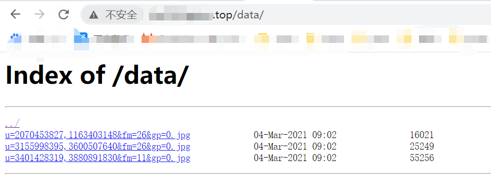

## Nginx


### 概念

#### 介绍

`Nginx 是一个高性能的 Http 和 反向代理服务器，特点是占用内存少，并发能力强，能支持高达50000的并发连接数`


#### 作用

- 反向代理
  - 正向代理
    - 正向代理即在客户端配置代理服务器，通过代理服务器访问其他服务器的资源，并返回结果
  - 反向代理
    - 反向代理则是只对外部暴露反向代理服务器，反向代理格局配置的规则请求资源，返回结果。反向代理请求的资源对用户来说是不可见的。客户端无需做任何配置
  - 正向代理和反向代理的区别
    - 实施主体不同：正向代理是客户端做出配置，而反向代理则是服务器做配置
    - 服务器是否课件：正向代理知道服务器的内部情况，而反向代理中客户端仅知道反向代理服务器的地址

- 负载均衡
  - 将请求分发到各个服务器上，实现更高的并发能力
- 动静分离
  - 即静态资源和动态资源分开部署。若访问静态资源，则指向静态资源的地址。若返回的是动态资源，如tomcat，则分发到 tomcat 上
- 高可用


### 环境搭建

https://blog.csdn.net/qq_34416331/article/details/102949004?ops_request_misc=%257B%2522request%255Fid%2522%253A%2522161484145716780274129104%2522%252C%2522scm%2522%253A%252220140713.130102334.pc%255Fblog.%2522%257D&request_id=161484145716780274129104&biz_id=0&utm_medium=distribute.pc_search_result.none-task-blog-2~blog~first_rank_v1~rank_blog_v1-3-102949004.pc_v1_rank_blog_v1&utm_term=nginx


### 指令集

```markdown
# 启动 nginx
./sbin/nginx

# 关闭 nginx
./sbin/nginx -s stop

# 查看版本号
./sbin/nginx -v

# 重载
./sbin/nginx -s reload
```


### 配置文件

#### 文件解析

##### 全局块

```
# 并发处理数量，越大则支持的并发量也越大
worker_processes 1
```


##### Event块

主要影响 Nginx 与用户网络连接

```
# 表示每个 worker_processes 支持的最大连接数
worker_connections 1024
```


##### Http 全局块

http 全局块分为 http 部分和 server 部分

###### http 部分

配置代理、缓存、日志定义以及第三方模块的配置。包含文件引入、超时、限流等

###### server 部分


#### location 解析

```
location [ = | ~ | ~* | ^~ ] uri {
	.....
}
```

- `=`：用于不含正则表达式的 uri 前，表示 uri 严格匹配，若匹配成功则停止匹配
- `~`：表示 uri 中包含正则表达式，且区分大小写
- `~*`：表示 uri 中包含正则表达式，且不区分大小写
- `^~`：用于不含正则表达式的 uri 前，要求 Nginx 服务器找到表示 uri 和请求字符串匹配度最高的 location 后，使用此 location 处理请求。

```markdown
# 任何以 /user 开头的请求
# 命中例子：http://xxxxx:port/user
location /user {
	proxy_pass http://192.168.0.185:8090
}

# 任何以 /edu/ 开头的请求，区分大小写
# 命中例子： http://xxxx:port/idx/
# 优先级高于正则
location ^~ /idx {
            alias  /opt/web;
            index  index.html index.htm;
        }

# 任何以 /edu/ 开头的请求，不区分大小写
# 命中例子： http://xxxx:port/Edu/
location  /edu/ {
	proxy_pass http://192.168.0.185:8090/edu
}


```


#### 静态文件访问

如文件为 /opt/web/index.html

##### 根目录方式访问

```
location /web {
	root   /opt;
	index  index.html index.htm;
}
```

##### 别名方式访问

```
location /web {
	alias /opt/web;
	index index.html index.htm;
}
```


#### 代理

```
location /user {
	proxy_pass http://192.168.0.185:8090;
}
location /group {
	proxy_pass http://192.168.0.185:8081;
}
location /auth {
	proxy_pass http://192.168.0.195:8090;
}
```


#### 负载均衡

##### 分配策略

- **轮询(默认)：**每个请求一个个轮流请求，如果对应的节点 down 了，会自动剔除
- **权重策略：**设置权重值，权重值越高则被分配的请求越多
- **ip_hash：**每个请求按照 ip 的 hash 结果分配，这每个访客固定访问一个后端服务器，可以用于解决负载均衡模式下的 session 问题
- **fair 最短响应时间：**优先分配给响应时间短的节点


##### 配置

使用 upstream 进行反向代理

###### 轮询分配

```
http {
    ....
    # 设置代理配置
    upstream myserver {
        server 127.0.0.1:80;
        server 127.0.0.1:81;
    }
    server {
        listen       80;
        server_name  localhost;

        #charset koi8-r;

        #access_log  logs/host.access.log  main;

        location /web {
            # 将集群节点添加到代理配置
        	proxy_pass http://myserver
            root   html;
            index  index.html index.htm;
        }
    }
}
```


###### 权重分配

在 upstream 的节点后面加上 weight=xxx

```
http {
    ....
    # 设置代理配置
    upstream myserver {
        server 127.0.0.1:80 weight=5;
        server 127.0.0.1:81 weight=10;
    }
    server {
        listen       80;
        server_name  localhost;

        #charset koi8-r;

        #access_log  logs/host.access.log  main;

        location /web {
            # 将集群节点添加到代理配置
        	proxy_pass http://myserver
            root   html;
            index  index.html index.htm;
        }
    }
}
```


###### ip_hash 分配

在 upstream 的第一行加上 `ip_hash;`

```
http {
    ....
    # 设置代理配置
    upstream myserver {
    	ip_hash;
        server 127.0.0.1:80;
        server 127.0.0.1:81;
    }
    server {
        listen       80;
        server_name  localhost;

        #charset koi8-r;

        #access_log  logs/host.access.log  main;

        location /web {
            # 将集群节点添加到代理配置
        	proxy_pass http://myserver
            root   html;
            index  index.html index.htm;
        }
    }
}
```


###### 最短响应时间分配 fair

在 upstream 的第一行加上 `fair;`

```
http {
    ....
    # 设置代理配置
    upstream myserver {
    	fair;
        server 127.0.0.1:80;
        server 127.0.0.1:81;
    }
    server {
        listen       80;
        server_name  localhost;

        #charset koi8-r;

        #access_log  logs/host.access.log  main;

        location /web {
            # 将集群节点添加到代理配置
        	proxy_pass http://myserver
            root   html;
            index  index.html index.htm;
        }
    }
}
```


#### 动静分离

##### 配置目录方式访问

在 /opt/web/data 文件夹下放几个文件

```
location /data/ {
	root /opt/web;
	autoindex on;
}
```



