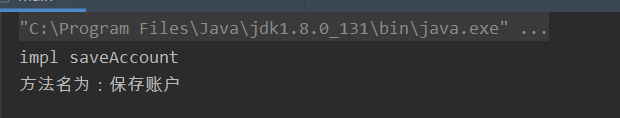
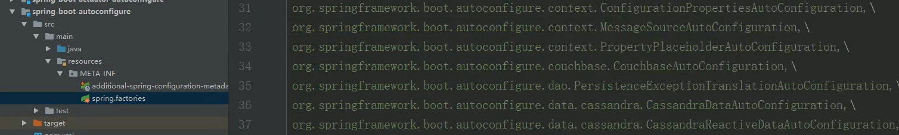
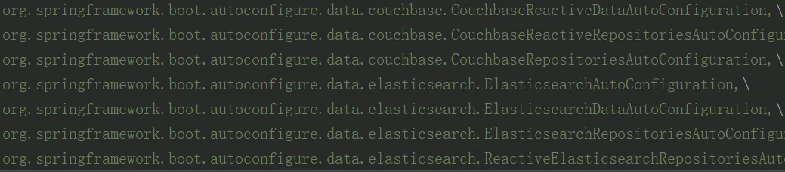

## Spring 复习

spring 核心模块

spring context

spring ioc

spring di

spring 代理 动态代理

spring aop

java servlet


### Spring 核心模块

- Spring Core：Spring 核心库，主要提供 IOC(控制反转) 和 DI(依赖注入) 功能

- Spring Context：为 Spring 提供上下文信息，便于通过 Context 访问到 Spring 的 Bean 资源

- Spring Aspects：为与 AspectJ 的集成提供支持，当代理类多时效率高于 Aop

- Spring Aop：提供面向切面的编程实现，但与 Spring Aspects 各自有特点，一般我们使用 AspectJ 进行切面处理，如日志记录、性能

  ​					    统计、安全控制、事务处理、异常处理等

- Spring Dao：提供对数据库的连接和异常处理、事务等

- Spring ORM：用于支持 Mybatis、Hibernate 等 ORM 工具

- Spring Web：为创建 web 应用程序提供支持

- Spring MVC：支持构建前后端一体化的应用程序

- Spring JMS： Java 消息服务，用于处理两个应用程序，或是分布式系统中的消息收发，但一般我们直接使用队列进行处理

- Spring Test：提供了对 JUnit 测试的支持


### 谈谈对 IOC 的理解

`IOC 控制反转其实是一种设计思想，将原本我们主动创建对象的动作，交给Spring框架实现，我们只要负责使用对应的类即可`

`在Spring 中 ioc 主要负责创建对象、管理对象(DI)、装配对象、配置对象以及管理这些对象的生命周期`


**原本的困难：**

- 要实现一个类，必须将其父类的实现都搞懂，并一层层实现出来，这会导致开发者浪费大量的时间和精力
- 如果一个类会在多个地方用到，则需要创建多个相同的类对象，造成冗余代码
- 使用单例处理可以避免创建多个相同的类对象，但为每个类的创建都写成单例模式会浪费开发者精力，且污染代码

**IOC 解决了什么：**

- IOC 其实就是一个自动化的单例工厂，能够自动将你选定的类变为单例模式管理，且自动实现它的父类，这样就避免了上述的三点困难

**IOC 原理：**

- IOC 容器其实就是一个 Map，在 Map 中存放各种类对象

**IOC 优点：**

- 减少代码冗余
- 使开发者无需关注当前类的相关类的实例化，只需要关注当前类的实例化和使用即可


### 谈谈对 DI 的理解

谈这个点首先要了解 DI 一共有几个考点，

考点有：

- 存在什么问题，DI 解决了什么
- DI 的概念
- DI 支持注入的数据类型
- DI 的三种注入方式


#### DI 的概念

`DI 即依赖注入，是 IOC 的一部分。概念就是不需要我们手动创建对象，只需要在配置文件中描述对象是如何创建的以及对象之间的调用关系，IOC 容器会负责通过你的描述将一个个对象组装起来`


#### 问题和解决

**原本的困难：**

- 由于项目中类的关系依赖复杂，常常在一个类初始化时也要初始化其他的类，让各个对象能够互相协作。这就提高了代码的编写难度
- 同时由于一些类实例是在其他类初始化时被创建的，这就要求我们在编写代码时注意对象生命周期的管理

**DI 解决了什么：**

- DI 通过读取配置文件，能够通过定义的类关系，实现各个类的自动装配，让开发者更专注于业务逻辑的处理
- 通过自动注入，可以实现在对象初始化时从配置文件中读取写好的配置参数，实现数据的自动赋值


#### DI 支持的数据类型

- 基本类型
- String
- bean 类型
- 复杂类型/集合类型


#### DI 的注入方式

**三种注入方式：**

- 构造器注入
- setter 方法注入
- 注解注入


**详解：**

##### 构造器注入：

主要通过 ==constructor-arg== 参数来定义变量

```xml
<bean id="accountService" class="xyz.tom.www.service.impl.AccountServiceImpl">
    <constructor-arg name="name" value="小明"></constructor-arg>
    <constructor-arg name="age" value="18"></constructor-arg>
	<constructor-arg name="birthday" ref="now"></constructor-arg>
</bean>
```


##### setter 方式注入：

通过 ==property== 参数来定义参数，允许注入复杂类型，如 array、list、set、props(map)

```xml
<!--  set方法注入
            设计的标签： property
            出现的为止： bean标签的内部
            标签中的属性：
              name（c常用）: 用于指定注入时所调用的set方法名称
              value: 用于提供基本类型和string类型的数据
              ref: 用于指定其他的bean类型数据，即在spring的ioc容器中出现过的bean对象
            优势：
              创建对象时没有明确的限制，可以使用默认构造函数
            弊端：
              如果有某个成员必须有值，则获取对象时有可能set方法没有执行
      -->
    <bean id="accountService2" class="xyz.tom.www.service.impl.AccountServiceImpl2">
        <property name="name" value="test"></property>
        <property name="birthday" ref="now"></property>
    </bean>
 
    <!--  复杂类型的注入/集合类型的注入
          用于给List结构集合注入的标签： list array set
          用于给Map结构注入的标签： map props
          同类型可以互换，即只要记： list map
    -->
    <bean id="accountService3" class="xyz.tom.www.service.impl.AccountServiceImpl3">
        <property name="myStrs">
            <array>
                <value>AAA</value>
                <value>BBB</value>
                <value>CCC</value>
            </array>
        </property>
 
        <property name="myList">
            <list>
                <value>AAA</value>
                <value>BBB</value>
                <value>CCC</value>
            </list>
        </property>
 
        <property name="mySet">
            <set>
                <value>AAA</value>
                <value>BBB</value>
                <value>CCC</value>
            </set>
        </property>
 
        <property name="myMap">
            <map>
                <entry key="testA" value="aaa"></entry>
                <entry key="testB">
                    <value>BBB</value>
                </entry>
            </map>
        </property>
 
        <property name="myProps">
            <props>
                <prop key="testA">AAA</prop>
                <prop key="testB">BBB</prop>
                <prop key="testC">CCC</prop>
            </props>
        </property>
    </bean>注解方式注入
```


##### 使用配置文件注解方式注入

注解方式注入需要在配置文件中通过 ==component-scan== 开启：

```xml

<?xml version="1.0" encoding="UTF-8"?>
<beans xmlns="http://www.springframework.org/schema/beans"
       xmlns:xsi="http://www.w3.org/2001/XMLSchema-instance"
       xmlns:context="http://www.springframework.org/schema/context"
       xsi:schemaLocation="http://www.springframework.org/schema/beans
        https://www.springframework.org/schema/beans/spring-beans.xsd
        http://www.springframework.org/schema/context
        https://www.springframework.org/schema/context/spring-context.xsd">
 
    <context:component-scan base-package="xyz.tom"></context:component-scan>
</beans>
```


##### 完全使用注解方式注入

创建配置文件，使用 ==@ComponentScan== 指定扫描范围，==@Configuration== 声明这个类是配置类

```java
@Configuration
@ComponentScan({"com.tom"})
public class SpringConfiguration {
}
```

修改启动类，通过 ==AnnotationConfigApplicationContext== 来获取到上下文对象

```java
public static void main(String[] args) { 
    ApplicationContext ac = new AnnotationConfigApplicationContext(SpringConfiguration.class);
    IAccountService accountService = ac.getBean("accountService", IAccountService.class);
    accountService.saveAccount();
}
```


##### 常用的注解

- **@Component：**创建 Bean 对象
- **@Autowired：**注入变量
- **@Qualifiler：**通过名称方式声明注入的bean对象
- **@Value：**注入基本类型和String类型数据
- **@Scope：**改变 Bean 对象的作用范围，如单例、多例
- **@PostConstruct：**指定初始方法
- **@PreDestory：**指定销毁方法


### 谈谈对 Spring 自动装配的理解

#### 理解

`自动装配其实就是将 bean 或是简单类型注入到其他 bean 的属性中的过程，通过让 Spring 检查IOC中注册的 bean 来发现和处理类之间的依赖关系，自动将有关系的 bean 组合在一起，从而无需开发者再在配置文件中显示地手动指定`


**存在的问题：**

- 当一个 bean 中需要使用到其他 bean 时，需要开发者在配置文件中显示地指定
- 自动装配避免了开发者编写错误，如拼写错误或是大小写错误

**自动装配解决了什么：**

- 自动装配会通过检查 bean 直接的依赖关系，从而去 IOC 容器中检查是否有符合的已经实例成功的 bean，从而避免开发者多次手动配置
- 自动装配减少了代码的开发难度和冗余代码


#### 自动装配的查找条件

| 类型         | 描述                                                         |
| ------------ | ------------------------------------------------------------ |
| no           | 不使用自动装配，通过显示设置 ref 属性来进行装配              |
| byName(默认) | 通过参数名自动装配，若出现相同名称的bean，则需要使用 @Qualifier 注解来显示指定 bean 的名称 |
| byType       | 通过参数类型自动装配                                         |
| constructor  | 这个方式类似于byType， 但是要提供给构造器参数，如果没有确定的带参数的构造器参数类型，将会抛出异常 |
| autodetect   | 首先尝试使用constructor来自动装配，如果无法工作，则使用byType方式 |


#### 自动装配的方式

自动配置有两种方式：

- xml 文件方式
- 注解方式

>  xml 文件方式

```xml
#### 手动装配 ####
<bean id="cat" class="com.hdu.autowire.Cat"></bean>
<bean id="dog" class="com.hdu.autowire.Dog"></bean>
<bean id="user" 
          class="com.hdu.autowire.User">
    <property name="cat" ref="cat"></property>
    <property name="dog" ref="dog"></property>
    <property name="str" value="haha"></property>
</bean>

#### 自动装配 ####
<bean id="cat" class="com.hdu.autowire.Cat"></bean>
<bean id="dog" class="com.hdu.autowire.Dog"></bean>
<bean id="user" 
      class="com.hdu.autowire.User"
      autowire="byName">
</bean>
```


> 注解方式

注解方式需要在配置文件中指定 ==annotation-config==：

```xml
<context:annotation-config/>
```

指定后只需要在对应的属性上增加 ==@Autowired== 注解即可

```java
public class Boss {
    @Autowired
    private Car car;

    @Autowired
    private Office office;
}
```


### 谈谈对 AOP 的理解

相关点：

- 概念
- 相关术语
- 五大通知类型：前置、后置、异常、最终、环绕
- 使用


#### 理解

`AOP 即面向切面编程，通过动态代理的方式将于业务无关却被大量业务模块所使用的代码封装起来，以此减少代码冗余和代码污染，同时提高代码的扩展性`

**原本的困难：**

- 当要增加一些与原本业务无关的需求，如日志功能、监控功能、事务处理等，这部分都是与大部分业务没有关系，却又要管理到这些业务的需求，如果要修改需要修改对应的业务代码，造成代码冗余和污染

**AOP 解决了什么：**

- AOP 能够将这些与原本业务无关的需求封装在代理类中，同时指定这个代理类对那些类进行代理增强，从而解决代码冗余以及代码污染的问题

**AOP 原理：**

- AOP 是通过 Spring 的动态代理机制来实现的，如果要代理的对象实现了某个接口，就使用 JDK 动态代理去创建代理对象，而没有实现接口的对象，则使用 CGlib 动态代理生成一个被代理对象的子类进行处理


#### 术语

|                  | **名称**  | **描述**                                                     |
| ---------------- | --------- | ------------------------------------------------------------ |
| **Joinpoint**    | 连接点    | 其实就是指我们的一个个方法，Spring AOP 仅支持方法类型的连接点 |
| **PointCut**     | 切入点    | 指我们要对哪些 Joinpoint 进行拦截                            |
| **Advice**       | 通知/增强 | 拦截到 Joinpoint 后要做的事情就是通知<br />通知的类型有： 前置通知、后置通知、异常通知、最终通知、环绕通知 |
| **Introduction** | 引介      | 引介是一种特殊的通知，在不修改类代码的前提下，Introduction 可以在运行期为类动态地添加一些方法或Field |
| **Target**       | 目标对象  | 即被代理的对象                                               |
| **Weaving**      | 织入      | 将增强应用到目标对象来创建新的代理对象的过程。Spring AOP 在运行时织入，而 AspectJ 采用编译期织入和类装载期织入 |
| **Proxy**        | 代理      | 一个类被 AOP 织入增强后，产生的结果代理类                    |
| **Aspect**       | 切面      | 即切入点和通知的结合                                         |


#### 五大通知类型

- **前置通知(before)：**在方法被调用前处理
- **后置通知(after-returning)：**在方法调用后处理
- **异常通知(after-throwing)：**在方法抛出异常时处理
- **最终通知(after)：**在方法调用后，或是抛出异常时处理，即一定会被调用到
- **环绕通知(around)：**在方法调用前后都可以处理，通过 ==joinPoint.proceed();== 来控制，这行之前的就是执行之前，之后就是执行之后


#### 使用

AOP 提供 xml 方式配置和注解方式配置

##### xml 方式配置

- 先引入 aspectj 的依赖

- ```xml
  <aop:config>
  	<aop:aspect id="logAdvice" ref="logger">
  		<aop:before method="printLog" pointcut="execution(public void  com.tom.service.impl.IAccountServiceImpl.saveAccount())"></aop:before>
  	</aop:aspect>
  </aop:config>
  ```


##### 注解方式配置

- 先引入 aspectj 的依赖

- 修改启动类

  ```java
  public class main {
      public static void main(String[] args) {
          ApplicationContext ac = new AnnotationConfigApplicationContext(SpringConfiguration.class);
      }
  }
  ```

- 修改配置类，使用 ==@EnableAspectJAutoProxy== 开启 AOP 自动代理

  ```java
  @Configuration
  @ComponentScan({"com.tom"})
  @EnableAspectJAutoProxy
  public class SpringConfiguration {
  }
  ```

- 实现切面，切面类需要加上 ==@Aspect== 和 ==@Component==

  ```java
  @Aspect
  @Component
  public class SysLogAspect {
   
      @Pointcut("execution(* com.tom.service.impl.*.*(..))")
      private void pt1(){}
   
      @Pointcut("execution(public void com.tom.service.impl.IAccountServiceImpl.saveAccount())")
      private void pt2(){}
   
      @Before("pt2()")
      public void printLog() {
          System.out.println("前置通知");
      }
   
      @Around("pt1()")
      public Object log(ProceedingJoinPoint joinPoint) throws Throwable {
          System.out.println("around 前");
          Object object = joinPoint.proceed();
          System.out.println("around 后");
          return object;
      }
  }
  ```


##### 自定义注解结合自定义切面

`Spring 支持使用 @annotation 注解实现自定义切面配置，即只有添加了指定注解的方法才会被切面增强`

- 先定义自定义注解

  ```java
  @Target(ElementType.METHOD)
  @Retention(RetentionPolicy.RUNTIME)
  @Documented
  public @interface SysLog {
   
      String value() default "";
  }
  ```

- 自定义切面类，定义 PointCut 时记得不是用通配符规则，而是用 ==@annotation== 来指定到自定义注解类上

  ```java
  @Aspect
  @Component
  public class SysLogAspect {
      @Pointcut("@annotation(com.tom.annotation.SysLog)")
      public void logPt(){}
   
      @Around("logPt()")
      public Object log(ProceedingJoinPoint joinPoint) throws Throwable {
          Object object = joinPoint.proceed();
   
          MethodSignature signature = (MethodSignature) joinPoint.getSignature();
          Method method = signature.getMethod();
   
          // 若是在serviceimpl中定义
          Method realMethod = joinPoint.getTarget().getClass().getDeclaredMethod(signature.getName(), method.getParameterTypes());
          SysLog syslog = realMethod.getAnnotation(SysLog.class);
          System.out.println("方法名为：" + syslog.value());
   
          return object;
      }
  }
  ```

- 使用

  ```java
  @Service("accountService")
  public class IAccountServiceImpl implements IAccountService {
   
      @SysLog("保存账户")
      public void saveAccount() {
          System.out.println("impl saveAccount");
      }
  }
  ```

- 结果

  


### Spring Aop 和 AspectJ 的区别

- Spring AOP 是运行时增强，基于代理，而 AspectJ 是编译时增强，基于字节码操作
- 在少量切面时二者效率基本相同，但当有大量切面时 AspectJ 的效率远高于 aop，一般我们也使用 aspectj 实现切面


### 谈一谈对 Spring 代理的理解

#### 理解

Spring 的代理分为 ==静态代理== 和 ==动态代理==，其中动态代理又分为使用 ==jdk 代理==和使用 ==cglib 代理==

- 静态代理
  - 静态代理其实就是生成一个代理类，代理类拥有与被代理类相同的接口关系和方法，将被代理的类作为代理类的一个属性，从而通过在方法里面增加自己的逻辑代码，外部调用时直接通过代理类调用，实现增强
- 动态代理
  - 与静态代理需要开发者手动实现代理类不同，动态代理会自动帮我们生成代理对象，主要方式有 JDK 代理 和 cglib 代理


#### 两种动态代理的区别

|              | jdk代理                                | cglib代理                                  |
| ------------ | -------------------------------------- | ------------------------------------------ |
| **区别**     | 基于接口的动态代理                     | 基于子类的动态代理                         |
| **局限**     | 被代理类最少实现一个接口，否则不能使用 | 被代理类不能是最终类(final 不能被继承的类) |
| **提供者**   | jdk 官方                               | 第三方cglib库                              |
| **创建方式** | Proxy.newProxyInstance                 | Enhancer.create                            |


### 谈一谈对 JDBC 和 DAO 模块的理解

`JDBC 和 DAO 主要提供了 java 应用对数据库的访问和操作，在数据库的错误信息上，提供了一个统一的异常访问层来获取数据，同时也通过 aop 的方式支持了事务管理`


### 谈一谈对 ORM 模块的理解

ORM 模块即在 JDBC 之上支持我们将数据库的数据转换为一个个对象的方式读取和存储。常见的 ORM 框架如 Hibernate、iBatis、JAP 等。

Mybatis 是半 ORM 框架，因为其实还是需要程序员去手写 sql 的


### Spring  Bean

#### 讲一讲 Spring 中的 Bean

这个问题应该从几个点回答：

- Bean 的创建方式
- Bean 的作用域
- Bean 的生命周期
- Bean 的线程安全


#### Spring 中 Bean 的创建方式和区别

**方式：**

- BeanFactory：懒加载
- ApplicationContext：立即加载

**区别：**

|          | BeanFactory                           | ApplicationContext                                           |
| -------- | ------------------------------------- | ------------------------------------------------------------ |
| 加载方式 | 懒加载，即只有使用到时加载            | 立即加载，即读取完配置文件后会立刻加载                       |
| 关系     |                                       | ApplicationContext 是 BeanFactory 派生出来的，拥有 BeanFactory 的所有功能 |
| 功能     | 实现了 DI、IOC 等基础的 bean 对象操作 | 具有 BeanFactory 的所有功能，同时有扩展了其他功能，如资源访问、事件传播、加载多个上下文等 |

**使用：**

一般推荐使用 ApplicationContext

- 由于 BeanFactory 是懒加载注入的方式，如果 Bean 注入异常，我们只能在第一次调用到这个 Bean 时才会抛出异常。而 ApplicationContext 是读取完配置文件立即加载，在初始化时检查就会判断 Bean 是否已经成功注入
- ApplicationContext 是 BeanFactory 的派生类，有 BeanFactory 的全部功能，同时又扩展了新功能


#### Spring 中 Bean 的作用域

通过设置 ==scope== 关键字

| 属性            | 描述                                                         |
| --------------- | ------------------------------------------------------------ |
| singleton(默认) | 单例模式使用                                                 |
| prototype       | 多例模式，每次使用都创建，在使用期间一直存活，长时间不用就销毁 |
| request         | 为每个网络实例创建一个实例，当网络请求完成后，bean 会失效并被 gc 回收 |
| session         | 为每个 session 创建一个实例，session 过期后失效并被 gc 回收  |
| global-session  | 全局作用域                                                   |


#### Spring 中 Bean 的生命周期

|      | 出生                         | 存活                         | 死亡                                 |
| ---- | ---------------------------- | ---------------------------- | ------------------------------------ |
| 单例 | 当容器创建时对象也立即被创建 | 只要容器还在，对象就一直存活 | 容器销毁，对象销毁                   |
| 多例 | 当使用对象时创建             | 对象只要仍在使用，就一直存活 | 当对象长时间不被使用时，就会被gc回收 |


#### Spring 中 Bean 的线程安全

由于 Bean 采用的是单例模式，因此在大并发的情况下可能会存在线程安全问题

**解决方案有：**

- 在 bean 对象中尽量避免定义可变的成员变量
- 必须定义可变成员变量时，用 ThreadLocal 来存储。(创建一个 ThreadLocal 对象，将需要的变量存储进去)


#### ApplicationContext 的通常实现类和使用

**实现类：**

- **ClassPathXmlApplicationContext**： 加载类路径下的配置文件，即 resources 下的配置文件
- **FileSystemXmlApplicationContext**：加载磁盘山任意路径下的配置文件(需要有访问权限)
- **AnnotationConfigApplicationContext**：根据注解创建容器


**demo:**

```java
public static void main(String[] args) {
        // 1. 获取核心容器对象
//        ApplicationContext ac = new ClassPathXmlApplicationContext("bean.xml");
        ApplicationContext ac  = new FileSystemXmlApplicationContext("E:\\study\\project\\spring\\spring-demo03\\src\\main\\resources\\bean.xml");
 
        // 2. 根据ID获取Bean对象
        IAccountService accountService = ac.getBean("accountService", IAccountService.class);
        accountService.saveAccount();
 
        AccountDao accountDao = ac.getBean("accountDao", AccountDao.class);
        accountDao.saveAccount();
    }
```


#### BeanFactory 的通常实现类和使用

**实现类：**

- XmlBeanFactory 


**使用：**

```java
public static void main(String[] args) {
    Resource resource = new ClassPathResource("bean.xml");
    BeanFactory factory = new XmlBeanFactory(resource);
    IAccountService accountService = factory.getBean("accountService", IAccountService.class);
    accountService.saveAccount();
}
```


### Spring 事务

#### 概念

Spring 支持的事务类型

- 编程式事务，即通过代码来管理事务
- 声明式事务：通过配置文件来管理事务
  - xml 配置 
  - 注解配置 ==@Transactional==
- 一般使用声明式事务，对代码侵入更小


#### Spring 中事务的优点

- 对不同事务API，如 JDBC、Hibernate、JPA 提供了一个通用的编程模式
- 使用简单
- 支持声明式事务管理，减少代码入侵


## Spring 高级

### Spring 中 Bean 的生命周期

#### 基本知识

- 在 Spring 启动时，会根据 @ComponentScan 来扫描类，当扫描到类时，会生成对应的 beanDefinition，并放入 BeanFactory 中的 beanDefinitionMap (map<beanName, beanDefinition>) 中。`当所有类都扫描完成后，BeanFactory 组建完成`
- `注意，这时候只是存在 BeanDefinition 的对象，而没有实例化 bean`
- 只有 BeanFactory 组建完成后，BeanFactoryPostProcessor 才可以执行


#### bean 的生命周期

bean 的生命周期在广义上看应该分为两部分，==准备阶段和实例化阶段==

- **准备阶段**
  - Spring 启动时，先根据 @ComponentScan 来扫描所需要的类
  - 从 class 文件中加载到对应的类信息
  - 组建 BeanFactory
    - 根据类信息生成 BeanDefinition，BeanDefinition 中包括了 beanClass(bean 的类型)、scope(作用域)
  - 当所有扫描到的类都生成了 BeanDefinition，并存入 BeanFactory 的 BeanDefinitionMap(Map<BeanName, BeanDefinition>) 中时， BeanFactory 组建完成
  - `注意：在准备阶段是不会实例化任何 bean 对象的`
- **实例化阶段**
  - 先调用 BeanFactoryPostProcessor(beanfactory 的后置处理器) 对 BeanDefinition 进行处理
    - 这个阶段可以自定义返回的 bean 类型等。如使用动态代理创建代理对象等。
  - 创建原始对象(即没有填充属性的值)
    - AService aservice = new AService();
  - 填充属性
    - Spring根据bean的定义填充的属性值。
  - aware
    - 如果bean实现了BeanNameAware 接口，Spring 传递bean 的ID 到 setBeanName方法。
    - 如果Bean 实现了 BeanFactoryAware 接口， Spring传递beanfactory 给setBeanFactory 方法。
  - 初始化
    - 如果bean实现IntializingBean了，调用它的afterPropertySet方法，如果bean声明了初始化方法，调用此初始化方法。
  - 调用 BeanPostProcessors 对前面实例化的 bean 对象进行处理，如 aop 等
    - postProcessAfterInitialization
    - AOP
    - ...
  - 放入 BeanFactory 的单例池 SingletonObjects (Map<BeanName， 对象>) 中


### Spring 循环依赖

#### 什么是循环依赖

`循环依赖就是指多个 bean 互相引用对方，最终形成闭环。如 A依赖于B，B也依赖于A。出现的位置是在 bean 生命周期的填充属性时发生`

**原本的问题：**

如 A、B 两个对象互相依赖，则当其中一个 bean A 构造时，无法从 ioc 的单例池中找到所依赖的另一个 bean B对象，此时 ioc 就会去创建这个 B 对象。但由于 B 对象依赖于 A 对象，而 A 对象又没有构造完成会尝试去创建 A 对象，因此不断循环。


**如何解决：**

通过一个中间 map 的方式


#### 靠一级缓存无法完全解决循环依赖

由于在 BeanPostProcessors  中可能修改放入 bean 中的对象，即重新 new 一个对象返回，此时缓存中的原始对象与实际存入单例池的对象不同，则会出现问题

如 AOP 生成的代理对象会被存储到单例池中，而非原来的那个被代理对象。因此 Spring 使用了三级缓存来解决这个问题


#### 三级缓存

`Spring 三级缓存是专门用于处理 循环依赖 + AOP 的，即类A和类B之间相互依赖，同时又有AOP进行代理`


**三级缓存分别是什么，存什么**

- **一级缓存 singletonObjects**
  - 存最终实例化的 bean 对象
- **二级缓存  earlySingletonObject**
  - 存提前生成的 AOP 代理对象
- **三级缓存 singletonFactory**
  - 存 beanName  以及一个 lambda 表达式，这个 lambda 表达式被调用后会生成对应的代理对象

**流程为：**

假设有循环依赖的对象 A、B

- 在创建 A 的原始对象时，无论是否存在循环引用，都会将这个对象存入三级缓存中，格式为 beanName:lambda表达式
- 在填充属性时，若发现需要填充 B 对象，则去实例化 B 对象
- 在创建 B 的原始对象的同时，将 B 对象存入三级缓存中，格式为 beanName:lambda表达式
- 在填充属性时，发现要填充 A 对象，且有循环引用，则从三级缓存中找到 A 对象的 kv，并调用 value 来创建 A 的代理对象，存入二级缓存中，同时填充到自己的属性中去，删除三级缓存的 KV 对
- B 对象继续实例化
- 当 B 对象实例化完成后， A 对象会将实例化后的 B 填充到自己的属性中，继续向下实例化
- 当走到 BeanPostProcessor 时，会尝试从二级缓存中获取自己的代理对象，若没有获取到，则走正常 AOP 流程，若获取到了，则使用获取到的代理对象(循环依赖中，由于 B 生成时已经通过三级缓存创建了 A 的代理对象，因此二级缓存中一定有 A 的代理对象)
- 将最终的对象(代理对象) 存入一级缓存中 (singletonObjects)


## Spring MVC 复习

### 说说 MVC 模式

`MVC 模型其实是将 web 应用以交互、逻辑、视图三个模块进行分割，让项目代码更加有序化的设计模式。分为 Controller层用于与用户交互数据、Model 层进行业务逻辑处理、View 层进行页面显示`


### 说说 SpringMVC

SpringMVC 是 Spring 的核心模块之一，可以让我们搭建 web 程序应用。它在传统 MVC 模式的基础上，将 Model 层又分为了 service 层和 dao 层，service 层用于处理业务逻辑，dao 层用于处理与数据库交互。


### SpringMVC 的组件和作用

| 组件         | 组件名            | 作用                                                         |
| ------------ | ----------------- | ------------------------------------------------------------ |
| 前端适配器   | DispatcherServlet | 接收用户的请求，并转发给处理器映射器和处理器适配器           |
| 处理器映射器 | HandlerMapping    | 根据用户请求的URI查找处理器，并返回处理器执行链(包括过滤器、拦截器、实际handler等) |
| 处理器适配器 | HandlerAdapter    | 得到处理器执行链，执行处理器。由于有多种处理器适配器，会自动使用合适的适配器调用处理器 |
| 处理器       | Handler           | 具体的业务控制器，对用户请求进行业务处理                     |
| 视图解析器   | ViewResolver      | 将 handler 的处理结果生成 View 视图                          |
| 视图         | View              | 展现给用户的界面                                             |


### SpringMVC 的运行流程

- 前端适配器接收到用户请求，发送给处理器映射器
- 处理器映射器根据用户请求的URI查找处理器，并返回处理器执行链(包括过滤器、拦截器、实际handler等)
- 前端适配器接收到处理器执行链后，发送给处理器适配器
- 处理器适配器从处理器执行链中获取到处理器，并使用合适的适配器调用处理器
- 处理器返回 ModelAndView 对象，并经由前端适配器发送给视图解析器
- 视图解析器处理 ModelAndView 来渲染 View 视图，并返回给用户


### 父子容器

#### 什么是父子容器、特点

`在 Spring 框架中，容器是用来管理 Bean 的整个生命周期的，而 Spring 中国可以包含多个容器，容器之间有上下级关系。而 Spring 为父容器，SpringMVC 为子容器`

**特点：**

- 父子容器之间说相互隔离的，各自内部可以存在名称相同的 bean
- 父容器不可以访问子容器，子容器可以访问父容器      ==>     子容器对父容器的不可见性
- 父容器不可以注入子容器的 bean，子容器可以注入父容器的 bean


#### SpringMVC 中能否使用一个容器？

可以，但是不建议。而且如果只是用一个容器必须是 SpringMVC，因为要管理 Controller


#### 为什么 SpringMVC 要使用父子容器？

先说 SpringMVC 中父子容器分别干了什么

`SpringMVC 中，将 controller 层交给了 SpringMVC 的容器管理，其他的 service 和 dao 层则交给了 Spring 容器加载`

**作用：**

- 避免了模块混乱，由于子容器对父容器的不可见性，避免在 service 层或是 dao 层注入 controller 的 bean
- 将视图层相关代码和业务层代码分开，有利于代码的维护
- 这样拓展性更强，Spring 可以兼容更多模块，如 mybatis、redis 等


#### 如何配置父子容器

在 web.xml 中分别配置 Spring 和 SpringMVC 容器，在各自的配置文件中的 component-scan 标签内配置 exclude-filter 和 include-filter 来指定加载的范围


#### Filter 和 Interceptor 的区别

- 原理不同
  - Filter 是基于函数回调
  - Interceptor 是基于反射机制
- 作用域不同
  - Filter 依赖于 Servler，只能在 web 环境下使用
  - 拦截器依赖于 Spring 容器，在 Spring 环境下就可以使用
- 细粒度不同
  - Filter 只能在请求进来和请求处理完成时进行处理，适用于权限验证等粗粒度的任务
  - Interceptor 可以在请求处理之前、请求处理执行完毕、视图返回给用户后进行处理，适合细粒度的任务
- 中断难度不同
  - Filter 较难中断，需要处理请求和响应对象进行中断，如将用户重定向到错误提示界面
  - Interceptor 只需要在 preHandle 方法内返回 false 就可以进行中断


#### Filter 实现

```java
public class DemoFilter implements Filter {
    @Override
    public void init(FilterConfig filterConfig) throws ServletException {
        System.out.println("DemoFitler 初始化！");
    }
 
    @Override
    public void doFilter(ServletRequest servletRequest, ServletResponse servletResponse, FilterChain filterChain) throws IOException, ServletException {
        System.out.println("DemoFitler 过滤！");
        filterChain.doFilter(servletRequest, servletResponse);
    }
 
    @Override
    public void destroy() {
        System.out.println("DemoFitler 销毁！");
    }
}
```


#### Interceptor 实现

```java
public class DemoInterceptor implements HandlerInterceptor {
 
    @Override
    public boolean preHandle(HttpServletRequest request, HttpServletResponse response, Object handler) throws Exception {
        System.out.println("DemoInterceptor! 请求前拦截！");
        return true;
    }
 
    @Override
    public void postHandle(HttpServletRequest request, HttpServletResponse response, Object handler, ModelAndView modelAndView) throws Exception {
        System.out.println("DemoInterceptor! 业务请求执行完毕！");
    }
 
    @Override
    public void afterCompletion(HttpServletRequest request, HttpServletResponse response, Object handler, Exception ex) throws Exception {
        System.out.println("DemoInterceptor! 处理完请求后被调用！");
    }
}
```


## SpringBoot 复习

### JavaConfig

即通过 java 代码来代替 xml 配置文件


### SpringBoot 如何让 tomcat 启动时调用

#### SPI规范

在 Servlet3.0 的 API 中定义了一个新规范 `SPI`，如果有一个类或方法要在容器启动时被调用，就需要在 META-INF/services 目录下新增一个文件，并写入要启动的类的全限定类名


#### 如何让 tomcat 启动时调用 mvc

实现 Spring Framework 提供的 WebApplicationInitializer 接口，并实现 onStartup() 方法，onStartup 方法会由当前使用的 web 容器调用(如 tomcat、jetty 等)。onStartup 的参数会传入一个 ServletContext 类，等同于在 web.xml 中的配置


### SpringBoot 自动配置

所谓自动配置其实就是 springboot 帮我们准备了一大堆 javaconfig 类，我们只需要选择性的使用其中一部分就可以了

>  spring-boot-autoconfigure

resources/META-INF/spring.factories 类中已经定义好了要使用的 JavaConfig




> @AutoConfigurationPackage

@AutoConfigurationPackage ： 自动扫描加了这个注解的类下面的所有目录，这个注解包含在 @SpringBootApplication 注解里面


> 自动配置源码解析

- 先看 @SpringBootApplication 注解，里面包含了 @ComponentScan 和 ==@EnableAutoConfiguration==

  - @ComponentScan  会扫描当前启动类目录的所有类，并将添加了 @Component 等配置的类作为bean注入ioc

  - @EnableAutoConfiguration 会开启自动配置，这是 SpringBoot 自动配置的核心

  - ```java
    @Target(ElementType.TYPE)
    @Retention(RetentionPolicy.RUNTIME)
    @Documented
    @Inherited
    @SpringBootConfiguration
    @EnableAutoConfiguration
    @ComponentScan(excludeFilters = {
            @Filter(type = FilterType.CUSTOM, classes = TypeExcludeFilter.class),
            @Filter(type = FilterType.CUSTOM, classes = AutoConfigurationExcludeFilter.class) })
    public @interface SpringBootApplication {
    ...
    }
    ```

- 点开 @EnableAutoConfiguration，可以看到 ==@Import(EnableAutoConfigurationImportSelector.class)==，即借助 EnableAutoConfigurationImportSelector 这个类来实现自动配置

  - ```java
    @Target({ElementType.TYPE})
    @Retention(RetentionPolicy.RUNTIME)
    @Documented
    @Inherited
    @AutoConfigurationPackage
    @Import({AutoConfigurationImportSelector.class})
    public @interface EnableAutoConfiguration {
    	...
    }
    ```

- 在 EnableAutoConfigurationImportSelector  中通过 ==selectImports()== 方法会扫描 META-INF/Spring.factories 的配置文件内容，并以字符串数组形式返回

  - 
  - getAutoConfigurationEntry() 会获取并过滤所有自动配置的
    - 内部使用 getCandidateConfigurations 对扫描到的配置文件返回值进行过滤
    - 使用 loadFactoryNames 扫描配置文件中所有的自动配置类

- 最终返回到 selecImports() 中，而后 Spring 会将这些自动配置类都注入到 IOC 容器中


### SpringBoot 如何整合 SpringMVC 的


SpringBoot 默认整合了 SpringMVC，这是 SpringBoot 的自动帮我们加载的，在 META-INF/Spring.factories 中可以找到


在 ==WebMvcAutoConfiguration== 这个类中，会通过 JavaConfig 方式将 SpringMVC 整合到 SpringBoot 中

如果要修改 SpringMVC 配置，只要实现 WebMvcConfigurer 接口即可，如添加拦截器就需要继承 WebMvcConfigurer 接口

```java
@Configuration
public class WebMvcConfig implements WebMvcConfigurer {

    /**
     * @return
     */
    @Bean
    public AuthorizationInterceptor authorizationInterceptor() {
        return new AuthorizationInterceptor();
    }

    /**
     * @param registry
     */
    @Override
    public void addInterceptors(InterceptorRegistry registry) {
        registry.addInterceptor(authorizationInterceptor())
                .addPathPatterns("/**")
                .excludePathPatterns("/swagger-resources/**")
                .excludePathPatterns("/v2/api-docs/**");
    }
}
```


### SpringBoot 是如何整合 start 的

实际是通过动态插拔实现的，即通过 @ConditionalOnBean(xxxx.class)来判断是否有加载对应的bean，来判断是否要加载 JavaConfig

流程为：

- 先自定义一个注解，如@EnableCustomCenter

  ```java
  /**
   * 定义一个注解 EnableCustomCenter
   */
  @Target({ElementType.TYPE})
  @Retention(RetentionPolicy.RUNTIME)
  @Import({CustomCenterMarker.class})
  public @interface EnableCustomCenter {
  }
  ```

- 新建 CustomCenterMarker 类作为一个标记，便于之后使用 @ConditionalOnBean 来判断是否要插入

  ```java
  public class CustomCenterMarker {
  }
  ```

- 使用 @ConditionalOnBean 来判断是否有使用我们的标记类，有的话就是使用了我们的 CustomCenter 框架，可以通过 JavaConfig 来注入我们的框架相关配置

  ```java
  // 判断是否有注入 CustomCenterMarker 类，以此实现动态拔插
  @ConditionalOnBean(CustomCenterMarker.class)
  // 从 springboot 配置文件中读取数据并配置到 JavaConfig 中
  @EnableConfigurationProperties(CustomCenterConfig.class)
  ...
  public class AppConfig {
  }
  ```


### SpringBoot 的 run 方法都干了什么

- 推断应用的类型是普通的项目还是 web 项目，加载 Spring.factories 配置文件中的类
- 查找并加载所有可用的初始化器(JavaConfig)，设置到initializers属性中
- 找出所有的应用程序监听器，设置到listeners属性中
- 推断并设置main方法的定义类，找到运行的主类


### SpringBoot 的读取配置方式

- @Value

- @ConfigurationProperties(prefix="")

  - 可以通过指定 prefix 来实现字段自动匹配

- @PropertySource(value="xxx") 

  - 可以指定读取哪个配置文件，可以与 @Value 或 @ConfigurationProperties 配合使用

- @Environment：可以获取所有加载出来的配置参数

  ```java
  @Autowired
  private Environment env;
  
  // 获取参数
  String getProperty(String key);
  ```

  

https://blog.csdn.net/weixin_45136046/article/details/90768687

## Spring、SpringMVC、SpringBoot 的区别


