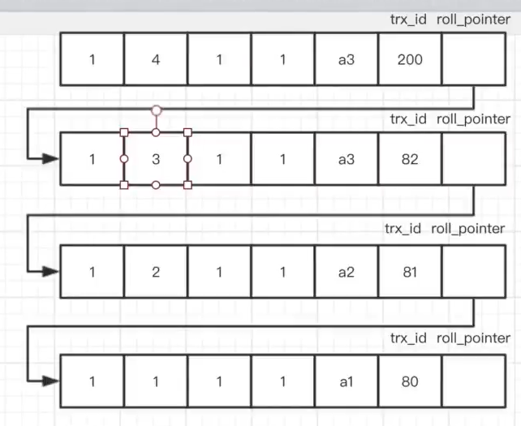

# 数据库复习

## 数据库基础

### 三范式

- 列不可拆分
- 唯一标识
- 引用主键


### 约束

- 唯一约束(unique)
- 非空约束(not null)
- 主键约束(primary key)
- 外键约束(foreign key)


## mysql

### 引擎类型

`myisam 是 mysql5.5 之前的默认引擎，不支持事务和行锁，而 innodb 是 mysql5.1 及之后的默认引擎，基于聚蔟索引来建立的，支持事务、行锁，并通过 mvcc 来支持高并发，内部使用 B+ 树实现索引机制`


### 索引

#### 索引基础

##### 索引是什么

**本质：**

`索引是一种帮助数据库高效获取数据的数据结构，在 mysql 中使用 B+ 树实现索引，在 mongodb 中使用 B 树实现索引`

**当没有索引时：**

每次执行查询 mysql 都需要从第一个记录开始扫描整个表，直到找到复合要求的记录，记录数量越多则操作时间越长

**存在索引时：**

mysql 无需遍历整个表，只需要通过索引来查找记录所在位置，并得到数据即可，性能大大提高


##### 索引的优缺点

**优点**

- 提高检索效率，减少表的检索行数，甚至可以避免回表
- 给表的连接条件建索引，能够加速表与表之间的连接
- 可以减少分组、排序查询消耗的时间

**缺点**

- 创建和维护索引会耗费时间，且随索引数量的增加而增加
- 索引会占用物理空间
- 对表数据进行插入、删除、更新时，也要动态维护索引


##### 索引的适用场景

**适用场景**

- 大数据量存储时，使用索引能够明显提高查询性能
- 大量查询业务时，而非插入、修改、删除
- 表内容不会频繁更新，且数据量大
- 唯一性明显的字段适合作为索引

**不适用场景**

- 数据较少时不合适，可能整表扫描更快
- 查询少，更新频繁的表不适合
- 唯一性查的字段不适合，如性别


##### Hash索引和 BTree索引

innodb、MyISAM 默认使用 bTree 索引，Memory 引擎默认使用 hash 索引

BTree 索引使用 B+ 树作为底层结构，是天然有序的，能够快速进行范围查询。而 Hash 索引底层使用了哈希表键值对方式存储数据，适用于等值查询。

>  BTree 索引和 Hash 索引的对比

- 哈希索引适用于等值查询，无法进行范围查询
- 哈希索引没法使用索引进行排序
- 哈希索引不支持复合索引
- 当出现大量重复键值的情况下，因为存在哈希碰撞会导致哈希索引的效率降低


##### mysql 中的索引种类

- 普通索引：针对单个列的索引

- 主键索引：为主键字段创建的索引，索引值必须唯一
- 唯一索引：索引值必须唯一，允许有空值
- 复合索引：多个字段联合组成，遵循最左原则
- 全文索引：查找 chat/varchat/text 类型时查找
- 其他...


##### 索引的失效场景(10个)

https://juejin.cn/post/6844904015872917517

- or 的左右字段都建立索引，否则失效
- 若索引字段类型为字符串，则查询的值必须用单引号括起来
- like 通配符，数据左边不能带有%，右边可以带
- 使用了 mysql 的内置函数则失效，如 DATE_ADD
- 使用联合索引时，不满足最左原则
- 对索引进行运算，则失效
- 在索引字段使用 !=、<>、not in 会导致失效
- 在索引字段使用 is null、is not null 会导致失效
- 连接查询时连接字段的编码格式不一致，则索引失效
- 优化器判断全表扫描更快时，索引失效
- where 条件中带有范围，则范围语句右侧开始的索引全部失效


#### 索引高级

##### 聚蔟索引和非聚蔟索引(辅助索引)

> **聚簇索引**

`聚簇索引就是以每张表的主键构造一棵 B+ 树，叶子节点中存放着整张表的行记录数据，这些叶子节点也称为数据页。若没有定义主键，则 innodb 会默认创建一个隐藏列 row_id 作为主键`

`非叶子节点称为目录页，记录了叶子节点的最小索引以及对应页的指针`

**特点：**

- 每张表只能有一个聚簇索引
- innodb 中一个页的大小为 16 kb，指针大小为 6 个字节
- 聚簇索引将索引和数据存储在同一个 B+ 树中，因此获取数据比非聚簇索引更快
- 由于聚簇索引的本质是 B+ 树，因此进行范围查找速度十分快
- 插入顺序对性能的影响大，一般建议以自增id为主键，且更新主键的代价很高，可能导致数据页中的行移动或页分裂
- 主键大小对页内存储的数据量有影响

**建议：**

- 设置自增id为主键
- 主键最好小点，让一个页内可以存储更多数据


> **非聚簇索引**(辅助索引/二级索引)

`非聚簇索引即在聚簇之上创建的辅助索引，同样也是一个新的 B+ 树结构，但非聚簇索引的叶子节点中不存储全部行数据，而是存储索引值以及对应行数据的聚簇索引值。`

`通过非聚簇索引查找需要进行二次查找，第一次先根据辅助索引找到对应的叶子节点的行数据，里面存储了辅助索引和对应的聚簇索引，再通过这个聚簇索引去聚簇索引树中找到对应的数据`

**特点：**

- 同一张表可以有多个辅助索引
- 叶子节点不存储完整的行数据，而是存储辅助索引值以及对应的聚簇索引值
- 通过辅助索引查找数据，需要进行二次查找
  - 第一次先通过辅助索引值找到对应的聚簇索引值
  - 第二次通过聚簇索引值，去聚簇索引树中找到对应的行数据


> 复合索引

在 innodb 中支持建立复合索引，如对 (a,b,c) 三个字段建立一个复合索引，建立后以 abc 的方式排序


##### innodb 的索引流程

- 当表建立时，会默认初始化第一页数据页 A
- 当要新建第二页 B 时，会先将第一页 A 复制一份形成 AC，而后再开第二页 B，之后将原来的第一页 A 改为目录页
  -  由于 A 始终存在，因此可以将 A 的数据加载到内存中，提高查询效率


##### 名词解释

###### 回表查询

`由于辅助索引中只记录了索引的值以及对应的的聚簇索引的索引值，若返回的字段只需要辅助索引的索引字段，则无需再去聚簇索引中查询，这就没有发生回表查询。若返回的字段在辅助索引中没有，则需要去聚簇索引中进行二次查找，这个就叫做回表查询`


###### 覆盖索引

`覆盖索引指在一次查询中，若通过索引获取到的数据内容已经覆盖了所有要返回的字段的值，就称为覆盖索引，即不用再回表查询`

是否覆盖索引，只需要使用 explain ，查看 Extra 是否显示 ==using index== 即可

一般通过建立复合索引的方式，将需要的字段建立到复合索引中


###### 最左前缀原则

`最左前缀原则即当存在复合索引如(a,b,c,d)时，不仅仅可以通过(a,b,c,d)来匹配索引，也可以通过 (a)、(ab)、(abc)的方式来用索引查询，但中间不能出现空档`


###### 索引下推

`在 MySQL 5.6 中引入了索引下推，可以在索引遍历过程中对索引中包含的字段先做判断，过滤掉不符合条件的记录，减少回表字数。如搜索张三、18岁、男，数据库会先搜索出名字为张三的数据，然后在搜索结果的基础上搜索年龄为18岁，，再在此基础上搜索性别为男的数据`


##### 索引使用技巧

###### like 使用

在使用 like 搜索数据时，若左边为 %，则无法使用索引，这时候可以考虑将数据倒序，而后改成 xxx% 的方式搜索

> 例子

如有 www.baidu.com  www.google.com www.qq.cn，要求搜索出以 com 为结尾的

可以在数据空存储时倒序，如 moc.udiab.www、moc.elgoog.www、moc.qq.www，用过 moc% 来匹配搜索


###### 复合索引中使用 > <

在复合索引中使用大于、小于，如 select * from t1 where b>1 and c=1

此时由于 b>1，因此会导致 c=1无法使用索引查找，即只能用 b =1 的情况下才能使用最左前缀原则，匹配多个字段索引


#### 索引优化


### 事务

#### ACID

- **原子性：**
  - 不可分割的操作，要么全部成功，要么全部失败
  - 原子性依靠 redo log 来保证，redo log 中记录了需要回滚的日志信息，在事务回滚时撤销已经执行成功的sql
- **一致性：**
  - 表示一个操作完后，保证数据库中的数据总是从一个一致性的状态转到另一个一致性的状态。如 A 向 B 转钱，一定是 A 扣了10块钱，B 增加了 10 块钱，总量不变
  - 一致性依靠代码层面来保证
- **隔离性：**
  - 隔离性表示两个操作隔离，不会互相影响。一个事务在最终提交前，对其他事务是不可见的
  - 隔离性依靠 MVCC 和间隙锁保证
- **持久性：**
  - 对于处理结果要永久保存
  - 持久性依靠内存和 redo log 保证，mysql修改数据同时在内存和redo log记录这次操作，事务提交的时候通过redo log刷盘，宕机的时候可以从redo log恢复


#### 4种事务隔离级别

| 级别                          | 描述                                                         | 问题                   |
| ----------------------------- | ------------------------------------------------------------ | ---------------------- |
| 读未提交(READ_UNCONMMITTED)   | 一个事务可以读到其他事务还没有提交的数据                     | 脏读、不可重复读、幻读 |
| 读提交<br />(READ_COMMITTED)  | Oracle 默认的事务级别，一个事务只能读到另一个已经提交的事务修改过的数据，且其他事务每对该数据进行一次修改并提交后，该事务都能查询得到最新值 | 不可重复读、幻读       |
| 重复读<br />(REPEATABLE_READ) | 这是 MySQL 的默认事务级别，对同一字段的多次读取结果都是一致的，除非数据被本身事务自己所修改 | 幻读                   |
| 串行<br />(SERIALIZABLE)      | 最高的隔离级别，仅允许对同一条记录并发执行读-读操作，不允许读-写、写-读操作的并发执行，对于这类操作需要进行排队执行 | 效率低下               |


#### 不同隔离级别存在的问题

- **脏读**  ===> 读未提交隔离级别的问题
  - 事务A读取了事务B中尚未提交的数据，如果事务B回滚，则事务A使用了错误的数据
- **不可重复读**  ===> 读提交隔离级别的问题
  - 对于数据库中的某个数据，在一个事务范围内多次查询却得到了不同的数据值，这是由于在查询间隔中，这个数据被另一个事务修改并提交了
  - 不可重复读的侧重点在于==修改数据==
- **幻读** ===> 重复读隔离级别的问题
  - 在事务的多次读取中，另一个事务对数据进行了新增操作，导致事务A多次读取的数据不一致
  - 幻读的侧重点在于==新增数据==
  - 幻读的解决方式是==间隙锁==
- **回滚丢失**
  - 事务A、B 同时执行一个数据，当事务B提交了，数据被事务B改变，而后事务A回滚了，这样被事务B修改的数据就由于A事务的回滚而丢失了
- **覆盖丢失**
  - 事务A、B 同时执行一个数据，事务 B 先提交，数据被事务 B 修改，而后事务 A 又提交数据，则会覆盖掉事务 B  所提交的数据内容


#### 隔离级别定义

`四种隔离级别实际上是 SQL 标准定义的隔离级别，不同的数据库可以自己实现这几种隔离级别，mysql 的 innodb 引擎使用了 MVCC 和 间隙锁的方式，在可重复读隔离级别下解决了幻读的问题。`

`MVCC解决的是普通读（快照读）的幻读，next-key locks解决的是当前读情况下的幻读`


#### 7种传播特性

- **PROPAGATION_REQUIRE(默认)**
  - 支持当前事务，若当前没有事务，则新建一个事务
  - 一般用于增加、删除、修改
- **PROPAGATION_SUPPORTS**
  - 支持当前事务，若当前没有事务，就以非事务方式运行
  - 用于查询
- **PROPAGATION_MANDATORY**
  - 支持当前事务，若当前没有事务则抛出异常
- **PROPAGATION_REQUIRES_NEW**
  - 新建事务，若当前存在事务，则将当前事务挂起
- **PROPAGATION_NOT_SUPPORT**
  - 以非事务方式运行，若当前存在事务，则将当前事务挂起
- **PROPAGATION_NEVER**
  - 以非事务方式运行，若当前存在事务，则抛出异常
- **PROPAGATION_NESTED**
  - 若当前存在事务，则在嵌套事务内执行，则新建一个事务执行
  - 嵌套事务为子事务嵌套在父事务中执行，子事务执行前，父事务会创建一个回滚点(save point)后再执行子事务
    - 若子事务回滚，则父事务会回到设立的回滚点，并继续向下执行
    - 若父事务回滚，则子事务也会被回滚，这是由于父事务被提交之前，子事务是不会被提交的


#### 幻读是什么？有什么影响？如何解决？

**什么是幻读**

幻读指在事务A执行期间，其他事务对事务A的中使用的数据提交了==插入操作==，这会导致事务A在做多次相同的查询时，后一次拿到了前一次没有查询到的数据


**幻读有什么影响**

- 破坏了语义
  - 如 select * from t where d=5中，锁住了所有 d=5 的行数据，但由于幻读中新增了数据，新增的这些数据就没有被之前的行锁锁住，这样语义就被破坏了
- 数据不一致
  - 即两次同样的查询条件，查出来的结果却不一样


**如何解决幻读**

使用间隙锁(next-key lock)的方式，但间隙锁会影响并发，而且可能带来死锁风险

`mysql 的 innodb 引擎使用了 MVCC 和 间隙锁的方式，在可重复读隔离级别下解决了幻读的问题。MVCC解决的是普通读（快照读）的幻读，next-key locks解决的是当前读情况下的幻读`


#### MVCC

##### 当前读、快照读

> **当前读**

`当前读指读取的是记录的最新版本，且读取时要保证其他并发事务不能修改当前记录，会对当前读取的记录加行锁`

常见的如 update、insert、delete、select for update 等


> **快照读**

`快照读指不加锁的 select 操作，以提高并发读取的性能。是基于多版本并发控制实现的，避免了加锁的操作，但也导致快照读读取到的并不一定是数据的最新版本，可能是之前的历史版本`


##### MVCC(多版本并发控制) 

https://www.jianshu.com/p/8845ddca3b23

`MVCC 指在读提交、可重复读这两种隔离级别的事务在执行普通的 select 操作时访问记录的版本链的过程，能够使不同事务的读-写、写-读操作并发执行，从而提高系统性能。MVCC 其实是一种概念，在不同的数据库中对其实现，在 mysql 中的实现方式就是快照读`

在读提交、可重复读这两种隔离级别下，ReadView 的生成是不同的

- 读提交级别下，会在每一次执行普通 select 时都生成一个 ReadView
- 可重复读级别下，只会在第一次 select 时生成一个 ReadView，之后的查询操作都重复使用这个 ReadView，以保证数据的可重复读


> 版本链

在 innoDB 引擎的表中，每一条记录中都包含两个必要的隐藏列

- trx_id：每次对某条记录进行改动时，都会把对应的事务id赋值给trx_id
- roll_pointer：每次对某条记录进行改动时，这个隐藏列会存一个指针，通过合格指针找到该记录修改前的信息




> ReadView 视图

ReadView 实际是对记录的管理，关键字段有：

- m_ids：存储当前未提交的事务，是一个数组。
  - 在 RC 级别(读提交)下，每次都会去更新当前未提交的事务列表，以此来搜索最新的数据，若事务提交，则不会再这个列表了。
  - 在 RR 级别(可重复读)下，不会更新这个未提交事务列表，以此来保证读取的数据一致性


##### 问题：说一下 MVCC

**先总结：**

`MVCC 指在读提交、可重复这两种事务隔离级别下执行 select 时访问记录的版本链的过程，本质目的是为了支持并发事务来提高数据库性能，在 msql 中的实现就是快照读`

`InnoDB 中MVCC的实现是通过版本链和ReadView(视图)来共同完成的`


**要实现 MVCC 有什么难点：**

- 在并发事务下，如何保证事务处理过程中的事务可见性。就是有许多事务同时对同一条记录进行处理，如何保证事务处理中 select 出的数据是事务开始时的内容，或是最新的内容 **==> 使用 ReadView 保证** 
- 在并发事务下，如何根据自己的事务id 来获取到对应的记录数据 **==> 使用版本链保证**


**然后介绍下版本链:**

`版本链即使是一个个回滚事务id和回滚指针形成的虚拟的链`，本质是通过 undolog 实现的。

在 innodb 引擎中，每一条记录里面都包含两个必要的隐藏列记录了当前这条记录最新提交的事务id以及回滚指针，回滚指针指向了删一个版本信息的地址，当在不同隔离级别下的事务要读取数据时需要通过判断事务id以及使用回滚指针，来找到自己需要的那个版本的数据


**然后介绍下 ReadView**

而` ReadView 记录了某一个事务中的一次 select 时，这条记录的事务相关信息`。在读提交级别下，事务中的每一次对同一条记录的 select 都会生成一个 ReadView，在可重复读级别下，只有事务第一次对这条记录的 select 才会生成 ReadView，而后对这条记录的 select 都是使用第一次生成的 ReadView

> 主要有几个属性：

- m_ids：表示这个 ReadView 中当前系统活跃的事务id列表
- min_trx_id：表示 m_ids 中最小的活跃事务id
- max_trx_id：表示 m_ids 中最大的活跃事务id
- creator_trx_id：表示生成这个 ReadView 的事务

> 处理流程：

当访问数据时，需要取出这条数据上的 trx_id 与 ReadView 中的信息做对比

- trx_id = creator_trx_id，则此时事务在访问自己修改的记录，因此可以获取到这条数据内容
- trx_id < min_trx_id，则这条数据是在当前这个 ReadView 之前提交的，因此当前事务可以获取这条数据内容
- trx_id >= max_trx_id，则表示记录上的事务是在这次 ReadView 之后才开启的，因此对当前事务不可见，需要通过版本链回溯到可访问的版本信息
- min_trx_id <= trx_id < max_trx_id，则要判断 trx_id 是否在 m_ids 列表中，若在，则表示创建这个版本的事务还未提交，当前事务不可见，需要通过版本链回溯。若不在，则表示这个版本的事务已经提交了，则可以直接获取到这条数据内容

> 查询结果

- 当前事务不可见：需要通过版本链回溯，直到查到可见的内容
- 若通过版本链查到最后也没有可见内容，则查询结果就不包含该记录


#### Spring 中配置事务

Spring 支持 xml配置、注解配置以及声明方式配置事务

- **xml 配置、注解配置：**在spring的配置文件中配置 DataSourceTransactionManager、TransactionTemplate，使用 execute 方法执行
- **声明式配置：**注解类上增加 ==@EnableTransactionManagement==，数据库配置类上写一下 DataSourceTransactionManager ，在要使用事务的方法上添加 ==@Transactional== 注解即可


#### Spring 中事务失效的情况

- @Transactional 只能放在 public 修饰的方法上，否则会失效
- 若用 spring+springmvc，service 层要让 spring 来扫描
- 使用了 myisam 引擎，myisam 引擎不支持事务
- @Transactional 要在具体的方法上，不建议在接口上，因为注解是不可继承的
- 只有抛出 RuntimeException 才会回滚，抛出 Exception 不会回滚
- 在有事务的方法内加了 try...catch，且在 catch 内没有再抛出异常
- 添加了 @Transactional 注解的方法被同个类中的方法调用，原因是在同一个类中的方法互相调用，切面无效


### 锁

#### 读锁和写锁

- **读锁：**共享锁、Shared Locks、S锁
  - 读出数据后，其他事务都不能写入，只有自己能够写入。但也可能其他事务也给这条数据加上了读锁，这时候自己也无法修改这个数据了
- **写锁：**排它锁、Exclusive Locks、X锁
  - 不允许其他事务加读锁，也不允许其他事务进行修改


##### 锁与语句

- 普通 select 操作不加锁

  - ```sql
    select * from user where name = "tom"
    ```

- 使用 S 锁

  - ```sql
    select * from user lock in share mode
    ```

- 使用 X 锁

  - 使用 for update

    ```sql
    select * from user for update
    ```

  - delete、insert、update 时都会加写锁

 

#### 间隙锁

`间隙锁其实是行锁，是在可重复级别下查询时才会有的锁，mysql 使用 MVCC 和间隙锁来解决幻读的问题。间隙锁就是在得到查询数据后，不仅仅对查到的数据加行锁，还会对其附近的行数据上锁`


### 日志

https://zhuanlan.zhihu.com/p/142491549

#### 日志类型

mysql 的日志类型主要有：

- binlog(归档日志)
- redolog(重做日志)
- undolog(回滚日志)
- errorlog(错误日志)
- slow query log(慢查询日志)
- relay log(中继日志)


#### 一条更新语句的执行流程


- 从内存中找出这条数据记录，对其进行更新
- 将对数据页的更改记录，更新到 redolog 中
- 将逻辑操作记录到 binlog 中国
- 内存和 redolog 中的数据，都是触发了落盘规则后再进行异步刷盘


#### crash-safe

`crash-safe 即当 mysql 在任何时间段崩溃，重启后之前提交的记录都不会丢失，未提交完整的数据会自动回滚`


#### WAL 技术

`WAL 又称日志先行技术，指在对数据文件进行修改前，必须将修改先记录日志，保证数据一致性和持久性，同时也可以提升语句的执行效率`

**原本有什么问题：**

- 直接修改磁盘数据是随机写，性能低，无法满足数据库的性能要求
- 当发生断电重启，内存中的数据可能会丢失

**WAL 解决了什么：**

- 通过先将操作日志写入磁盘中，由于只是在后面添加，是顺序写，执行效率更快
- 通过日志可以防止断电后数据丢失


#### binlog 归档日志

##### 概念

`binlog 在 mysql server 层产生，不属于任何引擎，以二进制形式记录数据库表结构和表数据变更的更新语句的原始逻辑。用于主从同步或是基于时间点的数据恢复`


##### 特点

- 记录的是一条条更新语句的原始逻辑，而不是值
- binlog 不会清理掉旧的数据，而是不断追加写入
- 超过单日志的最大值(默认1G)时，会新起一个文件继续记录
- 记录事务时不会触发跨日志记录，因此当要记录事务的写操作且刚好日志文件存储不下时，会新建一个日志文件并写入本次的事务相关语句
- binlog 是无法做到 crash-safe 的，需要使用 redolog


##### 作用

- 主从同步
- 数据库基于时间点恢复


#### redolog 重做日志

##### 概念

`redolog 是 innodb 引擎产生的日志，记录了数据库中每个页的数据内容的最终值，而不是逻辑变化，可以用于恢复事务提交后的数据页，但只能恢复到最后一次提交的位置。`

`当 mysql 有事务提交对数据进行更改时，mysql 会在内存中修改对应的数据页，并记录 redolog 日志，只有这两步都完成，才表示事务提交成功。`

redolog 能够有效做到 crash-safe，保证 mysql 的数据一致性和持久性。即使在数据刷盘前 mysql 崩溃了，在重启后可以从 redolog 中读取到最后一次提交的数据，并重新刷盘到磁盘中


##### 特点

- redolog 是顺序写，记录的是对数据页内容的更新，如`对xx表的yy数据页zz偏移量做了xx更新`，以此来避免随机写以及减少写入的内存占用
- redolog 是固定大小的，当日志空间满了需要对旧内容进行擦除，此时会导致 mysql 不再接受更新请求，导致 mysql 卡顿。因此并发量大的系统中需要适当调整 redolog 的大小


##### 作用

用于防止当数据库突然崩溃后内存数据丢失，此时可以从 redolog 中读取并重新刷盘，保证了 crash-safe


#### undolog 回滚日志

undolog 主要用于数据回滚和多版本控制(mvcc)，在数据修改时，会记录一条与当前操作相反的逻辑日志到 undolog 中，当事务失败时，可以根据 undolog 进行回滚，以保证事务的完整性


#### 三种日志对比

|                  | binlog                                         | redolog                                            | undolog                                    |
| ---------------- | ---------------------------------------------- | -------------------------------------------------- | ------------------------------------------ |
| **自动清理**     | 否，需要手动清理                               | 是                                                 | 否，需要手动清理，mysql 5.7 后支持在线清理 |
| **作用**         | 主从同步、按时间点恢复数据库                   | crash-safe                                         | 事务回滚、mvcc                             |
| **是否必须开启** | 若不需要主从同步，或是按时间点恢复，则无需开启 | 必须开启，同时支持将数据库恢复到最后一次提交的状态 | 必须开启                                   |
| **记录类型**     | 逻辑日志，记录sql语句                          | 物理日志，记录更新的页码、内容                     | 逻辑日志，记录与操作相反的 sql 语句        |


#### 两阶段提交

##### 流程

两阶段提交即当事务提交时， redolog 会写入两次


**具体流程为：**

- 在事务中做出了更新操作
- 先修改内存中的数据
- 将旧数据记录到 undolog 中，便于事务回滚
- **第一阶段提交：prepare**
  - 将数据记录到 redolog buffer 中，并异步刷新到 redolog 日志文件中，状态为 prepare，这是
- **第二阶段提交：commit**
  - 将逻辑操作记录到 binlog cache 中，并异步刷新到 binlog 日志文件中
  - 修改 redolog 中的记录状态为 commit，这一步与上一步合并为


##### 为什么要二阶段提交

若没有二阶段提交：

- 先写入redolog，当写入 binlog 时 mysql 崩溃，mysql 重启后会通过 redolog 恢复，但由于 binlog 中没有记录，因此从数据库以及以后通过这份 binlog 恢复的数据库中都不会有这次的更新操作
- 先写入binlog，当写入 redolog 时 mysql 崩溃，mysql 重启后无法通过 redolog 恢复数据，且从数据库会根据 binlog 备份，这会导致主从数据不一致


##### 并发事务

由于要保证 redolog和 binlog 的顺序一致性，因此 mysql 通过加锁的方式处理，在 prepare 阶段前加锁，commit 后释放锁


##### 效率

影响效率的因素有：

- 两阶段提交是用锁来控制的
- 两阶段提交有两次写入磁盘操作

在 mysql5.6后引入了==组提交==来解决性能瓶颈


#### 数据恢复


mysql 崩溃后数据恢复流程为：

- 检查 redolog ，并对日志进行重放，将最后一次提交时的数据读取到内存中，若满足刷盘条件，则刷盘
- 检查 redolog 中哪些事务是完整的且处理 prepare 状态的，根据 xid 找到 binlog 中对应的事务
  - 若找到且事务完整(即二阶段提交已经给写入了binlog)，则重新设置 redolog 中对应记录的的 commit 状态
  - 若没有找到或不完整，则根据 xid 找到 undolog，并执行回滚


### 主从

#### 什么是主从

`主从就是建立一个数据与主数据库完全一样的数据库环境`


#### 为什么要用主从

- 一主多从、读写分离，提高数据库整体性能
- 容灾备份，保护数据不丢失
- 故障切换，提高数据库可用性，当主库故障后，从库依然可以对外支持读操作


#### 主从复制的原理

##### 原理概述

在主库中的 binlog 文件记录了所有的更新语句

从库只需要将 binlog 文件内容读取，并在从库中操作一遍，就可以实现主从数据复制

复制过程主库会将 binlog 内容发送给从库，从库记录到 relaylog 中

而后从库将 relaylog 中的数据执行即可


##### 细节

> **相关日志**

- **bin log：**归档日志，记录了对数据库的写操作
- **relay log：**中继日志，用于临时记录从主服务器同步的二进制日志

> **三个线程**

`每一个主从连接，都会有三个线程，一个线程在主库，两个线程在从库`

- **binlog 输出线程：**
  - 每当有从库连接到主库时，主库都会创建一个线程并发送 binlog 的内容到从库
- **从库 I/O 线程：**
  - 当从库接收到主库发来的bin日志后，会创建一个I/O线程，读取主库发来的数据并写入到本地文件中，如 relay log 中
- **从库 SQL 线程：**
  - 这个线程会读取从库的 relay log，并在从库中执行


### 分库分表

### mysql优化和调优

#### 数据库能在哪几个方面优化

对于一个长期运行，且数据量较大的项目，可以从几个方面优化：

- 良好的数据库表设计，允许部分冗余数据阿里避免 join 查询，以此提高查询效率
- 添加适当的索引，并定期维护索引
- mysql 集群提高可用性
- mysql 实现读写分离，提高并发处理能力
- 优化 sql 语句
- 添加缓存机制，如 redis
- 分库分表

`但实际过程中，要优化sql表设计以及sql语句的执行效率才是最有效且最节省成本的方式`


#### 如何优化

-  表设计优化
  - 允许冗余字段，避免 join 查询
  - 选择适合的表字段，避免字段过长造成空间浪费
  - 将字段设置为 not null
  - 对字段建立合适的索引，以及对 order by 的列上建立索引
- sql 语句优化
  - 小表驱动大表，左连接时尽量以小表为左表，尽可能减少 join 的使用
  - 优先优化内层循环
  - 保证 join 语句中的条件字段建立了索引
  - 避免索引失效，可以合理开启慢查询日志，以及使用 explain 来判断优化语句
  - 合理使用 limit 和 skip
  - 尽量使用覆盖索引
  - 对外键关系的条件字段建立索引
  - 要提高 order by 的效率，可以调整 sort_buffer_size  和 max_length_for_sort_data 参数的大小
  - group by 中能在 where 写条件，就不要写到 having 中


#### explain


