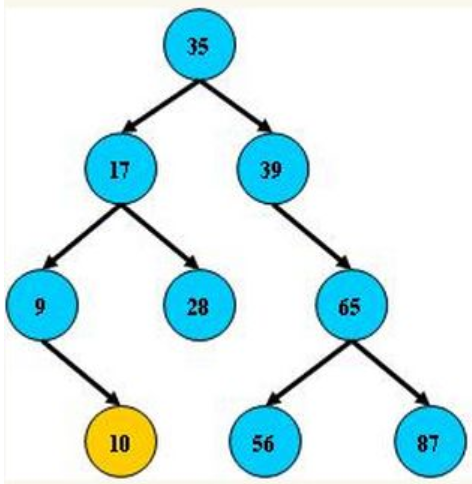
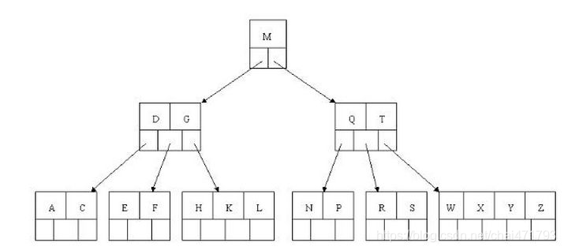
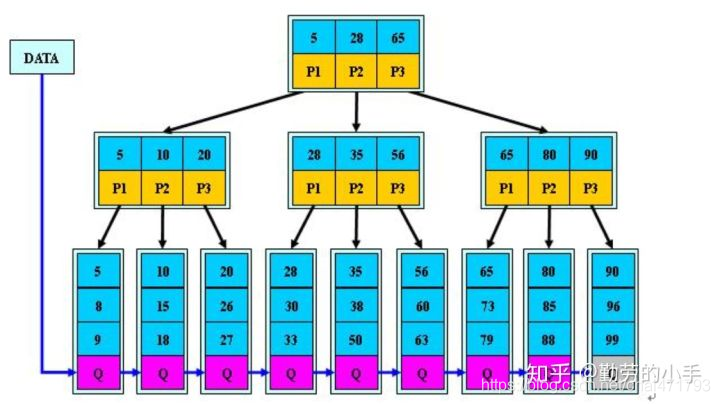
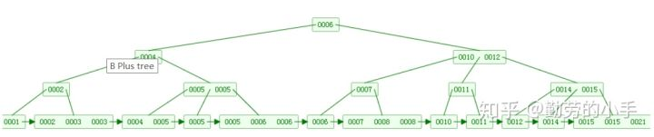

# 数据结构复习

## 树

### 平衡二叉树

`平衡二叉树是基于二分算法来提升查找数据的数据结构`

**特点：**

- 每个非叶子节点只允许最多两个子节点存在
- 左边叶子节点的值更小，右边叶子节点的值更大
- 没有值相等的重复节点

### B 树

`B 树是多叉树，同样是有序存储数据的，实际查找依然是通过二分进行查找`

**特点：**

- B 树是多叉树，存在多个分支
- 每个节点包含的关键字更多，而不像平衡二叉树那样只包含一个
- 所有节点关键字是按递增次序排列的，遵循左小右大的原则
- 所有的叶子节点均在同一层，叶子节点包含关键字数据和其他关键字数据的指针

### B+ 树

B+ 树是 B 树的升级版，

**特点：**

- B+ 树中不再保存关键字记录的内容，而是只保存数据索引和指针，以此增大每个非叶子节点所能保存的关键字
- 所有的数据都必须到叶子节点才能获取到
- B+ 树叶子节点的关键字从小到大有序排列，且左边的结尾数据都会保存右边节点开始数据的指针

### B 树和 B+ 树的对比

|          | B 树                                                         | B+ 树                                                        |
| -------- | ------------------------------------------------------------ | ------------------------------------------------------------ |
| 层级     | 非叶子节点不仅包含了关键字和指针，也保存了关键字数据的指针，层级更深 | 非叶子节点只保存关键字索引和对应页的指针，所有的关键字数据指针都在叶子接地那，因此非一叶子节点中一个索引占用的空间更少，层级更浅 |
| 查询速度 | 由于非叶子节点上也存储了关键字数据的地址指针，因此不同的数据查询次数可能不同 | B+ 树的关键字数据地址仅能从叶子节点中获取，因此查询次数都相同 |
| 节点遍历 | B 树中非叶子节点也存储了关键字数据指针，因此需要比那里所有的分支 | B+ 树中所有的数据都存储在叶子节点，且每个叶子节点都存有指向右侧最靠近自己的叶子节点的地址指针，因此 B+ 树只需要遍历所有叶子节点即可，效率更高 |
| 排序     | B 树中节点存储也是有序的，但不同叶子节点的数据只能重新找到分叉向下寻找 | B+ 树中所有的叶子节点形成了一个有序链表，数据检索效率更高    |

**总结：** 

- B+ 树比 B 树明显的优点是，由于所有的数据指针都在叶子节点，且相邻的叶子节点都保存了对应的地址指针，因此相邻数据查询效率更快，如范围查询等
- B 树比 B+ 树的优点是，由于部分数据指针存储在了非叶子节点上，因此数据检索时效率可能更快

### B* 树

在 B+ 树的基础上，非叶子节点尾部存储了指向同层相邻的非叶子节点的地址指针

