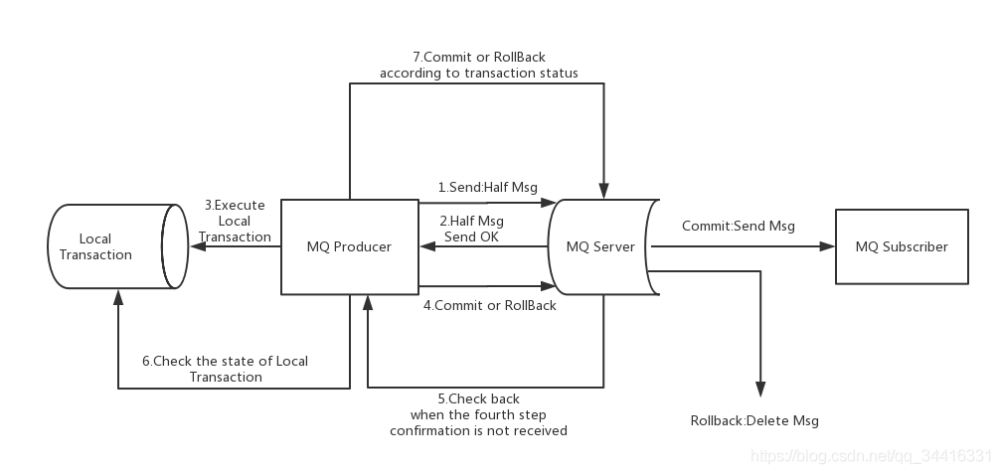

# 面试题解析记录

## 锁

### synchronized 在不同位置的区别

- **同步方法前**
  - 表示这个同步方法会被线程竞争和阻塞
- **同步代码块中**
  - 表示当线程执行到这个方法块时，会竞争和阻塞
- **给某个对象实例加锁**
  - 表示线程会对这个对象的使用权进行竞争和阻塞
- **静态方法前**
  - 给静态方法加锁，锁的是方法区中的类模板对象，这会导致使用这个静态方法的线程都会竞争和阻塞


###  说一说 synchronized 底层原理

#### 回答分析：

> 分析底层原理应该从三个方面回答
>
> - 先来个总的介绍
> - 结构 => 对象头、MarkWord、ObjectMonitor
> - 底层结构、monitor、对同步方法和同步方法块，在字节码文件中的不同标识方式
> - JDK 6 后对 synchronized 的优化  => 以此引导面试官问锁升级


#### 回答流程：

> **先总的介绍**

`synchronized 是 java 的内置关键字，是一种隐式锁，即使发生异常也会释放锁，通过 synchronized 可以实现对同步方法、同步代码块、对象实例以及静态代码块的加锁`

>**再介绍结构**

`synchronized 的实现是基于每个对象头部的对象头结构的，对象头中的个重要结构就是 MarkWord，这个 MarkWord 会根据锁的类型而动态变化，但默认存储了对象的锁状态、是否是偏向锁、锁标志位以及对象的 HashCode、分代年龄，在有线程持有锁后里面会存储对应的 monitor 的地址指针`


> **介绍 synchronized 底层是如何实现的 => monitor**

`synchronized 能够完成锁机制，主要就是通过线程持有锁后 MarkWord 中的锁标志位及 monitor 地址指针实现的。`

`每个对象都有一个自己的 monitor 实例，当一个线程持有锁时。被获取到的对象会修改对象头中的锁标志位为10，同时 MarkWord 中存储一个指向这个对象的 monitor 的指针，并修改这个 monitor 中的数据。当线程释放锁时，会释放这个指针，同时复位标志位为01`

`monitor 底层是使用 C++ 写的 ObjectMonitor 类，里面存储了锁的持有者以及加锁次数，阻塞等待的线程列表`

```c++
ObjectMonitor() {
    _header       = NULL;
    _count        = 0; //记录个数
    _waiters      = 0,
    _recursions   = 0;
    _object       = NULL;
    _owner        = NULL;
    _WaitSet      = NULL; //处于wait状态的线程，会被加入到_WaitSet
    _WaitSetLock  = 0 ;
    _Responsible  = NULL ;
    _succ         = NULL ;
    _cxq          = NULL ;
    FreeNext      = NULL ;
    _EntryList    = NULL ; //处于等待锁block状态的线程，会被加入到该列表
    _SpinFreq     = 0 ;
    _SpinClock    = 0 ;
    OwnerIsThread = 0 ;
}
```

> **介绍在同步代码块和同步方法中的实现方式**

然后，synchronized 对于同步代码块和同步方法中是用不同的方式处理的

在同步代码块中使用了 ==monitorenter== 和 ==monitorexit== 指令来标志同步代码块的进入位置和离开位置，同时编译器通过异常处理器保证了每一个 monitorenter 都会有一个匹配的 monitorexit，这也是为什么当异常时 synchronized 会自动释放锁的原因

而在同步方法中，synchronized 是通过给同步方法增加一个 ==ACC_SYNCHRONIZED== 标识来表明这是一个同步方法

> **最后介绍 jdk 6 后对 synchronized 的优化，引导面试官问锁升级的过程**

在 jdk1.6 之前 synchronized 是重量级锁，只有 `无锁、有锁`两种状态，效率较低，而在 jdk1.6 后对 synchronized 进行了优化，引入了`偏向锁和轻量级锁`提高锁的性能


### 说一说 synchronized 锁升级/优化

#### 回答分析：

> 锁升级过程的介绍要从前因后果，以及为什么要升级作答
>
> 或是面试官问你为什么 jdk6 后要加入偏向锁和轻量级锁，你可以告诉他我给你下整个锁升级的过程
>
> 或是通过描述jdk1.6之前及之后的 synchronized 锁的变化，以及偏向锁和轻量级锁的作用，引导他问锁升级的过程
>
> - 先介绍 jdk 1.6 之前和 jdk 1.6 及之后 synchronized 锁的变化
> - 着重介绍下偏向锁和轻量级锁是什么，以及作用
> - 介绍锁升级的过程
> - 总结下，经过优化后 synchronized 的效率如何


#### 回答流程：

> **先介绍 jdk 1.6 之前的问题来说明为什么要优化 synchronized**
>
> **再描述 jdk 1.6 及之后 synchronized 锁的变化**

`jdk 1.6 之前 synchronized 是一个重量级锁，只有无锁和重量级锁两种状态，且性能较低。在 jdk 1.6 中对它做了较大的优化，引入了偏向锁和轻量级锁，优化了锁升级的流程，即无锁->偏向锁->轻量级锁->重量级锁，大大提高了性能`

> **开始介绍偏向锁和轻量级锁的概念和作用**
>
> - 可以先说锁的作用，是为了解决什么问题
> - 然后再说这个锁的原理
> - 描述轻量级锁时使用了 CAS，这时面试官肯定会问题对 CAS 的相关问题

##### 偏向锁

**描述作用**

`偏向锁是针对不存在锁竞争，但同一个线程重复获取锁，造成额外的开销的情况`

**描述要解决什么问题**

由于synchronized 的可重入性，每次当同一线程重复持有锁时，都会去增加这个对象实例对应 monitor 中的 _count 个数，这就会引起锁申请以及 cpu 的用户态和内核态的切换，造成额外开销

**描述原理**

而偏向锁则是通过在实例的对象头和栈帧中记录当前持有锁的线程ID，由于偏向锁不会主动释放锁，因此当有线程再次尝试获取锁对象时，会将当前线程的线程ID与对象头中记录的持有锁的线程ID进行比较

若两个ID一致则不操作锁对象，避免了锁申请以及用户态和内核态的切换的开销

若两个ID不一致，则需要判断持有锁的线程ID是否要继续持有锁，若要继续持有则将这个偏向锁升级为轻量级锁，若不用再持有对象则锁对象重置为无锁状态，再让其他锁竞争，再次升级为偏向锁


##### 轻量级锁

**描述作用**

`轻量级锁是针对多个线程不在同一时刻来竞争同一把锁的情况，此时也不存在锁竞争，如同步代码块被线程交替执行的情况`

**解决了什么问题**

使用 CAS 方式来竞争锁，避免了每次有线程来竞争都要让用户态和内核态之间切换，而是在内存中就可以让多线程竞争锁

**描述原理**

轻量级锁是使用 CAS 机制来竞争锁的，也是在对象的对象头中存储了一个状态，而后线程竞争时会尝试用CAS机制更新这个锁状态，更新成功则持有锁，更新失败继续自旋。当自旋次数超出阈值后，则轻量级锁会升级为重量级锁，默认阈值是自旋10次


### 说一说 CAS

#### 回答分析：

> 面试官问这个问题，可能会直接问 CAS 有什么问题
>
> 你可以直接回答有 ABA 问题，以及通过版本号方式解决
>
> 或是先介绍 CAS 是什么、原理、优缺点，再引出 ABA 问题以及解决方式
>
> 在 CAS 的基础上，很容易引出原子类的问题，即atomic


#### 回答流程：

> **先回答 CAS 是什么**

CAS 就是比较交换算法，是一种无锁非阻塞算法，用于保证多线程的线程安全问题。底层==通过汇编指令保证原子性==，实现类为 jdk 提供的 UnSafe 类

> **再回答原理**

其原理是通过三个操作数实现，即内存地址、旧的预期值以及要修改的新值，CAS 开始时先记录内存地址以及内存地址中的值作为旧的预期值，当要向内存地址中存入新值时，会先对比旧的预期值是否与当前内存地址中的值相同，若相同则表明内存地址的内容没有被修改，可以存入新值，若不同则表明内存地址中的值已经被修改，此时则放弃修改，重新开始 CAS 的流程

> **再描述 CAS 的优缺点**

由于 CAS 是无锁算法，底层通过汇编保证了原子性，因此效率更高，

但由于实际是不断自旋判断，因此在一直失败时会占用cpu资源，且CAS 只能保证一个变量的原子性，无法保证对个变量的

> **再说明 CAS 有什么问题 => ABA 问题，以及如何解决**

CAS 中存在 ABA 问题，即 CAS 的比较是基于值对比的，若值的变化过程为 A 变为B再变为A，CAS 是无法发现内容发生了变化的

我们可以通过版本号的方式来解决 ABA 问题，jdk 5 中也提供了 AtomicStampedReference 类解决这个问题


## 并发

### 说一说原子类，AtomicInteger 原理

#### 回答分析:

> 面试官其实想问的是关于 atomic 原子类的问题，其实就是 i++，i--类型的问题，以及 atomic 使用了什么来解决


#### 回答流程：

> **先回答有什么问题**

Atomic 原子类是为了解决类似 i++ 这一类问题的，实际上 i++ 可以拆分为：

```java
temp = i;
temp = i + 1;
i = temp;
```

可见实际 i++ 这件事情是用了三个语句来执行的，因此不能保证整体的原子性

> **再回答 Atomic 解决了什么**

AtomicInteger 是一个原子操作的 Integer 类，底层通过 CAS 来保证数据处理时的线程安全，同时也需要注意越界的问题，最大值是21亿多，当发现即将越界时可以重新设置为0来避免


### 说一说 ThreadLocal 的原理

#### **回答分析：**

> 并发情况 ThreadLocal 是必问的，一般问 ThreadLocal 的原理和结构
>
> 我们要点出 ThreadLocal 可能会造成内存泄漏的问题和解决方案
>
> 可以将 SpringMVC 中的 RequestContextHolder 拿出来描述下，当做加分项，也表明自己有实际使用经历


#### **回答流程：**

> **先回答 ThreadLocal 是什么，作用**

`ThreadLocal 用于并发场景下，能够为每个线程都创建一个数据副本，用于存储一个变量，而各个线程中的这个变量都是互相隔离的`

> **回答原理**

ThreadLocal 的原理就是每一个线程都有一个自己的私有变量 threadLocals，这个变量是一个 ThreadLocalMap 类型的，ThreadLocalMap 实际是一个 hashmap，里面以 threadlocal 对象作为 key，实际要存储的内容作为 value 进行存储。支持多个 threadlocal 存储，且相同的 threadlocal 会覆盖

> **通过描述 threadlocal 的使用，引出内存泄漏问题**

一般我们会用 threadlocal 来存储用户数据啊这些，这样就不需要将用户数据作为参数传来传去。但如果使用不当的话，会造成内存泄漏问题。

内存泄漏有两种情况

第一种是线程退出了，但是 ThreadLocalMap 中存储的 value 值内容不会被回收，造成内存泄漏，这是由于在将 threadlocal 存入 ThreadLocalMap 时使用了弱引用，在线程退出后 ThreadLocalMap 会自动回收里面作为 key 的 threadlocal 对象，但没有清理掉对 value 的强引用，就造成了内存泄漏

另一种是由于在线程池中线程是被复用的，如果线程在处理完一个任务后没有及时调用 remove() 来清理 threadlocal 数据，则这个线程中会一直存储这些 threadlocal 数据

> **解决方案**

解决方案就是在 threadlocal 使用完毕后，一定要记得调用 remove() 清理掉

> **再说下实际项目经历中使用 RequestContextHolder** 

RequestContextHolder 


### 说一下 Volatile


## 多线程

### 线程如何中断

#### 回答分析：

> 这里面试官想考线程的中断标志位，因此可以先说下 interrupt() 来设置中断标志位为 true，但并不是一定会中断线程。同时说一下已经被废弃的 stop() 方法会直接中断一个正在运行的线程


#### 回答流程：

线程中可以调用 interrupt() 方法将线程的中断标志位设置为 true，但线程是否中断则是取决于线程在执行过程中的任务情况，线程会不时检测这个中断标志位来判断线程是否应该被中断，若标志位为 true 则中断线程，但中断线程会抛出 InterruptedException 异常，程序中必须捕获和处理这个异常

当线程处于 wait、sleep、join 的阻塞状态时，调用 interrupt() 后线程会立即中断，否则需要等线程执行到 wait()、sleep()、join 时才会被中断

还有一个已经被废弃的 stop() 方法，可以直接中断运行中的线程，但会造成并发安全问题


## JVM

### 说一下 jvm 的内存结构

#### 回答分析：

> 面试官想问的不仅仅是 jvm 的内存结构，可能之后还会想问你内部结构的哪些是线程私有，哪些是线程共享的，你可以在他问起来的时候以私有和共享来分类
>
> 同时，当你描述出来组件后，可以再接着拓展下一个个组件的作用和特点，以及对应的gc特性，这样能体现你对 jvm 结构的熟悉
>
> 在描述末尾可以着重带上对堆和方法区的 gc，引导面试官问你 gc 的知识点
>
> 虚拟机栈 ===> 引导问栈的定义方式、为什么会栈溢出、如何解决
>
> 堆 ===> 抛出年轻代、老年代、分代收集算法，引导面试官问这些
>
> ​               同时点出 jdk7 中将静态变量和字符串常量池放入堆区中，引导面试官问为什么移到堆区
>
> 方法区 ===> 在方法区中一定要知道 jdk8 将永久代换成了元空间，面试官则会去问永久代和元空间的区别以及为什么要替换等


#### 回答流程：

> **先按私有还是共享来对组件分类**

`jvm 的内存结构，按线程私有或线程共享来划分的话，线程私有的有程序计数器、本地方法栈、虚拟机栈，线程共享的有堆区和方法区。`

线程私有的组件和共享的组件在gc和生命周期上有所不同，线程私有的组件在线程结束后就会释放资源，且生命结束。

而线程共享的组件是需要gc线程回收的，且一直伴随着整个 jvm 的存活周期

> **再拓展下各个组件的作用和特点**

**程序计数器**

程序计数器是每个线程私有的，保存了当前线程下一个要执行的指令的地址

**虚拟机栈**

然后虚拟机栈则是一个先进后出的数据结构，存储了一个个栈帧 ，每个栈帧都对应着一个方法，保存了局部变量表，操作数栈、方法放回地址、动态链接等，当方法被调用时就向这个线程的虚拟机栈里面压入一个栈帧，当方法被调用完毕后则弹出这个栈帧，返回结果给上一个栈帧。虚拟机栈通过先进后出的方式保证方法调用的顺序性。虚拟机栈不需要gc回收，栈帧弹出后对应的资源就被回收了，但可能存在栈溢出的问题

**本地方法栈**

本地方法栈中也是个先进先出的栈结构，但里面存储的是 java 通过 jvm 调用其他语言提供的方法

**堆**

堆是 jvm 中最重要的一块内存区域，是我们调优以及垃圾回收的重点区域，里面存放了类实例对象，在jdk7中将字符串常量池以及静态变量从方法区中移到堆区，分为年轻代和永久代，年轻代又分为伊甸园区和幸存者区，同时使用分代算法进行垃圾回收

**方法区**

方法区主要存储了类模板信息和运行时常量池，在jdk 1.8 之前方法区还是永久代，在jdk 1.8 时将永久代换为元空间


### 有了解过哪些垃圾收集算法

#### 回答分析：

>这里就很纯粹了，面试官想问你知道哪些垃圾回收算法，你可以将算法分为标记算法和清除算法，
>
>- 标记算法为引用计数算法和可达性分析算法，并点出引用计数算法的问题以及java使用的是可达性分析算法
>- 清除算法分为标记清除算法、标记压缩算法、复制算法，以及延伸出来的分代收集算法、分区收集算法
>- 先描述三种基础的清除算法，而后对三种算法做对比优劣，并点出年轻代和老年代各自用了哪种
>- 问完这个之后，就可能会问gc引擎了

#### 回答流程：

> **先回答分类，这时候因为标记阶段算法没什么好说的，点出引用计数算法的问题，就可以着重回答可达性分析算法了**

垃圾回收分为标记阶段和清除阶段，标记阶段的算法有引用计数算法和可达性分析算法，但是引用计数算法存在互相引用导致对象无法回收的问题，就是A引用B，B引用A，则AB都永远无法被回收。java 中使用的都是可达性分析算法

而清除阶段基础的算法有标记清除算法、标记压缩算法以及复制算法，现代垃圾回收器中还依此拓展出了分代收集算法和G1引擎的分区收集算法

> **前面总结完毕后，开始描述下可达性分析算法**

可达性分析算法就是通过定义一个个根对象(GCRoot)，所有直接或间接连接这个根对象的对象称作可达对象，而不是可达的对象成为非可达对象或死亡对象，死亡对象是会被gc回收的

> **如果记得住的话，可以再描述下根对象可以是什么对象**

根对象可能是虚拟机栈或本地方法栈中的局部变量，方法池中的对象等

> **先总的描述下三种基本的清除算法**

标记清除算法是先进行可达性分析，然后遍历堆内存清理掉不可达的对象。标记清除算法效率高，但会造成许多内存碎片，并且要额外维护一个空闲列表记录可用的内存空间

标记压缩算法则是对标记清除算法的优化，先进行可达性分析，然后遍历堆内存清理掉不可达对象，最后将所有可达对象移动到堆内存的一端去，避免了内存碎片的产生，也不用维护空闲列表，只要维护一个可放入数据的位置指针

复制算法则是将内存空间分为两块，每次只使用其中的一块。如将内存空间修改为内存A和内存B，在清理内存A时，会将A中的可达对象==复制== 到内存B中，而后清理掉整个内存A。下一次则是A、B调换处理。这种算法的缺点就是内存需要被分割成对等的两块，更适合于少量存活对象，大量垃圾对象的情况。如年轻代就是使用了复制算法处理的


> **其实在介绍里面就已经说了优劣了，如果面试官还专门问了的话，那再给他回答**

从空间利率用来说，复制算法利率用最低，标记整理算法利用率最高

从性能来说，复制算法性能最高，标记整理算法性能最低

从适用场景来说，复制算法适用于存活对象少、死亡对象多的场景，如年轻代。而标记清除、标记整理算法适用于存活对象多，死亡对象少的情况，如老年代中


> 接下来可能会问分代收集算法和分区收集算法，如果他没有打断你，你就可以描述一下
>
> 先描述分代算法，顺带说下年轻代和老年代中对象的区别

分代收集算法即针对不同生命周期的对象采用不同的垃圾回收算法，例子如在年轻代中使用复制算法，在老年代中使用标记整理算法。

因为年轻代中的对象生命周期短，存活率低，使用复制算法效率更快。而老年代中的对象生命周期长，存活率高，使用标记整理算法更合适

> 描述分区算法

分区算法即将内存划分为一个个1024个区块，每个区块都是无属性的，会根据里面存储的数据类型更改对应的属性。如存储伊甸园区数据，则这个区块就被标记为伊甸园块。


### 说一下 CMS 垃圾回收器

CMS 垃圾回收器即低延迟回收，即尽可能缩短 stw 的时间，在标记清除算法的基础上进行了优化

分为 ：

初始标记、并发标记、重新标记以及并发清除阶段

- 初始标记：此时会触发 stw，先标记直接可达对象
- 并发标记：根据直接可达对象获取其他间接可达对象
- 重新标记：触发 stw，由于并发标记阶段线程也在执行，因此部分标记会变动，因此要重新标记
- 并发清除：清除掉死亡对象即可

优点：

- 低延迟

缺点：

- 并发标记占用cpu资源

- 内存碎片化

- 无法处理浮动垃圾


## Mysql

### mysql 有哪些引擎

#### 回答分析：

> 面试官想问的就是 myisam 和 innodb 了，但重点其实是 innodb，以此引出之后的 B+tree 和 聚簇索引、二级索引等
>
> 因此在这里只要简单答出 myisam 和 innodb 的区别，多说点 innodb 的特点，如 b+tree，聚簇索引、辅助索引等


#### 回答流程：

mysql 引擎主要就是 myisam 和 innodb 了，myisam 引擎是在 mysql5.5 之前的默认引擎，性能高但不支持外键、事务、行锁，而 innodb 则是当前主流使用的数据库引擎，支持事务处理、外键和行锁，同时二者虽然都是使用 B+Tree 来存储数据，但 myisam 的叶子节点中只缓存索引不缓存真实的数据，而 innodb 的聚簇索引叶子节点中存储了真实的记录数据


### B+树你了解吗

#### 回答分析：

> 面试官想问的是 B+ 树，而后引出聚簇索引、非聚簇索引
>
> 你可以在回答完 B+ 树后，顺带点一下 innodb 的索引就是通过 B+ 树来实现的
>
> 你也可以对比一下平衡二叉树和B树


#### 回答流程：

> **先回答 B+ 树**

B+ 树是一个多叉树结构，有以下几个特点：

- 遵循左小右大的原则
- 所有的数据都只存储在叶子节点上，获取数据只能在叶子节点上获取到
- 每个叶子节点的末尾都保存了指向相邻叶子的指针，使得所有叶子节点之间形成了一个双向链表结构
- 每个节点可以存储多个数据

> **再回答平衡二叉树和 B 树**

相对于平衡二叉树，B+树的高度更矮，查询效率更高，存储的数据量也更大。

与 B 树相比，B+ 树将所有的数据存储在叶子节点，在做范围查找时可以根据叶子节点的双向链表快速找到范围内的节点，而不用像 B 树一样还回溯到其他树干上

mysql 中的 innodb 引擎就是使用 B+ 树实现索引的


### 你知道 Mysql 的聚簇索引吗

#### 回答分析：

> 面试官这里是问聚簇索引、非聚簇索引，之后可能引出 mysql 辅助索引的查询
>
> 将聚簇索引一定要点出是以主键建立的索引、用了B+树，叶子节点和非叶子节点都存了什么
>
> 然后描述系非聚簇索引、二者的区别以及设置聚簇索引的注意
>
> 可以在描述非聚簇索引时提及覆盖索引的概念，引导面试官来问


#### 回答流程：

> **先回答问的，即聚簇索引**

聚簇索引就是指 innodb 对主键建立索引，底层使用了 B+ 树结构，叶子节点称之为页，其中存储了整张表的行记录，默认大小为16KB。 非叶子节点称为目录页，记录了叶子节点上的最小索引以及对应的地址指针

若定义表时没有定义主键，则 innodb 会默认生成一个 row_id 作为主键

> **再回答非聚簇索引**

非聚簇索引也叫做辅助索引，二级索引，同样也是 B+ 树结构，但与聚簇索引不同的是它的叶子节点存储的不是行数据，而是存储对应的聚簇索引的索引值，因此通过辅助索引查询数据，往往需要先根据辅助索引的索引值找到对应的叶子节点，然后取出对应的聚簇索引的索引值，再去聚簇索引上找出数据，即二次查找

> **回答下聚簇索引和非聚簇索引的区别，以及使用的注意事项**

二者的区别在于一张表只能有一个聚簇索引，而辅助索引可以有多个。且聚簇索引只需要查找一次，而辅助索引在没有发生索引覆盖的情况下需要查找两次。以及聚簇索引的叶子节点中存储了行数据，而非聚簇索引的叶子节点里面存储了对应的聚簇索引的索引值。

在设计表时主键最好小一点，以提高一页内能存储的记录条数。同时最好设置自增id为主键，避免页数据分页或换页的情况


### 你知道什么叫回表吗

#### 回答分析：

> 面试官想问你回表，其实与之相关的就是“覆盖索引”
>
> 先描述下回表和覆盖索引，然后再描述下覆盖索引的优点


#### 回答流程：

> **可以将回表和覆盖索引一起答**

回表和覆盖索引都是针对通过辅助索引查询的情况，由于辅助索引建立时可以是单个字段，也可以是复合字段，如果在搜索时辅助索引内的字段就已经可以满足我们要查询的内容时，就不会再去聚簇索引里面查询，而是直接返回相关数据，这就叫`覆盖索引`。

而与之相反，若辅助索引中的数据无法完全填充我们要查询的内容时，就需要根据叶子节点里存储的聚簇索引值，去聚簇索引表里搜索。去聚簇索引表里面搜索的这个动作就叫做 `回表`。

> **再讲下覆盖索引的优点，即为什么要避免回表**

在实际使用过程中，善用覆盖索引来避免回表可以提高我们的查询效率，因为不用再去聚簇索引中查找一次了。使用 explain 来检测 sql 语句时出现 ”using index“，就是使用了覆盖索引查找


### 锁表的情况，如何解决


## Redis

### 你知道 Redis 有哪些数据类型吗

#### 回答分析：

> 至少要回答出五大基本数据类型，能再说出三种特殊类型则是你的加分项
>
> 在描述类型的同时最好也说下作用，如果实际项目中有使用则说下自己用它来干嘛了
>
> 
>
> 先概括，回答完面试官的问题
>
> 然后再拓展，说下自己常用的或了解的数据类型有什么，拿来做什么的，在项目中如何用的


#### 回答流程

> **先将类型都答出来，如果一开始就描述太细的话怕后面会乱掉**

Redis 中有五种基本数据类型以及三种特殊数据类型，基本数据类型为 String、List、Set、Hash、ZSet，特殊类型为一个的地理位置的、基数以及位图

> **然后开始重点描述自己常用或了解的数据类型，结合自己的项目经历**

一般我们常用的数据类型就是 String、Hash 和 ZSet

像 String 我们可以把一些配置数据设置进去，在实际项目中，由于项目对用户id的区间有要求，必须从10000开始，以及考虑到之后的分表情况，因此将用户id使用 redis 自增方式使用，这时候就会使用 redis 的 incr 方法来实现

而 Hash 则是最常用的一个数据结构，我们用它来存储大量且属性相同的数据，比如用户登录的 token 管理，我们项目中的群组信息等

ZSet 也是在项目使用过的，他是一个有序的不重复集合，可以实现热点、排行榜的功能。在项目中我们用来给用户发布的资源下载量做排序。可以用 range 来指定你要获取的范围，默认是升序排序的。

Set 则是无序不重复的数据结构，可以获取到两个 Set 集合的交集和差集来实现共同朋友、共同关注等这一类的功能

List 类型在实际项目中没有用过，其内部是队列结构，一般是作为缓存队列使用

> **可以稍微点一下特殊数据类型作为加分项**

然后特殊数据类型里面，地理位置的数据类型就是通过记录地理坐标，可以获取都两个位置之间的距离，可以用来做附近的人、导航等

而基数就是不重复元素的个数，可以用来统计访问量。位图则是用来统计用户活跃或不在线、打卡未打卡这些。但这些在实际项目中没暂时都没有用过，暂时没这种需求


### 为什么 Redis 使用了单线程

#### 回答分析：

> 面试官想问 redis 使用单线程为什么性能还那么高
>
> 可以点出 redis 的性能瓶颈，然后 redis 6.0 中可以开启多线程(默认禁用)


#### 回答流程：

> **先说下 Redis 的性能瓶颈是内存和带宽**

这是由于 Redis 是基于内存操作的，所有的操作都在内存中，因此 Redis 的性能瓶颈在内存和网络带宽，而不是 cpu。如果使用多线程不仅不会提升性能，还会带来线程安全问题、锁已经线程上下文切换的开销。因此使用单线程就是效率最高的情况

> **然后说下为什么 Redis 效率那么高**

作者通过几个设计提高性能：

- Redis 处理完全基于内存，效率高
- 数据结构简单，操作也简单高效，没有多余业务操作
- 使用了单线程，避免不必要的线程安全问题处理以及上下文切换开销
- 使用多路复用IO提高连接并发数

> **再说下 Redis6.0 支持打开多线程**

Redis 6.0 中支持打开多线程处理，原本 redis 是通过主线程将数据返回给客户端的，打开多线程配置后，在返回数据时是交给多线程处理的


### 了解 Redis 事务么

#### 回答分析：

> 一般不怎么使用 Redis 事务，简单回答，但注意条理
>
> - 点出 Redis 事务无法保证原子性，只能保证编译器异常的原子性，无法保证运行时异常的原子性


#### 回答流程：

Redis 事务是无法保证原子性的，只能保证编译期异常的原子性，而无法保证运行时异常的原子性，当运行时发生了异常，其余命令也会继续执行，且不会回滚

操作就是 multi 开启事务，exec 执行事务，discard 放弃事务


### 说一下 Redis 的持久化机制

#### 回答分析：

> 面试官想问 rdb 和 aof，在回答出来后最好有能力对其进行拓展，表示你对这个有深入了解，并可以在最后提最大内存限制以及淘汰策略的使用
>
> - 先说出 redis 的持久化机制有 rdb 和 aof
> - 再对两种方式进行分析
> - 结合自己实际场景，说出 rdb 和 aof 在什么场景使用，自己是怎么用的
> - 然后点出持久化机制可能会导致 OOM，需要配置淘汰策略


#### 回答流程：

> **先概括 redis 的持久化机制**

redis 的持久化机制分别是 rdb redis 文件备份 以及 aof 文件追加，默认打开的是 rdb 模式

> **分析两种方式，先说 rdb**

rdb 机制是 redis 默认的备份方式，将 redis 数据以 rdb 文件形式存储在磁盘上，并通过一定策略进行刷盘来实现持久化的。

有三种情况下会导致刷盘：

- 配置文件中 save 规则满足时，save 规则就是配置文件中定义了一定时间内满足多少次写操作，就会进行刷盘
- 手动执行 flushall 命令
- redis 退出时

rdb 模式对性能损耗较低，但最后一次持久化的内容可能消失，即还没有刷盘到 rdb 文件中，如果要尽可能保存数据则要打开 aof

> **介绍 aof**

aof 机制是将 redis 的写操作都记录下来，追加到 aof 文件中，但是实际操作都是与 rdb 一样在后面 fork 一个子线程对文件进行替换。支持每次写操作都触发或每秒触发，一般开启每秒触发即可。

这种方式的优点是减少数据丢失的风险和数量，但缺点是对性能影响较大，且由于是记录了操作指令，因此占用的内存空间更大

> **然后说下可以怎么用**

在生产环境可以根据实际情况处理，如果对消息可靠性要求高就打开 aof，甚至 rdb、aof 都打开

> **提一下性能优化**

由于它的数据是存储在内存中的，在使用 redis 时需要注意设置最大内存避免发生OOM，可以通过 ` info Memory` 命令查看当前占用了多少内存。

同时可以将淘汰策略配置为 allkeys-lru，即根据 lru 算法删除 key


### 说一下 Redis 的淘汰策略/过期策略

#### 回答分析：

> 面试官问问题其实很多情况下是发散的， 可能他只是想问下淘汰策略有哪些，但是你可以根据自己的知识树，给他有条理地点出来
>
> - 先介绍下为什么 Redis 要有淘汰策略和过期策略
> - 然后先介绍下淘汰策略
> - 再介绍下过期策略
> - 然后说下生产环境自己是如何使用的


#### 回答流程：

> **先介绍为什么要有淘汰策略和过期策略**

Redis 是内存数据库，会将所有的数据都存储到内存中，如果数据一直增长就可能导致OOM，所有在限制 redis 最大内存的同时，还要设置淘汰策略和了解它的过期策略

> **介绍下淘汰策略**

当 Redis 发现内存不足时就会触发淘汰策略，内部提供了6种淘汰策略，分别为：

==对设置了过期时间的key使用lru算法回收、对所有key使用lru算法回收（重点！）==

随机删除即将过期的key、随机删除key

删除即将过期的key、永不删除

> **然后说下 redis 的过期策略**

过期策略也是 redis 内存管理的重要部分， 过期策略管理的是我们设置了过期时间的 key

常见的过期策略有三种，定时过期、惰性过期以及定期过期三种

定时过期是针对每个key，每个key 都维护了一个定时器，当过期了就立即清除，这种方式回收及时，但会占用大量 cpu 资源

惰性过期即只有访问那个 key 时才会判断是否过期

定期过期即每个一段时间，就扫描一定数量的设置了过期时间的 key，清除已经过期的key

==redis 采用惰性过期+定期过期的方式实现过期策略==

> **说下生成环境用哪个，顺带介绍下 LRU 算法**

在实际生产环境中使用 allkeys-lru，即对所有 key 使用 lru 算法回收。

- maxmemory：设置内存的最大容量 byte
- maxmemory-policy：设置淘汰策略

lru 算法是一种内存管理算法，会淘汰最近最少使用的数据，底层是使用 hashmap + 双向链表实现的


### 可怕，lru 算法介绍一下

#### 回答分析：

> 好吧，面试官就是想问你如何实现 lru 算法的，考你算法题啦兄弟！可以去 leetcode 刷


#### 回答流程：

lru 算法可以用 hashmap + 双向链表的方式实现 hashmap 负责查找，双向链表负责存储完整数据

hashmap 中以设置的 key 作为 key，value 则是指向双向链表中的Node节点，以此来保证查找复杂度为 O(1)

而双向链表中存储了真正的内存数据，当新增一个数据时，就会将这个数据放到链表的尾部，若链表已经最大了，则会弹出最靠近顶部的 使用次数最少的 node 节点

在 Redis 的实现中是每次选择一批的 key，然后淘汰掉最不经常使用的那个


### 说一下 Redis 如何实现发布订阅的

#### 回答分析：

> 说实在的 redis 的发布订阅很少用，要用就用 mq，因此根据自己的知识简单回答吧
>
> - 说下 redis 的发布订阅能做什么
> - 再说下 redis 发布订阅的大致数据结构


#### 回答流程：

redis 的发布订阅能够让 redis 作为注册中心和配置中心，甚至实现聊天

在 redis 中维护这一个字典，即一个hashmap，字典的 key 就是一个个频道，value 是订阅了这个频道的客户端，当要发布信息时，redis 就会取出这个频道，然后对这个订阅者列表遍历发送


### 说一下缓存穿透

#### 回答分析：

> 这算是常见问题了，有条理地回答即可
>
> - 先说下什么是缓存穿透现象
> - 然后点出大面积出现缓存穿透现象，不处理就可能造成缓存雪崩
> - 再说下常见的解决方案： 设置 nil + 弹性过期，或是使用布隆过滤器


#### 回答流程：

> **先说下什么是缓存穿透现象**

缓存穿透就是在查询数据时，redis 和数据库中都没有命中，则会查询失败，且下次查询依然会查询到数据库，当大量查询发生时就会对数据库造成很大压力

> **点出缓存雪崩**

当存在大量 key 都无法命中，则可能压垮数据库，造成缓存雪崩

> **常见解决方案**

常见的解决方案有两种

一种是缓存没命中，如果从数据库查出来的是空的，则设置一个 value 为空的值进去，如果要优化的话，就给这个值设置一个弹性的过期时间

另一种方案是使用布隆过滤器，当请求来时会在布隆过滤器中校验，若不符合则丢弃，但布隆过滤器会有误差


### 说一下什么是缓存击穿

#### 回答分析：

> 先说下缓存击穿是什么，会导致什么
>
> 然后说下解决方案
>
> - 热点数据永不过期 => 可以引出如何实现双写一致(读写锁)
> - 分布式锁 + 双重校验


#### 回答流程：

> **先回答概念**

缓存击穿就是当一个热点 key 过期失效时，瞬间大量并发请求到了数据库，导致数据库压力过载

> **解决方案**

解决有两种，一种是热点 key 永不过期，且保证缓存和数据库双写一致

另一种就是给从数据库查询的那条代码加上分布式锁和双重校验


### 说一下什么是缓存雪崩

#### 回答分析：

> 先说概念
>
> 再说方案


#### 回答流程：

缓存雪崩是指某个时间段内，缓存集中过期失效或 redis 宕机，导致大量请求同一时间访问数据库导致数据库崩溃

解决方案有：保证 redis 高可用，缓存预热以及限流降级

- 保证redis 高可用
- 缓存预热：在正式使用前先手动触发，加载不同的 key 到 redis 中，且设置弹性的过期时间


### 热点 key 如何处理

#### 回答分析：

> 回答这个问题应该从头到尾说，
>
> - 如何发现热key
> - 如何保存和更新热key

监控 => 客户端 或 代理类 或 zset 、抓包


#### 回答流程：

> 概述

热 key 即被大量并发线程访问的kv键值对，如果不对热 key 做缓存则会对数据库造成压力，如菜单列表、商品分类列表等

> 如何发现热key

发现热 key 的方案有提前预估、客户端收集、抓包等，比较好的方式是提前预估和客户端收集

提前预估如商品商城中的是商品分类列表，类型列表等

客户端收集则是在操作 redis 前进行数据统计，但这种方式会对客户端代码造成入侵  => 对jedis工具类使用装饰者模式或是aop增强

> 如何保存和更新热 key

我们在收集到热 key 之后，可以将其进行保存，如保存在 redis、zookeeper、数据库中

如果是保存在 zookeeper 或是 redis 中，则可以通过发布订阅机制知道热key的变化，从而动态增加热 key

如果是保存在数据库中，则可以发起定时任务去获取


### 你是如何保证 Redis 高可用的

#### 回答分析：

> 先说下 Redis 高可用有两种：
>
> - 主从+哨兵：保证节点的高可用
> - 集群：保证整个 Redis 服务的高可用
>
> 再说下自己在项目中用了主从+哨兵，并描述
>
> 最后简单说一下集群


#### 回答流程：

> 先说高可用分类

Redis 的高可用就是搭建主从复制+哨兵，主从+哨兵可以形成一个对外高可用的 redis 节点

> 再说主从+哨兵

我在项目中使用一主二从三哨兵的方式部署的。通过主从复制以及读写分离，保证 redis 服务的并发读写能力。通过哨兵来实现自动故障切换和故障通知

> 集群

集群主要是用于水平扩容的，且无法动态扩容，因为槽的数量是固定的，扩容需要个每个节点重新分配槽


### 说下 Redis 的主从架构

> 概述

Redis 的主从复制将一台 Master 的数据复制到其他 slave 上

> 作用

- 数据冗余，实现了数据的热备份
- 故障恢复：当主节点出现问题时，可以手动切换或通过哨兵动态切换
- 负载均衡：实现读写分离
- 高可用：是哨兵模式和集群模式的基础

> 原理

整个过程分为全量复制和增量复制的过程

每次 slave 连接到 master，master 都会将整个写操作文件发送给 slave，slave 收到后进行一次全量复制

而后每次有写命令，master 都会将命令发送给 slave 来保持数据同步


### 说下 Redis 的哨兵模式

> 概述

哨兵模式是 redis 提供的一个高可用方案，是一个独立的进程，用来监督 redis 主从节点的状态，实现故障自动切换、故障通知

> 故障切换的原理

故障切换分为主观下线和客观下线

主观下线就是当一个哨兵A发现 Master 不可用后不会马上进行 failover 处理，而只是哨兵A认为这个 Master 不可用

客观下线就是当其他的哨兵也发现 Master 宕机，且发现的哨兵数量达到半数以上时，哨兵间就会发起投票选举出新的 master 节点，然后结果由一个哨兵发起，进行 failover。切换成功后，则通过发布/订阅模式让对应的 slave 切换为 master，并通知其他节点


## 网络编程

### 了解过哪些IO模型呢

#### 回答分析：

> 面试官想问你五种IO模型，实际上这个问题就已经把 BIO、NIO、AIO 都概括进去了
>
> 但之后可能会拓展出 阻塞非阻塞与同步异步的概念区别


#### 回答流程：

> 先总地说出几种IO模型，然后各自稍微描述下
>
> 注意描述的渐进性，即一开始有什么不好，后面的模型解决了什么，模型还有什么问题待改进

IO模型一共有五种，分别为 `同步阻塞模型、同步非阻塞模型、多路复用模型、信号驱动模型以及异步非阻塞模型`

**同步阻塞模型**即用户发出IO请求后，若内核发现数据没有就绪就会将用户线程阻塞，直到有数据返回。这会让用户线程一直处于阻塞状态无法处理别的事情

**同步非阻塞模型**则解决了同步非阻塞模型的问题，在用户发出IO请求后，内核发现数据没有准备好，就直接返回“数据未准备好”的标志量给用户，这样就不会让用户线程阻塞住了。但这种模型的缺点就是对每个IO请求都会创建一个线程，且在数据未准备好时，需要用户线程不断轮询来判断数据是否完毕

而**多路复用模型**是在同步非阻塞模型上的优化，使用了多路复用器使得一个线程可以监听多个socket连接来解决对每个IO创建单独线程的问题。同时使用了 epoll 机制，当有IO事件发生时通知监听线程，而不是让用户线程一致轮询判断数据是否准备完毕，Netty 框架就是使用了NIO模型

**信号量驱动模型**则是在用户线程发起IO请求后，注解一个信号函数，当数据准备好后内核会发送这个信号给用户线程，然后用户线程才会进行读写操作

**异步非阻塞IO模型**则是在用户线程发起IO请求后马上返回一个确认给用户线程，并记录用户线程的回调，等数据准备好后调用回调传给用户线程


### 说一下 TCP 连接的过程

#### 回答分析：

> 面试官想问三次握手，先大致描述下三次握手过程，重点要描述为什么要三次握手


#### 回答流程：

> **先回答三次握手的过程**

TCP 连接的过程其实是三次握手，这是由于要保证 TCP 的可靠性而设计的

第一次握手是客户端向服务器发起连接请求

第二次握手则是服务器在接收到请求报文后，返回确认报文，告诉客户端我收到了你的连接请求，你可以连接了

第三次握手是客户端收到确认报文后，向服务器发出确认报文，表明我知道你可以连接了，我要开始连接了

然后客户端和服务器才开始连接

> **描述为什么握手次数是三次**

握手的目的是为了让客户端和服务器知晓对方是否可以连接

若只有一次握手，则客户端没有收到服务器的确认报文，就无法判断服务器是否可以连接

若只有两次握手，则服务器无法知道在自己处理完客户端的请求报文后，客户端是否还可以连接，因为前两次握手中间有时间差，可能客户端已经挂了

三次握手已经让双方知道了对方可以连接，更多次的握手对可靠性的提高有限


### 说一下 TCP 断开连接的过程

#### 回答分析：

> 面试官想问四次挥手，先大致描述下四次挥手过程，重点要描述为什么要四次挥手


#### 回答流程：

> 先回答四次挥手的过程

Tcp 断开连接的过程就是四次挥手，这是为了保证tcp的可靠性专门设计过的

第一次挥手是客户端向服务器发起请求，告诉他我要断开连接了。

第二次挥手是服务器返回确认报文，告诉客户端我知道你要断开连接了，此时服务器开始断开连接操作

第三次挥手是服务器断开连接完成后，再次向客户端发送报文，告诉客户端我已经成功断开连接了

第四次挥手则是客户端的检查，客户端会发送一个报文给服务器，看是否真正断开连接

> 然后描述下为什么要四次挥手，不是更少次或更多次

若只有一次挥手或二次挥手，这时候服务端可能正在断开连接，导致客户端确认失败

而只有三次挥手，客户端无法确认服务器是否真的断开了，故还需要第四次挥手来检测是否成功断开

用四次挥手已经能够保证较大概率已经断开连接了，更多次的挥手只会造成资源的浪费，且提升也有限


## 分布式

### 说一下对微服务的了解

#### 回答分析：

> 这个问题范围就很广了，面试官可能想看你能说出什么，考验你知识的广度，因此在回答是也不同太过深入
>
> 但在描述过程中不用死记硬背，可以融入自己对微服务的体会
>
> 但在回答这个问题时要注意阶段性和渐进性
>
> 阶段性：
>
> - 先说下微服务概念相关的
>   - 先说下微服务的概念
>   - 微服务解决了什么
>   - 微服务的优缺点
> - 再说当前主流的微服务框架，以及如何选型
>   - dubbo + zk/nacos + nginx
>   - spring cloud / spring cloud alibaba
> - 之后的回答就有侧重点了，看个人对哪套框架更熟悉就重点描述


#### 回答流程：

> **先回答下微服务概念**

微服务是一种架构思想，就是将业务功能拆分成一个个小模块，并以此编写成一个个可以独立运行的小服务，这些小服务之间使用轻量化协议通过 rpc 方式来调用，互相协作完成整个项目的运行

> **如果面试官有问我们再说分布式和微服务的区别，没问自己感觉没把握就不要提分布式**

分布式是一种部署方式，而微服务是一种架构思想。在使用多台服务器的情况下，分布式不一定是微服务，可能是集群，而微服务则一定是分布式的

> **说下单体服务的缺点和微服务的优缺点**

微服务解决了一些单体服务的问题，

**优点：**

- **从开发难度角度**，随着功能增加，单体项目越来越大导致项目越来越复杂，模块之间耦合性越来越高。而微服务将业务系统拆分成小服务且可以独立开发运行，使开发者能专注某个单独业务模块的开发
- **从团队角度：**在团队开发中使用单体服务，往往容易出现代码冲突，或是代码被别人修改了的情况，而在微服务中每个人只要专注于自己负责的模块的开发

- **从可用性角度**，单体服务中如果某个模块出了问题，会影响到整个服务都无法正常使用，或是降低整个服务的性能。而微服务只会影响出现问题的服务模块。如 IM 项目的群组模块出现问题，不会影响到聊天模块，用户仍可以正常登陆和聊天
- **从灵活性角度**，要增加并发能力，单体服务只能修改代码，或是部署集群，而微服务可以针对压力大的微服务部署集群增加节点，对压力小的服务减少集群节点数量，还可以根据服务情况进行针对性的 jvm 调优
- **从可拓展性角度**，单体服务要扩展需要修改代码，而微服务可能只要增加新的服务模块就可以了

**缺点：**

- 但微服务增加了维护的成本，运维要维护一个个微服务的情况，以及更新和部署都要一个个部署确认情况
- 出现问题定位麻烦，可能是多个微服务模块出了问题
- 需要更多的服务器来部署

> **然后说下当前微服务的主流架构，并说下自己在公司项目中用的是哪一套，让面试官问得有侧重点**

当前主流框架有 SpringCloud，以及 dubbo+zk/nacos+nginx 这两种，我在实际项目中使用的是 dubbo+zk 这一套，对于 SpringCloud 只有自己敲了 demo。

> **分别说一下不同框架中的核心组件**

分布式框架中的核心组件有：

**注册中心**，用来监控各个微服务状态，以及提供服务间发现的，一般使用 Eureka、zk 或是 nacos，当然也支持 redis 等

**远程调用框架** 则使用OpenFeign、Dubbo，集成了 Ribbon 做负载均衡

**负载均衡框架** 使用 Ribbon，dubbo 内也可以设置负载均衡，主要有 轮询、 随机、权重、故障最少、或响应时间最快、并发量最小等多种算法，且支持自定义算法

**熔断器** 则使用 Hystrix，提供服务降级和服务熔断的功能，防止故障时服务雪崩的发生

**网关** 则使用 GateWay、Nginx，做到对外暴露一个端口，内部自动转发到对应服务的功能，可以隐藏后面的服务端口以及避免客户端配置多个端口调用

**配置中心** 使用 SpringCloudConfig，zk 也可以做配置中心，配置中心是用于方便部署和维护使用的，可以在配置中心上配置公共的配置，一旦配置修改则可以自动通知到订阅了这些配置的服务，让其自动更新


### 说下如何实现分布式事务的

https://zhuanlan.zhihu.com/p/183753774

在生产中使用的分布式事务方案有两种，TCC 和 基于 MQ 的事务回滚

#### 2PC

2PC 即二阶段提交，是一种强一致性设计，是阻塞式的，在所有阶段都会导致线程阻塞，在客户端和其他服务之间引入了一个协调者的角色，一共分为准备阶段，提交/回滚阶段

流程为：

- 客户端发起事务，协调者会给各个相关的参与者发送准备指令，参与者接收到准备指令时就会开始创建事务并处理，但不会提交事务
- 参与者准备完成后，会返回一个响应给协调者
- 若准备阶段中全部参与者都返回成功，则协调者会给所有的参与者发送提交事务命令
- 若准备阶段中有参与者返回准备失败，则协调者会给所有的参与者发送回滚事务的请求
- **一阶段准备阶段存在超时机制，若超时则回滚，但若二阶段提交失败(可能是提交或回滚)，则会不断进行重试**


#### 3PC

3PC 是对 2PC 的优化，在参与者中也引入了超时机制，为了处理协调者挂了所有参与者都锁住，且新的协调者不知道提交阶段是回滚还是提交操作的问题

分为准备阶段、预提交阶段以及提交阶段

流程为：

- **准备阶段**
  - 准备阶段参与者不会开启事务，也不会被阻塞，协调者只是确认参与者的状态
- **预提交阶段**
  - 当所有的参与者都告知协调者准备好了，则所有的参与者都会进入预提交状态，即只要参与者发现自己进入预提交状态，就是所有的参与者都进入了预提交状态，开始执行事务，但不会提交
- **提交阶段**
  - 当所有参与者都成功，则协调者发给所有参与者提交事务的命令
  - 若有参与者失败，则协调者发给所有参与者回滚事务的命令
- **区别是什么？**
  - 在准备阶段和预提交阶段都存在超时机制
    - 若准备阶段超时，则什么也不做
    - 若预提交阶段超时，则直接提交事务，因为认为这阶段大概率是提交事务的


#### TCC

https://www.cnblogs.com/jajian/p/10014145.html

TCC 指 `Try - Confirm - Cancel`

- Try：预留阶段，这个阶段用来判断是否能够连接成功，以及锁住事务执行所需要的资源
- Confirm：确认操作，真正执行
- Cancel：撤销操作，即取消预留的动作

**流程：**

- try 阶段
  - 协调者调用所有参与者的 try，测试是否能够连接，并锁住事务执行所需要的资源
- confirm 阶段
  - 在 confirm 阶段执行事务逻辑，并提交事务
- 若某个参与者失败了，就会触发全局事务回滚，tcc 框架会调用定义好的 cancel 方法进行回滚


#### 消息事务

rocketmq 的事务分为事务消息发送提交以及事务补偿两个阶段，

**流程为：**

提交阶段：

- 先发送一个 half 消息到队列中
- 若 half 消息都返回了ok，则开始执行本地事务
- 若本地事务执行成功，则发送 commit 到队列，这时消费者就可以消费这条消息
- 若本地事务事务没有执行成功，则发送 rollback 消息到队列，这条消息就会被移除




## Dubbo

### 为什么要用 Dubbo

#### 回答分析：

> 这时候应该较为笼统回答即可，同时可以点出使用 dubbo 对应的匹配框架
>
> 以及指出 dubbo 现在已经逐渐社区化，而不是仅仅是一个 rpc 框架，还有 dubbo proxy 等


#### 回答流程：

> 先笼统回答 dubbo 以及对应的匹配框架

一方面是由于Dubbo 使用简单，中文文档也很多，网上的资料也蛮多的，另一方面就是 Dubbo 本身就可以实现很多事情，如 rpc 远程调用，服务治理


## Zookeeper

### 什么是 Zookeeper

#### 回答分析：

> 面试官一般会通过这个来开头 zookeeper，你可以根据这个问题将自己熟悉的 zookeeper 相关知识点列出来，引导面试官来问
>
> - 先笼统回答下 zookeeper 的概念和结构
> - 然后一句话概括 zookeeper 的作用以及相关技术点，有什么其他替代方案
> - 再说一下 zookeeper 的高可用的特点
>   - 集群和CP 引出 ZAB
> - 最后说一下项目里面自己用它做了什么


#### 回答流程：

> 先笼统回答 zk 的概念

zookeeper 是一个分布式服务管理框架，内部是以多叉树的形式存储数据的，树中的节点称为 ZNode，存储着数据、访问控制以及时间戳等，可以通过完整的路径找到这个唯一节点。我们用它做为微服务的注册中心，配置中心、创建全局唯一ID以及分布式锁等

> 再回答 zookeeper 能做什么

zk 作为注册中心和配置中心是依赖于 watch 机制，全局ID和分布式锁则是依赖于有序临时节点。

> 回答集群和CP

为了保证高可用生产环境都会为 zk 搭建集群，节点数量必须是 2N+1 个，通过 zab 协议，事务二段提交的方式来保证数据的强一致性

> 说出自己在项目中用来干嘛了

在实际项目中使用 zk 作为 dubbo 的注册中心，还为 zk 搭建了集群，


### 请简述一下 ZK 的选举机制

#### 回答分析：

> 面试官问的就是选举机制的流程
>
> - 先说下选举发生的时机，以及要求
>   - **时机：**服务启动、leader 崩溃
>   - **要求：**仍有半数节点可用，至少要有两个节点可用(1+1/2(另一个节点) = 1.5)
> - 然后描述下流程
> - 最后可以引出“观察者”


#### 回答流程：

> **先回答选举发生的时机和要求**

在 zk 集群服务刚启动或 leader 节点连接异常时都会触发重新选举，要求 zk 至少有两个可用节点才可以发起选举，且选举的过程中无法对外提供服务

> **然后回答流程**

zk 的选举流程可以总结为四个阶段：自我投票阶段，pk投票阶段，统计投票阶段、修改状态阶段

- 自我投票阶段 zk 节点会构造一个投票对象，投票对象中包含自己的 myid 和 zxid(即最大事务id)，保留这个投票对象并将这个投票发给集群中的其他节点
- pk投票阶段，当其他节点收到来自其他节点的投票信息时，就会将自己保存的投票信息与之pk，pk规则为：zxid 更大的投票胜出，若 zxid 相同则使用 myid，myid 越大的投票胜出。在 pk 完投票信息后，我们就会用新的投票覆盖之前保存的投票信息，同时将胜出的投票对象发送给其他的集群节点
- 统计投票阶段就是，每次集群节点pk投票后都会统计投票信息，当有过半的机器接收到相同的投票信息时，则这个对应的节点成为 leader 节点，由此可知最大的 myid 或最大的 zxid 不一定就是 leader 节点
- 修改状态阶段，即进入选举流程后所有的节点状态都变为 looking，选出 leader 节点后，集群中的所有节点都会更新自己的节点状态，并同步 leader 节点的数据内容。若被选举为 leader 节点，则状态改为 leading。follower 节点则状态改为 following


### Zookeeper 的监听原理

#### 回答分析：

> 面试官问 zk 的监听原理，估计就是要我们从部分源码实现方式来讲解了
>
> - 先点出对应的机制是什么 => watcher
> - 再说 watch 机制如何使用
> - 最后从源码级别开始分析 watcher


#### 回答流程：

> **先点出 watcher**

zk 的监听是基于 watcher 机制实现的发布/订阅模式，通过 watcher 可以订阅指定的 znode 节点事件，当这个节点发生变化时会主动通知到客户端，让客户端做出对应的处理

> **再说下 watcher 的特点**

watcher 的特点有一次性、顺序回调、轻量级以及实效性

一次性就是说 watcher 被触发后，服务器移除掉这个 watcher，想使用必须重新注册，这是为了避免 zk 的节点频繁变动导致服务器一直通知客户端，加重客户端的压力

而客户端顺序性是指watcher的调用的是串行化的，只有当一个回调完成后才会继续处理下一个watcher回调

轻量级是指 watcher 的通知的返回对象 WatchEvent 只包含通知状态、2021年4月18日15:37:27类型以及节点路径，具体的变化内容要客户端自己去获取

实效性则是指 watcher 只有在 session 彻底失效才会无效，若 session 快速重连成功，则 watcher 依然有效

> **再说下如何使用的**

watcher 提供了三种调用方法，分别对应不同的事件，如 exists、getData 和 getChildren，exists 可以监控节点创建、内容变化、删除，getData 可以监控节点的内容变化和删除，getChildren 可以监控子节点变化以及节点的删除

> **最后说下原理**


### 讲一下 ZAB 协议

> - 概述
> - 角色
> - 模式

zab 协议是 zookeeper 提供的原子广播协议，用于保证数据一致性

分为 leader、follower 两种角色

分为崩溃恢复模式和消息广播模式

- 崩溃恢复模式会在zk启动时，以及 leader 异常断开时触发，所有的节点会变为 looking 状态并重新进行选举
- 消息广播模式中，分为读操作和写操作
  - 读操作则客户端可以在任意节点读取数据，由于zab协议保证了数据一致性，因此所有节点的数据都是同步的
  - 写操作则是用类似事务二段提交的方式处理的
    - 写操作只能由 leader 发起，follower 或 observer 接收到写操作，会将其转发给 leader
    - leader 会结合这个写操作生成一个事务，并给这个事务生成一个唯一事务id
    - leader 会将这个事务提议给所有的 follower 节点
    - follower 节点接收到这个提议后，会发送 ack 给 leader节点
    - 当 leader 接收到半数以上 follower 节点的 ack 消息后，会发起 commit 给所有 follower
    - 当 follower 接收到 leader 发来的 commit 请求后，才会将事务请求 commit


## MQ

### 说说为什么要用 mq

#### 回答流程：

> **概述**

mq 本身是提供了发布订阅机制的，主要用服务间的解耦、削峰、数据分发以及分布式事务

> **解耦**

服务间解耦指，当一个服务A要发送数据到其他服务B和C中，如果没有使用mq，则需要使用http来调用对应的服务，如果有新的服务D要加入，则要去修改服务A的代码。而 mq 是通过发布订阅机制的，服务A只负责将数据仍到 mq 中，其他服务通过订阅的方式就可以获取数据，可以实现服务的水平扩展

> **数据分发**

各个模块可以订阅自己需要的话题，从而获取到数据

> **削峰**

削峰则是指 mq 可以作为缓存队列，当大量并发数据来时先存入 mq 中，让后面的业务线程处理，避免出现直接将业务模块打死的情况

> **分布式事务**

通过 mq 可以实现分布式事务，rocketmq 也实现了分布式事务


### 常用的 mq 对比

常用的有 rocketmq、activemq、rabbitmq、kafka

- 从语言上，activemq 和 rocketmq 都是 java ，rabbitmq 用 erlang，kafka 用 scala
- 吞吐量上，rocketmq 和 kafka 达到十万级
- 从社区活跃度看，rocketmq 的社区活跃度较高
- 功能的完善程度看,roceket的完善程度更高


### 什么是死信队列

#### 回答分析：

> 死信队列存储消息重试消费失败，不再重试的消息
>
> 因此需要先说消息重试，然后再说死信队列，最后说怎么解决


#### 回答流程：

> 消息重试死信队列

当消息被消费失败后会触发重试机制，若重试了16次都失败，则这个消息就被称为死信消息，被扔到队列中

存储死信消息的队列就叫死信队列。死信队列的特点有：死信队列中的消息不会再被取出消费，死信队列的消息只会保存3天，超过3天自动删除

> 如何查看和处理

可以在控制台里面找到死信消息，并尝试重发


### 如何保证 mq 的高可用

#### 回答分析：

> mq 的高可用要从：数据持久化以及主从不同来说


#### 回答流程：

要保证 mq 的高可用必须搭建mq主从，但由于 rocketmq 不支持自动将 slave 转为 master，因此一般会搭建双主双从来处理

mq 的主从同步方式为：同步复制和异步复制，同步复制即只有数据在 master 和 slave 都写成功后才会反馈给客户端写成，而异步复制则是只要 Master 中写成功了，就反馈给客户端写成功的状态

==生产环境中我们将刷盘方式配置成异步刷盘，同步方式配置成同步复制==

异步刷盘能够避免频繁的IO，除非服务器宕机否则不会丢失消息

而主从同步复制也可以保证消息不丢失，即使 Master 异常，Slave 节点也可以消费掉


### 如何保证消息的可靠性传输

消息可靠性传输需要保证生产者、MQ、消费者的可靠性

> **生产者的可靠性**

生产者的可靠性即生产者需要保证消息投递成功，如果失败要有补偿机制

生产者可以选择同步发送消息或是异步发送消息，若同步发送消息，则发送线程会阻塞直到mq返回结果，若异步发送消息，也可以通过回调函数来处理消息发送成功或消息发送失败

> **MQ 存储的可靠性**

MQ 通过修改刷盘机制和主从结构来保证消息不丢失，一般生产环境为了兼容性能，刷盘机制配置异步刷盘，主从同步配成同步复制

> **消费者消费的可靠性**

消费者消费的问题分为两种：

- 从队列中取出失败的情况，这时会走 mq 的重试机制，尝试重新消费，若一直消费失败则会将这条消息扔到死信队列中
- 消费者已经将消息从队列中取出，这时候消费者宕机


### 如何保证消息的幂等性

> **先说什么叫消息幂等性，会有什么问题**

幂等性即无论请求多少次，结果都相同。消息幂等性就是如果队列中存了重复的消息，如何保证消息只被消费一次。

由于消息重复的问题涉及到网络，因此只能在消息消费者，接收到消息后做幂等性处理，判断消息是否被消费过了。如增加数据或是删除数据前，判断下数据是否存在


### 如何保证消息一定被消费了(消息的可靠性传输)

mq 的事务和 ack


### 如何保证消息顺序性

要实现有序性必须保证三个有序：写入有序、存储有序以及消费有序

写入有序即将消息放入队列时必须是有序的，存储有序就是数据存储在队列中是有序的，消费有序则是数据取出是有序的

在 rocketmq 中的有序是通过将有序消息放入同一个队列，同时消费者也只用一个线程取出，来保证消费的有序性

如果是全局有序，则所有的消息都用同一个队列，若是分区有序，则同类型的有序消息放入同一个队列，对于一个队列消费者也只用一个线程来取出


## 设计模式

一般只要掌握常用的设计模式，有：

单例模式、代理模式、模板模式、工厂模式、观察者模式、装饰者模式


### java 中如何实现单例模式

> 从这题可以发散出，什么是单例模式，单例模式的种类等


