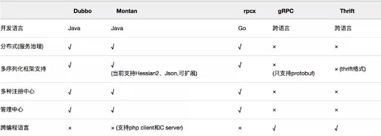
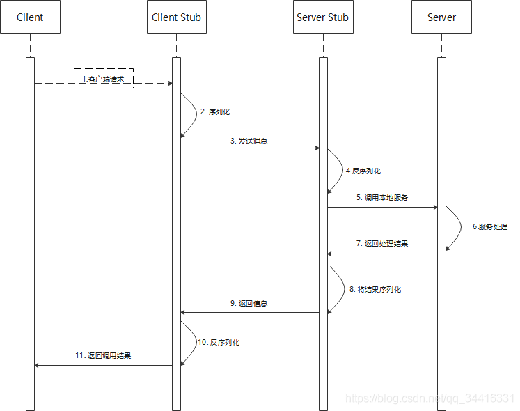
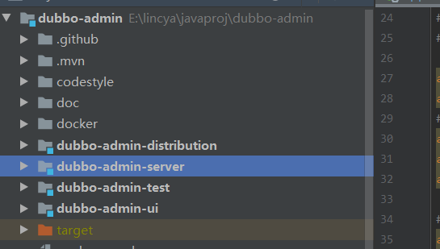
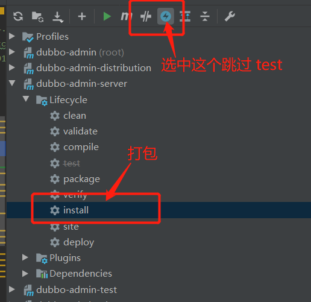
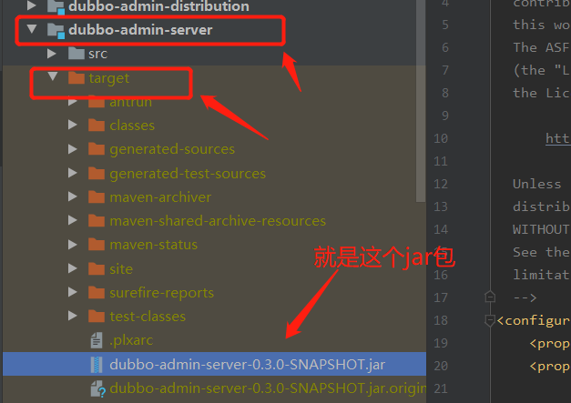

### 分布式和微服务

#### 分布式

分布式是一种==系统部署方式==，即根据实际情况将项目的组件拆分(如数据库一台服务器、java 服务一台服务器等)，部署在不同的机器上。在分布式中，生产环境的服务器必定超过一台


#### 微服务

微服务是一种==架构设计方式==，即将项目根据实际情况拆分成多个微小的服务(如拆分出用户模块、订单模块等)，小到一个服务可能只负责一个单一的功能。这个服务可以单独部署运行，服务间通过 rpc 来互相调用。如用户模块仅负责用户登录和用户操作，订单模块仅负责订单生成和确认


#### 对比

分布式是一种系统的部署方式，只要整个系统中超过一台服务器，就是分布式环境。如集群等

而微服务则是将项目拆分成多个子系统，若一台服务器能够满足需求，就可以用一台服务器跑所有。如果不能，也可以用多台服务器。


### RPC

#### 概念

`RPC(remote procedure call) 即远程过程调用。是指多个服务间，由于无法直接调用到其他服务提供的函数，需要通过网络来表达调用的语义和调用的数据，进而调用到对应服务的提供的方法，并接收到返回的参数`


#### 常见框架

- **RMI：**Java 自带的远程方法调用
- Dubbo：基于 TCP 的远程方法调用
- Hessian：基于 HTTP 的远程方法调用
- OpenFeign：基于 HTTP 的远程方法调用，集成在 SpringCloud 中
- gRpc：谷歌公司开发的远程方法调用，基于 TCP




#### 调用流程

`其实 rpc 的调用过程就是将数据通过序列化和反序列化的方式，在不同服务间进行传输`

- 客户端接收到用于请求后，将数据序列化，通过网络传输发送给对应的服务端
- 服务端接收都网络请求后，读取网络数据并反序列化，得到请求的函数和请求数据
- 服务端调用请求的函数，传入请求的数据，并得到处理结果
- 服务端将处理结果序列化，通过网络传输发送回客户端
- 客户端对响应结果反序列化，得到真正的响应内容




#### 性能

从调用流程可以看出，影响 RPC 框架性能的要素有两个：

- **通信效率：**是否能够快速在不同服务之间建立连接
- **序列化和反序列化效率：**序列化和反序列化机制是否快速


### Dubbo

#### 概念

`Dubbo 是一款基于 java 的高性能 rpc 分布式服务框架，支持多种远程调用模式，内部使用了 Netty 框架，技术文档成熟，且已经经历过市场的检验。`


##### 好处

- 简单易用，上手容易，文档充足
- 支持智能容错和负载均衡
- 服务自动注册和发现
- 支持多种远程调用协议


##### 支持的协议类型

- dubbo://
- rmi://
- http://
- webservice://
- redis://
- memcached://
- thrift://


#### 结构

##### 角色

| 节点      | 角色说明                               |
| --------- | -------------------------------------- |
| Provider  | 暴露服务的服务提供方                   |
| Consumer  | 调用远程服务的服务消费方               |
| Registry  | 服务注册与发现的注册中心               |
| Monitor   | 统计服务的调用次数和调用时间的监控中心 |
| Container | 服务运行容器                           |


###### 流程


- 服务容器(Container) 先将服务提供者(Provider) 启动

- 服务提供者启动时，向注册中心注册自己提供的服务

- 服务消费者(Consumer)在启动时，向注册中心订阅自己所需的服务

- 注册中心会将服务消费者订阅的服务的提供者地址列表返回，若有变更，则注册中心将基于长连接推送(notify)变更内容给消费者

  若消费者没有成功在注册中心订阅到服务提供者，则消费者会不断尝试订阅

- 服务消费者获取到服务提供者的地址列表后，基于软负载均衡算法，选择一台提供者进行调用，若调用失败，则另选一台调用

- 服务消费者和提供者会在内存中累计调用次数和调用消耗的时间，定时每分钟发送一次统计信息到监控中心


#### 特点

- 连通性
  - 注册中心仅负责服务地址的注册和查找，服务者和消费之尽在启动时与注册中心交互，因此注册中心的压力较小
  - 注册中心通过长连接感知服务提供者的存在，当服务提供者宕机后，注册中心将立刻推送通知给消费者
  - 即使注册中心和监控中心都宕机，也不会影响已运行的提供者和消费者，消费者在本地缓存了提供者地址列表
  - 即使没有注册中心和监控中心，服务消费者也可以直连到服务提供者
  - 监控中心是可选的，通过监控中心可以看到各服务的调用次数、消耗时间等，且以报表形式展示
  - 服务消费者、服务提供者每分钟提交一次统计数据给监控中心，使得监控中心的存在不影响整体服务的效率
- 健壮性
  - 监控中心宕机不会影响整体环境使用，只是丢失部分采样数据
  - 若注册中心连接的数据库宕机后，注册中心能仍通过缓存提供服务列表查询，但不能注册新服务
  - 注册中心是对等集群，任意一台宕机后，将自动切换到另一台去
  - 即使注册中心全部宕机，已连接成功的服务消费者和服务提供者仍能通过本地缓存通讯
  - 服务提供者是无状态的，任意一台宕机，会自动切换到另一台去
  - 服务提供者全部宕机后，服务消费者将无法使用，并无限次重连等待提供者恢复
- 伸缩性
  - 注册中心为对等集群，可以动态增加注册中心实例，所有客户端将自动发现新的注册中心
  - 服务提供者是无状态的，可动态增加服务提供者实例，注册中心会将新的服务提供者信息推送给消费者


#### 核心模块

- dubbo:application：应用信息配置
  - name：应用名称，负载均衡等都是通过 name
- dubbo:config-center：配置中心
  - protocol：使用哪个配置中心，如 zk(默认)、redis、nacos
  - address：配置中心地址
- dubbo:consumer：消费者配置
  - timeout：统一的服务调用超时时间，默认 1000
  - retries：调用重试次数，默认 2
  - loadbalance：负载均衡策略(随机/轮询/最少活跃调用)
  - check：启动时检查提供者是否存在
- dubbo:method：方法级控制
  - timeout
  - retries
  - loadbalance
- dubbo:monitor：监控中心
  - protocol：从注册中心发现监控中心地址
  - address：监控中心的服务地址
- dubbo:protocol：服务提供者协议配置
  - name：协议名称
  - port：端口，可以配置 -1 让其自动增长
- dubbo:provider：服务提供者配置
- dubbo:reference(@DubboReference)：消费者引用服务配置
  - mock：服务降级
- dubbo:registry：注册中心配置
  - protocol：注册中心协议
  - address：注册中心地址，逗号分隔
  - client：客户端，zookeeper 使用 curator
  - register：是否注册，若为 false 则只订阅不注册
- dubbo:service（@DubboService)：对外暴露的服务


#### 监控中心安装

##### 下载

```markdown
# 下载
https://github.com/apache/dubbo-admin
# 百度网盘下载
链接：https://pan.baidu.com/s/1tmLezkXaRWpQBTCuCYmGdA 
提取码：zlks 
```

##### 安装

直接用 idea 打开 dubbo-admin



修改 dubbo-admin-server/src/main/resources/application.properties 文件

```markdown
# 配上 dubbo-admin 监控的注册中心地址
admin.registry.address=zookeeper://hw63.gtom.top:2200,hw63.gtom.top:2201,hw234.gtom.top:2200
admin.config-center=zookeeper://hw63.gtom.top:2200,hw63.gtom.top:2201,hw234.gtom.top:2200
admin.metadata-report.address=zookeeper://hw63.gtom.top:2200,hw63.gtom.top:2201,hw234.gtom.top:2200

# 访问 dubbo-amdin 页面时登录的账号密码
admin.root.user.name=root
admin.root.user.password=root
```


使用 cmd 进入控制台，进入到 dubbo-admin 项目的地址，输入下面的内容，用于整体项目构建，包括前端UI

```
mvn clean package  -Dmaven.test.skip=true
```


##### 打包

由于最新版本的 dubbo-admin 默认使用 jar 包安装，只需要 maven install 即可



可以将生成的 jar 包部署的服务器上运行，就可以通过默认的8080端口访问，也可以根据自己的实际情况修改配置文件




### 常见题目

https://blog.csdn.net/moakun/article/details/82919804


