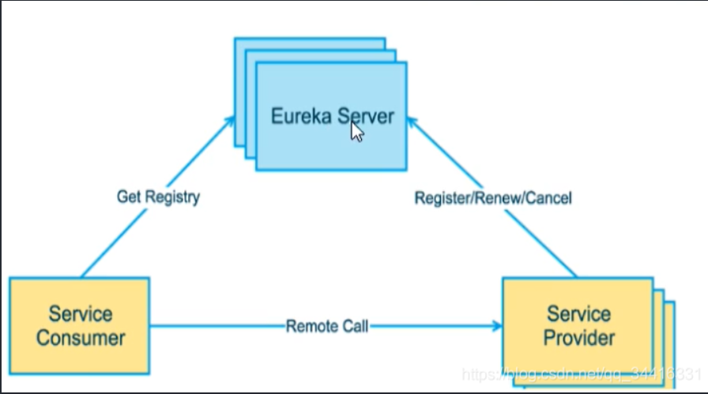
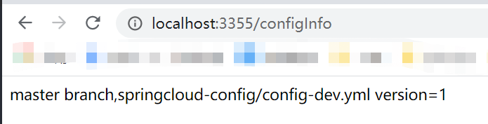
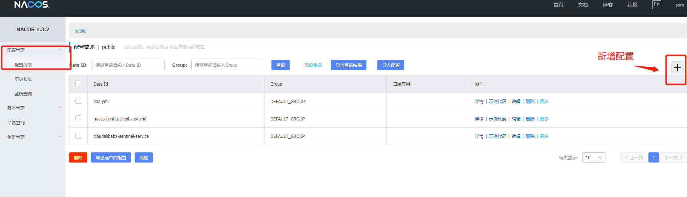

# SpringCloud

## 一、组件篇 Spring Cloud

### 1.1 微服务

#### 定义

微服务是一种架构，根据实际的业务开发出一系列的微小服务，这个微小服务有自己独立的功能和进程，通过暴露 api 实现各个微服务之间的关联。且由于是通过 api 来进行关联的，这些独立的微服务无需部署在同一个环境内。

#### 为什么要用微服务

**单体应用**

```
# 1.优点
-   单一架构模式在项目初期很小的时候开发方便，测试方便，部署方便，运行良好。

# 2.缺点
- 应用随着时间的推进，加入的功能越来越多，最终会变得巨大，一个项目中很有可能数百万行的代码，互相之间繁琐的jar包。
- 久而久之，开发效率低，代码维护困难
- 还有一个如果想整体应用采用新的技术，新的框架或者语言，那是不可能的。
- 任意模块的漏洞或者错误都会影响这个应用，降低系统的可靠性
```

微服务

```
# 1.优点
- 将服务拆分成多个单一职责的小的服务，进行单独部署，服务之间通过网络进行通信
- 每个服务应该有自己单独的管理团队，高度自治
- 服务各自有自己单独的职责，服务之间松耦合，避免因一个模块的问题导致服务崩溃

# 2.缺点
- 开发人员要处理分布式系统的复杂性
- 多服务运维难度，随着服务的增加，运维的压力也在增大
- 服务治理 和 服务监控 关键
```


#### 技术选型

当前主流的技术选型是 Dubbo 和 SpringCloud

**优缺点：**

|          | Dubbo                                                        | SpringCloud                                                  |
| :------- | :----------------------------------------------------------- | :----------------------------------------------------------- |
| 传输效率 | 二进制传输，占用带宽更少，速度更快                           | http 协议传输，占用带宽多，且 http 协议一般使用 json 格式，消耗更大。但可以通过压缩、二进制、高速缓存、分段降级等方法解决 |
| 开发难度 | 开发难度大，由于历史停止维护的原因，存在许多依赖问题还未解决 | 由于与 springboot 是同一个公司的，兼容性更好                 |


### 1.2 SpringCloud 概述

#### 定义

 springcloud是一个含概多个子项目的开发工具集,集合了众多的开源框架,他利用了Spring Boot开发的便利性实现了很多功能,如服务注册,服务注册发现,负载均衡等.SpringCloud在整合过程中主要是针对Netflix(耐非)开源组件的封装.SpringCloud的出现真正的简化了分布式架构的开发。


#### 核心组件


```
# 1.核心组件说明
- eurekaserver(停止维护)、consul(go)、nacos(alibaba)    服务注册中心组件
- rabbion & openfeign           服务负载均衡 和 服务调用组件
- hystrix & hystrix dashboard   服务断路器  和  服务监控组件
- zuul、gateway                 服务网关组件
- config                        统一配置中心组件
- bus                           消息总线组件
```


### 1.3 SpringCloud 父类环境搭建(重要)

#### 1.3.1 版本选择

```
# 1.版本选择官方建议 https://spring.io/projects/spring-cloud
- Angel                                         版本基于springboot1.2.x版本构建与1.3版本不兼容
- Brixton                                       版本基于springboot1.3.x版本构建与1.2版本不兼容
    `2017年Brixton and Angel release官方宣布报废
- Camden                                版本基于springboot1.4.x版本构建并在1.5版本通过测试
    `2018年Camden release官方宣布报废
- Dalston、Edgware                版本基于springboot1.5.x版本构建目前不能再springboot2.0.x版本中使用
    `Dalston(达尔斯顿)将于2018年12月官方宣布报废。Edgware将遵循Spring Boot 1.5.x的生命周期结束。
- Finchley                                  版本基于springboot2.0.x版本进行构建,不能兼容1.x版本
- Greenwich                                 版本基于springboot2.1.x版本进行构建,不能兼容1.x版本
- Hoxton                                        版本基于springboot2.2.x版本进行构建
```


#### 1.3.2 引入依赖

```xml
<?xml version="1.0" encoding="UTF-8"?>
<project xmlns="http://maven.apache.org/POM/4.0.0"
         xmlns:xsi="http://www.w3.org/2001/XMLSchema-instance"
         xsi:schemaLocation="http://maven.apache.org/POM/4.0.0 http://maven.apache.org/xsd/maven-4.0.0.xsd">
    <modelVersion>4.0.0</modelVersion>

    <groupId>com.tom.springcloud</groupId>
    <artifactId>cloud2020</artifactId>
    <version>1.0-SNAPSHOT</version>
    <packaging>pom</packaging>

    <properties>
        <project.build.sourceEncoding>UTF-8</project.build.sourceEncoding>
        <maven.compiler.source>1.8</maven.compiler.source>
        <maven.compiler.target>1.8</maven.compiler.target>
        <spring.boot.version>2.3.7.RELEASE</spring.boot.version>
        <spring.cloud.version>Hoxton.SR9</spring.cloud.version>
        <alibaba.cloud>2.1.0.RELEASE</alibaba.cloud>
        <junit.version>4.12</junit.version>
        <log4j.version>1.2.17</log4j.version>
        <lombok.version>1.16.18</lombok.version>
        <mysql.version>8.0.11</mysql.version>
        <druid.version>1.1.16</druid.version>
        <mybatis.spring.boot.version>2.1.1</mybatis.spring.boot.version>
    </properties>

    <parent>
        <groupId>org.springframework.boot</groupId>
        <artifactId>spring-boot-starter-parent</artifactId>
        <version>2.3.7.RELEASE</version>
    </parent>

    <dependencies>
        <dependency>
            <groupId>org.springframework.boot</groupId>
            <artifactId>spring-boot-starter-web</artifactId>
            <version>${spring.boot.version}</version>
        </dependency>
        <dependency>
            <groupId>org.springframework.boot</groupId>
            <artifactId>spring-boot-starter-actuator</artifactId>
            <version>${spring.boot.version}</version>
        </dependency>
        <dependency>
            <groupId>org.springframework.boot</groupId>
            <artifactId>spring-boot-starter-test</artifactId>
            <version>${spring.boot.version}</version>
            <scope>test</scope>
        </dependency>
    </dependencies>

    <dependencyManagement>
        <dependencies>
            <dependency>
                <groupId>org.springframework.boot</groupId>
                <artifactId>spring-boot-starter-web</artifactId>
                <version>${spring.boot.version}</version>
            </dependency>
            <dependency>
                <groupId>org.springframework.boot</groupId>
                <artifactId>spring-boot-starter-actuator</artifactId>
                <version>${spring.boot.version}</version>
            </dependency>
            <!--jdbc-->
            <dependency>
                <groupId>org.springframework.boot</groupId>
                <artifactId>spring-boot-starter-jdbc</artifactId>
                <version>${spring.boot.version}</version>
            </dependency>
            <dependency>
                <groupId>org.springframework.boot</groupId>
                <artifactId>spring-boot-starter-test</artifactId>
                <version>${spring.boot.version}</version>
                <scope>test</scope>
            </dependency>
            <dependency>
                <groupId>org.springframework.boot</groupId>
                <artifactId>spring-boot-devtools</artifactId>
                <version>${spring.boot.version}</version>
                <scope>runtime</scope>
                <optional>true</optional>
            </dependency>
            <dependency>
                <groupId>mysql</groupId>
                <artifactId>mysql-connector-java</artifactId>
                <version>${mysql.version}</version>
            </dependency>
            <dependency>
                <groupId>com.alibaba</groupId>
                <artifactId>druid</artifactId>
                <version>${druid.version}</version>
            </dependency>
            <dependency>
                <groupId>org.mybatis.spring.boot</groupId>
                <artifactId>mybatis-spring-boot-starter</artifactId>
                <version>${mybatis.spring.boot.version}</version>
            </dependency>

            <dependency>
                <groupId>junit</groupId>
                <artifactId>junit</artifactId>
                <version>${junit.version}</version>
            </dependency>

            <dependency>
                <groupId>log4j</groupId>
                <artifactId>log4j</artifactId>
                <version>${log4j.version}</version>
            </dependency>

            <dependency>
                <groupId>org.projectlombok</groupId>
                <artifactId>lombok</artifactId>
                <version>${lombok.version}</version>
                <optional>true</optional>
            </dependency>


            <dependency>
                <groupId>org.springframework.boot</groupId>
                <artifactId>spring-boot-dependencies</artifactId>
                <version>${spring.boot.version}</version>
                <type>pom</type>
                <scope>import</scope>
            </dependency>
            <dependency>
                <groupId>org.springframework.cloud</groupId>
                <artifactId>spring-cloud-dependencies</artifactId>
                <version>${spring.cloud.version}</version>
                <type>pom</type>
                <scope>import</scope>
            </dependency>
            <dependency>
                <groupId>com.alibaba.cloud</groupId>
                <artifactId>spring-cloud-alibaba-dependencies</artifactId>
                <version>${alibaba.cloud}</version>
                <type>pom</type>
                <scope>import</scope>
            </dependency>
        </dependencies>
    </dependencyManagement>
</project>
```


### 1.4 服务注册中心

#### 什么是服务注册中心

服务注册中心不完成系统的任何业务功能，而是负责整个微服务系统的服务注册和服务发现，以及对服务健康状态的监控和管理


```
# 1.服务注册中心
- 可以对所有的微服务的信息进行存储，如微服务的名称、IP、端口等
- 可以在进行服务调用时通过服务发现查询可用的微服务列表及网络地址进行服务调用
- 可以对所有的微服务进行心跳检测，如发现某实例长时间无法访问，就会从服务注册表移除该实例。
```


#### 常用的注册中心

springcloud支持的多种注册中心Eureka(netflix)、Consul、Zookeeper、以及阿里巴巴推出Nacos组件。这些注册中心在本质上都是用来管理服务的注册和发现以及服务状态的检查的。


#### Eureka

##### 结构

- Eureka Server 组件 :  服务注册中心组件    管理所有服务  支持所有服务注册
- Eureka Client 组件 :   分类服务  商品服务  订单服务(微服务)


##### 注册和发现流程

- 先启动 Eureka 注册中心 EurekaServer
- 其他微服务作为 EurekaClient 连接上 EurekaServer
- EurekaClient 连接上后，会将自身的信息(地址，名称)注册进 EurekaServer(Map<别名，地址>)
- 当一个微服务A需要调用其他服务时，使用要调用的这个服务的别名去注册中心获取实际的 RPC 远程调用地址
- 当微服务A获取到调用地址后，根据获得的地址调用目标服务的接口(底层使用 HttpClient)
- 同时微服务A在获取到服务地址后会缓存在本地jvm内存中，默认每隔30s更新一次服务调用地址




##### 单机版搭建

在父工程中引入依赖

```xml
<parent>
  <groupId>org.springframework.boot</groupId>
  <artifactId>spring-boot-starter-parent</artifactId>
  <version>2.3.7.RELEASE</version>
  <relativePath/>
</parent>
    
<!--定义springcloud使用版本号-->
<properties>
  <java.version>1.8</java.version>
  <spring-cloud.version>Hoxton.SR9</spring-cloud.version>
</properties>
<!--全局管理springcloud版本,并不会引入具体依赖-->
<dependencyManagement>
  <dependencies>
    <dependency>
      <groupId>org.springframework.cloud</groupId>
      <artifactId>spring-cloud-dependencies</artifactId>
      <version>${spring-cloud.version}</version>
      <type>pom</type>
      <scope>import</scope>
    </dependency>
  </dependencies>
</dependencyManagement>
```


###### Eureka Server 搭建

**引入 server 依赖**

```xml
<!--引入 eureka server-->
<dependency>
  <groupId>org.springframework.cloud</groupId>
  <artifactId>spring-cloud-starter-netflix-eureka-server</artifactId>
</dependency>
```

**修改配置文件**

properties 文件

```properties
server.port=7001
spring.application.name=eurekaserver 

# eureka
#指定服务注册中心的地址
eureka.client.service-url.defaultZone=http://localhost:7001/eureka
# 将自己作为一个 client 注册到 server
eureka.client.register-with-eureka=false
# 不要启动时立即注册
eureka.client.fetch-registry=false
```

yml 文件

```properties
eureka:
  instance:
    hostname: localhost
  client:
    # false 即不像注册中心注册自己
    register-with-eureka: false
    # false 表示自己就是注册中心，不用去检索服务
    fetch-registry: false
    service-url:
      # 设置与 eureka server 交互的地址，查询服务和注册服务都需要依赖这个地址
      # 若是单机版，则配置自己的地址
      # 若是集群版，则配置其他 eureka 服务的访问地址
      defaultZone: http://${eureka.instance.hostname}:${server.port}/eureka/
#  server:
#    # 关闭自我保护机制，保证不可用服务被及时剔除
#    enable-self-preservation: false
#    # 设置等待时间，超过等待时间没有收到心跳，则会清除，单位是毫秒
#    eviction-interval-timer-in-ms: 2000
```

**修改启动类**

开启注解  @EnableEurekaServer

```java
@SpringBootApplication
@EnableEurekaServer
public class EurekaServerApplication {
    public static void main(String[] args) {
        SpringApplication.run(EurekaServerApplication.class, args);
    }
}
```


###### Eureka Client 搭建

**引入依赖**

```xml
<!--引入eureka client-->
<dependency>
  <groupId>org.springframework.cloud</groupId>
  <artifactId>spring-cloud-starter-netflix-eureka-client</artifactId>
</dependency>
```

**修改配置文件**

```properties
server.port=8888
spring.application.name=eurekaclient8888

# eureka
#指定服务注册中心的地址
eureka.client.service-url.defaultZone=http://localhost:7001/eureka
```

**修改启动类**

开启注解  @EnableEurekaServer

```java
@SpringBootApplication
@EnableEurekaServer
public class EurekaServerApplication {
    public static void main(String[] args) {
        SpringApplication.run(EurekaServerApplication.class, args);
    }
}
```


###### 测试

访问 eureka 地址端口

http://localhost:7001/


##### 集群版搭建(高可用)

###### 概念

防止注册中心故障导致整个微服务环境不可用，需要给 Eureka 搭建集群来提高可用性，实现负载均衡+故障容错


###### **Eureka Server 搭建**

**修改配置文件**

EurekaServer 7001 

```properties
server:
  port: 7001
eureka:
  instance:
    hostname: eureka7001
  client:
    # false 即不像注册中心注册自己
    register-with-eureka: false
    # false 表示自己就是注册中心，不用去检索服务
    fetch-registry: false
    service-url:
      # 设置与 eureka server 交互的地址，查询服务和注册服务都需要依赖这个地址
      # 若是单机版，则配置自己的地址
      # 若是集群版，则配置其他 eureka 服务的访问地址
      defaultZone: http://eureka7002.com:7002/eureka/
      # 单机
      #      defaultZone: http://localhost:7001/eureka
```

EurekaServer 7002 

```properties
server:
  port: 7002
eureka:
  instance:
    hostname: eureka7002
  client:
    # false 即不像注册中心注册自己
    register-with-eureka: false
    # false 表示自己就是注册中心，不用去检索服务
    fetch-registry: false
    service-url:
      # 设置与 eureka server 交互的地址，查询服务和注册服务都需要依赖这个地址
      # 若是单机版，则配置自己的地址
      # 若是集群版，则配置其他 eureka 服务的访问地址
      defaultZone: http://eureka7001.com:7001/eureka/
      # 单机
      #      defaultZone: http://localhost:7002/eureka
```


###### Eureka Client 连接集群

修改配置文件

```properties
eureka:
  instance:
    # 实例名称
    instance-id: paymeng8001
    # 显示IP地址
    prefer-ip-address: true
  client:
    #表示是否将自己注册进EurekaServer默认为true。
    register-with-eureka: true
    #是否从EurekaServer抓取已有的注册信息，默认为true。单节点无所谓，集群必须设置为true才能配合ribbon使用负载均衡
    fetchRegistry: true
    service-url:
      #集群，将 EurekaServer 集群的节点全部配置上
      defaultZone: http://eureka7001.com:7001/eureka/,http://eureka7002.com:7002/eureka/
```


##### 访问微服务客户端集群

**找到要调用的服务名称**


**修改请求路径**

```java
 public static final String PAYMENT_URL = "http://CLOUD-PAYMENT-SERVICE";
```

使用默认的负载均衡方法

```java
@Bean
@LoadBalanced
public RestTemplate restTemplate() {
   return new RestTemplate();
}
```


##### 服务发现

对于注册进 Eureka 的微服务，可以通过服务发现来发现服务的信息

在启动类上增加 @EnableDiscoveryClient

```java
@SpringBootApplication
@EnableEurekaClient
@EnableDiscoveryClient
public class Order80Application {
    public static void main(String[] args) {
        SpringApplication.run(Order80Application.class, args);
    }

    @Bean
    @LoadBalanced
    public RestTemplate restTemplate() {
        return new RestTemplate();
    }
}
```

调用发现服务

```java
@Resource
private DiscoveryClient discoveryClient;

@GetMapping("/discovery")
public Object discovery() {
    List<String> services = discoveryClient.getServices();
    for(String service : services) {
        log.info(" service : "+ service);
        List<ServiceInstance> instances = discoveryClient.getInstances(service);
        for (ServiceInstance instance : instances) {
            log.info(instance.getServiceId() + "\t" + instance.getHost() + "\t" + instance.getPort() + "\t" + instance.getUri());
        }
    }
    return this.discoveryClient;
}
```


##### eureka自我保护机制

**概念**

```
保护模式即某时刻某一个微服务不可用了，Eureka 不会立刻清理，依旧会保存该微服务的信息
```

**作用**

```
防止 EurekaClient 是正常运行，但与 EurekaServer 网络不通，EurekaServer 不会立刻将 EurekaClient 剔除。
```

一旦进入保护模式，Eureka Server 会尝试保护服务注册表中的信息，不再删除服务注册表中的数据，即不会注销任何服务

**关闭(生产环境不建议关闭保护模式)**

```properties
eureka:
  ......
  server:
    # 关闭自我保护机制，保证不可用服务被及时剔除
    enable-self-preservation: false
    # 设置等待时间，超过等待时间没有收到心跳，则会清除
    eviction-interval-timer-in-ms: 2000
```


#### Zookeeper

Zookeeper 的节点注册是临时性的，一定时间内没有收到心跳包就会被剔除

##### 服务端搭建

引入依赖

```xml
<!--    zookeeper 客户端    -->
<dependency>
    <groupId>org.springframework.cloud</groupId>
    <artifactId>spring-cloud-starter-zookeeper-discovery</artifactId>
</dependency>
```

修改启动类

```java
@SpringBootApplication
@EnableDiscoveryClient
@MapperScan("com.tom.mapper")
public class ZKPayment18003Application {
    public static void main(String[] args) {
        SpringApplication.run(ZKPayment18003Application.class, args);
    }
}
```

修改配置文件

```properties
spring:
  application:
    name: cloud-payment-service
  ...
  cloud:
    zookeeper:
      connect-string: www.xxx.top:2181
```


##### 客户端注册

修改配置文件

```properties
server:
  port: 81

spring:
  application:
    name: cloud-consumer-order-zk
  cloud:
    zookeeper:
      connect-string: www.gtom.top:2181
```

修改启动类

```java
@SpringBootApplication
@EnableDiscoveryClient
public class ZKOrderApplication {
    public static void main(String[] args) {
        SpringApplication.run(ZKOrderApplication.class, args);
    }
}
```

controller 调用其他微服务

```java
@RestController
public class OrderZKController {

    public static final String INVOKE_URL= "http://cloud-payment-zookeeper";

    @Resource
    private RestTemplate restTemplate;

    @GetMapping("/consumer/pay/zk")
    public String paymentInfo() {
        String result = restTemplate.getForObject(INVOKE_URL+"/payment/zk", String.class);
        return result;
    }
}
```


#### Consul

##### 中文文档地址

https://www.springcloud.cc/spring-cloud-consul.html

##### 概念

```
Consul 是一套开源的分布式服务发现和配置管理系统，提供了服务治理、配置中心、控制总线等功能，且每个功能都可以单独使用。
```

**Consul 有许多优点**

- 基于 raft 协议，比较简洁
- 支持健康检查
- 支持 Http 协议 dns 协议
- 支持跨数据中心的 WAN 集群
- 提供图形界面
- 跨平台，支持 WIndows、Mac、Linux


**特点**：

**● 服务发现(Service Discovery)**

Consul 允许通过 dns 或 http 接口的方式来注册服务和发现服务，一些外部的服务能够通过 Consul 很容易找到注册了的服务

**● 健康检查(Health Checking)**

Consul 的 Client 可以提供任意数量的健康检查，可以与特定的服务或是本地节点相关联并查看状态，操作员可以通过这些来监视集群的健康状况，服务发现组件可以使用这些信息将不健康的主机路由出去

**● KV存储**

提供了易用的键值存储，结合其他工具可以实现动态配置、功能标记、Leader 选举等

**● 安全服务通信**

Consul 可以为服务生成和分发 TLS 证书，以建立相互的 TSL 连接。意图是用于定义允许那些服务通信，服务分割可以很容易地进行管理，目的是可以实时更改，而不是使用复杂的网络拓扑和静态防火墙规则

**● 多数据中心**

Consul 支持开箱即用的多数据中心


##### 下载和打开

###### Windows 环境下载

**官网下载：**

https://www.consul.io/downloads

**百度网盘下载：**

链接：https://pan.baidu.com/s/1cRepVYayhhlg8ZpMFGMHHw  提取码：wvyh 


下载成功后解压，得到：


在这个目录打开命令行窗口，输入

```
consul agent -dev
```

访问：

http://localhost:8500


##### 单机版搭建

**引入依赖**

```xml
<!--    consul 客户端    -->
<dependency>
    <groupId>org.springframework.cloud</groupId>
    <artifactId>spring-cloud-starter-consul-discovery</artifactId>
</dependency>
```

**修改启动类**

```java
@SpringBootApplication
@EnableDiscoveryClient
@MapperScan("com.tom")
public class ConsulPaymentApplication8004 {
    public static void main(String[] args) {
        SpringApplication.run(ConsulPaymentApplication8004.class, args);
    }
}
```

**修改配置文件**

```properties
server:
  port: 18004

spring:
  application:
    name: cloud-payment-service-consul

  ### consul
  cloud:
    consul:
      host: localhost
      port: 8500
      discovery:
        service-name: ${spring.application.name}
```

**调用**

```java
@RestController
public class OrderController {

    public static final String INVOKE_URL= "http://cloud-payment-service-consul";

    @Resource
    private RestTemplate restTemplate;

    @GetMapping("/consumer/pay/consul")
    public String paymentInfo() {
        String result = restTemplate.getForObject(INVOKE_URL+"/payment/consul", String.class);
        return result;
    }
}
```


#### CAP 理论

**C:** Consistency 强一致性 必须让数据必须一致，放弃 C 的情况如点赞数等

**A:** Availability 系统可用性

**P:** Partition tolerance 分区容错性 

AC: 单点

**CP:** 强调必须保证一致性，若服务出现故障，就会拒接请求，但这时候就违背了系统可用性

**AP：**强调系统的高可用性，即允许数据不是强一致的，而是通过其他方式保证数据的最终一致性


#### 三个注册中心的异同

https://blog.csdn.net/zzaric/article/details/102184865

| **组件名**    | **语言** | **CAP** | **服务健康检查** | **对外暴露接口** | **Spring Cloud 集成** |
| ------------- | -------- | ------- | ---------------- | ---------------- | --------------------- |
| **Eureka**    | Java     | AP      | 可配置支持       | HTTP             | 已集成                |
| **Zookeeper** | Java     | CP      | 支持             | 客户端           | 已集成                |
| **Consul**    | Go       | CP      | 支持             | HTTP/DNS         | 已集成                |
| Nacos         |          | AP、CP  |                  |                  | 已集成                |


### 1.5 Ribbon 负载均衡

#### 文档地址

https://github.com/Netflix/ribbon


#### 相关介绍

##### 概念

**负载均衡**

```
负载均衡(LB)就是将用户的请求平摊地分配到多个服务上，从而达到服务的高可用
```

**ribbon**

```
Ribbon 是用于实现负载均衡和服务调用的组件，支持配置多种负载均衡算法(如简单轮询、随机连接等)和自定义算法
```


##### 工作流程

先选择 EurekaServer，优先选择在同一个区域内负载较少的 server

根据用户指定的负载均衡策略，在从 server 渠道的服务注册列表中选择一个地址进行请求


##### Ribbon本地负载均衡和Nginx服务端负载均衡的区别

- Nginx 是服务器负载均衡(集中式LB)，客户端所有请求都会交给 Nginx，然后由 Nginx 实现转发请求
- Ribbon 是本地负载均衡(进程内LB)，在调用微服务接口的时候，会在注册中心上获取微服务列表之后缓存到 本地 jvm 中，从而实现本地 RPC 远程服务调用技术。集成于消费方进程，消费方通过它来获取到服务提供方的地址。
- Nginx 只作为一个转发者，无法细致到某个具体的服务。可以被认为是最外层的负载均衡
- Ribbon 可以细致到具体的某个服务，是在请求通过 Nginx 后到达服务时，进行的负载均衡


#### 负载算法

##### 自带的负载均衡算法

| **类名**                  | **策略**       | **描述**                                                     |
| :------------------------ | :------------- | :----------------------------------------------------------- |
| **RoundRobinRule**        | 轮询(默认)     | 逐一选择地址列表中的路径进行请求                             |
| RandomRule                | 随机           | 从地址列表中随机选择一个路径进行请求                         |
| RetryRule                 | 轮询+重试      | 先采用轮询策略获取服务，若请求失败则会在指定时间内重试       |
| WeightedResponseTimeRule  | 权重           | 对轮询策略的扩展，响应速度越快的实例选择权重越大，越容易被选择到 |
| BestAvailableRule         | 最可用         | 先过滤掉由于多次访问故障而处于断路器跳闸状态的服务，然后选择一个并发量最小的服务 |
| AvailabilityFilteringRule | 选择并发量最小 | 先过滤掉故障实例，再选择并发量较小的实例                     |
| ZoneAvoidanceRule         | 默认规则       | 复合判断 server 所在区域的性能和 server 的可用性选择服务器   |


##### 轮询负载均衡算法的原理

`轮询负载均衡算法： rest接口是第几次请求 % 该服务集群总数 = 实际调用服务器位置下标`

每次重启服务器后 rest 接口计数都重新从 1 开始


##### 替换负载均衡算法

```
注意：不能与启动类在一个包下(即不能放在 @ComponentScan 所在的包和子包下，@SpringbootApplication 里面包含了 @ComponentScan)，否则会被所有的 Ribbon 客户端共享
```

**新建算法配置类**

```java
@Configuration
public class MySelfRule {

    @Bean
    public IRule myRule() {
        return new RandomRule(); // 随机
    }
}
```


**修改启动类**

```java
@SpringBootApplication
@EnableEurekaClient
@EnableDiscoveryClient
@RibbonClient(name = "CLOUD-PAYMENT-SERVICE", configuration = MySelfRule.class) // 指定对应服务使用的负载均衡算法
public class Order80Application {
    public static void main(String[] args) {
        SpringApplication.run(Order80Application.class, args);
    }

    @Bean
    @LoadBalanced
    public RestTemplate restTemplate() {
        return new RestTemplate();
    }
}
```


##### 自定义负载均衡算法

###### 定义自己的算法 

先去掉引用的 @LoadBalanced，重写一个继承 ILoadBalanced 接口


修改 MyLB.java

```java
@Component
public class MyLB implements MyLoadBalancer {

    private AtomicInteger automicInteger = new AtomicInteger(0);

    // 通过自旋锁获取当前访问次数
    public final int getAndIncrement() {
        int current;
        int next;
        do {
            current = this.automicInteger.get();
            // 2147483647 即 Integer.MAX
            next = current >= 2147483647 ? 0 : current + 1;
        } while (!this.automicInteger.compareAndSet(current, next));
//        System.out.println("*** 访问次数 = " + next);
        return next;
    }

    @Override
    public ServiceInstance instances(List<ServiceInstance> serviceInstances) {
        // 通过取模方式决定使用哪一个服务节点
        int index = getAndIncrement() % serviceInstances.size();
        return serviceInstances.get(index);
    }
}
```


###### 使用自定义算法

```java
@GetMapping("/consumer/payment/lb")
public String getPaymentLB() {
    List<ServiceInstance> instances = discoveryClient.getInstances("CLOUD-PAYMENT-SERVICE");
    if (instances == null || instances.size() == 0) {
        return null;
    }

    ServiceInstance serviceInstance = myLB.instances(instances);
    URI uri = serviceInstance.getUri();
    return restTemplate.getForObject(uri + "/payment/lb", String.class);
}
```


### 1.6 OpenFeign 远程调用

#### 概述

`OpenFeign 是一个服务接口绑定器，通过定义一个服务接口，然后在上面添加注解实现服务之间的调用。可以与 Eureka 和 Ribbon(OpenFeign 已内置) 组合使用以支持负载均衡。`

openFeigh 是在 Feign 的基础上增加了对 SpringMVC 注解的支持


#### 使用

**引入依赖**

```xml
<!--    eureka 客户端    -->
<dependency>
    <groupId>org.springframework.cloud</groupId>
    <artifactId>spring-cloud-starter-netflix-eureka-client</artifactId>
</dependency>
<!--    openfeign    -->
<dependency>
    <groupId>org.springframework.cloud</groupId>
    <artifactId>spring-cloud-starter-openfeign</artifactId>
</dependency>
```


**修改启动类  **

增加 @EnableFeignClients 注解

```java
@SpringBootApplication
@EnableFeignClients
public class Order83FeignApplication {
    public static void main(String[] args) {
        SpringApplication.run(Order83FeignApplication.class, args);
    }
}
```


**增加 feign 文件夹**


**编写 Feign**

- 需要指定要调用的那个微服务名称
- 方法名称不一样，但是参数，响应以及请求路径必须一致

```java
@Component
@FeignClient(value = "CLOUD-PAYMENT-SERVICE")
public interface IPaymentFeign {

    @GetMapping("/payment/find/{id}")
    CommonResult findById(@PathVariable("id") Long id);
}
```


**在 controller 中使用**

```java
@RestController
public class OrderController {

    @Resource
    private IPaymentFeign paymentFeign;

    @GetMapping("/consumer/payment/get/{id}")
    public CommonResult<Payment> getPaymentById(@PathVariable("id") Long id) {
        return paymentFeign.findById(id);
    }
}
```


#### 修改 Feign 的超时时间

默认 Feign 的等待时间为 1 秒钟

```properties
server:
  port: 9004
spring:
  application:
    name: cloud-consumer-order-feign
eureka:
  client:
    register-with-eureka: false
    service-url:
      # 设置与 eureka server 交互的地址，查询服务和注册服务都需要依赖这个地址
      defaultZone: http://eureka7001.com:7001/eureka,http://eureka7002.com:7002/eureka,http://eureka7003.com:7003/eureka
ribbon:
  # 建立连接所用的时间，适用于网络状况正常的情况下，两端连接所用的时间
  ConnectTimeout: 5000
  # 建建连接后，从服务器读取到可用资源所用的时间
  ReadTimeout: 5000
```


#### 日志级别

可以通过调整日志级别查看 Feign 的调用情况

**增加配置类 FeignConfig.java**


```java
@Configuration
public class FeignConfig {
    @Bean
    Logger.Level feignLoggerLevel() {
        return Logger.Level.FULL;
    }
}
```

**修改配合文件**

```properties
logging:
  level:
    com.tom.order80.feign.IPaymentFeign: debug
```

**可以在控制台看到**


### 1.7 Hystrix 断路器

#### 概述

##### 断路器

`断路器本身是一种开关，当某个服务单元发生故障后，通过断路器的故障监控，可以向调用方返回一个预定的、可处理的响应，而不是长时间等待或抛出调用者无法处理的异常`

`断路器避免了服务调用方的线程不会被长时间占用，从而避免故障在分布式系统中的蔓延，甚至引起服务雪崩`


##### **Hystrix**

`Hystrix 是一个用于处理分布式系统的延迟和容错的开源库，它能够保证在一个依赖调用出问题的情况下，不会导致整体服务失败，避免级联故障，以提高分布式的弹性`

`Hystrix 的主要作用是服务降级、服务熔断、服务限流以及接近实时的监控`


#### 服务降级

##### 定义

`服务降级即当服务出现故障时，至少有一个保底的处理方案，如给客户端返回友好提示(如系统繁忙，请稍后再试等)等`

**发生服务降级的情况：**

- 程序运行异常
- 超时
- 服务熔断触发服务降级
- 线程池/信号量打满


##### 服务端降级配置

修改启动类，增加 @EnableCircuitBreaker

```java
@SpringBootApplication
@EnableEurekaClient
@EnableDiscoveryClient
@EnableCircuitBreaker
@MapperScan("com.tom.mapper")
public class PaymentHystrixApplication18006 {
    public static void main(String[] args) {
        SpringApplication.run(PaymentHystrixApplication18006.class, args);
    }
}
```

修改提供方的 service 类

```java
// 代码内延时5秒，而设置超时3秒就返回备选处理方案
// 只要是代码出现异常，都会触发服务降级的代码
@HystrixCommand(fallbackMethod = "paymentInfo_TimeOutHandler", commandProperties = {
        @HystrixProperty(name="execution.isolation.thread.timeoutInMilliseconds", value="3000")
})
@Override
public String paymentInfo_TimeOut(Integer id) {
    int age = 10/0;
    int timeNumber = 5;
    try {
        TimeUnit.SECONDS.sleep(timeNumber);
    } catch (InterruptedException e) {
        e.printStackTrace();
    }
    return "线程池： " + Thread.currentThread().getName() + "   paymentInfo_TimeOut, id:" + id + "  OK!";
}

public String paymentInfo_TimeOutHandler(Integer id) {
    return "线程池： " + Thread.currentThread().getName() + "  系统繁忙或运行报错，请稍后再试, id:" + id + "  超时!";
}
```


##### 客户端降级配置(常用)

修改 Controller 中的调用方法

```java
@HystrixCommand(fallbackMethod = "paymentInfo_TimeOutHandler", commandProperties = {
        @HystrixProperty(name="execution.isolation.thread.timeoutInMilliseconds", value="8000")
})
@GetMapping("/consumer/payment/hystrix/timeout/{id}")
public String paymentInfo_TimeOut(@PathVariable("id") Integer id){
    String result = paymentFeign.paymentInfo_TimeOut(id);
    return result;
}

public String paymentInfo_TimeOutHandler(Integer id) {
    return "消费者，对方支付系统繁忙请稍后再试";
}
```


**修改启动类，增加 @EnableHystrix 注解**

```java
@SpringBootApplication
@EnableFeignClients
@EnableDiscoveryClient
@EnableHystrix
public class HystrixOrder84Application {

    public static void main(String[] args) {
        SpringApplication.run(HystrixOrder84Application.class, args);
    }
}
```


**修改配置文件**

`注意：打开这个会导致 ribbion 设置的超时时间失效`

需要同时修改 feign 和 hystrix 的超时时间，hystrix 的超时时间最好大于等于 feign 的连接时间+请求时间

在调用时发现触发了降级，需要判断是 feign 超时还是 hystrix 超时了

```properties
feign:
  hystrix:
    enabled: true #默认为false，如果为false,则使用ribbon的超时设置和重试机制，否则使用feign的相关设置
  client:
    config:
      default:
        #连接到目标的时间，此处会收到注册中心启动中的影响。设置为3秒钟，如果注册中心有明显的不在线，基本是毫秒级熔断拒绝
        connectTimeout: 2000
        #获取目标连接后执行的最长时间，设置为32秒，即服务最长时
        readTimeout: 8000

ribbon:
  # 建立连接所用的时间，适用于网络状况正常的情况下，两端连接所用的时间
  ConnectTimeout: 8000
  # 建建连接后，从服务器读取到可用资源所用的时间
  ReadTimeout: 8000

hystrix:
  command:
    default:
      execution:
        isolation:
          thread:
            timeoutInMilliseconds: 10000
```


##### 全局降级

在控制类上增加 @DefaultProperties 来指定全局降级的回调方法

在要降级的方法上增加 @HystrixCommand 实现全局降级，没有添加 @HystrixCommand 的方法不会触发降级

需要特殊定义降级方法的接口，需要 @HystrixCommand(fallbackMethod="xxxx"xxxx)

```java
@RestController
@Slf4j
@DefaultProperties(defaultFallback = "global_PaymentInfo_TimeOutHandler")
public class OrderController {

    @Resource
    private PaymentFeign paymentFeign;

    // 指定了自己的降级方法
    @HystrixCommand(fallbackMethod = "paymentInfo_TimeOutHandler", commandProperties = {
            @HystrixProperty(name="execution.isolation.thread.timeoutInMilliseconds", value="8000")
    })
    @GetMapping("/consumer/payment/hystrix/timeout/{id}")
    public String paymentInfo_TimeOut(@PathVariable("id") Integer id){
        String result = paymentFeign.paymentInfo_TimeOut(id);
        return result;
    }

    // 没有指定 fallbackMethod， 使用全局降级
    @HystrixCommand
    @GetMapping("/consumer/payment/hystrix/global/timeout/{id}")
    public String glolbal_paymentInfo_TimeOut(@PathVariable("id") Integer id){
        String result = paymentFeign.paymentInfo_TimeOut(id);
        return result;
    }

    // 自定义 fallback
    public String paymentInfo_TimeOutHandler(Integer id) {
        return "消费者，对方支付系统繁忙请稍后再试";
    }

    // 全局 fallback
    public String global_PaymentInfo_TimeOutHandler() {
        return "Global全局异常处理，请稍后再试";
    }
}
```


##### 给 Feign 配降级处理

通过给 Feign 匹配上对应的降级处理类，根据各个方法做降级处理。

但这种配置方法会导致 @Hystrix 的配置失效

修改 Feign 接口

```java
@Component
@FeignClient(value = "CLOUD-PAYMENT-SERVICE-HYSTRIX", fallback = PaymentFeignFallback.class)
public interface PaymentFeign {
    @GetMapping("/payment/hystrix/ok/{id}")
    public String paymentInfo_OK(@PathVariable("id") Integer id);

    @GetMapping("/payment/hystrix/timeout/{id}")
    public String paymentInfo_TimeOut(@PathVariable("id") Integer id);
}
```

```java
@Component
public class PaymentFeignFallback implements PaymentFeign{
    @Override
    public String paymentInfo_OK(Integer id) {
        return "PaymentFeignFallback paymentInfo_OK";
    }

    @Override
    public String paymentInfo_TimeOut(Integer id) {
        return "PaymentFeignFallback paymentInfo_TimeOut";
    }
}
```


#### 服务熔断

##### 熔断器概念

`服务熔断是指当访问量和访问情况达到设定峰值时，会打开断路器，直接拒绝访问并使用服务降级的方式返回结果给访问者。`

`同时会在服务恢复正常后关闭断路器，恢复链路的正常调用`


##### **熔断器状态**

- **关闭**

  此时请求正常到达服务，但失败的请求会调用服务降级方法处理

- **打开**

  此时请求直接被转发到服务降级方法，不会调用到服务

- **半开**

  在熔断器打开一定时间(默认5s)后，会变为半开状态，接收一个请求，若请求成功，则关闭熔断器，若失败，则打开熔断器，进入下一个循环


##### 熔断流程讲解

###### 整体流程


###### 参数介绍

**快照时间窗**

`一段固定的时间，默认为10秒，决定熔断器收集请求的时间`

熔断器是否打开，是根据在一端固定时间内统计请求数据计算获得的。而这个固定的时间成为**快照时间窗**


**请求总数阈值**

`在快照时间窗内，请求数量必须超过请求总数阈值，才可能触发熔断器的`

若快照时间窗内的请求数量没有超过请求总数阈值，即使这些请求全部都是失败的，熔断器也不会打开


**错误百分比阈值**

即当在快照时间窗内，错误请求数/请求总数 超过错误百分比阈值，且满足请求总数阈值，则会打开熔断器，使用服务降级


**休息时间窗**

`一段固定的时间，默认为5秒，用于决定熔断器打开的时间`

当熔断器打开后，就进入了休息时间窗，在休息时间窗内所有的请求直接调用降级方法，当休息时间窗结束，熔断器进入半开状态


###### 详细介绍

> 熔断器关闭时

请求正常达到服务，若请求失败，则会调用服务降级方法。同时无论请求成功还是失败，都会被熔断器记录，计算是否要打开熔断器。


> 熔断器是否打开的计算方式

打开熔断器需要同时满足的条件

- 请求数量超过请求总数阈值
- 失败率超过错误百分比阈值

在快照时间窗内，即使时间未到达，只要满足上面两个条件，马上打开熔断器，并进入休息时间窗


> 熔断器关闭时

访问的请求直接使用降级方法返回，不会到达服务


> 打开的熔断器如何再关闭

在一段时间后(默认是 5s)，熔断器会处于半开状态，会获取一个请求转发到目标服务，

若请求成功，则关闭熔断器，让服务正常使用

若请求失败，则继续打开熔断器，直至下一个循环


###### 官网流程图


##### 示例代码

```java
// =========== 服务熔断
@HystrixCommand(fallbackMethod = "paymentCircuitBreaker_fallback", commandProperties = {
        @HystrixProperty(name = "circuitBreaker.enabled", value = "true"), // 是否开启断路器
        @HystrixProperty(name = "circuitBreaker.requestVolumeThreshold", value = "10"), // 请求次数
        @HystrixProperty(name = "circuitBreaker.sleepWindowInMilliseconds", value = "10000"),  // 时间窗口期
        @HystrixProperty(name = "circuitBreaker.errorThresholdPercentage", value = "60") // 失败率达到多少后跳闸
})
@Override
public String paymentCircuitBreaker(@PathVariable("id") Integer id) {
    log.info("啊进入了");
    if (id < 0) {
        throw new RuntimeException("***** id 不能是负数");
    }
    String serialNumber = IdUtil.simpleUUID();

    return Thread.currentThread().getName() + "\t" + "调用成功 流水号:" + serialNumber;
}

public String paymentCircuitBreaker_fallback(@PathVariable("id") Integer id) {
    return "服务出问题了,请稍后再试 id = " + id;
}
```


##### 配置列表

```java
import com.netflix.hystrix.contrib.javanica.annotation.HystrixCommand;
import com.netflix.hystrix.contrib.javanica.annotation.HystrixProperty;

public class AllHystrixCommand {
    @HystrixCommand(fallbackMethod = "str. fallbackMethod",
            groupKey = "strGroupCommand",
            commandKey = "strCommarld",
            threadPoolKey = "strThreadPool",
            commandProperties = {
                    //没置隔离策略，THREAD 表示线程池SEMAPHORE:信号他隔离
                    @HystrixProperty(name = "execution.isolation.strategy", value = "THREAD"),
                    
                    //当隔离策略选择信号池隔离的时候，用来没置信号池的大小(最大并发数)
                    @HystrixProperty(name = "execution.isolation.semaphore.maxConcurrentRequests", value = "10"),
                    
                	//配置命令执行的超时时间
                    @HystrixProperty(name = "execution.isolation.thread.timeoutinMilliseconds", value = "10"),

                    //是否启用超时时间
                    @HystrixProperty(name = "execution.timeout.enabled", value = "true"),

                    //执行超时的时候是否中断
                    @HystrixProperty(name = "execution.isolation.thread.interruptOnTimeout", value = "true"),

                    //执行被取消的时候是否中断
                    @HystrixProperty(name = "execution.isolation.thread.interruptOnCancel", value = "true"),

                    //允许回调方法执行的最大并发数
                    @HystrixProperty(name = "fallback.isolation.semaphore.maxConcurrentRequests", value = "10"),

                    //服务降級是否启用，是否执行回调函数
                    @HystrixProperty(name = "fallback.enabled", value = "true"),
                    @HystrixProperty(name = " circuitBreaker.enabled", value = "true"),

                    //该属性用来没置在燎动时间窗中，断路器熔断的最小请求数。例如，默认该值为20的时候,
                    //如果滚动时间窗(默以10秒)内仅收到了19个请求，即使这19个请求都失败了， 断路器也不会打开。
                    @HystrixProperty(name = " circuitBreaker.requestVolumeThreshold", value = "20"),

                    //该属性用来没置在燎动时间窗中，表示在熔动时间窗中，在请求数量超过
                    // circuitBreaker. requestVolumeThreshold的情况下，如果错误请求数的百分比超过50,
                    //就把断路器没置为”打开”状态，否则就设置为"关闭”状态。
                    @HystrixProperty(name = "circuitBreaker.errorThresholdPercentage", value = "50"),

                    //该属性用来没置当断路器打开之后的休眠时间窗。休眠时间窗结束之后,
                    //会将断路器置为"半开”状态，尝试熔断的请求命令，如果依然失败就将断路器继续设置为”打开”状态,
                    //如果成功就没置为"关闭”状态。
                    @HystrixProperty(name = "circuitBreaker.sleepWindowinMilliseconds", value = "5000"),

                    //断路器强制打开
                    @HystrixProperty(name = " circuitBreaker.forceOpen", value = "false"),

                    //断路器强制关闭
                    @HystrixProperty(name = " circuitBreaker.forceClosed", value = "false"),

                    //滚动时间窗没置，该时间用 于断路器判断健康度时需要收集信息的持续时间
                    @HystrixProperty(name = "metrics.rollingStats.timeinMilliseconds", value = "10000"),

                    //该属性用来没置滚动时间窗统计指标信息时划分”桶"的数量，断路器在收集指标信息的时候会根据
                    //设置的时间窗长度拆分成多个"桶"来累计各度量值，每个”桶"记录了-段时间内 的采集指标。
                    //比如10秒内拆分成10个"桶"收集这样，所以timeinMilliseconds 必须能被numBuckets 整除。否则会抛异常@HystrixProperty(name = "metrics .rollingStats . numBuckets", value = "10"),
                    //熔动时间窗没置，该时间用于断路器判断健康度时需要收集信息的持续时间
                    @HystrixProperty(name = "metrics.rollingStats.timeinMilliseconds", value = "1000"),

                    //该属性用来没置熔动时间窗统计指标信息时划分”桶"的数量，断路器在收集指标信息的时候会根据
                    //设置的时间窗长度拆分成多个"桶”来累计各度量值，每个”桶" 记录了- -段时间内的来集指标。
                    //比如10秒内拆分成10个"桶”收集这样，所以timeinMilliseconds 必须能被numBuckets 整除。否则会抛异常
                    @HystrixProperty(name = "metrics.rollingStats.numBuckets", value = "10"),

                    //该属性用来没置对命令执行的延迟是否使用百分位数来跟踪和计算。如果没置为false,那么所有的概要统计都将返回-1。
                    @HystrixProperty(name = "metrics.rollingPercentile.enabled", value = "false"),

                    //该属性用来没置百分位统计的滚动窗口的持续时间，单位为亳秒。
                    @HystrixProperty(name = "metrics.rollingPercentile.timeInMilliseconds", value = "60000"),

                    //该属性用来没置百分位统计滚动窗口中使用“桶
                    @HystrixProperty(name = "metrics.rollingPercentile.numBuckets", value = "60000"),

                    //该属性用来设置在执行过程中每个 “桶” 中保留的最大执行次数。如果在炫动时间窗内发生超过该没定值的执行次数，
                    //就从最初的位置开始重写。例如，将该值设置为100,熔动窗口为10秒，若在10秒内一个“桶 ” 中发生了500次执行,
                    //那么该“桶”中只保留最后的100次执行的统计。另外，增加该值的大小将会增加内存量的消耗，并增加排序百分位数所需的计算时间。@HystrixProperty(name = "metrics . rollingPercentile. bucketSize", value = "100"),
                    //该属性用来没置采集影响断路器状态的健康快照(请求的成功、错误百分比) 的间隔等待时间。
                    @HystrixProperty(name = "metrics.healthSnapshot.intervalinMilliseconds", value = "500"),

                    //是否开启请求缓存
                    @HystrixProperty(name = "requestCache.enabled", value = "true"),

                    //HystrixProperty的执行和时间是否打印日志到HystrixRequestLog中
                    @HystrixProperty(name = "requestLog.enabled", value = "true"),

                    @HystrixProperty(name = "metrics.rollingPercentile.bucketSize", value = "10"),

                    //该属性用来汝置采集影响断路器状态的健康快照(请求的成功、错误百分 比)的间隔等待时间。
                    @HystrixProperty(name = "metrics.healthSnapshot.intervalinMilliseconds", value = "500"),

                    //是否开启请求缓存
                    @HystrixProperty(name = "requestCache.enabled", value = "true"),

                    // HystrixCommand的执 行和事件是否打印日志到HystrixRequestLog中
                    @HystrixProperty(name = "requestLog.enabled", value = "true"),

            },
            threadPoolProperties = {
                    //该参数用来没置执行命令线程池的核心线程数，该值 也就是命令执行的最大并发量
                    @HystrixProperty(name = "coreSize", value = "10"),

                    //该参数用来没置线程池的最大队列大小。当设置为-1时，线程池将使用SynchronousQueue实现的队列,
                    //否则将使用LinkedBlockingQueue 实现的队列。
                    @HystrixProperty(name = "maxQueueSize", value = "-1"),

                    //该参数用来为队列设置拒绝阙值。通过该参数，即使队列没 有达到最大值也能拒绝请求。
                    //该参数主要是对LinkedBlockingQueue队列的补充,因为LinkedBlockingQueue
                    //队列不能动态修改它的对象大小，而通过该属性就可以凋整拒绝请求的队列大小了。
                    @HystrixProperty(name = "queueSizeRejectionThreshold", value = "5"),
            })
    public String All() {
        return "tom";
    }
}
```


#### 服务雪崩

`服务雪崩即当一个服务异常时，会导致调用它的服务长时间等待，随着调用方服务越来越多的线程在等待，就会占用更多的系统资源，`

`影响到整条调用链上的服务，引起系统崩溃`

在复杂的分布式体系结构中，应用程序间可能有数十个依赖，每个依赖在某些时候都有可能会失败

多个微服务之间调用的时候，如服务A调用服务B和服务C，服务B和服务C又调用了其他服务，这就称为“扇出”。

若扇出的链路上某个微服务的调用响应时间过长或不可用，则对服务A的调用就会占用越来越多的系统资源，从而引起系统崩溃。

**可能造成的影响有：**

- 服务之间的延迟增加
- 备份队列、线程和其他系统资源紧张
- 导致系统发生更多级联故障

故需要对故障和延迟进行隔离和管理，使得单个依赖关系的失败，不会对系统有巨大的影响


#### 服务限流

`限制通过的请求，一定时间内仅允许指定数量的请求通过，待处理的请求可能等待或是拒绝`


#### Hystrix Dashboard 可视化搭建

##### 环境搭建

###### 引入依赖

```xml
<dependencies>
    <dependency>
        <groupId>org.springframework.cloud</groupId>
        <artifactId>spring-cloud-starter-netflix-hystrix-dashboard</artifactId>
    </dependency>
    <!--    hystrix 客户端    -->
    <dependency>
        <groupId>org.springframework.cloud</groupId>
        <artifactId>spring-cloud-starter-netflix-hystrix</artifactId>
    </dependency>
    <dependency>
        <groupId>org.springframework.boot</groupId>
        <artifactId>spring-boot-starter-web</artifactId>
    </dependency>
    <dependency>
        <groupId>org.springframework.boot</groupId>
        <artifactId>spring-boot-starter-actuator</artifactId>
    </dependency>

    <!--热部署-->
    <dependency>
        <groupId>org.springframework.boot</groupId>
        <artifactId>spring-boot-devtools</artifactId>
    </dependency>
</dependencies>
```


###### 修改启动类，增加 @EnableHystrixDashboard 注解

```java
@SpringBootApplication
@EnableEurekaClient
@EnableDiscoveryClient
@EnableCircuitBreaker
@EnableHystrixDashboard
@MapperScan("com.tom.mapper")
public class PaymentHystrixApplication18006 {
    public static void main(String[] args) {
        SpringApplication.run(PaymentHystrixApplication18006.class, args);
    }
}
```


###### 修改配置类

在仪表盘项目的启动界面上看到这个提示


修改配置类

```properties
server:
  port: 9001
hystrix:
  dashboard:
    proxy-stream-allow-list: "*"
```


###### 对被监控的服务项目配置

由于使用的是 SpringBoot 2.x 以上，故要修改启动类

`注意：@EnableDiscoveryClient、@EnableCircuitBreaker、getServlet方法 这三个必须添加上`

```java
@SpringBootApplication
@EnableEurekaClient
@EnableDiscoveryClient
@EnableCircuitBreaker
public class PaymentHystrixApplication18006 {
    public static void main(String[] args) {
        SpringApplication.run(PaymentHystrixApplication18006.class, args);
    }

    @Bean
    public ServletRegistrationBean getServlet() {
        HystrixMetricsStreamServlet streamServlet = new HystrixMetricsStreamServlet();
        ServletRegistrationBean registrationBean = new ServletRegistrationBean(streamServlet);
        registrationBean.setLoadOnStartup(1);
        registrationBean.addUrlMappings("/hystrix.stream");
        registrationBean.setName("HystrixMetricsStreamServlet");
        return registrationBean;
    }
}
```


##### 访问

访问监控页面：http://localhost:9001/hystrix


输入对应参数：http://localhost:18006/hystrix.stream


##### 监控参数


##### 集群版配置

https://www.cnblogs.com/hellxz/p/9100224.html#%E4%BA%94%E3%80%81%E4%B8%8E%E6%B6%88%E6%81%AF%E4%BB%A3%E7%90%86%E7%BB%93%E5%90%88


#### 服务熔断和服务降级的关系

`服务熔断可以看成是一个转发器，根据配置和请求情况，决定将请求转发到目标服务，还是转发到配置好的服务降级方法。二者是完全不同的。`


### 1.8 Gateway 网关

https://docs.spring.io/spring-cloud-gateway/docs/2.2.6.RELEASE/reference/html/

#### 概述

##### 定义

`Gateway 使用的 Webflux 中的 reactor-netty 响应式编程组件，底层使用了Netty框架`


##### Zuul 和 GateWay 对比

Spring Cloud Gateway 可以看做是一个 Zuul 1.x 的升级版和代替品，比 Zuul 2 更早的使用 Netty 实现异步 IO，从而实现了一个简单、比 Zuul 1.x 更高效的、与 Spring Cloud 紧密配合的 API 网关。
Spring Cloud Gateway 里明确的区分了 Router 和 Filter，并且一个很大的特点是内置了非常多的开箱即用功能，并且都可以通过 SpringBoot 配置或者手工编码链式调用来使用。
比如内置了 10 种 Router，使得我们可以直接配置一下就可以随心所欲的根据 Header、或者 Path、或者 Host、或者 Query 来做路由。
比如区分了一般的 Filter 和全局 Filter，内置了 20 种 Filter 和 9 种全局 Filter，也都可以直接用。当然自定义 Filter 也非常方便。


##### 作用


##### 架构图


#### 核心概念

网关其实就是： `路由转发+执行过滤链`

##### Route 路由

`路由是构建网关的基本模块，由ID、目标URI，一系列断言和过滤器组成若断言为true则匹配该路由`


##### Predicate 断言

`路由转发的判断条件`

即对 Http 请求中的所有内容(header、body)进行匹配，若请求与断言相匹配则转发到路由


##### Filter 过滤

`Gateway 支持对请求在被转发到路由前以及转发到路由后进行修改`

Filter 仅包含 pre(之前) 和 post(之后)。

- pre 处理中，可以对请求做参数校验、权限校验、流量监控、日志输出、协议转换等
- post 处理中，可以对请求的响应头、响应体进行修改，还可以实现日志输出、流量监控等


##### 整体流程


- 客户端向 Gateway 发起请求，而后在 Gateway Handler Mapping 中找到与请求相匹配的路径，在将其转发到对应的 Gateway Web Handler
- Handler 接收到情趣后，通过指定的过滤器链将请求发送到实际的服务模块，并返回结果


#### 使用

**引入依赖**

```xml
<dependencies>
    <dependency>
        <groupId>org.springframework.boot</groupId>
        <artifactId>spring-boot-starter-actuator</artifactId>
    </dependency>
    <!--热部署-->
    <dependency>
        <groupId>org.springframework.boot</groupId>
        <artifactId>spring-boot-devtools</artifactId>
    </dependency>
    <dependency>
        <groupId>org.projectlombok</groupId>
        <artifactId>lombok</artifactId>
    </dependency>
    <dependency>
        <groupId>org.springframework.boot</groupId>
        <artifactId>spring-boot-starter-test</artifactId>
    </dependency>
    <!--引入 eureka client-->
    <dependency>
        <groupId>org.springframework.cloud</groupId>
        <artifactId>spring-cloud-starter-netflix-eureka-client</artifactId>
    </dependency>
    <dependency>
        <groupId>org.springframework.cloud</groupId>
        <artifactId>spring-cloud-starter-gateway</artifactId>
    </dependency>
</dependencies>
```


**修改配置文件，增加路由，并连接到 eureka 注册中心**

```properties
server:
  port: 9527

spring:
  application:
    name: cloud-gateway-service
  cloud:
    gateway:
      discovery:
        locator:
          enabled: true # 开启从注册中心动态创建路由的功能，利用微服务名进行路由
      routes:
        - id: payment_routh             # 路由的ID，没有固定规则但要求唯一，建议配合服务名
#          uri: http://localhost:18001    # 匹配后提供服务的路由地址
          uri: lb://CLOUD-PAYMENT-SERVICE    # 匹配后提供服务的路由地址
          predicates:
            - Path=/payment/find/**,/payment/add      # 断言，路径相匹配的进行路由

        - id: payment_routh2             # 路由的ID，没有固定规则但要求唯一，建议配合服务名
#          uri: http://localhost:18001    # 匹配后提供服务的路由地址
          uri: lb://CLOUD-PAYMENT-SERVICE    # 匹配后提供服务的路由地址
          predicates:
            - Path=/payment/lb/**      # 断言，路径相匹配的进行路由

eureka:
  instance:
    # 修改实例名称
    instance-id: cloud-gateway-service
    # 显示IP地址
    prefer-ip-address: true
  client:
    #表示是否将自己注册进EurekaServer默认为true。
    register-with-eureka: true
    #是否从EurekaServer抓取已有的注册信息，默认为true。单节点无所谓，集群必须设置为true才能配合ribbon使用负载均衡
    fetchRegistry: true
    service-url:
      #集群
      defaultZone: http://eureka7001.com:7001/eureka/,http://eureka7002.com:7002/eureka/
```


**测试**

http://localhost:9527/payment/lb


#### 自定义过滤器

```java
/**
 * 日志过滤器
 */
@Component
@Slf4j
public class LogGatewayFilter implements GlobalFilter, Ordered {
    // 过滤器顺序，越小越前面
    @Override
    public int getOrder() {
        return 0;
    }

    @Override
    public Mono<Void> filter(ServerWebExchange exchange, GatewayFilterChain chain) {
        log.info("********** come in LogGatewayFilter:  " + new Date(   ));
        String uname = exchange.getRequest().getQueryParams().getFirst("uname");
        if (uname == null) {
            log.info("********** user name is null");
            exchange.getResponse().setStatusCode(HttpStatus.NOT_ACCEPTABLE);
            return exchange.getResponse().setComplete();
        }

        return chain.filter(exchange);
    }
}
```


### 1.9 Config 分布式配置中心

#### 概念

##### 统一配置中心

`统一配置中心顾名思义,就是将配置统一管理,配置统一管理的好处是在日后大规模集群部署服务应用时相同的服务配置一致,日后再修改配置只需要统一修改全部同步,不需要一个一个服务手动维护`


##### Spring Cloud Config

`Spring Cloud Config 项目是一个解决分布式系统的配置管理方案。为微服务框架中的微服务提供集中式的外部配置支持，配置服务器为不同微服务应用的所有环境提供了中心化的外部配置`

`它包含了Client和Server两个部分，server提供配置文件的存储、以接口的形式将配置文件的内容提供出去，client通过接口获取数据、并依据此数据初始化自己的应用。`


##### 作用

- 集中管理配置文件
- 不同环境不同配置，动态化的配置更新，可以区分 dev/test/prod/beta/release 等环境
- 运行期间动态调整配置，不再需要每个服务部署的机器上编写配置文件，服务会向配置中心统一拉取自己的配置信息
- 当配置发生变动时，服务不需要重启即可感知到配置的变化并应用
- 将配置信息以 REST 接口的形式暴露


##### 业务流程图


##### 获取访问形式

可以通过官网给出的五种格式访问 git 上对应的配置文件


**推荐第三个**

http://config-3344.com:3344/master/config-dev.yml

- label: 分支名称
- application: 项目名称
-  profile: 分类 ，如dev/test/prod等


#### 配置和使用

##### ConfigServer 配置

###### 先搭建 git 仓库，并放入文件，获取到 git 仓库的地址


###### 引入依赖

```xml
<dependency>
    <groupId>org.springframework.cloud</groupId>
    <artifactId>spring-cloud-config-server</artifactId>
</dependency>
<dependency>
    <groupId>org.springframework.cloud</groupId>
    <artifactId>spring-cloud-starter-netflix-eureka-client</artifactId>
</dependency>
<dependency>
    <groupId>org.springframework.boot</groupId>
    <artifactId>spring-boot-starter-web</artifactId>
</dependency>
<dependency>
    <groupId>org.springframework.boot</groupId>
    <artifactId>spring-boot-starter-actuator</artifactId>
</dependency>
<!--热部署-->
<dependency>
    <groupId>org.springframework.boot</groupId>
    <artifactId>spring-boot-devtools</artifactId>
</dependency>
```


###### 增加配置文件

```properties
server:
  port: 3344

spring:
  application:
    name: cloud-config-server
  cloud:
    config:
      server:
        git:
          uri: https://gitee.com/xxxxx/spring-cloud-conifg.git
          #### 搜索目录
          search-paths:
            SpringCloudConifg
      #### 读取分支
      label: master

eureka:
  instance:
    # 修改实例名称
    instance-id: cloud-config-server3344
    # 显示IP地址
    prefer-ip-address: true
  client:
    #表示是否将自己注册进EurekaServer默认为true。
    register-with-eureka: true
    #是否从EurekaServer抓取已有的注册信息，默认为true。单节点无所谓，集群必须设置为true才能配合ribbon使用负载均衡
    fetchRegistry: true
    service-url:
      #集群
      defaultZone: http://eureka7001.com:7001/eureka/,http://eureka7002.com:7002/eureka/
```


###### 修改启动类

```java
@SpringBootApplication
@EnableConfigServer
@EnableEurekaClient
public class ConfigCenterApplication3344 {
    public static void main(String[] args) {
        SpringApplication.run(ConfigCenterApplication3344.class, args);
    }
}
```


###### 测试

{uri}/{label}/{对应的文件}

http://config-3344.com:3344/master/config-dev.yml


##### ConfigClient 配置

###### 引入依赖

```xml
<dependency>
    <groupId>org.springframework.cloud</groupId>
    <artifactId>spring-cloud-config-client</artifactId>
</dependency>
<dependency>
    <groupId>org.springframework.cloud</groupId>
    <artifactId>spring-cloud-starter-netflix-eureka-client</artifactId>
</dependency>
<dependency>
    <groupId>org.springframework.boot</groupId>
    <artifactId>spring-boot-starter-web</artifactId>
</dependency>
<dependency>
    <groupId>org.springframework.boot</groupId>
    <artifactId>spring-boot-starter-actuator</artifactId>
</dependency>
<!--热部署-->
<dependency>
    <groupId>org.springframework.boot</groupId>
    <artifactId>spring-boot-devtools</artifactId>
</dependency>
```


###### 增加配置文件 bootstrap.yml

bootstrap.yml 的优先级高于 application.yml

```properties
server:
  port: 3355

spring:
  application:
    name: cloud-config-client
  cloud:
    config:
      # 整合起来就是： {uri}/{label}/{name}-{profile}.yml
      # http://config-3344.com:3344/master/config-test.yml
      uri: http://config-3344.com:3344 # 配置中心地址
      label: master
      name: config # 配置文件的名称
      profile: dev # 配置文件的后缀名

eureka:
  instance:
    # 修改实例名称
    instance-id: cloud-config-server3355
    # 显示IP地址
    prefer-ip-address: true
  client:
    #表示是否将自己注册进EurekaServer默认为true。
    register-with-eureka: true
    #是否从EurekaServer抓取已有的注册信息，默认为true。单节点无所谓，集群必须设置为true才能配合ribbon使用负载均衡
    fetchRegistry: true
    service-url:
      #集群
      defaultZone: http://eureka7001.com:7001/eureka/,http://eureka7002.com:7002/eureka/

management:
  endpoints:
    web:
      exposure:
        include: "*"	
```


###### 修改启动类

```java
@EnableEurekaClient
@EnableDiscoveryClient
@SpringBootApplication
public class ConfigCenterApplication3355 {

    public static void main(String[] args) {
        SpringApplication.run(ConfigCenterApplication3355.class, args);
    }
}
```


###### 增加 controller

```java
@RestController
public class ConfigController {

    @Value("${config.info}")
    private String configInfo;

    @GetMapping("/configInfo")
    public String getConfigInfo() {
        return configInfo;
    }
}
```


###### 测试

http://localhost:3355/configInfo




##### Config 动态刷新

如何在不重启服务的情况下，动态刷新配置信息？

**修改配置文件**

```properties
management:
  endpoints:
    web:
      exposure:
        include: "*"
```


**在 controller 上增加 @RefreshScope**

```java
@RefreshScope
@RestController
public class ConfigController {

    @Value("${config.info}")
    private String configInfo;

    @GetMapping("/configInfo")
    public String getConfigInfo() {
        return configInfo;
    }
}
```


当修改了 git 上的配置，需要对对应的客户端端口发送 post 请求

```markdown
curl -X POST "http://localhost:3355/actuator/refresh"
```


### 2.0 Bus 消息总线

#### 概念

##### 定义

`实际是通过消息中间件，将分布式系统的节点与消息系统链接的框架一般用于全局通知刷新配置信息，通常与配置中心结合使用，避免每次更新配置都要使用 post 方法通知一台台机器更新配置`

当前支持 RabbitMQ 和 Kafka


**总线：**

`在微服务框架中，通常使用轻量级的消息代理来构建一个共用的消息主题，并让所有微服务实例都连接上来。由于这个主题中产生的消息会被所有实例监听和消费，故称它为消息总线。`

在消息总线上的各个实例，都可以方便地广播一些需要让其他连接在该主题上的实例都知道的消息


##### 基本原理

ConfigClient 实例全都监听 MQ 中的同一个 topic(默认为 SpringCloudBus)，当配置中心刷新数据时，会将这个信息放入 Topic 中，这样其他监听了这个 Topic 的实例就都能得到通知，从而自动去更新配置信息


##### 作用

能够管理和传播分布式系统间的消息：

- 广播状态的更改
- 事件推送
- 微服务间的通信


##### 结构图

通过通知配置服务中心，通过消息订阅的方式，通过消息总线让对应的模块重新刷新配置


##### 流程图


#### 代码样例

添加 rabbitmq 和 bus 的依赖

```xml
<dependency>
    <groupId>org.springframework.cloud</groupId>
    <artifactId>spring-cloud-starter-bus-amqp</artifactId>
</dependency>
```


##### **服务端配置**

修改配置文件，增加 rabbitmq 相关配置

```properties
server:
  port: 3344

spring:
  application:
    name: cloud-config-server
  cloud:
    config:
      server:
        git:
          uri: https://gitee.com/lincyatom/spring-cloud-conifg.git
          #### 搜索目录
          search-paths:
            SpringCloudConifg
      #### 读取分支
      label: master
  # rabbitmq 相关配置
  rabbitmq:
    host: www.gtom.top
    port: 5672
    username: guest
    password: guest

# rabbitmq 相关配置,暴露bus刷新配置的接口
management:
  endpoints: #暴露bus刷新配置的断点
    web:
      exposure:
        include: "bus-refresh"

eureka:
  instance:
    # 修改实例名称
    instance-id: cloud-config-server3344
    # 显示IP地址
    prefer-ip-address: true
  client:
    #表示是否将自己注册进EurekaServer默认为true。
    register-with-eureka: true
    #是否从EurekaServer抓取已有的注册信息，默认为true。单节点无所谓，集群必须设置为true才能配合ribbon使用负载均衡
    fetchRegistry: true
    service-url:
      #集群
      defaultZone: http://eureka7001.com:7001/eureka/,http://eureka7002.com:7002/eureka/
```


##### **客户端配置**

```yml
server:
  port: 3355

spring:
  application:
    name: cloud-config-client
  cloud:
    config:
      # 整合起来就是： {uri}/{label}/{name}-{profile}.yml
      # http://config-3344.com:3344/master/config-test.yml
      uri: http://config-3344.com:3344 # 配置中心地址
      label: master
      name: config # 配置文件的名称
      profile: dev # 配置文件的后缀名
  rabbitmq:
    host: www.xxx.top
    port: 5672
    username: guest
    password: guest
    
management:
  endpoints:
    web:
      exposure:
        include: "*"
        
eureka:
  instance:
    # 修改实例名称
    instance-id: cloud-config-server3355
    # 显示IP地址
    prefer-ip-address: true
  client:
    #表示是否将自己注册进EurekaServer默认为true。
    register-with-eureka: true
    #是否从EurekaServer抓取已有的注册信息，默认为true。单节点无所谓，集群必须设置为true才能配合ribbon使用负载均衡
    fetchRegistry: true
    service-url:
      #集群
      defaultZone: http://eureka7001.com:7001/eureka/,http://eureka7002.com:7002/eureka/
```


##### **全局通知命令**

直接发送给 Config Server，会发现所有 Config Client 也被刷新了

```
curl -X POST "http://localhost:3344/actuator/bus-refresh"
```


##### 定点通知命令

通过通知 Config Server，继而通知指定的节点更新配置

```properties
模板
curl -X POST "http://localhost:3344/actuator/bus-refresh/{spring.application.name}:{server.port}"

# 示例
curl -X POST "http://localhost:3344/actuator/bus-refresh/cloud-config-client:3366"
```


### 2.1 Stream 消息驱动

#### 概念

##### 中文指导手册

http://m.wang1314.com/doc/webapp/topic/20971999.html


##### 定义

`屏蔽底层消息中间件的差异，降低切换成本，统一消息的编程模型`

注意：当前仅支持 RabbitMQ 和 Kafka


##### 作用

当微服务架构中同时存在多种消息队列，在不同的消息队列间发布/订阅消息，会导致维护难度提升和开发的提升。Stream 能够让开发者忽略这些消息中间件的差异。


##### 关键对象

- **Binder**

  统一的对外暴露对象，通过这个来屏蔽MQ间的差异

- **Channel**

  消息存储和转发的媒介，可以通过 Channel 对队列进行配置

- **Source 和 Sink**

  Source 对应输出，Sink 对应输入


#### 原理

通过定义绑定器作为中国渐层，实现应用程序和消息中间件细节之间的隔离

通过向程序暴露统一的 Channel 通道，使得应用程序不需要再考虑不同的消息中间件实现


#### 代码示例

##### 添加依赖

```xml
<dependencies>
    <dependency>
        <groupId>org.springframework.cloud</groupId>
        <artifactId>spring-cloud-starter-stream-rabbit</artifactId>
    </dependency>
    <dependency>
        <groupId>org.springframework.cloud</groupId>
        <artifactId>spring-cloud-starter-netflix-eureka-client</artifactId>
    </dependency>
    <dependency>
        <groupId>org.springframework.boot</groupId>
        <artifactId>spring-boot-starter-web</artifactId>
    </dependency>
    <dependency>
        <groupId>org.springframework.boot</groupId>
        <artifactId>spring-boot-starter-actuator</artifactId>
    </dependency>
    <!--热部署-->
    <dependency>
        <groupId>org.springframework.boot</groupId>
        <artifactId>spring-boot-devtools</artifactId>
    </dependency>
    <!--lombok-->
    <dependency>
        <groupId>org.projectlombok</groupId>
        <artifactId>lombok</artifactId>
    </dependency>
</dependencies>
```


##### 提供者代码

修改配置文件

```properties
server:
  port: 8801

spring:
  application:
    name: cloud-stream-rabbot-provider
  cloud:
    stream:
      binders: #在此处配置要绑定的rabbitmq的服务信息
        defaultRabbit: #标识定义的名称，用于binding整合
          type: rabbit #消息组件类型
          environment: #设置rabbitmq的相关配置
            spring:
              rabbitmq:
                host: www.xxx.top
                port: 5672
                username: tom
                password: 111111
      bindings: # 服务的整合处理
        output: # 名字是一个通道的名称
          destination: MyStreamExchange # 表示要使用的Exchange名称定义
          content-type: application/json # 设置消息类型，本次为json,文本则设置"text/plain"
          binder: defaultRabbit #设置要绑定的消息服务的具体设置
eureka:
  instance:
    # 修改实例名称
    instance-id: cloud-stream-rabbot-provider8801
    # 显示IP地址
    prefer-ip-address: true
  client:
    #表示是否将自己注册进EurekaServer默认为true。
    register-with-eureka: true
    #是否从EurekaServer抓取已有的注册信息，默认为true。单节点无所谓，集群必须设置为true才能配合ribbon使用负载均衡
    fetchRegistry: true
    service-url:
      #集群
      defaultZone: http://eureka7001.com:7001/eureka/,http://eureka7002.com:7002/eureka/
```

增加启动类

```java
@SpringBootApplication
@EnableEurekaClient
public class StreamRabbitApplication8801 {
    public static void main(String[] args) {
        SpringApplication.run(StreamRabbitApplication8801.class, args);
    }
}
```

增加消息提供服务

```java
public interface IMessageProvider {
    String send();
}
```

使用 @EnableBinding 指定为输出

```java
@EnableBinding(Source.class) // 定义消息的推送管道
@Slf4j
public class MessageProviderImpl implements IMessageProvider {

    @Resource
    private MessageChannel output; // 消息发送管道

    @Override
    public String send() {

        String serial = UUID.randomUUID().toString() + "  **** tom";
        output.send(MessageBuilder.withPayload(serial).build());
        log.info("********* serial = " + serial);
        return null;
    }
}
```

测试

```java
@RestController
public class SendMessageController {
    @Resource
    private IMessageProvider messageProvider;

    @GetMapping("/sendMessage")
    public String sendMessage() {
        return messageProvider.send();
    }
}
```

http://localhost:8801/sendMessage


##### 消费者代码

修改配置文件，将提供者的 output 改为 input

```properties
server:
  port: 8803

spring:
  application:
    name: cloud-stream-rabbot-consumer
  cloud:
    stream:
      binders: #在此处配置要绑定的rabbitmq的服务信息
        defaultRabbit: #标识定义的名称，用于binding整合
          type: rabbit #消息组件类型
          environment: #设置rabbitmq的相关配置
            spring:
              rabbitmq:
                host: www.gtom.top
                port: 5672
                username: tom
                password: 111111
      bindings: # 服务的整合处理
        input: # 名字是一个通道的名称
          destination: MyStreamExchange # 表示要使用的Exchange名称定义
          content-type: application/json # 设置消息类型，本次为json,文本则设置"text/plain"
          binder: defaultRabbit #设置要绑定的消息服务的具体设置
eureka:
  instance:
    # 修改实例名称
    instance-id: cloud-stream-rabbot-consumer8803
    # 显示IP地址
    prefer-ip-address: true
  client:
    #表示是否将自己注册进EurekaServer默认为true。
    register-with-eureka: true
    #是否从EurekaServer抓取已有的注册信息，默认为true。单节点无所谓，集群必须设置为true才能配合ribbon使用负载均衡
    fetchRegistry: true
    service-url:
      #集群
      defaultZone: http://eureka7001.com:7001/eureka/,http://eureka7002.com:7002/eureka/
```

增加启动类

```java
@SpringBootApplication
@EnableEurekaClient
public class StreamRabbitApplication8803 {
    public static void main(String[] args) {
        SpringApplication.run(StreamRabbitApplication8803.class, args);
    }
}
```

增加消息获取类

```java
@Slf4j
@Component
@EnableBinding(Sink.class)
public class ReceiveMessageListenerController {

    @Value("${server.port}")
    private String serverPort;

    /**
     * StreamListener 注解, 监听队列, 用于消费者队列的消息接收
     *
     * @param message
     */
    @StreamListener(Sink.INPUT)
    public void input(Message<String> message) {
        log.info("消费者2号 ------> 接收到的消息：[{}]; port:[{}]", message.getPayload(), serverPort);
    }
}
```


##### 服务集群下，保证消息只消费一次

相同的微服务应用赢放置于同一个 group 中，以此来保证消息只被这个服务集群消费一次。

内部是使用轮询方式接收

**修改配置文件如下：**

在 bindings 下增加 group 属性，指定消费者分组

```properties
server:
  port: 8803

spring:
  application:
    name: cloud-stream-rabbot-consumer
  cloud:
    stream:
      binders: #在此处配置要绑定的rabbitmq的服务信息
        defaultRabbit: #标识定义的名称，用于binding整合
          type: rabbit #消息组件类型
          environment: #设置rabbitmq的相关配置
            spring:
              rabbitmq:
                host: www.gtom.top
                port: 5672
                username: tom
                password: 111111
      bindings: # 服务的整合处理
        input: # 名字是一个通道的名称
          destination: MyStreamExchange # 表示要使用的Exchange名称定义
          content-type: application/json # 设置消息类型，本次为json,文本则设置"text/plain"
          binder: defaultRabbit #设置要绑定的消息服务的具体设置
          group: MyStreamA

eureka:
  instance:
    # 修改实例名称
    instance-id: cloud-stream-rabbot-consumer8803
    # 显示IP地址
    prefer-ip-address: true
  client:
    #表示是否将自己注册进EurekaServer默认为true。
    register-with-eureka: true
    #是否从EurekaServer抓取已有的注册信息，默认为true。单节点无所谓，集群必须设置为true才能配合ribbon使用负载均衡
    fetchRegistry: true
    service-url:
      #集群
      defaultZone: http://eureka7001.com:7001/eureka/,http://eureka7002.com:7002/eureka/
```


##### 消息持久化

添加了 group 属性后，若服务关闭/重启时有新的这个 group 的消息，在服务开启后能够拉取到这些消息


### 2.2 Sleuth 分布式请求链路跟踪

#### 概念

##### 定义

在复杂的微服务架构系统中，几乎每一个前端请求都会形成一个复杂的分布式服务调用链路，在每条链路中任何一个依赖服务出现延迟超时或者错误都有可能引起整个请求最后的失败。

`微服务跟踪其实是一个工具，它能够在分布式系统中跟踪一个用户请求的过程，通过捕获这些跟踪数据，就能够构建微服务的整个调用链的视图。同时还可以进行性能分析和数据分析，优化链路`


##### 作用

- 提供链路追踪

  可以清楚地看出一个请求经过了哪些服务，可以方便地理清服务间的调用关系

- 性能分析

  Sleuth 可以查看每个请求的耗时，从而分析出哪些服务请求较为耗时，从而调整配置参数，避免高峰时出现问题

- 数据分析

- 可视化

  结合 zipkpin ，可以实现数据的可视化


#### 环境搭建

##### 下载 Zipkpin

**官网下载**

https://dl.bintray.com/openzipkin/maven/io/zipkin/java/zipkin-server/

**百度网盘**

链接：https://pan.baidu.com/s/1K3_fLdv36KRTZhEYCt9sMA 
提取码：0l47 


**查看**

使用 java -jar 运行 jar 包

访问：http://localhost:9411/zipkin/


##### 代码修改

引入依赖

```xml
<dependency>
    <groupId>org.springframework.cloud</groupId>
    <artifactId>spring-cloud-starter-zipkin</artifactId>
</dependency>
```

修改配置文件，涉及的相关服务都要加上

```properties
spring:
  application:
    name: cloud-payment-service
  zipkin:
    base-url: http://localhost:9411
    sleuth:
      sampler:
        probability: 1  #采样率值介于0-1之间,1标识全部采集。一般0.5即可
```


## 二、组件篇 Alibaba

### 2.1 相关介绍

**介绍文档**

https://github.com/alibaba/spring-cloud-alibaba

https://github.com/alibaba/spring-cloud-alibaba/blob/master/README-zh.md

**参考文档**

https://github.com/alibaba/spring-cloud-alibaba/blob/master/spring-cloud-alibaba-docs/src/main/asciidoc-zh/spring-cloud-alibaba.adoc


#### 概念

`Spring Cloud Alibaba 是由阿里开发的一套为分布式应用开发和部署的一站式解决方案，包含了分布式应用所需的组件，只需要添加一些注释和少量配置即可将Spring Cloud应用程序连接到Alibaba的分布式解决方案，并使用Alibaba中间件构建分布式应用程序系统。`


#### 相关组件

**开源组件**

- Nacos： 服务注册和配置中心 (Eureka + Config + Bus)

  一个更易于构建云原生应用的动态服务发现、配置管理和服务管理平台。

- Sentinel：熔断和限流 (Hystrix)

  把流量作为切入点，从流量控制、熔断降级、系统负载保护等多个维度保护服务的稳定性

- RocketMQ：消息驱动 (Stream)

  开源的分布式消息系统，基于高可用分布式集群技术，提供低延时的、高可靠的消息发布与订阅服务

- Dubbo：服务间通信 (OpenFeign)

  在国内应用非常广泛的一款高性能 Java RPC 框架

- Seata：分布式事务处理

  阿里巴巴开源产品，一个易于使用的高性能微服务分布式事务解决方案

- Arthas：JVM 调优

  开源的Java动态追踪工具，基于字节码增强技术，功能非常强大

**商业化组件**

- Alibaba Cloud ACM：一款在分布式架构环境中对应用配置进行集中管理和推送的应用配置中心产品

- Alibaba Cloud OSS：阿里云对象存储服务（Object Storage Service，简称 OSS），是阿里云提供的云存储服务

- Alibaba Cloud SchedulerX：阿里中间件团队开发的一款分布式任务调度产品，提供秒级、精准的定时（基于 Cron 表达式）任务调度服务


#### 架构图


### 2.2 父类环境搭建

```xml
<properties>
    <alibaba.cloud>2.2.3.RELEASE</alibaba.cloud>
</properties>

<dependencyManagement>
      <dependency>
            <groupId>com.alibaba.cloud</groupId>
            <artifactId>spring-cloud-alibaba-dependencies</artifactId>
            <version>${alibaba.cloud}</version>
            <type>pom</type>
            <scope>import</scope>
        </dependency>
    </dependencies>
</dependencyManagement>
```


### 2.3 Nacos 服务注册和配置中心

**官网**

https://nacos.io/en-us/

**参考文档**

https://nacos.io/zh-cn/docs/architecture.html


#### 基本概念

##### 定义

`注册中心+配置中心的组合，提供动态服务发现、服务管理和配置管理的一站式平台。`


#### CAP

##### 服务中心对比

Nacos 可以在 AP 模式和 CP 模式之间切换


##### 如何选择AP模式还是CP模式

###### AP 模式

- **描述**

  为了增加可用性，我们一般选用 AP 模式

  AP 模式为了服务的可用性减弱了一致性，当不需要要求强一致性的业务，且服务实例是通过 nacos-client 注册的，可以保持心跳上报，就可以选择 AP 模式

- **实例类型**

  临时实例

- **主流搭配**

  Spring cloud、Dubbo


###### CP 模式

- **描述**

  若需要有编辑、存储配置等要求强一致性的业务时，必须选择 CP 模式

- **实例类型**

  持久化实例

- **主流搭配**

  K8S服务、DNS服务


##### 如何切换模式

```properties
curl -X PUT '$NACOS_SERVER:8848/nacos/v1/ns/operator/switches?entry=serverMode&value=CP'
```


#### 环境搭建

##### 下载 Nacos

**官网下载**

https://github.com/alibaba/nacos/releases/tag/1.4.0

**百度网盘下载**

链接：https://pan.baidu.com/s/1vf7jBU6xPS43TYVQDQpWfA 
提取码：tefj 


##### **打开并访问**

由于 nacos 默认是集群模式的，打开会报 tomcat 启动错误，故修改 startup.cmd 模式为 standalone 单机模式

```properties
#set MODE="cluster"
set MODE="standalone"
```

**访问：**

http://localhost:8848/nacos

账号密码都是 nacos


#### 服务注册

引入依赖

```xml
<dependencies>
    <!--  SpringCloud alibaba nacos    -->
    <dependency>
        <groupId>com.alibaba.cloud</groupId>
        <artifactId>spring-cloud-starter-alibaba-nacos-config</artifactId>
    </dependency>
    <dependency>
        <groupId>com.alibaba.cloud</groupId>
        <artifactId>spring-cloud-starter-alibaba-nacos-discovery</artifactId>
    </dependency>
    <!--  web组件      -->
    <dependency>
        <groupId>org.springframework.boot</groupId>
        <artifactId>spring-boot-starter-web</artifactId>
    </dependency>
    <dependency>
        <groupId>org.springframework.boot</groupId>
        <artifactId>spring-boot-starter-actuator</artifactId>
    </dependency>
</dependencies>
```

**提供者配置**

修改配置文件

```properties
server:
  port: 19002
spring:
  application:
    name: nacos-payment-provider
  cloud:
    nacos:
      discovery:
        server-addr: localhost:8848 #配置nacos地址
management:
  endpoints:
    web:
      exposure:
        include: "*"
```


###### 消费者配置

```properties
server:
  port: 19201
spring:
  application:
    name: nacos-client-consumer
  cloud:
    nacos:
      discovery:
        server-addr: localhost:8848

# 消费者将要去访问微服务名称(注册成功进nacos的微服务提供者)
service-url:
  nacos-user-service: http://nacos-payment-provider
```


#### 服务配置中心

##### 引入依赖

```xml
<dependency>
    <groupId>com.alibaba.cloud</groupId>
    <artifactId>spring-cloud-starter-alibaba-nacos-config</artifactId>
</dependency>
```

每次服务启动都会从配置中心拉取配置，优先级依然是 bootstrap.yml > applicaiton.yml

且只要 Nacos 平台修改配置，客户端自动会获取到最新的


##### 配置测试案例

引入依赖

```xml
<dependencies>
    <dependency>
        <groupId>com.alibaba.cloud</groupId>
        <artifactId>spring-cloud-starter-alibaba-nacos-config</artifactId>
    </dependency>
    <!--  SpringCloud alibaba nacos    -->
    <dependency>
        <groupId>com.alibaba.cloud</groupId>
        <artifactId>spring-cloud-starter-alibaba-nacos-discovery</artifactId>
    </dependency>
    <!--  web组件      -->
    <dependency>
        <groupId>org.springframework.boot</groupId>
        <artifactId>spring-boot-starter-web</artifactId>
    </dependency>
    <dependency>
        <groupId>org.springframework.boot</groupId>
        <artifactId>spring-boot-starter-actuator</artifactId>
    </dependency>
    <!--lombok-->
    <dependency>
        <groupId>org.projectlombok</groupId>
        <artifactId>lombok</artifactId>
    </dependency>
</dependencies>
```


**编写配置类**

需要编写 application.yml，指定加载的配置中心的文件应用环境

这个配置会在匹配文件时用到，必须写


application.yml

```properties
spring:
  profiles:
    active: dev
```

bootstrap.yml

```properties
server:
  port: 3377
spring:
  application:
    name: nacos-config-client
  cloud:
    nacos:
      discovery:
        server-addr: localhost:8848 #配置nacos地址
      config:
        server-addr: localhost:8848
        file-extension: yml #指定yaml格式的配置

############################################################################
# 官网文档 https://nacos.io/zh-cn/docs/quick-start-spring-cloud.html
# ${spring.application.name}-${spring.profile.active}.${spring.cloud.nacos.config.file-extension}
# 以上匹配规则转换后 ===> nacos-config-client-dev.yml
# 在nacos配置中心配置 http://localhost:8848/nacos
############################################################################
```

最终服务器的匹配规则为:

`${spring.application.name}-${spring.profile.active}.${spring.cloud.nacos.config.file-extension}`


**在 nacos 控制台创建对应的配置文件**

上面匹配规则的结果，就叫 DataID


##### 配置方案


由于 Nacos 可以是根据 命名空间+组+dataId 的方式定位配置文件的，形成了三级目录的结构，可以根据实际情况进行分类

故可以采用

- 命名空间：对应地区
- 组：微服务，如 paymentService、orderService
- dataId: 对应环境，如 dev、test、prod

```properties
server:
  port: 3377
spring:
  application:
    name: nacos-config-client
  cloud:
    nacos:
      discovery:
        server-addr: localhost:8848 #配置nacos地址
      config:
        server-addr: localhost:8848
        file-extension: yml #指定yaml格式的配置
        # 所属组，不写则默认使用 DEFAULT_GROUP
        group: TEST_GROUP
        # 所属命名空间I，不写则默认使用 public
        namespace: 226113f3-292b-4839-8245-dc60df351f53

############################################################################
# 官网文档 https://nacos.io/zh-cn/docs/quick-start-spring-cloud.html
# ${spring.application.name}-${spring.profile.active}.${spring.cloud.nacos.config.file-extension}
# 以上匹配规则转换后 ===> nacos-config-client-dev.yml
# 在nacos配置中心配置 http://localhost:8848/nacos
############################################################################
```


#### Nacos 集群

https://nacos.io/zh-cn/docs/cluster-mode-quick-start.html


##### nacos持久化，修改数据源

###### 概念

 Nacos 本身自带了数据源 derby，但是在集群模式下为了保证配置信息的一致性，所有的 Nacos 节点都应该使用同一个数据库。故需要修改 nacos 使用外部数据源(当前仅支持 mysql)。


###### 修改方式

进入我们准备的数据库：

```mysql
# 创建 nacos 的数据库
create database nacos_conf;
use nacos_conf;
```

找到 conf/nacos-mysql.sql，将 sql 内的语句全部执行，创建表


找到 conf/application.properties，找到 db 的相关选项

全部打开，并根据自己的情况作出相应配置


如果是 mysql 8.0+，在 db.url.0 的最后面记得加上，否则会报错

```markdown
&allowPublicKeyRetrieval=true
```


##### 集群配置

集群至少需要 3 个 nacos 节点才可以

###### 解压和修改数据源

```markdown
# 解压压缩包
tar -zxvf nacos-server-1.4.0.tar.gz

# 修改数据源
详情请看上面 nacos 持久化
```


###### 修改集群配置

```markdown
# 查看hostname
hostname -i

# 修改集群配置
cp cluster.conf.example  cluster.conf
vim cluster.conf

# 在cluster.conf中配置，使用上面 hostname 出来的地址，不能用 127.0.0.1
172.16.204.71:3333
172.16.204.71:4444
172.16.204.71:5555
```


###### 复制三份 nacos，修改对应的端口

```markdown
# 复制三份 nacos，为集群做准备
mv nacos nacos3333
cp -a nacos3333 nacos4444
cp -a nacos3333 nacos5555

# 修改配置文件中的端口
vim nacos3333/conf/application.properties
vim nacos4444/conf/application.properties
vim nacos5555/conf/application.properties
```


###### 修改 nacos 脚本

启动脚本

```markdown
# 创建启动脚本
vim start-cluster.sh

# 填入信息
./nacos3333/bin/startup.sh
./nacos4444/bin/startup.sh
./nacos5555/bin/startup.sh

# 赋权
chmod +711 start-cluster.sh
```

关闭脚本

```markdown
# 创建关闭脚本
vim stop-cluster.sh

# 填入信息
sh ./nacos3333/bin/shutdown.sh
sh ./nacos4444/bin/shutdown.sh
sh ./nacos5555/bin/shutdown.sh

# 赋权
chmod +711 stop-cluster.sh
```


###### 修改 nginx 配置

```
vim /opt/nginx/conf/nginx.conf
```

新增端口映射

```markdown
# 使用 hostname -i 得到的ip
# 通过 nginx 转发来实现负载均衡
upstream cluster{
	server 172.16.204.71:3333;
	server 172.16.204.71:4444;
	server 172.16.204.71:5555;
}

server {
	listen       1111;
    server_name  localhost;

	location / {
		proxy_pass http://cluster
	}
}
```


###### 开放防火墙端口

由于是通过 nginx 转发，实现负载均衡的，外部访问只要访问 nginx 的对外暴露端口即可，即1111

```markdown
# 开放防火墙端口
firewall-cmd --zone=public --add-port=1111/tcp --permanent

# 记得开放云服务安全组的端口
```


###### 访问

http://www.xxxx.top:1111/nacos/index.html

默认的账号密码都是 nacos


###### 客户端连接

```properties
spring:
  application:
    name: nacos-payment-provider
  cloud:
    nacos:
      discovery:
        server-addr: www.gtom.top:1111 #配置nacos地址
      config:
        name: nacos-client-provider19002
```


### 2.4 Sentinel 熔断和流量管理

https://github.com/alibaba/Sentinel/wiki/%E4%BB%8B%E7%BB%8D

#### 基本概念

##### 定义

`把流量作为切入点，从流量控制、熔断降级、系统负载保护等多个维度保护服务的稳定性的框架`


##### 特性

- **丰富的应用场景**：Sentinel 承接了阿里巴巴近 10 年的双十一大促流量的核心场景，例如秒杀（即突发流量控制在系统容量可以承受的范围）、消息削峰填谷、集群流量控制、实时熔断下游不可用应用等。

- **完备的实时监控**：Sentinel 同时提供实时的监控功能。您可以在控制台中看到接入应用的单台机器秒级数据，甚至 500 台以下规模的集群的汇总运行情况。

- **广泛的开源生态**：Sentinel 提供开箱即用的与其它开源框架/库的整合模块，例如与 Spring Cloud、Dubbo、gRPC 的整合。您只需要引入相应的依赖并进行简单的配置即可快速地接入 Sentinel。

- **完善的 SPI 扩展点**：Sentinel 提供简单易用、完善的 SPI 扩展接口。您可以通过实现扩展接口来快速地定制逻辑。例如定制规则管理、适配动态数据源等。

  

##### 主要特性

主要是黄色和绿色


##### Sentinel 与 Hystrix 的对比

|            | Hystrix                                                      | Sentinal                   |
| ---------- | ------------------------------------------------------------ | -------------------------- |
| 搭建       | 需要手动搭建监控平台                                         | 单独一个组件，可以独立出来 |
| 细粒度配置 | 没有一套便捷的可视化界面供我们配置流速控制、服务熔断、服务降级等 | 提供了可视化的统一配置管理 |


#### 环境搭建

##### 组成部分

- 核心库

  不依赖任何框架，能够独立运行于所有 Java 环境，同时对 Dubbo / Spring Cloud 等框架有较好的支持

- 控制台

  基于 SpringCloud 开发，可以直接运行，不需 tomcat 等额外应用容器


##### 控制台安装

直接下载 jar

https://github.com/alibaba/Sentinel/releases/tag/v1.8.0


下载后使用命令运行

**注意：**sentinel 默认使用 8080 端口！

```
java -jar ./sentinel-dashboard-1.8.0.jar
```

访问

http://localhost:8080

默认账号密码均是 sentinel


##### 核心库使用

引入依赖

```xml
<dependencies>
    <!--  SpringCloud alibaba nacos    -->
    <dependency>
        <groupId>com.alibaba.cloud</groupId>
        <artifactId>spring-cloud-starter-alibaba-nacos-discovery</artifactId>
    </dependency>
    <!--  SpringCloud alibaba sentinel    -->
    <dependency>
        <groupId>com.alibaba.cloud</groupId>
        <artifactId>spring-cloud-starter-alibaba-sentinel</artifactId>
    </dependency>
    <!--  sntinel 持久化使用  -->
    <dependency>
        <groupId>com.alibaba.csp</groupId>
        <artifactId>sentinel-datasource-nacos</artifactId>
    </dependency>
    <!--  web组件      -->
    <dependency>
        <groupId>org.springframework.boot</groupId>
        <artifactId>spring-boot-starter-web</artifactId>
    </dependency>
    <dependency>
        <groupId>org.springframework.boot</groupId>
        <artifactId>spring-boot-starter-actuator</artifactId>
    </dependency>
</dependencies>
```


修改配置文件

```properties
server:
  port: 8401
spring:
  application:
    name: sentinel-client-service
  cloud:
    nacos:
      discovery:
        server-addr: www.xxx.top:1111 #配置nacos地址
    sentinel:
      transport:
        # 配置仪表盘访问地址
        dashboard: localhost:8080
        # 默认使用8719端口
        port: 8719

management:
  endpoints:
    web:
      exposure:
        include: "*"
```


修改启动类

```java
@SpringBootApplication
@EnableDiscoveryClient
public class SentinelClientAppllication8401 {
    public static void main(String[] args) {
        SpringApplication.run(SentinelClientAppllication8401.class, args);
    }
}
```


#### 使用介绍

##### 实时监控

https://github.com/alibaba/Sentinel/wiki/%E5%AE%9E%E6%97%B6%E7%9B%91%E6%8E%A7

Sentinel 使用懒加载机制，当 Sentinel 启动后，必须先调用接口，才会被获取到


##### 流控配置

https://github.com/alibaba/Sentinel/wiki/%E6%B5%81%E9%87%8F%E6%8E%A7%E5%88%B6


关联模式：

关联模式可以用于：支付接口和下订单接口的关联，通过限制下订单接口，来保证支付接口的访问量不会超过预期值


WarmUp 预热

当大量的并发来了之后，会在一定时间内，处理数量逐渐增加。

当一定时间内没有大流量进入后，会降低回原本的最低处理速度


##### 熔断降级

https://github.com/alibaba/Sentinel/wiki/%E7%86%94%E6%96%AD%E9%99%8D%E7%BA%A7


##### 热点Key

https://github.com/alibaba/Sentinel/wiki/%E7%83%AD%E7%82%B9%E5%8F%82%E6%95%B0%E9%99%90%E6%B5%81

controller 代码

```java
@RestController
public class FlowimitController {

    @GetMapping("/testhostkey")
    @SentinelResource(value = "testhostkey", blockHandler = "deal_hotkey")
    public String testHotKey(@RequestParam(value = "p1", required = false) String p1,
                             @RequestParam(value = "p2", required = false) String p2) {
        return "************ test hot key";
    }

    public String deal_hotkey(String p1, String p2, BlockException exception) {
        return "!!!!!!!!!!! deal_hotkey 热点降级处理";
    }
}
```

设置热点规则


**规则匹配：**

只要有带第一个参数的，即 p1 的请求，都会被 sentinel 监控

error:  http://localhost:8402/testhostkey?p1=a&p2=b

ok:   http://localhost:8402/testhostkey?p2=b

ok:   http://localhost:8402/testhostkey


##### @SentinelResource 自定义服务降级

```java
@RestController
public class RateLimitController {

    @GetMapping("/byResource")
    @SentinelResource(value = "byResource", blockHandler = "dealbyResource")
    public CommonResult byResource() {
        return new CommonResult(200, "按资源名称限流测试通过", new Payment(2020L, "serial001"));
    }

    public CommonResult dealbyResource(BlockException blockException) {
        return new CommonResult(444, blockException.getClass().getCanonicalName() + "\t 服务不可用");
    }

    @GetMapping("/rateLimit/customBlockHandler")
    @SentinelResource(value = "customBlockHandler",
            blockHandlerClass = CustomBlockHandler.class,
            blockHandler = "handlerException")
    public CommonResult customBlockHandler() {
        return new CommonResult(200, "全局自定义", new Payment(2020L, "serial001"));
    }
}
```

自定义的全局降级

```java
public class CustomBlockHandler {
    public static CommonResult handlerException(BlockException blockException) {
        return new CommonResult(444, "全局自定义 失败！");
    }
}
```

配置：需要使用资源名配置，不能使用url配置，否则降级会处理不到


##### 配置持久化

我们发现每次服务被重启，都会导致配置好的控制消失，这时候就要结合 nacos 实现配置持久化


###### 配置

修改配置文件

```properties
  cloud:
    nacos:
      discovery:
        server-addr: www.gtom.top:1111 #配置nacos地址
    sentinel:
      transport:
        #配置Sentinel dashboard地址
        dashboard: localhost:8080
        #默认8719端口,假如被占用会自动从8719开始依次+1扫描,直至找到未被占用的端口
        port: 8719
      datasource:
        dsl:
          nacos:
            server-addr: www.gtom.top:1111
            dataId: cloudalibaba-sentinel-service
            groupId: DEFAULT_GROUP
            data_type: json
            rule-type: flow
```


打开 nacos 控制台，新增配置



配置名称就是上面配置的dataId，用于管理这个服务下的所有控制配置


新增配置内容

```properties
[
    {
        "resource":"getPayment",
        "limitApp": "default",
        "grade": 1,
        "count": 1,
        "strategy": 0,
        "controlBehavior": 0,
        "clusterMode": false
    }
]
```


###### 配置详解

- resource: 资源名称
- limitApp: 来源应用
- grade: 阈值类型，0表示线程数，1表示QPS
- count: 单机阈值
- strategy: 流控模式 0 表示直接，1表示关联，2表示链路
- controlBehavior: 流控效果 0 快速失败  1 WarmUp  2 排队等待
- clusterMode: 是否集群


##### 记一次流控失败500

这是由于构建 blockHandler 方法时，参数与原始方法不一致导致的。

若去掉 blockGetPayment 的参数 id， 则流控失败，会跳至 fallback 处理

```java
@GetMapping("/order/{id}")
@SentinelResource(value = "getPayment", blockHandler = "blockGetPayment", fallback = "fallbackGetPayment")
public CommonResult<Payment> getPay(@PathVariable("id") Long id) {
    if (id == 4) {
        throw new IllegalArgumentException("非法参数异常！");
    }
    return new CommonResult<Payment>(200, "调用成功", new Payment(1L, "11111"));
}

public CommonResult<Payment> blockGetPayment(@PathVariable("id") Long id, BlockException e) {
    return new CommonResult(445, "blockHandler-sentinel限流，无此流水：blockException" + e.getClass().getCanonicalName(), new Payment(id, "null"));
}
```


### 2.5 Seata 分布式事务

http://seata.io/zh-cn/docs/overview/what-is-seata.html

#### 概念

##### 定义

`Seata 是一款开源的分布式事务解决方案，致力于提供高性能和简单易用的分布式事务服务。Seata 将为用户提供了 AT、TCC、SAGA 和 XA 事务模式，为用户打造一站式的分布式解决方案。`


##### 模型

XID +三组件模型：

XID:：唯一ID， Transcation ID : 全局唯一的事务ID

**三组件模型：**

- TC (Transaction Coordinator) - 事务协调者

  维护全局和分支事务的状态，驱动全局事务提交或回滚。

- TM (Transaction Manager) - 事务管理器

  定义全局事务的范围：开始全局事务、提交或回滚全局事务。

- RM (Resource Manager) - 资源管理器

  管理分支事务处理的资源，与TC交谈以注册分支事务和报告分支事务的状态，并驱动分支事务提交或回滚。


##### 分布式事务流程

**流程**

- TM（事务管理器）向 TC（事务协调者）申请开启一个全局事务，全局事务创建成功并生成了一个全局唯一的 XID
- XID 在微服务调用链路的上下文中传播
- RM（资源管理器）向 TC（事务协调者）发起针对 XID 的全局提交或回滚决议(即请求TC开始提交或开始回滚)
- TC（事务协调者）调度 XID 下管理的全部分支事务完成提交或回滚请求


**人话**

- 记住各自的英文描述，就能记住他们是干嘛的

  - TM：Transaction Manager 事务管理器

    用于管理一个全局事务，有自己的全局事务ID。能够向 TC 提交全局事务链路的提交或回滚的动作请求

  - RM:  Resource Manager 资源管理器

    对应一个个小的事务处理，如对提交一笔订单到订单表中。同时还负责向自己的 TM 注册分支事务和报告事务状态

  - TC: Transaction Coordinator 事务协调者

    维护全局事务和和分支事务的状态，全局事务提交或回滚的真正执行者。在接收到 TM 提交的提交/回滚请求后，执

    行全局的提交/回滚请求

    


#### 安装(nacos环境)

搭建视频

https://www.bilibili.com/video/BV12Q4y1A7Nt

配置相关

https://github.com/seata/seata/tree/develop/script


##### seata-server 端搭建

###### 增加数据库和相关表

```sql
create database seata;
-- -------------------------------- The script used when storeMode is 'db' --------------------------------
-- the table to store GlobalSession data
CREATE TABLE IF NOT EXISTS `global_table`
(
    `xid`                       VARCHAR(128) NOT NULL,
    `transaction_id`            BIGINT,
    `status`                    TINYINT      NOT NULL,
    `application_id`            VARCHAR(32),
    `transaction_service_group` VARCHAR(32),
    `transaction_name`          VARCHAR(128),
    `timeout`                   INT,
    `begin_time`                BIGINT,
    `application_data`          VARCHAR(2000),
    `gmt_create`                DATETIME,
    `gmt_modified`              DATETIME,
    PRIMARY KEY (`xid`),
    KEY `idx_gmt_modified_status` (`gmt_modified`, `status`),
    KEY `idx_transaction_id` (`transaction_id`)
) ENGINE = InnoDB
  DEFAULT CHARSET = utf8;

-- the table to store BranchSession data
CREATE TABLE IF NOT EXISTS `branch_table`
(
    `branch_id`         BIGINT       NOT NULL,
    `xid`               VARCHAR(128) NOT NULL,
    `transaction_id`    BIGINT,
    `resource_group_id` VARCHAR(32),
    `resource_id`       VARCHAR(256),
    `branch_type`       VARCHAR(8),
    `status`            TINYINT,
    `client_id`         VARCHAR(64),
    `application_data`  VARCHAR(2000),
    `gmt_create`        DATETIME(6),
    `gmt_modified`      DATETIME(6),
    PRIMARY KEY (`branch_id`),
    KEY `idx_xid` (`xid`)
) ENGINE = InnoDB
  DEFAULT CHARSET = utf8;

-- the table to store lock data
CREATE TABLE IF NOT EXISTS `lock_table`
(
    `row_key`        VARCHAR(128) NOT NULL,
    `xid`            VARCHAR(96),
    `transaction_id` BIGINT,
    `branch_id`      BIGINT       NOT NULL,
    `resource_id`    VARCHAR(256),
    `table_name`     VARCHAR(32),
    `pk`             VARCHAR(36),
    `gmt_create`     DATETIME,
    `gmt_modified`   DATETIME,
    PRIMARY KEY (`row_key`),
    KEY `idx_branch_id` (`branch_id`)
) ENGINE = InnoDB
  DEFAULT CHARSET = utf8;
```


###### 提交配置文件到 Nacos

config.txt

```markdown
service.vgroupMapping.my_test_tx_group=default
service.disableGlobalTransaction=false
store.mode=db
store.db.datasource=druid
store.db.dbType=mysql
store.db.driverClassName=com.mysql.cj.jdbc.Driver
store.db.url=jdbc:mysql:/www.gtom.top:3306/seata?allowPublicKeyRetrieval=true&useSSL=false&useUnicode=true&characterEncoding=utf-8
store.db.user=root
store.db.password=root
store.db.minConn=5
store.db.maxConn=30
store.db.globalTable=global_table
store.db.branchTable=branch_table
store.db.queryLimit=100
store.db.lockTable=lock_table
store.db.maxWait=5000
```

修改 nacos-config.sh，用于执行脚本，将配置文件的内容注册到 nacos 的配置中心

nacos-config.sh

```shell
  
#!/usr/bin/env bash
# Copyright 1999-2019 Seata.io Group.
#
# Licensed under the Apache License, Version 2.0 (the "License");
# you may not use this file except in compliance with the License.
# You may obtain a copy of the License at、
#
#      http://www.apache.org/licenses/LICENSE-2.0
#
# Unless required by applicable law or agreed to in writing, software
# distributed under the License is distributed on an "AS IS" BASIS,
# WITHOUT WARRANTIES OR CONDITIONS OF ANY KIND, either express or implied.
# See the License for the specific language governing permissions and
# limitations under the License.

while getopts ":h:p:g:t:u:w:" opt
do
  case $opt in
  h)
    host=$OPTARG
    ;;
  p)
    port=$OPTARG
    ;;
  g)
    group=$OPTARG
    ;;
  t)
    tenant=$OPTARG
    ;;
  u)
    username=$OPTARG
    ;;
  w)
    password=$OPTARG
    ;;
  ?)
    echo " USAGE OPTION: $0 [-h host] [-p port] [-g group] [-t tenant] [-u username] [-w password] "
    exit 1
    ;;
  esac
done

if [[ -z ${host} ]]; then
    host=localhost
fi
if [[ -z ${port} ]]; then
    port=8848
fi
if [[ -z ${group} ]]; then
    group="SEATA_GROUP"
fi
if [[ -z ${tenant} ]]; then
    tenant=""
fi
if [[ -z ${username} ]]; then
    username=""
fi
if [[ -z ${password} ]]; then
    password=""
fi

nacosAddr=$host:$port
contentType="content-type:application/json;charset=UTF-8"

echo "set nacosAddr=$nacosAddr"
echo "set group=$group"

failCount=0
tempLog=$(mktemp -u)
function addConfig() {
  curl -X POST -H "${contentType}" "http://$nacosAddr/nacos/v1/cs/configs?dataId=$1&group=$group&content=$2&tenant=$tenant&username=$username&password=$password" >"${tempLog}" 2>/dev/null
  if [[ -z $(cat "${tempLog}") ]]; then
    echo " Please check the cluster status. "
    exit 1
  fi
  if [[ $(cat "${tempLog}") =~ "true" ]]; then
    echo "Set $1=$2 successfully "
  else
    echo "Set $1=$2 failure "
    (( failCount++ ))
  fi
}

count=0
for line in $(cat $(dirname "$PWD")/config.txt | sed s/[[:space:]]//g); do
  (( count++ ))
	key=${line%%=*}
    value=${line#*=}
	addConfig "${key}" "${value}"
done

echo "========================================================================="
echo " Complete initialization parameters,  total-count:$count ,  failure-count:$failCount "
echo "========================================================================="

if [[ ${failCount} -eq 0 ]]; then
	echo " Init nacos config finished, please start seata-server. "
else
	echo " init nacos config fail. "
fi
```

使用命令提交配置信息，打开 git bash，执行

```shell
# 使用默认public
sh ./nacos.sh -h www.xxx.top -p 1111 -g SEATA_GROUP -u tom -w 111111

# 指定某个 namespace  就是 -t [dataId]
sh ./nacos.sh -h www.xxx.top -p 1111 -g SEATA_GROUP -t xxxxxxxxdataId -u tom -w 111111
```

提交成功


###### 服务端配置

从官网下载服务端的包

http://seata.io/zh-cn/blog/download.html

解压后，打开 config/registry.conf，直接修改为

```properties
registry {
  # file 、nacos 、eureka、redis、zk、consul、etcd3、sofa
  type = "nacos"
  nacos {
    application = "seata-server"  # seata-server 在 nacos 上的服务名
    serverAddr = "www.xxx.top:1111"
    group = "SEATA_GROUP"
    namespace = ""
    cluster = "default"
    username = ""
    password = ""
  }
}
config {
  # file、nacos 、apollo、zk、consul、etcd3
  type = "nacos"
  nacos {
    serverAddr = "www.xxx.top:1111"
    namespace = ""
    group = "SEATA_GROUP"
    username = ""
    password = ""
  }
}
```

运行 bin 目录下的启动脚本，然后查看 nacos


###### 项目中修改

引入依赖

```xml
<dependencies>
    <!--nacos-->
    <dependency>
        <groupId>com.alibaba.cloud</groupId>
        <artifactId>spring-cloud-starter-alibaba-nacos-discovery</artifactId>
    </dependency>
    <!--seata-->
    <dependency>
        <groupId>com.alibaba.cloud</groupId>
        <artifactId>spring-cloud-starter-alibaba-seata</artifactId>
        <exclusions>
            <exclusion>
                <artifactId>seata-all</artifactId>
                <groupId>io.seata</groupId>
            </exclusion>
            <exclusion>
                <groupId>io.seata</groupId>
                <artifactId>seata-spring-boot-starter</artifactId>
            </exclusion>
        </exclusions>
    </dependency>
    <dependency>
        <groupId>io.seata</groupId>
        <artifactId>seata-all</artifactId>
        <version>1.3.0</version>
    </dependency>
    <!-- 教程根据快照版录制,正式版发布后请切换正式版依赖 -->
    <dependency>
        <groupId>io.seata</groupId>
        <artifactId>seata-spring-boot-starter</artifactId>
        <version>1.3.0</version>
    </dependency>
    <!--feign-->
    <dependency>
        <groupId>org.springframework.cloud</groupId>
        <artifactId>spring-cloud-starter-openfeign</artifactId>
    </dependency>
    <!--web-actuator-->
    <dependency>
        <groupId>org.springframework.boot</groupId>
        <artifactId>spring-boot-starter-web</artifactId>
    </dependency>
    <dependency>
        <groupId>org.springframework.boot</groupId>
        <artifactId>spring-boot-starter-actuator</artifactId>
    </dependency>
    <!--mysql-druid-->
    <dependency>
        <groupId>org.mybatis.spring.boot</groupId>
        <artifactId>mybatis-spring-boot-starter</artifactId>
    </dependency>
    <dependency>
        <groupId>com.alibaba</groupId>
        <artifactId>druid-spring-boot-starter</artifactId>
        <version>1.1.10</version>
    </dependency>
    <dependency>
        <groupId>mysql</groupId>
        <artifactId>mysql-connector-java</artifactId>
    </dependency>
    <dependency>
        <groupId>org.projectlombok</groupId>
        <artifactId>lombok</artifactId>
        <optional>true</optional>
    </dependency>
</dependencies>
```

修改配置文件

```properties
server:
  port: 7501

spring:
  application:
    name: seata-order-service
  cloud:
    nacos:
      discovery: #Nacos注册中心地址
        server-addr: www.xxx.top:1111
  datasource:
    driver-class-name: com.mysql.cj.jdbc.Driver
    url: jdbc:mysql://www.xxx.top:3306/seata_order?characterEncoding=utf8&connectTimeout=1000&socketTimeout=3000&autoReconnect=true&allowPublicKeyRetrieval=true&useSSL=false&useUnicode=true&characterEncoding=utf-8
    username: root
    password: root
#    type: com.alibaba.druid.pool.DruidDataSource
feign:
  hystrix:
    enabled: false

logging:
  level:
    io:
      seata: info
mybatis:
  mapper-locations: classpath:dao/*.xml

seata:
  enabled: true
  application-id: order_client
  tx-service-group: my_test_tx_group
  service:
    grouplist:
      default: localhost:8091
  config:
    type: nacos
    nacos:
      namespace:
      serverAddr: www.xxxx.top:8791
      group: SEATA_GROUP
      username: ""
      password: ""
  registry:
    type: nacos
    load-balance: RandomLoadBalance
    load-balance-virtual-nodes: 10
    nacos:
      application: seata-server # seata 在 nacos 的注册名，这里必须与nacos的seata服务名一致
      server-addr: www.xxx.top:8791 # 配置 nacos 地址
      group : SEATA_GROUP
      namespace:
      username: ""
      password: ""
```


###### 使用

```java
package com.xi.seata.service.impl;

import com.xi.seata.dao.OrderDao;
import com.xi.seata.domain.Order;
import com.xi.seata.feigh.AccountFeign;
import com.xi.seata.feigh.StorageFeign;
import com.xi.seata.service.OrderService;
import io.seata.spring.annotation.GlobalTransactional;
import lombok.extern.slf4j.Slf4j;
import org.springframework.beans.factory.annotation.Autowired;
import org.springframework.stereotype.Service;
import javax.annotation.Resource;

@Slf4j
@Service
public class OrderServiceImpl implements OrderService {
    @Autowired
    private OrderDao orderDao;

    @Resource
    private AccountFeign accountFeign;
    @Resource
    private StorageFeign storageFeign;


    /**
     * 创建订单->调用库存服务扣减库存->调用账户服务扣减账户余额->修改订单状态
     * 简单来说,下订单->减库存->减账户余额->改状态
     *
     * @param order
     */
    @Override
    // name 必须是唯一的
    @GlobalTransactional(name = "aaa_tx_group", rollbackFor = Exception.class)
    public void create(Order order) {
        log.info("------------->开始新建订单");
        orderDao.create(order);

        log.info("------------->订单微服务开始调用库存,做扣减 数量");
        storageFeign.decrease(order.getProductId(), order.getCount());
        log.info("------------->订单微服务开始调用库存,做扣减end");

        log.info("------------->订单微服务开始调用账户,做扣减 账户余额");
        accountFeign.decrease(order.getUserId(), order.getMoney());
        log.info("------------->订单微服务开始调用账户,做扣减end");

        log.info("------------->修改订单状态开始");
        orderDao.update(order.getUserId(), 0);
        log.info("------------->修改订单状态结束");

        log.info("------------->下订单结束了,O(∩_∩)O哈哈~");
    }
}
```


# RabbitMQ 安装

### 单机版环境搭建

**下载配置文件和安装**

```sh
# 环境安装
rpm -ivh erlang-22.0.7-1.el7.x86_64.rpm
rpm -ivh socat-1.7.3.2-2.el7.x86_64.rpm 
rpm -ivh rabbitmq-server-3.7.18-1.el7.noarch.rpm 
```

**修改配置文件**

```
# 复制配置文件
cp /usr/share/doc/rabbitmq-server-3.7.18/rabbitmq.config.example /etc/rabbitmq/rabbitmq.config
vim /etc/rabbitmq/rabbitmq.config 
```

去掉 %% 以及最后的,

这是用于允许访问 rabbitmq 管理界面


**启动 rabbitmq 的插件**

```
rabbitmq-plugins enable rabbitmq_management
```


**启动和关闭 rabbitmq**

```
systemctl start rabbitmq-server
systemctl restart rabbitmq-server
systemctl stop rabbitmq-server
systemctl status rabbitmq-server
```


**开启防火墙**

```
firewall-cmd --zone=public --add-port=15072/tcp --permanent
```


# -----------  我是底  -----------