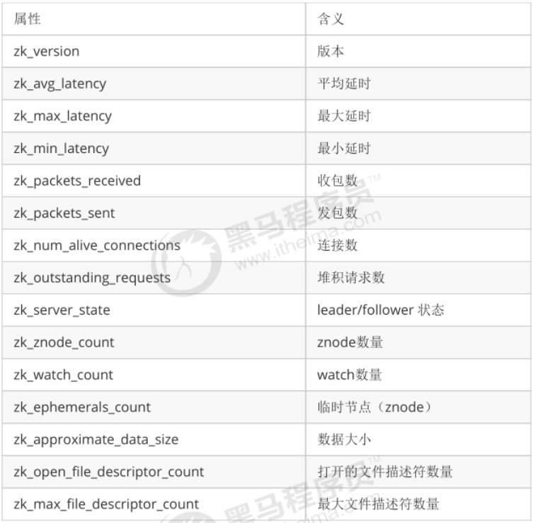

## Zookeeper

### 概念

#### 什么是 Zookeeper

`Zookeeper 是一个基于观察者模式设计的分布式服务管理框架，负责存储数据和管理服务，接受观察者的注册，当数据的状态发生变化，则通知已注册的观察者做出相应的反应`

Zookeeper 是一个分布式数据一致性解决方案，为分布式应用提供一个高性能、高可用且具有严格顺序访问控制能力的分布式协调存储服务


#### 业务场景

- 维护配置信息
  - Zookeeper 可以作为分布式应用的配置中心。同时当服务器配置发生变化时，客户端可以通过 Zookeeper 获取到配置变化
  - 
- 分布式锁
- 集群管理
  - Zookeeper 可以负责添加/移除集群中的服务，将服务的加入或移除通知到其他已注册的服务，同时还可以根据情况调整存储和计算任务，以及对故障的服务进行恢复等
- 生成分布式唯一ID
  - 使用 Zookeeper 还可以实现分布式唯一ID，在每次要生成一个新ID时，创建一个持久顺序节点，创建操作返回的节点序号，即作为新ID，同时删除比自己小的节点


#### 特点

- 高性能
  - Zookeeper 将全部数据都存储在内存中，并直接用于服务客户端的所有非事务请求，尤其适合以读为主的应用场景
- 高可用
  - Zookeeper 一般以集群方式对外提供服务，只要集群中有超过一半的机器能够正常工作，整个集群就能对外正常服务
- 严格的顺序访问
  - 对于每个来自客户端的更新请求，Zookeeper 都会分配一个全局唯一的递增序号，这个序号反映了所有事务操作的先后顺序


### 数据模型

#### 整体结构

- Zookeeper 是以树形结构(目录)方式存储数据节点的，树中的节点被被称为 znode
- 一个 znode 可以有很多个子节点，因此 znode 在结构上表现为树状
- 可以以 path 来定位某个 znode 节点，如 /ns/user/sadasd1
- znode 即像文件一样维护着数据、元信息、ACL、时间戳等数据结构，也可以当做目录作为路径标识的一部分


#### 节点类型

节点类型在创建时即被确定，且不可更改

- 临时节点
  - 临时节点的生命周期依赖于创建它们的会话，一旦会话结束，临时节点将自动删除
  - 临时节点也支持手动删除
  - 临时节点对所有的客户端都是可见的
  - 临时节点不允许有子节点
- 持久化节点
  - 持久的生命周期不依赖于创建它们的会话，只有在客户端显示执行删除操作的时候，它们才能被删除


### 基本命令

#### 节点操作

```markdown
# #################### 创建节点 ################### #
# 新增节点
# 默认为持久节点，加上 -s 为有序节点，加上 -e 为临时节点
create [-s] [-e] path data

# 创建持久节点
create /hadoop "123456"
# 创建持久化有序节点
create -s /a "aaa"
---- Cteated /a0000001
---- Cteated /b0000002
---- Cteated /c0000003
create -s /b "bbb"
create -s /c "ccc"
# 创建临时节点，临时节点会在会话过期后删除
create -e /tmp "tmp"
# 创建临时有序节点
create -e -s /aa "aa data"
---- Cteated /aa000004
create -e -s /bb "bb data"
---- Cteated /bb000005
create -e -s /cc "cc data"
---- Cteated /cc000006

# #################### 更新节点 ################### #
# 直接更新节点
set /hadoop "new data"
# 基于版本号更新，当传入的版本号与当前节点的数据版本号不符合时，zookeeper 会拒绝此次修改
# set [path] [data] [version]
set /hadoop "update data by version" 1

# #################### 删除节点 ################### #
# 基于版本号删除节点，若传入的版本号与当前节点不符合，则 zookeeper 拒绝此次删除
# delete [path] [version]
delete /hadoop 0
# 删除节点及所有后代节点
# rmr [path]
rmr /hadoop

# #################### 查看节点 ################### #
get /hadoop

# #################### 查看节点状态 ################### #
stat /hadoop

# #################### 查看节点列表 ################### #
# ls [path]
ls /
# 如存在 /a 和 /a/node，查看 /a 下所有的子节点
ls /a
```


#### 节点属性


#### 监听器操作

```markdown
# 监听节点的内容变化
# 监听器能够在节点内容发生改变的时候，向客户端发出通知。
# Zookeeper 的触发器是一次性的，触发一次就会失效
get path watch

# 监听节点的状态变化
# 监听器能够在节点状态发生改变的时候，向客户端发出通知
state path watch

# 接听节点的子节点变化
ls path watch
ls2 path watch
```


### ACL 访问权限控制

#### 概念

`ACL(access controll list) 即访问控制列表，用于 ZNode 节点的权限控制。`


##### 格式

scheme​ : id : permission

- 权限模式(scheme)：授权的策略
- 授权对象(id)：授权的对象
- 权限(permission)：授予的权限


##### 特点

- 它的权限控制是基于每个 znode 节点的，需要对每个 ZNode 节点设置权限
- 支持对每个 ZNode 设置多种权限控制方案和多个权限
- 子节点不会继承父节点的前悬，客户端无权访问某节点，但可能可以访问它的子节点


#### 授权参数

##### 授权模式(scheme)

| scheme | 描述                                                    |
| ------ | ------------------------------------------------------- |
| world  | 只有一个用户：anyone，代表登录 zookeeper 的所有人(默认) |
| ip     | 对客户端使用 IP 地址认证                                |
| auth   | 使用已添加认证的用户认证                                |
| digist | 使用 “用户名：密码” 方式认证                            |


##### 授权对象

即给谁授予权限，即用户或 ip 地址


##### 授予权限(permission)

| permission | acl简写 | 描述                                   |
| ---------- | ------- | -------------------------------------- |
| create     | c       | 可以创建子节点                         |
| delete     | d       | 可以删除子节点(仅能删除自己的下级节点) |
| read       | r       | 可以读取节点数据及显示子节点列表       |
| write      | w       | 可以设置节点数据                       |
| admin      | a       | 可以设置节点访问控制列表权限           |


##### 授权命令

```markdown
# 设置acl权限
# setAcl [path] [acl]
setAcl 

# 读取acl权限
# getAcl [path] [acl]
getAcl

# 添加授权用户
# addauth <scheme> <auth>
addauth
```


##### 授权例子

###### world 授权模式

```markdown
# world 授权
# setAcl [path] world:anyone:[acl]
# 移除创建子节点权限
setAcl /node1 world:anyone:drwa
```


###### IP 授权模式

```markdown
# ip 授权
# setAcl [path] ip:[ip]:[acl]
setAcl /node1 192.168.60.128:cdrwa
```


###### Auth 授权模式

```markdown
# Auth 授权模式需要先添加用户
# addauth digist [user]:[password]
# 授予某个用户对某节点的操作权限
# setAcl [path] auth:[user]:[acl]
create /node3 "node3"
addauth digest tom:123456
setAcl /node3 auth:tom:cdrwa

# 每次客户端进入也需要登录用户
addauth digest tom:123456
# 访问 /node3
get /node3
```


###### Digest 授权模式


###### 多种授权模式

```markdown
# 授权模式间以逗号分开
setAcl /node7 ip:192.168.0.12:crdwa,auth:tom:crdwa
```


##### 超级管理员


### watcher 机制

#### 概念

`Zookeeper 采用 watcher 机制实现了发布订阅功能，该机制在被订阅对象发生变化时会异步通知客户端，使得客户端不必在 watcher 注册后轮询阻塞。实际上与观察者模式类似`


#### 架构

##### 组成

watcher 实现由三部分组成：

- Zookeeper 服务端
- Zookeeper 客户端
- 客户端的 ZKWatchManager 对象


##### **流程**

- 客户端先将 watcher 注册到服务端，同时将这个 watcher 对象保存到客户端的 watch 管理器中
- 当 Zookeeper 服务端监听的数据状态发生变化时，服务端会主动通知客户端
- 客户端的 watch 管理器会触发相关的 watcher 来回调相应的处理逻辑，从而实现整体的数据发布订阅流程


##### watcher 特性

| 特性           | 说明                                                         |
| -------------- | ------------------------------------------------------------ |
| 一次性         | watcher 是一次性的，一旦被触发就会移除。想要再次使用必须重新注册 |
| 客户端顺序回调 | 在客户端，watcher 的回调是顺序串行化执行的。只有一个回调完成了，才会执行下一个回调 |
| 轻量级         | WatchEvent 是最小的通信单元，结构上只包含了通知状态、事件类型和节点路径，并不会告知数据节点变化的具体内容 |
| 时效性         | watcher 只有在当前 session 彻底失效时才会无效。若 session 在有效期内快速重连成功，则 watcher 依然存在，仍可接收到通知 |

 

##### WatchEvent

Watcher 是一个接口，内部包含了 KeeperState(通知状态) 和 EventType(事件类型)。若需要获取变化后的数据则需要调用 get 等方法重新获取


###### KeeperState

KeeperState 是客户端与服务器连接体发生变化时，对应的通知类型。是一个枚举类。

当 KeeperState 发生变化时，EventType 恒定为 None

| 枚举属性      | 说明                     |
| ------------- | ------------------------ |
| SyncConnected | 客户端与服务器正常连接时 |
| Disconnected  | 客户端与服务器断开连接时 |
| Expired       | 会话 session 失效时      |
| AuthFailed    | 身份认证失败时           |


###### EventType

EventType 是当数据节点(znode)发生变化时对应的通知类型，此时 KeeperState 恒定为 SyncConnected

| 枚举属性            | 说明                                         |
| ------------------- | -------------------------------------------- |
| None                | 无                                           |
| NodeCreated         | Watcher 监听的数据节点被创建时               |
| NodeDeleted         | Watcher 监听的数据节点被删除时               |
| NodeDataChanged     | Watcher 监听的数据节点内容发生变化时         |
| NodeChildrenChanged | Watcher 监听的数据节点的子节点列表发生变化时 |


#### 常用方法和使用

| 注册方式                           | Created | ChildrenChanged | Changed | Deleted |
| ---------------------------------- | ------- | --------------- | ------- | ------- |
| zk.exists("/node-x", watcher)      | 可监控  |                 | 可监控  | 可监控  |
| zk.getData(”/hode-x“, watcher)     |         |                 | 可监控  | 可监控  |
| zk.getChildren("/node-x", watcher) |         | 可监控          |         | 可监控  |


### zab 协议(一致性协议)

#### 概念

`ZAB 协议是 Zookeeper 专门设计的一种支持崩溃恢复、主从同步的原子广播协议，以此实现集群中分布式数据的一致性`


#### 角色

一般集群中至少有一个领导者和多个跟随者。数量为奇数，即3、5、7...

- 领导者(Leader)：负责进行投票的发起和决议，更新系统状态

- 学习者(Learner)：

  - **跟随者(Follower)：**用于接收客户端请求并向客户端返回结果。在选举过程中参与投票

  - **观察者(ObServer)：**可以接收客户端连接，将写请求转发给 leader 节点。但 ObServer 节点不参与投票过程，只同步 leader 的数据状态。Observer 的目的是为了扩展系统，提高读取速度

- 客户端(Client)：请求发起方


#### 模式

##### 崩溃恢复模式

`恢复模式主要是在服务框架启动时，或是 leader 节点宕机时发生`

当整个服务框架在启动过程中，或是当 leader 节点出现网络中断、崩溃退出等异常情况，zab 协议就会进入恢复模式并选举产生新的 leader 服务器。当选举产生了新的 leader 服务器，且集群中有过半的机器与该 leader 服务器完成了状态同步和数据同步后，zab 协议就会退出恢复模式，进入消息广播模式


##### 消息广播模式

`当集群中有过半的 follower 节点完成了和 leader 的数据同步和状态同步，整个服务框架就进入消息广播模式。`

消息广播模式主要分为读操作和写操作：

- 读操作
  - 由于 zab 保证了分布式数据的一致性，因此每个 follower 节点都保存有最新的数据副本，无论客户端连接的是哪一个节点都可以直接从节点中读取到最新的数据
- 写操作
  - 写操作只能由 leader 节点发起。如果客户端连接的是一个 follower 节点，这个写请求也会被 follower 节点转发到 leader 节点，再由 leader 节点发起写请求


##### 写操作流程（2PC）

zab 协议的写操作是通过类似二段提交的方式实现保证数据一致性的

- leader 从客户端收到一个写请求 / leader 从 follower 接收到一个转发过来的写请求
- leader 生成一个新的事务，并为这个事务生成一个唯一的 ZXID
- leader 将这个事务提议(propose)给所有的 follower 节点
- follower 节点将收到的事务请求加入到历史队列中，并发送 ack(确认) 给 leader
- 当 leader 收到大多数(半数以上)的 follower 的 ack 消息后，leader 会发送 commit 请求给这些 follower
- 当 follower 收到 leader 发来的 commit 请求后，会从历史队列中将事务请求 commit


### leader 选举

#### 服务器状态

| 状态名    | 状态             | 描述                                                         |
| --------- | ---------------- | ------------------------------------------------------------ |
| looking   | 寻找 leader 状态 | 当服务器处于该状态时，它会认为当前集群中没有 leader，进入 leader 选举状态 |
| leading   | 领导者状态       | 表明当前服务器的角色是 leader                                |
| following | 跟随者状态       | 表明当前服务器的角色是 follower                              |
| observing | 观察者状态       | 表明当前服务器的角色是 observer                              |


#### 服务器启动时的 leader 选举

leader 选举至少需要两个节点

整体可以总结为：`自我投票 -> pk投票 -> 统计投票 -> 修改状态` 四个过程

- **自我投票阶段**
  - 每个 server 发出一个投票，由于是初始情况，所有的节点都会将自己作为 leader 服务器进行投票，即投自己。每个投票里面会包含自己的 myid 和 zxid(最大事务id)，使用(myid, zxid)来表示。如 server1的投票为(1,0)，server2的投票为(2,0)
  - 将自己的投票内容发送给集群中的其他节点
- **pk投票阶段**
  - 集群中的每个节点存有一份投票信息(初始为投自己)
  - 当集群中的每个节点，收到来自其他节点的投票信息时，就会将自己保存的投票信息与之进行pk，并依据pk结果修改自己的投票信息
  - pk 规则为：
    - 优先检查 zxid(最大事务id)，选择 zxid 更大的节点作为 leader
    - 若 zxid 都相同，则选择 myid 更大的节点最为 leader
    - 更新自己的投票信息为pk成功的节点发来的投票信息，并向其他机器发送这次的投票信息
  - 注意：每次PK完成后节点都会向集群中的其他节点发送投票的结果
- **统计投票阶段**
  - 每次投票后服务器都会统计投票信息，当有过半的机器接收到相同的投票信息时，则使这个投票对应的节点成为 leader 节点
  - 由此可以看出，不一定 myid 最大或 zxid 最大的节点是 leader 节点
- **修改状态阶段**
  - 一旦确定了 leader，集群中的所有节点都会更新自己的状态，并同步 leader 的数据内容，如果是 leader 节点，会变更为 leading，若是 follower 节点，则变更自己的状态为 following


#### 服务器运行时的 leader 选举

当 leader 节点宕机，整个 zookeeper 集群都会暂停对外服务，进入新一轮的 leader 选举

- 变更状态
  - 当 leader 挂掉后，集群中的其他节点会将自己的状态变更为 looking，开始进入 leader 选举过程
- 其他则是与服务器启动时的 leader 选举过程一致


### observer 角色

由于 zookeeper 的写操作需要过半的节点确认，因此随着 follower 节点的增加，会造成写效率的降低。因此引入了`观察者`角色

#### 概念

`observer 角色即一个不参与选举和写操作，只听取选举结果，并与leader同步数据，对外提供读写操作的特殊节点`


#### 特点

- 不参与 leader 选举，只听取投票结果

- 不参与集群中写数据时的 ack 反馈
- 只与 leader 同步数据内容
- 对外提供读写，但会像 follower 一样将写操作转发到 leader 去


#### 优点

- 增加了 zookeeper 的动态扩展能力，不影响写操作效率的情况下，提高了读操作的并发性能
- 不参投票，因此增加任意台 Observer，也不会影响集群性能
- Observer 不参与实际的选举和写入，因此 Observer 失败或断开连接不会影响 Zookeeper 集群的可用性


#### 使用

在配置文件中增加

```markdown
# 定义当前节点为观察者节点
peerType=observer
```

修改所有节点的配置文件

```markdown
# 在集群配置中，配置上观察者节点，并在后面加上 :observer
server.1:localhost:2181:3181:observer
```


### ZK 实现分布式锁

zk 实现分布式锁主要依赖 watcher 机制以及临时顺序节点

- 如有有一个 locker 节点，所有使用到分布式锁的线程都去这个 locker 下创建一个临时有序节点
- 当线程创建完临时有序节点后，再用 getchildren 方法去获取下面的所有路径，若发现自己的序号最小，则认为获取到了锁
- 若不是最小的，则代表没有获取到锁。这时候线程需要使用 exist() 方法监听序号最小的节点
- 当收到 watch 的通知，则再去调用 getchilder 方法获取、判断等等


### 环境搭建

#### JDK 环境搭建

Zookeeper 的运行环境依赖于 jdk 环境，因此需要先搭建 jdk 环境

##### 下载 JDK

从官网下载：

https://www.oracle.com/technetwork/java/javase/downloads/jdk8-downloads-2133151.html

百度网盘下载：

https://pan.baidu.com/s/1JuMW56Gt0NBiS1dgzRbwdA   提取码：zb8y

 

##### 解压并安装

  ```markdown
# 安装到指定目录
rpm -ivh --prefix=/opt jdk-8u181-linux-x64.rpm
# 重命名
mv jdk1.8.0_181-amd64/ java
  ```


##### 配置环境变量

```
# 修改配置文件
vim /etc/profile

# 在末尾添加
export JAVA_HOME=/usr/local/java
export CLASSPATH=.:$JAVA_HOME/lib/
export PATH=$PATH:$JAVA_HOME/bin
export JAVA_HOME PATH CLASSPATH

# 让配置信息立刻生效
source /etc/profile
```


##### 测试

```markdown
# 查看当前安装好的 jdk 版本
java -version
```


#### Zookeeper 单机搭建

##### 下载 Zookeeper

**百度网盘：**

链接：https://pan.baidu.com/s/1zvx7XC7TW7A587Ia9r_ksA  提取码：8joc 

**官网下载地址：**

http://archive.apache.org/dist/zookeeper/zookeeper-3.6.2/apache-zookeeper-3.6.2-bin.tar.gz


##### 解压并安装

```markdown
# 解压
tar -zxvf apache-zookeeper-3.6.2-bin.tar.gz
# 重命名文件夹
mv apache-zookeeper-3.6.2-bin /opt/zookeeper-cluster/zookeeper2200

# 创建data目录
mkdir /opt/zookeeper-cluster/zookeeper2200/data
# 修改配置文件
cd /zookeeper/conf
mv zoo_sample.cfg zoo.cfg
# 修改 zoo.cfg 文件
dataDir=/opt/zookeeper-cluster/zookeeper2200/data
```


##### 启动、关闭脚本

启动脚本

```
./bin/zkServer.sh start
```

关闭脚本

```
./bin/zkServer.sh stop
```

查看服务状态

```
./bin/zkServer.sh status
```

客户端脚本

```markdown
# 登录指定ip的指定端口 -server [host]:[port]
sh ./bin/zkCli.sh -server 121.36.203.234:2200
```


#### 集群搭建

##### 修改配置文件

在配置文件最末尾增加

记住这里面用的端口号不能与暴露给客户端的端口号一致，Zookeeper 的配置文件中共有三种端口号

- **clientPort 客户端访问端口：**提供给客户端访问，测试环境可以暴露在外网中国
- **zookeeper 服务间通信端口：**用于 zookeeper 服务之间通信，如果服务器都是同一个局域网则只要开放防火墙即可
- **leader 选举端口：**用于 zookeeper 服务之间进行 leader 选举，如果服务器都是同一个局域网则只要开放防火墙即可
- 这三个端口不能重复，否则 zookeeper 会开启失败！

```markdown
# server .A=B:C:D
# #A：数字，表示节点的编号
# #B：节点的ip地址
# #C：Zookeeper 服务器间的通信接口
# #D：Leader 的选举接口
server.1=121.36.203.234:3100:3200
server.2=123.60.11.63:3100:3200
server.3=123.60.11.63:3101:3201
```


##### 增加 myid 文件

在配置文件指定的 dataDir 目录下创建 myid 文件，并将自己对应的节点编号写入这个文件中

```markdown
# 2200
touch /opt/zookeeper-cluster/zookeeper2200/data/myid
echo "1" > /opt/zookeeper-cluster/zookeeper2200/data/myid

# 2200
touch /opt/zookeeper-cluster/zookeeper2200/data/myid
echo "2" > /opt/zookeeper-cluster/zookeeper2200/data/myid

# 2201
touch /opt/zookeeper-cluster/zookeeper2201/data/myid
echo "3" > /opt/zookeeper-cluster/zookeeper2201/data/myid
```


##### 开放对应端口

根据配置，开放防火墙。如果是云服务器，记得要开放安全组。

```markdown
# 开放客户端连接端口
firewall-cmd --zone=public --add-port=2200-2201/tcp --permanent
# 开放 zookeeper 服务通信端口
firewall-cmd --zone=public --add-port=3100-3101/tcp --permanent
# 开放 Leader 选举端口
firewall-cmd --zone=public --add-port=3200-3201/tcp --permanent
# 重载
firewall-cmd --reload
```


##### 配置启动/关闭脚本

###### 启动脚本

```
sh /opt/zookeeper-cluster/zookeeper2200/start.sh
sh /opt/zookeeper-cluster/zookeeper2201/start.sh

echo "zookeeper 集群启动完成"
ps -ef|grep zookeeper
```

###### 关闭脚本

```
sh /opt/zookeeper-cluster/zookeeper2200/stop.sh
sh /opt/zookeeper-cluster/zookeeper2201/stop.sh

echo "zookeeper 集群已关闭"
ps -ef|grep zookeeper
```


##### 查看启动状态

```markdown
./bin/zkServer.sh status
```

主节点


从节点


#### 监控窗口

在 zookeeper 3.5.x 后，提供了窗口可以查看 zookeeper 状态，默认使用 8080 端口

```
http://www.xxx.top:8081/commands
```


可以通过配置修改端口的启动状态

```
admin.serverPort=8081
```


### 监控命令

#### 汇总

zookeeper 支持使用 `telnet` 或 `nc` 向 zookeeper 提交相应的命令进行查询

| 命令     | 描述                                                         |
| -------- | ------------------------------------------------------------ |
| **conf** | 输出相关服务配置的详细信息，如端口、zk数据及日志配置路径、超时时间、最大连接数等 |
| cons     | 列出所有连接到这个节点的客户端连接/会话的详细信息。包括接收/发送的包数量，session id，操作延迟，最后的操作执行等 |
| crst     | 重置当前这个节点的所有连接/会话的统计信息                    |
| dump     | 列出未经处理的会话和临时节点                                 |
| envi     | 输出关于服务器的环境详细信息                                 |
| ruok     | 测试节点是否处于正确运行状态，如果运行正常则返回 “imok”，否则返回空 |
| stat     | 输出节点的详细信息：接收/发送包数量、连接数、模式、节点总数、延迟 |
| srst     | 重置 server 状态                                             |
| wchs     | 列出服务器 watches 的简洁信息：连接总数、watching 节点总数和 watches 总数 |
| wchc     | 通过 session 分组，列出 watch 的所有节点                     |
| **mntr** | 列出集群的健康状态，包括“接受/发送”的包数量、操作延迟、当前服务模式、节点总数、watch 总数、临时节点总数等 |


#### 安装 telnet 或 nc

```markdown
# 安装 telnet
yum install telnet

# 安装 nc
yum install nc
# nc 使用例子
echo mntr | nc localhost 2181
```


#### 命令细节

##### conf 命令

用于输出相关服务配置的详细信息

```markdown
echo conf| nc localhost 2200
```

| 属性              | 含义                                                         |
| ----------------- | ------------------------------------------------------------ |
| clientPort        | 客户端端口号                                                 |
| dataDir           | 数据快照文件目录 默认情况下100000次事务操作生成一次快照      |
| dataLogDir        | 事物日志文件目录，生产环境中放在独立的磁盘上                 |
| tickTime          | 服务器之间或客户端与服务器之间维持心跳的时间间隔(以毫秒为单位) |
| maxClientCnxns    | 最大连接数(以ip为粒度)                                       |
| minSessionTimeout | 最小session超时 minSessionTimeout=tickTime*2                 |
| maxSessionTimeout | 最大session超时 maxSessionTimeout=tickTime*20                |
| serverId          | 服务器编号                                                   |
| initLimit         | 集群中的follower服务器(F)与leader服务器(L)之间初始连接时能容忍的最多心跳数 |
| syncLimit         | 集群中的follower服务器(F)与leader服务器(L)之间 请求和应答之间能容忍的最多心跳 |
| electionAlg       | 基于TCP的FastLeaderElection                                  |
| electionPort      | 选举端口                                                     |
| quorumPort        | 数据通信端口                                                 |
| peerType          | 是否为观察者 1为观察者                                       |


##### cons 命令

列出所有连接到这条服务器的客户端连接/会话的详细信息

```
echo cons| nc localhost 2200
```


##### crst命令

重置当前这台服务器所有连接/会话的统计信息

```
echo crst| nc localhost 2200
```


##### dump 命令

列出未经处理的会话和临时节点

```
echo dump| nc localhost 2200
```


##### envi 命令

输出关于服务器的环境配置信息

```
echo envi| nc localhost 2200
```


##### ruok命令

测试服务是否处于正确运行状态

```
echo ruok| nc localhost 2200
```


##### stat 命令

出节点的详细信息：接收/发送包数量、连接数、模式、节点总数、延迟

```
echo stat| nc localhost 2200
```


##### srst 命令

重置server状态

````
echo srst | nc localhost 2200
````


##### wchs 命令

列出服务器watches的简洁信息

```
echo wchs| nc localhost 2200
```


##### wchc 命令

通过session分组，列出watch的所有节点，它的输出的是一个与 watch 相关的会话的节点列表

```
echo wchc| nc localhost 2200
```


##### wchp命令

通过路径分组，列出所有的 watch 的session id信息

```
echo wchp| nc localhost 2200
```


##### mntr命令

列出服务器的健康状态

```
echo mntr| nc localhost 2200
```




### taokeeper 监控工具使用

taokeeper 是淘宝团队开源的基于 zookeeper 的 zk 管理中间件，可以方便地查看集群状态

#### 搭建

##### 下载相关内容

```markdown
# 下载数据库脚本
wget https://github.com/downloads/alibaba/taokeeper/taokeeper.sql
# 下载主程序
wget https://github.com/downloads/alibaba/taokeeper/taokeeper-monitor.tar.gz
# 下载配置文件
wget https://github.com/downloads/alibaba/taokeeper/taokeeper-monitor-config.properties
```

```markdown
# 从百度网盘下载
链接：https://pan.baidu.com/s/1xH7nx4bYI-JdaowuDSqkVg 
提取码：0qzx 
```


##### 对应数据库配置

```markdown
# 创建数据库
create database taokeeper
# 使用数据库 taokeeper
use taokeeper
# 导入数据
source /opt/taokeeper.sql
```


#### 修改配置

```markdown
# 创建数据文件夹
mkdir /opt/zookeeper-cluster/taokeeper/data
mkdir /opt/zookeeper-cluster/taokeeper/data/ZooKeeperClientThroughputStat
# 创建日志文件夹
mkdir /opt/zookeeper-cluster/taokeeper/log

# 修改 tomcat 配置
vim /bin/catalina.sh
### 找到位置添加
# 指向配置文件所在的位置
JAVA_OPTS=-DconfigFilePath="/opt/zookeeper-cluster/taokeeper/taokeeper-monitor-tomcat/taokeeper-monitor-config.properties"

# 给tomcat 的 bin 目录下的所有 sh 文件都赋予可执行权限
chmod +711 *.sh

# 启动
./startup.sh
```


### Springboot 整合 curator

#### curator

`curator 一个 zookeeper 的开源客户端，在 zookeeper 原生API的基础上进行了拔桩，解决了许多细节问题。提供了分布式锁服务、集群领导选举、共享计数器、缓存机制、分布式队列等功能的封装抽象`


**Zookeeper 原生 API 的问题：**

- 连接对象异步创建，需要开发人员自行编码等待
- 连接没有超时后自动重连的机制
- watcher 一次注册只生效一次
- 不支持递归创建树形节点

**Curator 解决的问题：**

- 支持session会话超时重连
- watcher 自动反复注册
- 简化调用的 API
- 提供了分布式锁服务、共享计数器、缓存机制等


#### 整合 Curator


### 命令调优

#### 命令

##### 查看 zookeeper 当前连接数

```markdown
# netstat -na | grep [端口号] | wc -l
netstat -na | grep 2200 | wc -l
```


#### 调优

##### 客户端连接数量管理

修改配置文件

```markdown
# the maximum number of client connections.
# increase this if you need to handle more clients
maxClientCnxns=60
```

查看当前连接数

```markdown
# netstat -na | grep [端口号] | wc -l
netstat -na | grep 2200 | wc -l
```


### 线上问题分析

#### zookeeper：Too many connections 

###### 原因：

一般这种情况都是客户端在疯狂创建连接，需要配置ip粒度的连接数量管理，同时查看哪个客户端在疯狂创建连接

###### 处理：

- 先查看当前连接数，若没有配置的话一个ip最多同时有60个连接。，超过则会报 too manty connections。可以在配置类中修`maxClientCnxns`提高允许的连接数

- 查看 linux 的 ulimit 限制

  ````
  ulimit -a
  ````

  其他查看`部署调优.md - 修改打开的最大文件数和线程`


### 常见题目

https://blog.csdn.net/weixin_43122090/article/details/103645642

https://www.cnblogs.com/lanqiu5ge/p/9405601.html