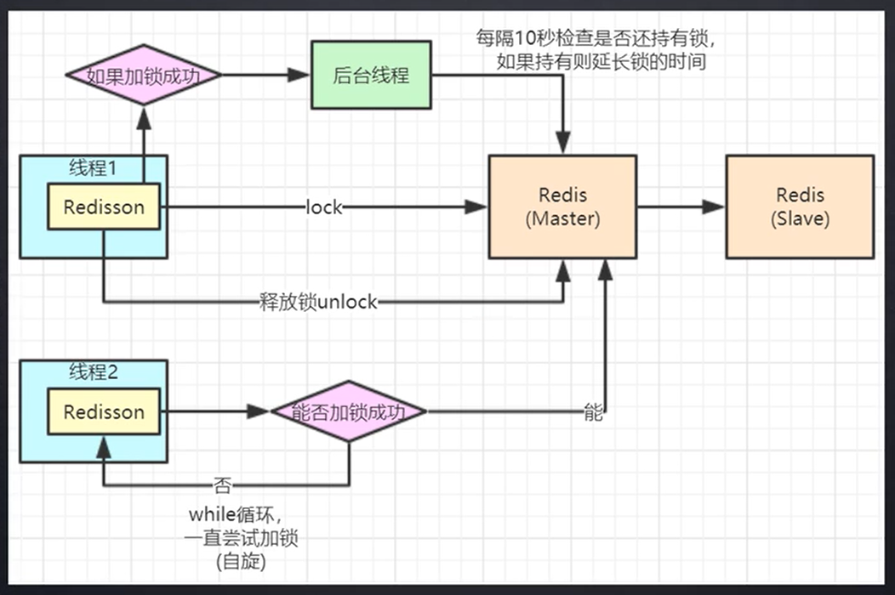

# 分布式内容

## 分布式 ID 生成

- IDWorker

- SnowFlake
  - 整体上按照时间自增排序，并且整个分布式系统内不会产生ID碰撞(由数据中心ID和机器ID作区分)

- GUID
  - https://blog.csdn.net/u010127245/article/details/51078819

https://blog.csdn.net/hj12312/article/details/79715632

https://my.oschina.net/lenglingx/blog/818480


## 分布式锁

引入依赖

```
<!-- redisson -->
<dependency>
    <groupId>org.redisson</groupId>
    <artifactId>redisson</artifactId>
    <version>3.14.1</version>
</dependency>
```


使用 lua 语句来保证整体的原子性，默认看门狗的任务间隔时间为30/3 = 10s，即每隔十秒循环一次


Redisson 中文手册

https://www.bookstack.cn/read/redisson-wiki-zh/spilt.1.6.-%E5%88%86%E5%B8%83%E5%BC%8F%E5%AF%B9%E8%B1%A1.md


分线程间隔时间大概是过期时间的三分之一




Redis 主从架构锁失效

针对主从架构锁失效，有 RedLock，向多个节点同时加锁，超过半数加锁成功才算成功。但会造成性能影响。

Zookeeper


并发量大选择 Redis，对一致性要求高则使用 Zookeeper


