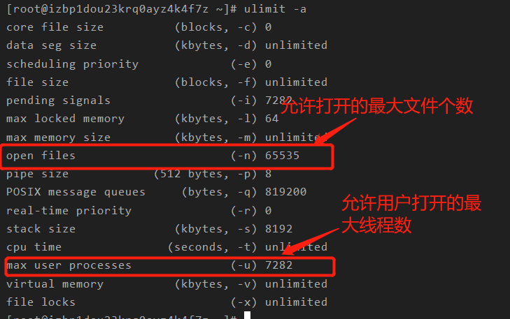
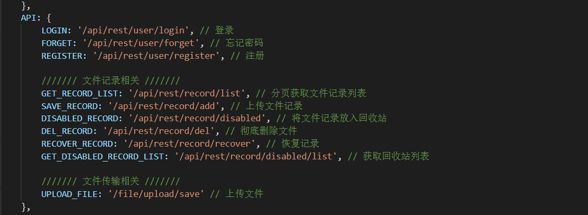
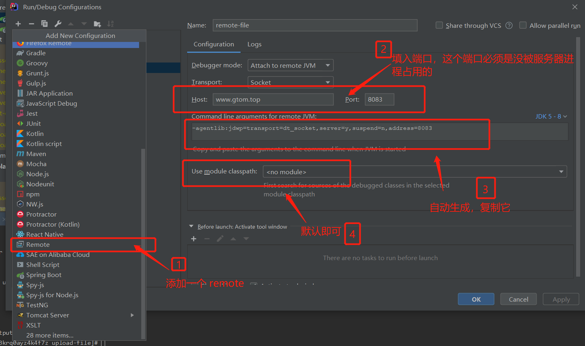
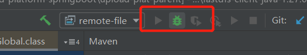

# 部署调优

## 调优

### 修改打开的最大文件数和线程

```markdown
# 查看当前设置内容
ulimit -a
```



修改二者

```markdown
# 修改配置文件
vim /etc/security/limits.conf

# 修改允许打开的最大文件个数
root soft nofile 65535
root hard nofile 65535
* soft nofile 65535
* hard nofile 65535

# 修改允许创建的最大线程数
root soft nproc 10000
root hard nproc 10000
* soft nproc 10000
* hard nproc 10000

# 修改完后断开连接，再次连接上即可
```


## 脚本

### jar 包启动和关闭脚本

启动脚本

```sh
nohup java -jar -Dspring.config.location=/opt/upload-project/upload-file/application.yml upload-plat-file.war >logs/output.log 2>&1 &

tail -f logs/output.log
```

关闭脚本

```sh
project='upload-plat-user'
pidfile=`jps -l | grep $project | awk '{print $1}'`
kill -9 $pidfile
if [ $? -eq 0 ]
then
        echo "stop `hostname` " $project " Success!"
else
        echo "stop `hostname` " $project " Failed!"
fi
```


## 部署

### jar/war包项目部署

#### 使用内置 tomcat ，打包成war 部署 (jar 包无需此步骤)

##### 修改启动类

继承 SpringBootServletInitializer ，重写 configure 方法

```java
public class UserApplication extends SpringBootServletInitializer {
    public static void main(String[] args) {
        SpringApplication.run(UserApplication.class, args);
    }

    @Override
    protected SpringApplicationBuilder configure(SpringApplicationBuilder builder) {
        return builder.sources(Application.class);
    }
}

```


##### 修改 pom.xml

设置包的最终打包名称，并引入插件 spring-boot-maven-plugin

```xml
<build>
    <!-- 最终打包名称 -->
    <finalName>upload-plat-user</finalName>
    <plugins>
        <plugin>
            <groupId>org.springframework.boot</groupId>
            <artifactId>spring-boot-maven-plugin</artifactId>
            <version>2.4.1</version>
            <executions>
                <execution>
                    <goals>
                        <goal>repackage</goal>
                    </goals>
                </execution>
            </executions>
        </plugin>
    </plugins>
</build>
```

 

#### 使用外部配置文件

启动脚本

```sh
# 先创建日志路径
mkdir logs
```

使用 -Dspring.config.location 来指定外部配置文件路径

```sh
nohup java -jar -Dspring.config.location=/opt/upload-project/upload-file/application.yml upload-plat-file.war >logs/output.log 2>&1 &

tail -f logs/output.log
```


关闭脚本

```sh
project='upload-plat-user'
pidfile=`jps -l | grep $project | awk '{print $1}'`
kill -9 $pidfile
if [ $? -eq 0 ]
then
        echo "stop `hostname` " $project " Success!"
else
        echo "stop `hostname` " $project " Failed!"
fi
```


### nginx 整合 vue 项目

https://www.cnblogs.com/riches/p/12606945.html

#### Vue 项目需要的修改

在 router  的配置文件中修改

```javascript
const router = new VueRouter({
  mode: 'history',
  base: "/upload-user", // 改成项目名称，后面需要通过 url/[项目名称] 来访问页面
  routes
});
```


将 vue.config.js 下配置的代理名称给后端，如 /api，/file，

记得要关闭映射文件，否则可以看得到源码

```javascript
module.exports = {
  publicPath: "./",
	devServer: {
		port: 8093,
		host: "localhost",
		https: false,
		// 自动启动浏览器
    	open: false,
		proxy: {
          '/api': {
            target: 'http://www.xxx.top:8081', // 设置你调用的接口域名和端口号 别忘了加http
            changeOrigin: false,
            pathRewrite: {
              '^/api': ''// 这里理解成用‘/api’代替target里面的地址，后面组件中我们掉接口时直接用api代替 比如我要调用'http://40.00.100.100:3002/user/add'，直接写‘/api/user/add’即可
            }
          },
          '/file': {
            target: 'http://www.xxx.top:8082', // 设置你调用的接口域名和端口号 别忘了加http
            changeOrigin: false,
            pathRewrite: {
              '^/file': ''
            }
          }
		}
  },
  // 生产环境是否生成 sourceMap 文件
  productionSourceMap: false
}
```


前端代码中访问 api 为 /api/user/login，/api/user/register 格式，如：




#### nginx 需要作出的修改

修改 conf/nginx.conf ，配置页面访问路径，以及代理页面的请求

last 不能忘记，否则会被重定向到 nginx 的首页

```javascript
server {
        listen       8090;
        server_name  localhost;

        location /upload-user {
           alias /opt/upload-project/upload-web/upload-user;
           index index.html index.htm;
           try_files $uri $uri/ /index.html last;
        }
                
        location /api {
           proxy_pass http://www.gtom.top:8081/;
        }

        location /file {
          proxy_pass http://www.gtom.top:8082/;
       }
}
```


### 远程调试线上包

#### idea 配置




#### 服务端配置

将上面复制的命令增加到 war 包的启动命令中

注意这个端口不能与项目端口相同

```sh
-agentlib:jdwp=transport=dt_socket,server=y,suspend=n,address=8083

# 完整命令示例
nohup java -jar -agentlib:jdwp=transport=dt_socket,server=y,suspend=n,address=8083 upload-plat-file.war >logs/output.log 2>&1 &

```


#### 打断点调试

先启动服务




直接在项目对应代码的位置打断点即可

**注意：** 项目代码必须与 war 包相同

